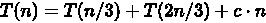

# 第二章 第 2 节 前端算法-2

> 原文：[`www.nowcoder.com/tutorial/10072/5538fff89c074ffca8dfd472fab51a10`](https://www.nowcoder.com/tutorial/10072/5538fff89c074ffca8dfd472fab51a10)

#### 2.10 第 K 大的数

**参考答案**：

三种方案：

*   排序，取第 `k` 个
*   构造前 `k` 个最大元素小顶堆，取堆顶
*   计数排序或桶排序，但它们都要求输入的数据必须是有确定范围的整数，所以本题不可用

那么除了这两种方案还有没有其它的方式可解决本题喃？其实还有两种：

*   快速选择（quickselect）算法
*   中位数的中位数（bfprt）算法

解法一：数组排序，取第 k 个数

最简单

**代码实现：**

```cpp
let findKthLargest = function(nums, k) {
    nums.sort((a, b) => b - a);
    return nums[k-1]
};
```

**复杂度分析：**

*   时间复杂度：O(nlogn)
*   空间复杂度：O(logn)

解法二：构造前 `k` 个最大元素小顶堆，取堆顶

我们也可以通过构造一个前 `k` 个最大元素小顶堆来解决，小顶堆上的任意节点值都必须小于等于其左右子节点值，即堆顶是最小值。

所以我们可以从数组中取出 `k` 个元素构造一个小顶堆，然后将其余元素与小顶堆对比，如果大于堆顶则替换堆顶，然后堆化，所有元素遍历完成后，堆中的堆顶即为第 `k` 个最大值

具体步骤如下：

*   从数组中取前 `k` 个数（ `0` 到 `k-1` 位），构造一个小顶堆
*   从 `k` 位开始遍历数组，每一个数据都和小顶堆的堆顶元素进行比较，如果小于堆顶元素，则不做任何处理，继续遍历下一元素；如果大于堆顶元素，则将这个元素替换掉堆顶元素，然后再堆化成一个小顶堆。
*   遍历完成后，堆顶的数据就是第 K 大的数据

**代码实现：**

```cpp
let findKthLargest = function(nums, k) {
    // 从 nums 中取出前 k 个数，构建一个小顶堆
    let heap = [,], i = 0
    while(i < k) {
       heap.push(nums[i++]) 
    }
    buildHeap(heap, k)

    // 从 k 位开始遍历数组
    for(let i = k; i < nums.length; i++) {
        if(heap[1] < nums[i]) {
            // 替换并堆化
            heap[1] = nums[i]
            heapify(heap, k, 1)
        }
    }

    // 返回堆顶元素
    return heap[1]
};

// 原地建堆，从后往前，自上而下式建小顶堆
let buildHeap = (arr, k) => {
    if(k === 1) return
    // 从最后一个非叶子节点开始，自上而下式堆化
    for(let i = Math.floor(k/2); i>=1 ; i--) {
        heapify(arr, k, i)
    }
}

// 堆化
let heapify = (arr, k, i) => {
    // 自上而下式堆化
    while(true) {
        let minIndex = i
        if(2*i <= k && arr[2*i] < arr[i]) {
            minIndex = 2*i
        }
        if(2*i+1 <= k && arr[2*i+1] < arr[minIndex]) {
            minIndex = 2*i+1
        }
        if(minIndex !== i) {
            swap(arr, i, minIndex)
            i = minIndex
        } else {
            break
        }
    }
}

// 交换
let swap = (arr, i , j) => {
    let temp = arr[i]
    arr[i] = arr[j]
    arr[j] = temp
}
```

**复杂度分析：**

*   时间复杂度：遍历数组需要 O(n) 的时间复杂度，一次堆化需要 O(logk) 时间复杂度，所以利用堆求 Top k 问题的时间复杂度为 O(nlogk)
*   空间复杂度：O(k)

解法三：快速选择（quickselect）算法

无论是排序算法还是构造堆求解 Top k 问题，我们都经过的一定量的不必要操作：

*   如果使用排序算法，我们仅仅想要的是第 k 个最大值，但对其余不需要的数也进行了排序
*   如果使用堆排序，需要维护一个大小为 `k` 的堆(大顶堆，小顶堆)，时间复杂度也为 `O(nlogk)`

快速选择（quickselect）算法与快排思路上相似，我们先看看快排是如何实现的？

快排

快排使用了分治策略的思想，所谓分治，顾名思义，就是分而治之，将一个复杂的问题，分成两个或多个相似的子问题，在把子问题分成更小的子问题，直到更小的子问题可以简单求解，求解子问题，则原问题的解则为子问题解的合并。

快排的过程简单的说只有三步：

*   首先从序列中选取一个数作为基准数
*   将比这个数大的数全部放到它的右边，把小于或者等于它的数全部放到它的左边 （一次快排 `partition`）
*   然后分别对基准的左右两边重复以上的操作，直到数组完全排序

具体按以下步骤实现：

*   创建两个指针分别指向数组的最左端以及最右端
*   在数组中任意取出一个元素作为基准
*   左指针开始向右移动，遇到比基准大的停止
*   右指针开始向左移动，遇到比基准小的元素停止，交换左右指针所指向的元素
*   重复 3，4，直到左指针超过右指针，此时，比基准小的值就都会放在基准的左边，比基准大的值会出现在基准的右边
*   然后分别对基准的左右两边重复以上的操作，直到数组完全排序

注意这里的基准该如何选择喃？最简单的一种做法是每次都是选择最左边的元素作为基准，但这对几乎已经有序的序列来说，并不是最好的选择，它将会导致算法的最坏表现。还有一种做法，就是选择中间的数或通过 `Math.random()` 来随机选取一个数作为基准，下面的代码实现就是以随机数作为基准。

**代码实现**

```cpp
let quickSort = (arr) => {
  quick(arr, 0 , arr.length - 1)
}

let quick = (arr, left, right) => {
  let index
  if(left < right) {
    // 划分数组
    index = partition(arr, left, right)
    if(left < index - 1) {
      quick(arr, left, index - 1)
    }
    if(index < right) {
      quick(arr, index, right)
    }
  }
}

// 一次快排
let partition = (arr, left, right) => {
  // 取中间项为基准
  var datum = arr[Math.floor(Math.random() * (right - left + 1)) + left],
      i = left,
      j = right
  // 开始调整
  while(i <= j) {

    // 左指针右移
    while(arr[i] < datum) {
      i++
    }

    // 右指针左移
    while(arr[j] > datum) {
      j--
    }

    // 交换
    if(i <= j) {
      swap(arr, i, j)
      i += 1
      j -= 1
    }
  }
  return i
}

// 交换
let swap = (arr, i , j) => {
    let temp = arr[i]
    arr[i] = arr[j]
    arr[j] = temp
}

// 测试
let arr = [1, 3, 2, 5, 4]
quickSort(arr)
console.log(arr) // [1, 2, 3, 4, 5]
// 第 2 个最大值
console.log(arr[arr.length - 2])  // 4
```

快排是从小到大排序，所以第 `k` 个最大值在 `n-k` 位置上

**复杂度分析**

*   时间复杂度：O(nlog~~2~~n)
*   空间复杂度：O(nlog~~2~~n)

快速选择（quickselect）算法

上面我们实现了快速排序来取第 k 个最大值，其实没必要那么麻烦，我们仅仅需要在每执行一次快排的时候，比较基准值位置是否在 `n-k` 位置上，如果小于 `n-k` ，则第 k 个最大值在基准值的右边，我们只需递归快排基准值右边的子序列即可；如果大于 `n-k` ，则第 k 个最大值在基准值的做边，我们只需递归快排基准值左边的子序列即可；如果等于 `n-k` ，则第 k 个最大值就是基准值

**代码实现：**

```cpp
let findKthLargest = function(nums, k) {
    return quickSelect(nums, nums.length - k)
};

let quickSelect = (arr, k) => {
  return quick(arr, 0 , arr.length - 1, k)
}

let quick = (arr, left, right, k) => {
  let index
  if(left < right) {
    // 划分数组
    index = partition(arr, left, right)
    // Top k
    if(k === index) {
        return arr[index]
    } else if(k < index) {
        // Top k 在左边
        return quick(arr, left, index-1, k)
    } else {
        // Top k 在右边
        return quick(arr, index+1, right, k)
    }
  }
  return arr[left]
}

let partition = (arr, left, right) => {
  // 取中间项为基准
  var datum = arr[Math.floor(Math.random() * (right - left + 1)) + left],
      i = left,
      j = right
  // 开始调整
  while(i < j) {

    // 左指针右移
    while(arr[i] < datum) {
      i++
    }

    // 右指针左移
    while(arr[j] > datum) {
      j--
    }

    // 交换
    if(i < j) swap(arr, i, j)

    // 当数组中存在重复数据时，即都为 datum，但位置不同
    // 继续递增 i，防止死循环
    if(arr[i] === arr[j] && i !== j) {
        i++
    }
  }
  return i
}

// 交换
let swap = (arr, i , j) => {
    let temp = arr[i]
    arr[i] = arr[j]
    arr[j] = temp
}
```

**复杂度分析：**

*   时间复杂度：平均时间复杂度 O(n)，最坏情况时间复杂度为 O(n2)
*   空间复杂度：O(1)

解法四：中位数的中位数（BFPRT）算法

又称为**中位数的中位数算法**，它的最坏时间复杂度为 O(n) ，它是由**Blum、Floyd、Pratt、Rivest、Tarjan**提出。该算法的思想是修改快速选择算法的主元选取方法，提高算法在最坏情况下的时间复杂度。

在 BFPTR 算法中，仅仅是改变了快速选择（quickselect）算法中 `Partion` 中的基准值的选取，在快速选择（quickselect）算法中，我们可以选择第一个元素或者最后一个元素作为基准元，优化的可以选择随机一个元素作为基准元，而在 BFPTR 算法中，每次选择五分中位数的中位数作为基准元（也称为主元**pivot**），这样做的目的就是使得划分比较合理，从而避免了最坏情况的发生。

BFPRT 算法步骤如下：

*   选取主元
    *   将 n 个元素按顺序分为 `n/5` 个组，每组 5 个元素，若有剩余，舍去
    *   对于这 `n/5` 个组中的每一组使用插入排序找到它们各自的中位数
    *   对于上一步中找到的所有中位数，调用 BFPRT 算法求出它们的中位数，作为主元；
*   以主元为分界点，把小于主元的放在左边，大于主元的放在右边；
*   判断主元的位置与 k 的大小，有选择的对左边或右边递归

**代码实现：**

```cpp
let findKthLargest = function(nums, k) {
    return nums[bfprt(nums, 0, nums.length - 1, nums.length - k)]
}

let bfprt = (arr, left , right, k) => {
  let index
  if(left < right) {
    // 划分数组
    index = partition(arr, left, right)
    // Top k
    if(k === index) {
        return index
    } else if(k < index) {
        // Top k 在左边
        return bfprt(arr, left, index-1, k)
    } else {
        // Top k 在右边
        return bfprt(arr, index+1, right, k)
    }
  }
  return left
}

let partition = (arr, left, right) => {
  // 基准
  var datum = arr[findMid(arr, left, right)],
      i = left,
      j = right
  // 开始调整
  while(i < j) {
    // 左指针右移
    while(arr[i] < datum) {
      i++
    }

    // 右指针左移
    while(arr[j] > datum) {
      j--
    }

    // 交换
    if(i < j) swap(arr, i, j)

    // 当数组中存在重复数据时，即都为 datum，但位置不同
    // 继续递增 i，防止死循环
    if(arr[i] === arr[j] && i !== j) {
        i++
    }
  }
  return i
}

/**
 * 数组 arr[left, right] 每五个元素作为一组，并计算每组的中位数，
 * 最后返回这些中位数的中位数下标（即主元下标）。
 *
 * @attention 末尾返回语句最后一个参数多加一个 1 的作用其实就是向上取整的意思，
 * 这样可以始终保持 k 大于 0。
 */
let findMid = (arr, left, right) => {
    if (right - left < 5)
        return insertSort(arr, left, right);

    let n = left - 1;

    // 每五个作为一组，求出中位数，并把这些中位数全部依次移动到数组左边
    for (let i = left; i + 4 <= right; i += 5)
    {
        let index = insertSort(arr, i, i + 4);
        swap(arr[++n], arr[index]);
    }

    // 利用 bfprt 得到这些中位数的中位数下标（即主元下标）
    return findMid(arr, left, n);
}

/**
 * 对数组 arr[left, right] 进行插入排序，并返回 [left, right]
 * 的中位数。
 */
let insertSort = (arr, left, right) => {
    let temp, j
    for (let i = left + 1; i <= right; i++) {
        temp = arr[i];
        j = i - 1;
        while (j >= left && arr[j] > temp)
        {
            arr[j + 1] = arr[j];
            j--;
        }
        arr[j + 1] = temp;
    }
    return ((right - left) >> 1) + left;
}

// 交换
let swap = (arr, i , j) => {
    let temp = arr[i]
    arr[i] = arr[j]
    arr[j] = temp
}
```

**复杂度分析：**


**为什么是 5？**

在 BFPRT 算法中，为什么是选 5 个作为分组？

首先，偶数排除，因为对于奇数来说，中位数更容易计算。

如果选用 3，有  ，其操作元素个数还是 `n` 。

如果选取 7，9 或者更大，在插入排序时耗时增加，常数 `c` 会很大，有些得不偿失。

总结

所以，这里我们总结一下，求 topk 问题其实并不难，主要有以下几个思路：

*   整体排序：O(nlogn)
*   局部排序：只冒泡排序前 k 个最大值，O(nk)
*   堆：O(nlogk)
*   计数或桶排序：计数排序用于前 k 个最值，时间复杂度为 O(n + m)，其中 m 表示数据范围；桶排序用于最高频 k 个，时间复杂度为 O(n)； **但这两者都要求输入数据必须是有确定范围的整数**
*   快速选择（quickselect）算法：平均 O(n)，最坏 O(n2)
*   中位数的中位数（bfprt）算法：最坏 O(n)

#### 2.11 算法题目，验证有效的括号

**参考答案**：

**题目**：

给定一个只包括 '('，')'，'{'，'}'，'['，']'的字符串，判断字符串是否有效。

有效字符串需满足：

左括号必须用相同类型的右括号闭合。 左括号必须以正确的顺序闭合。 注意空字符串可被认为是有效字符串。

**解题思路：**

第一种：用 repace 方法，闭合才有效，也就是最里边的也要闭合，那就把最里边的括号取代为空

```cpp
var isValid = function(s) {
    while(s.length){
        let temp =s;
        s = s.replace('()','');
        s = s.replace('[]','');
        s = s.replace('{}','');
        if(s==temp)return false
    }
    return true
};
```

第二种：栈思想 括号都是要闭合的，也就是说遇到第一个右括号时，必定左边就是对应的左括号，也就是说把遇到的左括号都放进栈里，然后遇到右括号时取出栈顶的元素匹配 如"{[()]}"遇到{[(放入栈内，然后遇到）与栈顶匹配，栈顶也就是最后一个进栈的元素（，然后把栈的最后一个元素删掉

```cpp
var isValid = function(s) {
    let a = [];
    let res=0;
    for(let i=0;i<s.length;i++){
        if(s[i]=='('||s[i]=='{'||s[i]=='['){
            a.push(s[i]);
            res++;
        }
        else if(s[i]==')'){
            if(a[a.length-1]=='('){
               a.pop();
                res--;
            }
            else return false
        }
        else if(s[i]=='}'){
            if(a[a.length-1]=='{'){
               a.pop();
                res--;
            }else return false
        }
        else if(s[i]==']'){
            if(a[a.length-1]=='['){
               a.pop();
                res--;
            }else return false
        }
    }
    return res==0
};
```

比起第一个方法快了不少但是还是慢

第三种：使用 map 数据结构

```cpp
var isValid = function(s) {
    let map = {
        "{":"}",
        "[":"]",
        "(":")",
    }
    let leftArr = [];
    for(let ch of s){
        if(ch in map){
            leftArr.push(ch)
        }else{
            if(ch!=map[leftArr.pop()]){
                return false
            }
        }
    }
     return !leftArr.length
};
复制代码
```

循环 s 字符串，ch in map 的意思是循环 map 的键值，也就是遇到左括号时，放进数组，当开始遇到右括号时，用 pop（）弹出栈顶的元素与与之比对，若是不相等，就 ruturn false （leftArr.pop()为左括号，map[key]=value,也就是右括号），当程序走完时，left 的 length 长度应该为 0，若不为 0 则没闭合(当 length=0 时，!leftArr.length 为 turn，当 length>0 时，!leftArr.length 为 false)

#### 2.12 算法题，反转单链表

**参考答案**：

解法一：迭代法
解题思路： 将单链表中的每个节点的后继指针指向它的前驱节点即可

画图实现： 画图帮助理解一下


确定边界条件： 当链表为 null 或链表中仅有一个节点时，不需要反转

代码实现：

```cpp
var reverseList = function(head) {
    if(!head || !head.next) return head
    var prev = null, curr = head
    while(curr) {
        // 用于临时存储 curr 后继节点
        var next = curr.next
        // 反转 curr 的后继指针
        curr.next = prev
        // 变更 prev、curr 
        // 待反转节点指向下一个节点 
        prev = curr
        curr = next
    }
    head = prev
    return head
};
```

时间复杂度：O(n)

空间复杂度：O(1)

解法二：尾递归法
解题思路： 从头节点开始，递归反转它的每一个节点，直到 null ，思路和解法一类似

代码实现：

```cpp
var reverseList = function(head) {
    if(!head || !head.next) return head
    head = reverse(null, head)
    return head
};

var reverse = function(prev, curr) {
    if(!curr) return prev
    var next = curr.next
    curr.next = prev
    return reverse(curr, next)
};
```

时间复杂度：O(n)

空间复杂度：O(n)

解法三：递归法
解题思路： 不断递归反转当前节点 head 的后继节点 next

画图实现： 画图帮助理解一下


代码实现：

```cpp
var reverseList = function(head) {
    if(!head || !head.next) return head
    var next = head.next
    // 递归反转
    var reverseHead = reverseList(next)
    // 变更指针
    next.next = head
    head.next = null
    return reverseHead
};
```

时间复杂度：O(n)

空间复杂度：O(n)