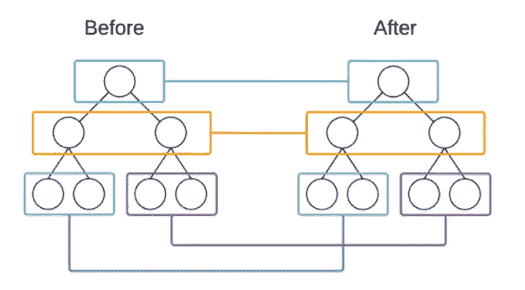
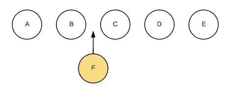
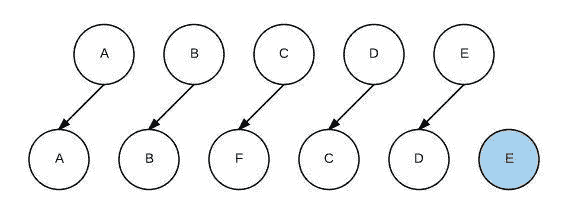

# 第四章 第 4 节 前端框架 vue-4

> 原文：[`www.nowcoder.com/tutorial/10072/49d5f04da41f427e84350a1f6b5a0c83`](https://www.nowcoder.com/tutorial/10072/49d5f04da41f427e84350a1f6b5a0c83)

#### 1.21 vue keep-alive

**参考答案：**

**keep-alive**：`keep-alive`可以实现组件缓存，是 Vue.js 的一个内置组件。

作用：

1.  它能够把不活动的组件实例保存在内存中，而不是直接将其销毁
2.  它是一个抽象组件，不会被渲染到真实 DOM 中，也不会出现在父组件链中

使用方式：

1.  常用的两个属性`include/exclude`，允许组件有条件的进行缓存。

2.  两个生命周期`activated/deactivated`，用来得知当前组件是否处于活跃状态。

3.  keep-alive 的中还运用了`LRU(Least Recently Used)`算法。

原理：Vue 的缓存机制并不是直接存储 DOM 结构，而是将 DOM 节点抽象成了一个个 VNode 节点，所以，keep- alive 的缓存也是基于 VNode 节点的而不是直接存储 DOM 结构。

其实就是将需要缓存的 VNode 节点保存在 this.cache 中／在 render 时,如果 VNode 的 name 符合在缓存条件（可以用 include 以及 exclude 控制），则会从 this.cache 中取出之前缓存的 VNode 实例进行渲染。

#### 1.22 既然函数是引用类型，为什么 vue 的 data 还是可以用函数

**参考答案：**

JavaScript 只有函数构成作用域(注意理解作用域，**只有函数{}构成作用域**,对象的{}以及 if(){}都不构成作用域),data 是一个函数时，每个组件实例都有自己的作用域，每个实例相互独立，不会相互影响。

#### 1.23 vue 中 $nextTick 作用与原理

**参考答案:**

作用：是为了可以获取更新后的 DOM 。

由于 Vue DOM 更新是异步执行的，即修改数据时，视图不会立即更新，而是会监听数据变化，并缓存在同一事件循环中，等同一数据循环中的所有数据变化完成之后，再统一进行视图更新。为了确保得到更新后的 DOM，所以设置了 Vue.nextTick()，就是在下次 DOM 更新循环结束之后执行延迟回调。在修改数据之后立即使用这个方法，获取更新后的 DOM。

原理：

在下次 DOM 更新循环结束之后执行延迟回调。nextTick 主要使用了宏任务和微任务。根据执行环境分别尝试采用

*   Promise
*   MutationObserver
*   setImmediate
*   如果以上都不行则采用 setTimeout

定义了一个异步方法，多次调用 nextTick 会将方法存入队列中，通过这个异步方法清空当前队列。

#### 1.24 vue 的特性

**参考答案：**

*   表单操作
*   自定义指令
*   计算属性
*   过滤器
*   侦听器
*   生命周期

#### 1.25 v-if v-show 区别

**参考答案：**

v-show 和 v-if 都是用来显示隐藏元素，v-if 还有一个 v-else 配合使用，两者达到的效果都一样，但是 v-if 更消耗性能的，因为 v-if 在显示隐藏过程中有 DOM 的添加和删除，v-show 就简单多了，只是操作 css。

**解析：**

v-show

v-show 不管条件是真还是假，第一次渲染的时候都会编译出来，也就是标签都会添加到 DOM 中。之后切换的时候，通过 display: none;样式来显示隐藏元素。可以说只是改变 css 的样式，几乎不会影响什么性能。

v-if

在首次渲染的时候，如果条件为假，什么也不操作，页面当作没有这些元素。当条件为真的时候，开始局部编译，动态的向 DOM 元素里面添加元素。当条件从真变为假的时候，开始局部编译，卸载这些元素，也就是删除。

#### 1.26 Vue 列表为什么加 key

**参考答案：**

vue 中列表循环需加:key="唯一标识" 唯一标识且最好是静态的，因为 vue 组件高度复用增加 Key 可以标识组件的唯一性，为了更好地区别各个组件 key 的作用主要是为了高效的更新虚拟 DOM

**解析：**

vue 和 react 的虚拟 DOM 的 Diff 算法大致相同，其核心是基于两个简单的假设
首先讲一下 diff 算法的处理方法，对操作前后的 dom 树同一层的节点进行对比，一层一层对比，

当某一层有很多相同的节点时，也就是列表节点时，Diff 算法的更新过程默认情况下也是遵循以上原则。
比如一下这个情况：

我们希望可以在 B 和 C 之间加一个 F，Diff 算法默认执行起来是这样的：

即把 C 更新成 F，D 更新成 C，E 更新成 D，最后再插入 E，是不是很没有效率？

所以我们需要使用 key 来给每个节点做一个唯一标识，Diff 算法就可以正确的识别此节点，找到正确的位置区插入新的节点。

#### 1.27 jquery 和 vue 相比

**参考答案：**

1.  jquery：轻量级的 js 库

2.  vue：前端 js 库，是一个精简的 MVVM，它专注于 MVVM 模型的 viewModel 层，通过双向数据绑定把 view 和 model 层连接起来，通过对数据的操作就可以完成对页面视图的渲染。

| **Vue** | **jQuery** |
| --- | --- |
| 数据驱动视图(MVVM 思想:数据视图完全分离；数据驱动、双向绑定；) | 直接操作 DOM(获取、修改、赋值、事件绑定) |
| 操作简单 | 操作麻烦 |
| 模块化 | x |
| 实现单页面 | x |
| 组件复用 | x |
| 性能高：使用的虚拟 DOM，减少 dom 的操作 | x |

**扩展：**

1.  vue 适用的场景：复杂数据操作的后台页面，表单填写页面

    2.  jquery 适用的场景：比如说一些 html5 的动画页面，一些需要 js 来操作页面样式的页面
    3.  二者也是可以结合起来一起使用的，vue 侧重数据绑定，jquery 侧重样式操作，动画效果等，则会更加高效率的完成业务需求

#### 1.28 为什么选择用 vue 做页面展示

**参考答案：**

*   MVVM 框架：

    Vue 正是使用了这种 MVVM 的框架形式，并且通过声明式渲染和响应式数据绑定的方式来帮助我们完全避免了对 DOM 的操作。

*   单页面应用程序

    Vue 配合生态圈中的 Vue-Router 就可以非常方便的开发复杂的单页应用

*   轻量化与易学习

    Vue 的生产版本只有 30.90KB 的大小，几乎不会对我们的网页加载速度产生影响。同时因为 Vue 只专注于视图层，单独的 Vue 就像一个库一样，所以使我们的学习成本变得非常低

*   渐进式与兼容性

    Vue 的核心库只关注视图层，不仅易于上手，还便于与第三方库或既有项目整合。Vue 只做界面，而把其他的一切都交给了它的周边生态（axios（Vue 官方推荐）、Loadsh.js、Velocity.js 等）来做处理，这就要求 Vue 必须要对其他的框架拥有最大程度的兼容性

*   视图组件化

    Vue 允许通过组件来去拼装一个页面，每个组件都是一个可复用的 Vue 实例，组件里面可以包含自己的数据，视图和代码逻辑。方便复用

*   虚拟 DOM（Virtual DOM）

    Vue 之所以可以完全避免对 DOM 的操作，就是因为 Vue 采用了虚拟 DOM 的方式，不但避免了我们对 DOM 的复杂操作，并且大大的加快了我们应用的运行速度。

*   社区支持

    得益于 Vue 的本土化身份（Vue 的作者为国人尤雨溪），再加上 Vue 本身的强大，所以涌现出了特别多的国内社区，这种情况在其他的框架身上是没有出现过的，这使得我们在学习或者使用 Vue 的时候，可以获得更多的帮助

*   未来的 Vue 走向

    Vue 是由国人尤雨溪在 Google 工作的时候，为了方便自己的工作而开发出来的一个库，而在 Vue 被使用的过程中，突然发现越来越多的人喜欢上了它。所以尤雨溪就进入了一个边工作、边维护的状态，在这种情况下 Vue 依然迅速的发展。

    而现在尤雨溪已经正式辞去了 Google 的工作，开始专职维护 Vue，同时加入进来的还有几十位优秀的开发者，他们致力于把 Vue 打造为最受欢迎的前端框架。事实证明 Vue 确实在往越来越好的方向发展了（从 Angular、React、Vue 的对比图中可以看出 Vue 的势头）。所以我觉得完全不需要担心未来 Vue 的发展，至少在没有新的颠覆性创新出来之前，Vue 都会越做越好。

#### 1.29 vue/angular 区别

**参考答案：**

1.  体积和性能

    相较于 vue，angular 显得比较臃肿，比如一个包含了 Vuex + Vue Router 的 Vue 项目 (gzip 之后 30kB) ，而 angular-cli 生成的默认项目尺寸 (~65KB) 还是要小得多。

    在性能上，AngularJS 依赖对数据做脏检查，所以 Watcher 越多越慢。Vue.js 使用基于依赖追踪的观察并且使用异步队列更新。所有的数据都是独立触发的。 对于庞大的应用来说，这个优化差异还是比较明显的

2.  Virtual DOM vs Incremental DOM

    在底层渲染方面，vue 使用的虚拟 dom，而 angular 使用的是 Incremental DOM，Incremental DOM 的优势在于低内开销

3.  Vue 相比于 Angular 更加灵活，可以按照不同的需要去组织项目的应用代码。比如，甚至可以直接像引用 jquery 那样在 HTML 中引用 vue，然后仅仅当成一个前端的模板引擎来用。

4.  es6 支持

    es6 是新一代的 javascript 标准，对 JavaScript 进行了大量的改进，使用 es6 开发已是基本需求。虽然有部分十分老旧的浏览器不支持 es6，但是可以利用现代开发工具将 es6 编译成 es5。在对 es6 的支持上两者都做得很好，（TS 本身就是 es6 的超集）

5.  学习曲线

    针对前端而言，angular 的学习曲线相对较大，vue 学习起来更容易一些。不过对 java 和 c 的使用者而言，angular 的静态检查、依赖注入的特性，以及面向对象的编程风格，使得 angular 都要更亲切一些。

6.  使用热度

    在使用热度上，vue 具有更大优势，主要原因是更受数量庞大的中国开发者欢迎。较低的上手难度，易懂的开发文档，以及国人主导开发的光环，都使得 vue 更为流行