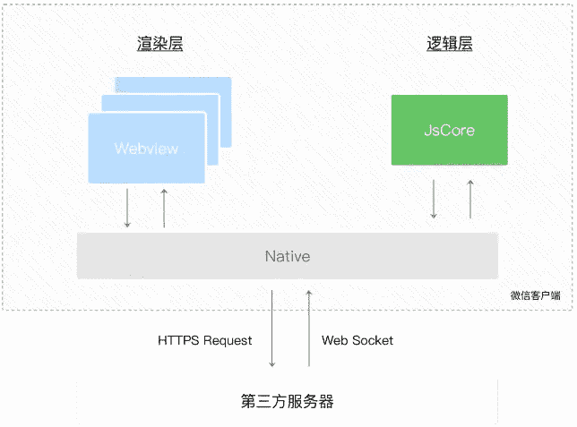

# 第四章 第 6 节 前端框架-微信小程序

> 原文：[`www.nowcoder.com/tutorial/10072/b2c666996f7e47119e0c420615fbcf94`](https://www.nowcoder.com/tutorial/10072/b2c666996f7e47119e0c420615fbcf94)

## 2\. 微信小程序

#### 2.1 微信小程序是单页应用吗

**参考答案：**

是，通过路由进行页面切换

#### 2.2 小程序的开发，发送一个请求，怎么请求数据的

**参考答案：**

1.  在微信小程序进行网络通信，只能和指定的域名进行通信
    服务器域名在：小程序后台=> 开发=> 开发设置 => 服务器域名中配置，配置时需注意：

    1）域名只支持 https（request, uploadFile，downloadFile）和 wss（connectSocket）协议。

    2）域名不能使用 ip 地址或 localhost。

    3）域名必须经过 ICP 备案。

    4）服务器域名一个月内可申请 5 次修改。

2.  微信小程序包括四种类型的网络请求

    ​ 1) 普通 HTTPS 请求(wx.request)

    ​ 2) 上传文件(wx.uploadFile)

    ​ 3) 下载文件(wx.downloadFile)

    ​ 4) WebSocket 通信(wx.connectSocket)

3.  小程序没有跨域的限制：

    在普通网站中，由于浏览器的同源策略限制，存在数据的跨域请求问题，从而衍生出 JSONP 和 CORS 两种主流的跨域问题解决方案，但是小程序内部运行机制与网页不同，小程序中的代码并不运行在浏览器中，因此小程序开发中，不存在数据的跨域请求限制问题。

#### 2.3 小程序中数据怎么同步渲染

**参考答案：**

通过 setData 方法

**解析：**

setData 工作原理

小程序分为逻辑层和渲染层，而我们每次逻辑层改变了，要借由 Native 进行。小程序的渲染层和逻辑层由两个线程管理：渲染层的界面使用了 WebView 进行渲染；逻辑层采用 JsCore 线程运行 JS 脚本。一个小程序存在多个界面，所以渲染层存在多个 WebView 线程，这两个线程的通信会经由微信客户端 Native 做中转，逻辑层发送网络请求也经由 Native 转发，请看下图:



所以我们不要重复 setdata ，以及减少数据的传输量。我们的数据传输实际是一次 Javascript 脚本过程，当数据量过大时会增加脚本的编译执行时间，占用 WebView JS 线程。去除不必要的事件绑定（ WXML 中的 bind 和 catch ），从而减少通信的数据量和次数。

#### 2.4 微信小程序组件的生命周期

**参考答案：**

组件生命周期：

组件的生命周期，指的是组件自身的一些函数，这些函数在特殊的时间点或遇到一些特殊的框架事件时被自动触发。

其中，最重要的生命周期是 created attached detached ，包含一个组件实例生命流程的最主要时间点。

*   组件实例刚刚被创建好时， created 生命周期被触发。此时，组件数据 this.data 就是在 Component 构造器中定义的数据 data 。 此时还不能调用 setData 。 通常情况下，这个生命周期只应该用于给组件 this 添加一些自定义属性字段。
*   在组件完全初始化完毕、进入页面节点树后， attached 生命周期被触发。此时， this.data 已被初始化为组件的当前值。这个生命周期很有用，绝大多数初始化工作可以在这个时机进行。
*   在组件离开页面节点树后， detached 生命周期被触发。退出一个页面时，如果组件还在页面节点树中，则 detached 会被触发。

**解析：**

定义生命周期方法：

生命周期方法可以直接定义在 Component 构造器的第一级参数中。

自小程序基础库版本 2.2.3 起，组件的的生命周期也可以在 lifetimes 字段内进行声明（这是推荐的方式，其优先级最高）。

```cpp
Component({
  lifetimes: {
    attached: function() {
      // 在组件实例进入页面节点树时执行
    },
    detached: function() {
      // 在组件实例被从页面节点树移除时执行
    },
  },
  // 以下是旧式的定义方式，可以保持对 <2.2.3 版本基础库的兼容
  attached: function() {
    // 在组件实例进入页面节点树时执行
  },
  detached: function() {
    // 在组件实例被从页面节点树移除时执行
  },
  // ...
})
```

在 behaviors 中也可以编写生命周期方法，同时不会与其他 behaviors 中的同名生命周期相互覆盖。但要注意，如果一个组件多次直接或间接引用同一个 behavior ，这个 behavior 中的生命周期函数在一个执行时机内只会执行一次。

可用的全部生命周期如下表所示。

| 生命周期 | 参数 | 描述 |
| --- | --- | --- |
| created | 无 | 在组件实例刚刚被创建时执行 |
| attached | 无 | 在组件实例进入页面节点树时执行 |
| ready | 无 | 在组件在视图层布局完成后执行 |
| moved | 无 | 在组件实例被移动到节点树另一个位置时执行 |
| detached | 无 | 在组件实例被从页面节点树移除时执行 |
| error | `Object Error` | 每当组件方法抛出错误时执行 |

组件所在页面的生命周期：

还有一些特殊的生命周期，它们并非与组件有很强的关联，但有时组件需要获知，以便组件内部处理。这样的生命周期称为“组件所在页面的生命周期”，在 pageLifetimes 定义段中定义。其中可用的生命周期包括：

| 生命周期 | 参数 | 描述 |
| --- | --- | --- |
| show | 无 | 组件所在的页面被展示时执行 |
| hide | 无 | 组件所在的页面被隐藏时执行 |
| resize | `Object Size` | 组件所在的页面尺寸变化时执行 |

```cpp
Component({
  pageLifetimes: {
    show: function() {
      // 页面被展示
    },
    hide: function() {
      // 页面被隐藏
    },
    resize: function(size) {
      // 页面尺寸变化
    }
  }
})
```

#### 2.5 小程序 rpx 单位

**参考答案：**

*   rpx 是微信小程序独有的、**解决屏幕自适应**的尺寸单位
*   可以根据屏幕宽度进行自适应，不论大小屏幕，**规定屏幕宽为 750rpx**
*   通过 rpx 设置元素和字体的大小，小程序在**不同尺寸**的屏幕下，**可以实现自动适配**

**扩展：**

rpx 和 px 之间的换算

*   在普通网页开发中，最常用的像素单位是 px
*   在小程序开发中，推荐使用 rpx 这种响应式的像素单位进行开发
*   以 iPhone6 为例，iPhone6 的屏幕宽度为 375px，共有 750 个物理像素，则 750rpx = 375px = 750 物理像素
*   得出公式：**1 rpx = 0.5 px = 1 物理像素**
*   举个例子：在 iPhone6 上，如果要绘制一个宽为 100px，高为 30px 的盒子，换算成 rpx 单位，宽高分别为 200rpx 和 60rpx

#### 2.6 微信小程序与 vue 区别

**参考答案**：

*   生命周期不一样，微信小程序生命周期比较简单
*   数据绑定也不同，微信小程序数据绑定需要使用`{{}}，vue` 直接:就可以 显示与隐藏元素，`vue`中，使用 `v-if`和 `v-show`
*   控制元素的显示和隐藏，小程序中，使用`wx-if`和`hidden` 控制元素的显示和隐藏
*   事件处理不同，小程序中，全用 `bindtap(bind+event)`，或者 `catchtap(catch+event)`绑定事件,vue：使用`v-on:event` 绑定事件，或者使用`@event`绑定事件
*   数据双向绑定也不也不一样在 `vue`中,只需要再表单元素上加上 `v-model`,然后再绑定 `data`中对应的一个值，当表单元素内容发生变化时，`data`中对应的值也会相应改变，这是 `vue`非常 `nice` 的一点。微信小程序必须获取到表单元素，改变的值，然后再把值赋给一个 `data`中声明的变量。

#### 2.7 简述微信小程序原理

**参考答案**：

*   微信小程序采用 `JavaScript、WXML、WXSS` 三种技术进行开发,本质就是一个单页面应用，所有的页面渲染和事件处理，都在一个页面内进行，但又可以通过微信客户端调用原生的各种接口
*   微信的架构，是数据驱动的架构模式，它的 `UI` 和数据是分离的，所有的页面更新，都需要通过对数据的更改来实现
*   小程序分为两个部分 `webview`和 `appService` 。其中 `webview` 主要用来展现`UI ，appService` 有来处理业务逻辑、数据及接口调用。它们在两个进程中运行，通过系统层 `JSBridge` 实现通信，实现 UI 的渲染、事件的处理

#### 2.8 bindtap 和 catchtap 的区别是什么

**参考答案**：

相同点：首先他们都是作为点击事件函数，就是点击时触发。在这个作用上他们是一样的，可以不做区分

不同点：他们的不同点主要是`bindtap`是不会阻止冒泡事件的，`catchtap`是阻值冒泡的

#### 2.9 小程序 wxml 与标准的 html 的异同？

**参考答案**：

相同：

*   都是用来描述页面的结构；
*   都由标签、属性等构成；

不同：

*   标签名字不一样，且小程序标签更少，单一标签更多；
*   多了一些`wx:if` 这样的属性以及 `{{ }}`这样的表达式
*   WXML 仅能在微信小程序开发者工具中预览，而`HTML`可以在浏览器内预览；
*   组件封装不同， `WXML`对组件进行了重新封装，
*   小程序运行在`JS Core`内，没有`DOM 树`和`window`对象，小程序中无法使用`window`对象和`document`对象。

#### 2.10 小程序简单介绍下三种事件对象的属性列表？

**参考答案**：

基础事件（BaseEvent）

*   `type:`事件类型
*   `timeStamp：`事件生成时的时间戳
*   `target：`触发事件的组件的属性值集合
*   `currentTarget：`当前组件的一些属性集合

自定义事件（CustomEvent）

*   `detail`

触摸事件（TouchEvent）

*   `touches`
*   `changedTouches`

#### 2.11 微信小程序的优劣势？

**参考答案**：

优势：

1.  无需下载，通过搜索和扫一扫就可以打开。
2.  良好的用户体验：打开速度快。
3.  开发成本要比 App 要低。
4.  安卓上可以添加到桌面，与原生 App 差不多。
5.  为用户提供良好的安全保障。小程序的发布，微信拥有一套严格的审查流程，不能通过审查的小程序是无法发布到线上的。

劣势：

1.  限制较多。页面大小不能超过 1M。不能打开超过 5 个层级的页面。
2.  样式单一。小程序的部分组件已经是成型的了，样式不可以修改。例如：幻灯片、导航。
3.  推广面窄，不能分享朋友圈，只能通过分享给朋友，附近小程序推广。其中附近小程序也受到微信的限制。
4.  依托于微信，无法开发后台管理功能。