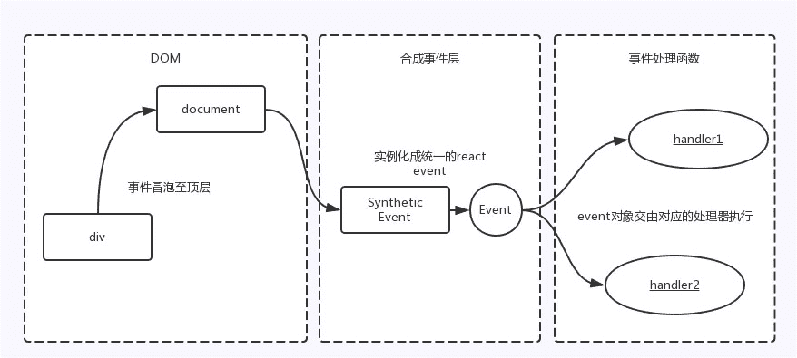

# 第四章 第 8 节 前端框架-react2

> 原文：[`www.nowcoder.com/tutorial/10072/51d832d1323a4ac39abe88d9172263d7`](https://www.nowcoder.com/tutorial/10072/51d832d1323a4ac39abe88d9172263d7)

#### **3.11 列出一些应该使用 Refs 的情况**

**参考答案**：

以下是应该使用 refs 的情况：

*   需要管理焦点、选择文本或媒体播放时
*   触发式动画
*   与第三方 DOM 库集成

#### 3.12 React 事件绑定原理

**参考答案**：

React 并不是将 click 事件绑在该 div 的真实 DOM 上，而是在 document 处监听所有支持的事件，当事件发生并冒泡至 document 处时，React 将事件内容封装并交由真正的处理函数运行。这样的方式不仅减少了内存消耗，还能在组件挂载销毁时统一订阅和移除事件。
另外冒泡到 document 上的事件也不是原生浏览器事件，而是 React 自己实现的合成事件（SyntheticEvent）。因此我们如果不想要事件冒泡的话，调用 event.stopPropagation 是无效的，而应该调用 event.preventDefault。

#### 3.15 redux-saga 和 mobx 的比较

**参考答案**：

1.  状态管理

*   redux-sage 是 redux 的一个异步处理的中间件。
*   mobx 是数据管理库，和 redux 一样。

2.  设计思想

*   redux-sage 属于 flux 体系， 函数式编程思想。
*   mobx 不属于 flux 体系，面向对象编程和响应式编程。

3.  主要特点

*   redux-sage 因为是中间件，更关注异步处理的，通过 Generator 函数来将异步变为同步，使代码可读性高，结构清晰。action 也不是 action creator 而是 pure action，
*   在 Generator 函数中通过 call 或者 put 方法直接声明式调用，并自带一些方法，如 takeEvery，takeLast，race 等，控制多个异步操作，让多个异步更简单。
*   mobx 是更简单更方便更灵活的处理数据。 Store 是包含了 state 和 action。state 包装成一个可被观察的对象， action 可以直接修改 state，之后通过 Computed values 将依赖 state 的计算属性更新 ，之后触发 Reactions 响应依赖 state 的变更，输出相应的副作用 ，但不生成新的 state。

4.  数据可变性

*   redux-sage 强调 state 不可变，不能直接操作 state，通过 action 和 reducer 在原来的 state 的基础上返回一个新的 state 达到改变 state 的目的。
*   mobx 直接在方法中更改 state，同时所有使用的 state 都发生变化，不生成新的 state。

5.  写法难易度

*   redux-sage 比 redux 在 action 和 reducer 上要简单一些。需要用 dispatch 触发 state 的改变，需要 mapStateToProps 订阅 state。
*   mobx 在非严格模式下不用 action 和 reducer，在严格模式下需要在 action 中修改 state，并且自动触发相关依赖的更新。

6.  使用场景

*   redux-sage 很好的解决了 redux 关于异步处理时的复杂度和代码冗余的问题，数据流向比较好追踪。但是 redux 的学习成本比 较高，代码比较冗余，不是特别需要状态管理，最好用别
    的方式代替。
*   mobx 学习成本低，能快速上手，代码比较简洁。但是可能因为代码编写的原因和数据更新时相对黑盒，导致数据流向不利于追踪。

#### 3.16 简述一下 React 的源码实现

**参考答案**：

1.  React 的实现主要分为 `Component` 和 `Element`；
2.  `Component` 属于 React 实例，在创建实例的过程中会在实例中注册 `state` 和 `props` 属性，还会依次调用内置的生命周期函数；
3.  `Component` 中有一个 `render` 函数，`render` 函数要求返回一个 `Element`对象（或 `null`）；
4.  `Element` 对象分为原生 `Element` 对象和组件式对象，原生 `Element` + 组件式对象会被一起解析成虚拟 DOM 树，并且内部使用的 `state` 和 `props` 也以 AST 的形式注入到这棵虚拟 DOM 树之中；
5.  在渲染虚拟 DOM 树的前后，会触发 React Component 的一些生命周期钩子函数，比如 `componentWillMount` 和 `componentDidMount`，在虚拟 DOM 树解析完成后将被渲染成真实 DOM 树；
6.  调用 `setState` 时，会调用更新函数更新 `Component` 的 `state`，并且触发内部的一个 `updater`，调用 `render` 生成新的虚拟 DOM 树，利用 diff 算法与旧的虚拟 DOM 树进行比对，比对以后利用最优的方案进行 DOM 节点的更新，这也是 React 单向数据流的原理（与 Vue 的 MVVM 不同之处）。

#### 3.17 setState 到底是异步还是同步?

**参考答案**：

有时表现出异步,有时表现出同步

1.  **`setState`只在合成事件和钩子函数中是“异步”的，在原生事件和`setTimeout` 中都是同步的。**
2.  **`setState` 的“异步”并不是说内部由异步代码实现，其实本身执行的过程和代码都是同步的，只是合成事件和钩子函数的调用顺序在更新之前，导致在合成事件和钩子函数中没法立马拿到更新后的值，形成了所谓的“异步”，当然可以通过第二个参数 `setState(partialState, callback)` 中的`callback`拿到更新后的结果。**
3.  `setState` 的批量更新优化也是建立在“异步”（合成事件、钩子函数）之上的，在原生事件和 setTimeout 中不会批量更新，在“异步”中如果对同一个值进行多次`setState`，`setState`的批量更新策略会对其进行覆盖，取最后一次的执行，如果是同时`setState`多个不同的值，在更新时会对其进行合并批量更新。**

#### 3.18 redux 异步中间件之间的优劣?

**参考答案**：

**redux-thunk 优点:**

*   体积小: redux-thunk 的实现方式很简单,只有不到 20 行代码
*   使用简单: redux-thunk 没有引入像 redux-saga 或者 redux-observable 额外的范式,上手简单

**redux-thunk 缺陷:**

*   样板代码过多: 与 redux 本身一样,通常一个请求需要大量的代码,而且很多都是重复性质的
*   耦合严重: 异步操作与 redux 的 action 偶合在一起,不方便管理
*   功能孱弱: 有一些实际开发中常用的功能需要自己进行封装

**redux-saga 优点:**

*   异步解耦: 异步操作被被转移到单独 saga.js 中，不再是掺杂在 action.js 或 component.js 中
*   action 摆脱 thunk function: dispatch 的参数依然是一个纯粹的 action (FSA)，而不是充满 “黑魔法” thunk function
*   异常处理: 受益于 generator function 的 saga 实现，代码异常/请求失败 都可以直接通过 try/catch 语法直接捕获处理
*   功能强大: redux-saga 提供了大量的 Saga 辅助函数和 Effect 创建器供开发者使用,开发者无须封装或者简单封装即可使用
*   灵活: redux-saga 可以将多个 Saga 可以串行/并行组合起来,形成一个非常实用的异步 flow
*   易测试，提供了各种 case 的测试方案，包括 mock task，分支覆盖等等

**redux-saga 缺陷:**

*   额外的学习成本: redux-saga 不仅在使用难以理解的 generator function,而且有数十个 API,学习成本远超 redux-thunk,最重要的是你的额外学习成本是只服务于这个库的,与 redux-observable 不同,redux-observable 虽然也有额外学习成本但是背后是 rxjs 和一整套思想
*   体积庞大: 体积略大,代码近 2000 行，min 版 25KB 左右
*   功能过剩: 实际上并发控制等功能很难用到,但是我们依然需要引入这些代码
*   ts 支持不友好: yield 无法返回 TS 类型

**redux-observable 优点:**

*   功能最强: 由于背靠 rxjs 这个强大的响应式编程的库,借助 rxjs 的操作符,你可以几乎做任何你能想到的异步处理
*   背靠 rxjs: 由于有 rxjs 的加持,如果你已经学习了 rxjs,redux-observable 的学习成本并不高,而且随着 rxjs 的升级 redux-observable 也会变得更强大

**redux-observable 缺陷:**

*   学习成本奇高: 如果你不会 rxjs,则需要额外学习两个复杂的库
*   社区一般: redux-observable 的下载量只有 redux-saga 的 1/5,社区也不够活跃,在复杂异步流中间件这个层面 redux-saga 仍处于领导地位

#### 3.19 state 和 props 区别是啥？

**参考答案**：

props 和 state 是普通的 JS 对象。虽然它们都包含影响渲染输出的信息，但是它们在组件方面的功能是不同的。即

*   state 是组件自己管理数据，控制自己的状态，可变；
*   props 是外部传入的数据参数，不可变；
*   没有 state 的叫做无状态组件，有 state 的叫做有状态组件；
*   多用 props，少用 state，也就是多写无状态组件。

#### 3.20 当调用 setState 时，React render 是如何工作的？

**参考答案**：

虚拟 DOM 渲染:当 render 方法被调用时，它返回一个新的组件的虚拟 DOM 结构。当调用 setState()时，render 会被再次调用，因为默认情况下 shouldComponentUpdate 总是返回 true，所以默认情况下 React 是没有优化的。
原生 DOM 渲染:React 只会在虚拟 DOM 中修改真实 DOM 节点，而且修改的次数非常少——这是很棒的 React 特性，它优化了真实 DOM 的变化，使 React 变得更快。