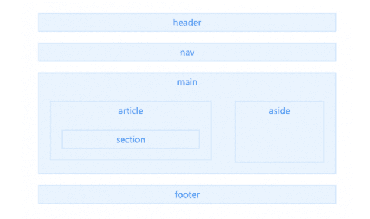

# 第五章 第 1 节 前端基础-html

> 原文：[`www.nowcoder.com/tutorial/10072/407594bc55614be889073977988fe249`](https://www.nowcoder.com/tutorial/10072/407594bc55614be889073977988fe249)

#### 1.1 html 标签的类型（head， body，！Doctype） 他们的作用是什么

**参考答案：**

!DOCTYPE 标签：

*   它是指示 web 浏览器关于页面使用哪个 HTML 版本进行编写的指令.

head：

*   是所有头部元素的容器, 绝大多数头部标签的内容不会显示给读者
*   该标签下所包含的部分可加入的标签有 <base>, <link>, <meta>, <script>, <style>和<title>

body :

*   用于定义文档的主体, 包含了文档的所有内容
*   该标签支持 html 的全局属性和事件属性.

#### 1.2 h5 新特性

**参考答案：**

*   新增选择器 document.querySelector、document.querySelectorAll
*   拖拽释放(Drag and drop) API
*   媒体播放的 video 和 audio
*   本地存储 localStorage 和 sessionStorage
*   离线应用 manifest
*   桌面通知 Notifications
*   语意化标签 article、footer、header、nav、section
*   增强表单控件 calendar、date、time、email、url、search
*   地理位置 Geolocation
*   多任务 webworker
*   全双工通信协议 websocket
*   历史管理 history
*   跨域资源共享(CORS) Access-Control-Allow-Origin
*   页面可见性改变事件 visibilitychange
*   跨窗口通信 PostMessage
*   Form Data 对象
*   绘画 canvas

H5 移除的元素：

*   纯表现的元素：basefont、big、center、font、s、strike、tt、u
*   对可用性产生负面影响的元素：frame、frameset、noframes

#### 1.3 伪类和伪元素

**参考答案：**

伪类：用于已有元素处于某种状态时为其添加对应的样式，这个状态是根据用户行为而动态变化的。

​ 例如：当用户悬停在指定元素时，可以通过:hover 来描述这个元素的状态，虽然它和一般 css 相似，可以为 已有元素添加样式，但是它只有处于 DOM 树无法描述的状态下才能为元素添加样式，所以称为伪类。

伪元素：用于创建一些不在 DOM 树中的元素，并为其添加样式。

​ 例如，我们可以通过:before 来在一个元素之前添加一些文本，并为这些文本添加样式，虽然用户可以看见 这些文本，但是它实际上并不在 DOM 文档中。

#### 1.4 html5 语义化

**参考答案：**

在 HTML5 出来之前，我们习惯于用`div`来表示页面的章节或者不同模块，但是`div`本身是没有语义的。但是现在，HTML5 中加入了一些语义化标签，来更清晰的表达文档结构。

标签：



```cpp
<title>      <!--：页面主体内容。-->
<hn>         <!--：h1~h6，分级标题，<h1> 与 <title> 协调有利于搜索引擎优化。-->
<ul>         <!--：无序列表。-->
<li>         <!--：有序列表。-->
<header>     <!--：页眉通常包括网站标志、主导航、全站链接以及搜索框。-->
<nav>         <!--：标记导航，仅对文档中重要的链接群使用。-->
<main>         <!--：页面主要内容，一个页面只能使用一次。如果是 web 应用，则包围其主要功能。-->
<article>    <!--：定义外部的内容，其中的内容独立于文档的其余部分。-->
<section>    <!--：定义文档中的节（section、区段）。比如章节、页眉、页脚或文档中的其他部分。-->
<aside>         <!--：定义其所处内容之外的内容。如侧栏、文章的一组链接、广告、友情链接、相关产品列表等。-->
<footer>     <!--：页脚，只有当父级是 body 时，才是整个页面的页脚。-->
<small>      <!--：呈现小号字体效果，指定细则，输入免责声明、注解、署名、版权。-->
<strong>     <!--：和 em 标签一样，用于强调文本，但它强调的程度更强一些。-->
<em>         <!--：将其中的文本表示为强调的内容，表现为斜体。-->
<mark>       <!--：使用黄色突出显示部分文本。-->
<figure>     <!--：规定独立的流内容（图像、图表、照片、代码等等）（默认有 40px 左右 margin）。-->
<figcaption><!--：定义 figure 元素的标题，应该被置于 figure 元素的第一个或最后一个子元素的位置。-->
<cite>       <!--：表示所包含的文本对某个参考文献的引用，比如书籍或者杂志的标题。-->
<blockquoto><!--：定义块引用，块引用拥有它们自己的空间。-->
<q>          <!--：短的引述（跨浏览器问题，尽量避免使用）。-->
<time>       <!--：datetime 属性遵循特定格式，如果忽略此属性，文本内容必须是合法的日期或者时间格式。-->
<abbr>       <!--：简称或缩写。-->
<dfn>       <!--：定义术语元素，与定义必须紧挨着，可以在描述列表 dl 元素中使用。-->
<address>    <!--：作者、相关人士或组织的联系信息（电子邮件地址、指向联系信息页的链接）。-->
<del>        <!--：移除的内容。-->
<ins>        <!--：添加的内容。-->
<code>       <!--：标记代码。-->
<meter>      <!--：定义已知范围或分数值内的标量测量。（Internet Explorer 不支持 meter 标签）-->
<progress>    <!--：定义运行中的进度（进程）。-->
```

**扩展：**

语义化优点：

*   易于用户阅读，样式丢失的时候能让页面呈现清晰的结构。
*   有利于 SEO，搜索引擎根据标签来确定上下文和各个关键字的权重。
*   方便其他设备解析，如盲人阅读器根据语义渲染网页
*   有利于开发和维护，语义化更具可读性，代码更好维护，与 CSS3 关系更和谐。

#### 1.5 audio 标签的 api

**参考答案：**

audio 常用属性

| **属性** | **属性值** | **注释** |
| --- | --- | --- |
| src | url | 播放的音乐的 url 地址（火狐只支持 ogg 的音乐，而 IE9 只支持 MP3 格式的音乐。chrome 貌似全支持） |
| preload | preload | 预加载（在页面被加载时进行加载或者说缓冲音频），如果使用了 autoplay 的话那么该属性失效。 |
| loop | loop | 循环播放 |
| controls | controls | 是否显示默认控制条（控制按钮） |
| autoplay | autoplay | 自动播放 |

audio 音乐格式的支持

| **音频格式** | **Chrome** | **Firefox** | **IE9** | **Opera** | **Safari** |
| --- | --- | --- | --- | --- | --- |
| OGG | 支持 | 支持 | 支持 | 不支持 | 不支持 |
| MP3 | 支持 | 不支持 | 支持 | 不支持 | 支持 |
| WAV | 不支持 | 支持 | 不支持 | 支持 | 不支 |

audio 属性

| 属性 | 注释 |
| --- | --- |
| duration | 获取媒体文件的总时长，以 s 为单位，如果无法获取，返回 NaN |
| paused | 如果媒体文件被暂停，那么 paused 属性返回 true，反之则返回 false |
| ended | 如果媒体文件播放完毕返回 true |
| muted | 用来获取或设置静音状态。值为 boolean |
| volume | 控制音量的属性值为 0-1;0 为音量最小，1 为音量最大 |
| startTime | 返回起始播放时间 |
| error | 返回错误代码，为 uull 的时候为正常。否则可以通过 Music.error.code 来获取具体的错误代码： 1.用户终止 2.网络错误 3.解码错误 4.URL 无效 |
| currentTime | 用来获取或控制当前播放的时间，单位为 s。 |
| currentSrc | 以字符串形式返回正在播放或已加载的文件 |

常用的控制用的函数：

| 函数 | 作用 |
| --- | --- |
| load() | 加载音频、视频软件 |
| play() | 加载并播放音频、视频文件或重新播放暂停的的音频、视频 |
| pause() | 暂停出于播放状态的音频、视频文件 |
| canPlayType(obj) | 测试是否支持给定的 Mini 类型的文件 |

常用 audio 的事件：

| 事件名称 | 事件作用 |
| --- | --- |
| loadstart | 客户端开始请求数据 |
| progress | 客户端正在请求数据（或者说正在缓冲） |
| play | play()和 autoplay 播放时 |
| pause | pause()方法促发时 |
| ended | 当前播放结束 |
| timeupdate | 当前播放时间发生改变的时候。播放中常用的时间处理哦 |
| canplaythrough | 歌曲已经载入完全完成 |
| canplay | 缓冲至目前可播放状态。 |