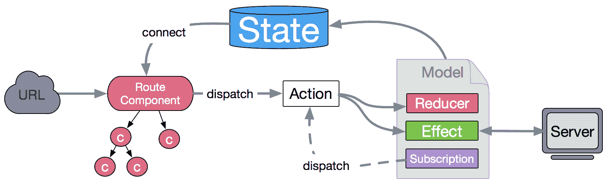
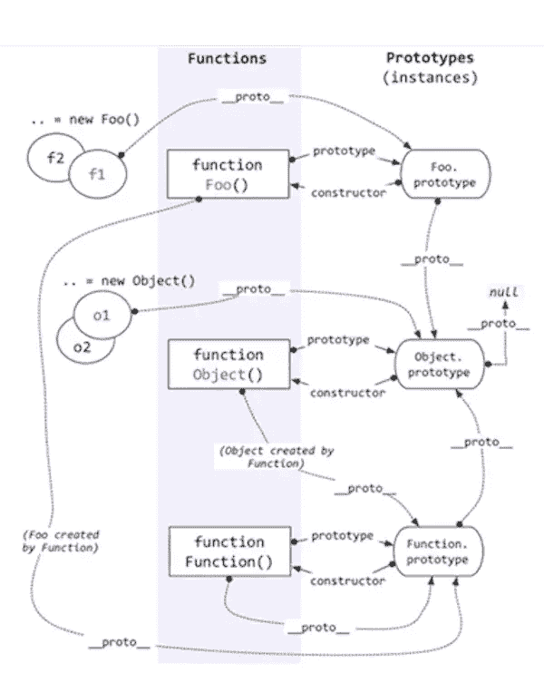

# 第五章 第 3 节 前端基础-js2

> 原文：[`www.nowcoder.com/tutorial/10072/ba6b10b9d88a44a9a486e571adc10435`](https://www.nowcoder.com/tutorial/10072/ba6b10b9d88a44a9a486e571adc10435)

#### 2.11 dva 的数据流流向是怎么样的

**参考答案：**

​ 数据的改变发生通常是通过用户交互行为或者浏览器行为（如路由跳转等）触发的，当此类行为会改变数据 的时候可以通过 `dispatch` 发起一个 action，如果是同步行为会直接通过 `Reducers` 改变 `State` ，如果是 异步行为（副作用）会先触发 `Effects` 然后流向 `Reducers` 最终改变 `State`，所以在 dva 中，数据流向非 常清晰简明，并且思路基本跟开源社区保持一致。

​ 

#### 2.12 变量提升

**参考答案：**

JavaScript 是单线程语言，所以执行肯定是按顺序执行。但是并不是逐行的分析和执行，而是一段一段地分析执行，会先进行编译阶段然后才是执行阶段。在编译阶段阶段，代码真正执行前的几毫秒，会检测到所有的变量和函数声明，所有这些函数和变量声明都被添加到名为 Lexical Environment 的 JavaScript 数据结构内的内存中。所以这些变量和函数能在它们真正被声明之前使用。

#### 2.13 作用域

**参考答案：**

**概念：**作用域就是一个独立的地盘，让变量不会外泄、暴露出去。也就是说作用域最大的用处就是隔离变量，不同作用域下同名变量不会有冲突。

**ES6 之前 JavaScript 没有块级作用域,只有全局作用域和函数作用域**。ES6 的到来，为我们提供了‘块级作用域’,可通过新增命令 let 和 const 来体现。

**扩展：**

var ——ES5 变量声明方式

1.  在变量未赋值时，变量 undefined（为使用声明变量时也为 undefined）
2.  作用域——var 的作用域为方法作用域；只要在方法内定义了，整个方法内的定义变量后的代码都可以使用

let——ES6 变量声明方式

1.  在变量为声明前直接使用会报错
2.  作用域——let 为块作用域——通常 let 比 var 范围要小
3.  let 禁止重复声明变量，否则会报错；var 可以重复声明

const——ES6 变量声明方式

​ const 为常量声明方式；声明变量时必须初始化，在后面出现的代码中不能再修改该常量的值

​ const 实际上保证的，并不是变量的值不得改动，而是变量指向的那个内存地址不得改动

#### 2.14 HashMap 和 Array 有什么区别？

**参考答案：**

1.  查找效率
    HashMap 因为其根据 hashcode 的值直接算出 index,所以其查找效率是随着数组长度增大而增加的。
    ArrayMap 使用的是二分法查找，所以当数组长度每增加一倍时，就需要多进行一次判断，效率下降

2.  扩容数量
    HashMap 初始值 16 个长度，每次扩容的时候，直接申请双倍的数组空间。
    ArrayMap 每次扩容的时候，如果 size 长度大于 8 时申请 size*1.5 个长度，大于 4 小于 8 时申请 8 个，小于 4 时申 请 4 个。这样比较 ArrayMap 其实是申请了更少的内存空间，但是扩容的频率会更高。因此，如果数据量比较大的时候，还是使用 HashMap 更合适，因为其扩容的次数要比 ArrayMap 少很多。

3.  扩容效率
    HashMap 每次扩容的时候重新计算每个数组成员的位置，然后放到新的位置。
    ArrayMap 则是直接使用 System.arraycopy，所以效率上肯定是 ArrayMap 更占优势。

4.  内存消耗
    以 ArrayMap 采用了一种独特的方式，能够重复的利用因为数据扩容而遗留下来的数组空间，方便下一个 ArrayMap 的使用。而 HashMap 没有这种设计。 由于 ArrayMap 之缓存了长度是 4 和 8 的时候，所以如果频繁的使用到 Map，而且数据量都比较小的时候，ArrayMap 无疑是相当的是节省内存的。

总结
综上所述，数据量比较小，并且需要频繁的使用 Map 存储数据的时候，推荐使用 ArrayMap。 而数据量比较大的 时候，则推荐使用 HashMap。

#### 2.15 HashMap 和 Object

**参考答案：**

`Objects`和 `Maps` 类似的是，它们都允许你按键存取一个值、删除键、检测一个键是否绑定了值。因此（并且也没有其他内建的替代方式了）过去我们一直都把对象当成 `Maps` 使用。不过 `Maps` 和 `Objects` 有一些重要的区别，在下列情况里使用 `Map` 会是更好的选择：

|  | Map | Object |
| :-- | :-- | :-- |
| 意外的键 | `Map` 默认情况不包含任何键。只包含显式插入的键。 | 一个 `Object` 有一个原型, 原型链上的键名有可能和你自己在对象上的设置的键名产生冲突。**注意:** 虽然 ES5 开始可以用 `Object.create(null)` 来创建一个没有原型的对象，但是这种用法不太常见。 |
| 键的类型 | 一个 `Map`的键可以是**任意值**，包括函数、对象或任意基本类型。 | 一个`Object` 的键必须是一个 [`String`](https://developer.mozilla.org/zh-CN/docs/Web/JavaScript/Reference/String) 或是[`Symbol`](https://developer.mozilla.org/zh-CN/docs/Web/JavaScript/Reference/Global_Objects/Symbol)。 |
| 键的顺序 | `Map` 中的 key 是有序的。因此，当迭代的时候，一个 `Map` 对象以插入的顺序返回键值。 | 一个 `Object` 的键是无序的注意：自 ECMAScript 2015 规范以来，对象*确实*保留了字符串和 Symbol 键的创建顺序； 因此，在只有字符串键的对象上进行迭代将按插入顺序产生键。 |
| Size | `Map` 的键值对个数可以轻易地通过[`size`](https://developer.mozilla.org/zh-CN/docs/Web/JavaScript/Reference/Global_Objects/Map/size) 属性获取 | `Object` 的键值对个数只能手动计算 |
| 迭代 | `Map` 是 [iterable](https://developer.mozilla.org/en-US/docs/Web/JavaScript/Guide/iterable) 的，所以可以直接被迭代。 | 迭代一个`Object`需要以某种方式获取它的键然后才能迭代。 |
| 性能 | 在频繁增删键值对的场景下表现更好。 | 在频繁添加和删除键值对的场景下未作出优化。 |

#### 2.16 javascript 中 arguments 相关的问题

**参考答案：**

**arguments**

在 js 中，我们在调用有参数的函数时，当往这个调用的有参函数传参时，js 会把所传的参数全部存到一个叫 arguments 的对象里面。它是一个**类数组数据**

**由来**

Javascrip 中每个函数都会有一个 Arguments 对象实例 arguments，引用着函数的实参。它是寄生在 js 函数当中的，不能显式创建，arguments 对象只有函数开始时才可用

**作用**

有了 arguments 这个对象之后，我们可以不用给函数预先设定形参了，可以动态地通过 arguments 为函数加入参数

#### 2.17 instanceOf 原理，手动实现 function isInstanceOf (child, Parent)

**参考答案**：

instanceof 主要作用就是判断一个实例是否属于某种类型

```cpp
let person = function(){

}
let no = new person()
no instanceof person//true
```

instanceOf 原理

```cpp
function new_instance_of(leftVaule, rightVaule) { 
    let rightProto = rightVaule.prototype; // 取右表达式的 prototype 值
    leftVaule = leftVaule.__proto__; // 取左表达式的 __proto__ 值
    while (true) {
        if (leftVaule === null) {
            return false;    
        }
        if (leftVaule === rightProto) {
            return true;    
        } 
        leftVaule = leftVaule.__proto__ 
    }
}
```

其实 instanceof 主要的实现原理就是只要右边变量的 prototype 在左边变量的原型链上即可。因此，instanceof 在查找的过程中会遍历左边变量的原型链，直到找到右边变量的 prototype，如果查找失败，则会返回 false，告诉我们左边变量并非是右边变量的实例。

同时还要了解 js 的原型继承原理



我们知道每个 JavaScript 对象均有一个隐式的 proto 原型属性，而显式的原型属性是 prototype，只有 Object.prototype.proto 属性在未修改的情况下为 null 值

手动实现

```cpp
function instance_of(L, R) {//L 表示左表达式，R 表示右表达式
    var O = R.prototype;
    L = L.__proto__;
    while (true) { 
        if (L === null) 
        return false; 
        if (O === L) // 这里重点：当 O 严格等于 L 时，返回 true 
        return true; 
        L = L.__proto__; 
    } 
}
// 开始测试
var a = []
var b = {}

function Foo(){}
var c = new Foo()
function child(){}
function father(){}
child.prototype = new father() 
var d = new child()

console.log(instance_of(a, Array)) // true
console.log(instance_of(b, Object)) // true
console.log(instance_of(b, Array)) // false
console.log(instance_of(a, Object)) // true
console.log(instance_of(c, Foo)) // true
console.log(instance_of(d, child)) // true
console.log(instance_of(d, father)) // true

```

#### 2.18 数组去重

**参考答案：**

**1\. 利用 ES6 Set 去重（ES6 中最常用）**

```cpp
function unique (arr) {
  return Array.from(new Set(arr))
}
var arr = [1,1,'true','true',true,true,15,15,false,false, undefined,undefined, null,null, NaN, NaN,'NaN', 0, 0, 'a', 'a',{},{}];
console.log(unique(arr))
 //[1, "true", true, 15, false, undefined, null, NaN, "NaN", 0, "a", {}, {}]
```

不考虑兼容性，这种去重的方法代码最少。这种方法还无法去掉“{}”空对象，后面的高阶方***添加去掉重复“{}”的方法。

**2\. 利用 for 嵌套 for，然后 splice 去重（ES5 中最常用）**

```cpp
function unique(arr){            
        for(var i=0; i<arr.length; i++){
            for(var j=i+1; j<arr.length; j++){
                if(arr[i]==arr[j]){         //第一个等同于第二个，splice 方法删除第二个
                    arr.splice(j,1);
                    j--;
                }
            }
        }
return arr;
}
var arr = [1,1,'true','true',true,true,15,15,false,false, undefined,undefined, null,null, NaN, NaN,'NaN', 0, 0, 'a', 'a',{},{}];
    console.log(unique(arr))
    //[1, "true", 15, false, undefined, NaN, NaN, "NaN", "a", {…}, {…}]     //NaN 和{}没有去重，两个 null 直接消失了
```

双层循环，外层循环元素，内层循环时比较值。值相同时，则删去这个值。

**3\. 利用 indexOf 去重**

```cpp
function unique(arr) {
    if (!Array.isArray(arr)) {
        console.log('type error!')
        return
    }
    var array = [];
    for (var i = 0; i < arr.length; i++) {
        if (array .indexOf(arr[i]) === -1) {
            array .push(arr[i])
        }
    }
    return array;
}
var arr = [1,1,'true','true',true,true,15,15,false,false, undefined,undefined, null,null, NaN, NaN,'NaN', 0, 0, 'a', 'a',{},{}];
console.log(unique(arr))
   // [1, "true", true, 15, false, undefined, null, NaN, NaN, "NaN", 0, "a", {…}, {…}]  //NaN、{}没有去重
```

新建一个空的结果数组，for 循环原数组，判断结果数组是否存在当前元素，如果有相同的值则跳过，不相同则 push 进数组。

**4\. 利用 sort()**

```cpp
function unique(arr) {
    if (!Array.isArray(arr)) {
        console.log('type error!')
        return;
    }
    arr = arr.sort()
    var arrry= [arr[0]];
    for (var i = 1; i < arr.length; i++) {
        if (arr[i] !== arr[i-1]) {
            arrry.push(arr[i]);
        }
    }
    return arrry;
}
     var arr = [1,1,'true','true',true,true,15,15,false,false, undefined,undefined, null,null, NaN, NaN,'NaN', 0, 0, 'a', 'a',{},{}];
        console.log(unique(arr))
// [0, 1, 15, "NaN", NaN, NaN, {…}, {…}, "a", false, null, true, "true", undefined]      //NaN、{}没有去重
```

利用 sort()排序方法，然后根据排序后的结果进行遍历及相邻元素比对。

**5\. 利用对象的属性不能相同的特点进行去重（这种数组去重的方法有问题，不建议用，有待改进）**

```cpp
function unique(arr) {
    if (!Array.isArray(arr)) {
        console.log('type error!')
        return
    }
    var arrry= [];
     var  obj = {};
    for (var i = 0; i < arr.length; i++) {
        if (!obj[arr[i]]) {
            arrry.push(arr[i])
            obj[arr[i]] = 1
        } else {
            obj[arr[i]]++
        }
    }
    return arrry;
}
    var arr = [1,1,'true','true',true,true,15,15,false,false, undefined,undefined, null,null, NaN, NaN,'NaN', 0, 0, 'a', 'a',{},{}];
        console.log(unique(arr))
//[1, "true", 15, false, undefined, null, NaN, 0, "a", {…}]    //两个 true 直接去掉了，NaN 和{}去重
```

**6\. 利用 includes**

```cpp
function unique(arr) {
    if (!Array.isArray(arr)) {
        console.log('type error!')
        return
    }
    var array =[];
    for(var i = 0; i < arr.length; i++) {
            if( !array.includes( arr[i]) ) {//includes 检测数组是否有某个值
                    array.push(arr[i]);
              }
    }
    return array
}
var arr = [1,1,'true','true',true,true,15,15,false,false, undefined,undefined, null,null, NaN, NaN,'NaN', 0, 0, 'a', 'a',{},{}];
    console.log(unique(arr))
    //[1, "true", true, 15, false, undefined, null, NaN, "NaN", 0, "a", {…}, {…}]     //{}没有去重
```

**7\. 利用 hasOwnProperty**

```cpp
function unique(arr) {
    var obj = {};
    return arr.filter(function(item, index, arr){
        return obj.hasOwnProperty(typeof item + item) ? false : (obj[typeof item + item] = true)
    })
}
    var arr = [1,1,'true','true',true,true,15,15,false,false, undefined,undefined, null,null, NaN, NaN,'NaN', 0, 0, 'a', 'a',{},{}];
        console.log(unique(arr))
//[1, "true", true, 15, false, undefined, null, NaN, "NaN", 0, "a", {…}]   //所有的都去重了
```

利用 hasOwnProperty 判断是否存在对象属性

**8\. 利用 filter**

```cpp
function unique(arr) {
  return arr.filter(function(item, index, arr) {
    //当前元素，在原始数组中的第一个索引==当前索引值，否则返回当前元素
    return arr.indexOf(item, 0) === index;
  });
}
    var arr = [1,1,'true','true',true,true,15,15,false,false, undefined,undefined, null,null, NaN, NaN,'NaN', 0, 0, 'a', 'a',{},{}];
        console.log(unique(arr))
//[1, "true", true, 15, false, undefined, null, "NaN", 0, "a", {…}, {…}]
```

**9\. 利用递归去重**

```cpp
function unique(arr) {
        var array= arr;
        var len = array.length;

    array.sort(function(a,b){   //排序后更加方便去重
        return a - b;
    })

    function loop(index){
        if(index >= 1){
            if(array[index] === array[index-1]){
                array.splice(index,1);
            }
            loop(index - 1);    //递归 loop，然后数组去重
        }
    }
    loop(len-1);
    return array;
}
 var arr = [1,1,'true','true',true,true,15,15,false,false, undefined,undefined, null,null, NaN, NaN,'NaN', 0, 0, 'a', 'a',{},{}];
console.log(unique(arr))
//[1, "a", "true", true, 15, false, 1, {…}, null, NaN, NaN, "NaN", 0, "a", {…}, undefined]
```

**10\. 利用 Map 数据结构去重**

```cpp
function arrayNonRepeatfy(arr) {
  let map = new Map();
  let array = new Array();  // 数组用于返回结果
  for (let i = 0; i < arr.length; i++) {
    if(map .has(arr[i])) {  // 如果有该 key 值
      map .set(arr[i], true); 
    } else { 
      map .set(arr[i], false);   // 如果没有该 key 值
      array .push(arr[i]);
    }
  } 
  return array ;
}
 var arr = [1,1,'true','true',true,true,15,15,false,false, undefined,undefined, null,null, NaN, NaN,'NaN', 0, 0, 'a', 'a',{},{}];
    console.log(unique(arr))
//[1, "a", "true", true, 15, false, 1, {…}, null, NaN, NaN, "NaN", 0, "a", {…}, undefined]
```

创建一个空 Map 数据结构，遍历需要去重的数组，把数组的每一个元素作为 key 存到 Map 中。由于 Map 中不会出现相同的 key 值，所以最终得到的就是去重后的结果。

**11\. 利用 reduce+includes**

```cpp
function unique(arr){
    return arr.reduce((prev,cur) => prev.includes(cur) ? prev : [...prev,cur],[]);
}
var arr = [1,1,'true','true',true,true,15,15,false,false, undefined,undefined, null,null, NaN, NaN,'NaN', 0, 0, 'a', 'a',{},{}];
console.log(unique(arr));
// [1, "true", true, 15, false, undefined, null, NaN, "NaN", 0, "a", {…}, {…}]
```

**12\. [...new Set(arr)]**

```cpp
[...new Set(arr)] 
//代码就是这么少----（其实，严格来说并不算是一种，相对于第一种方法来说只是简化了代码）
```