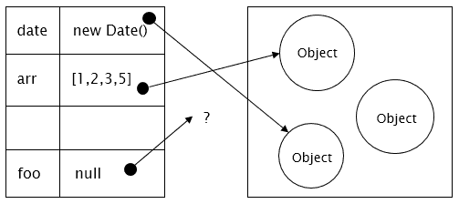

# 第五章 第 4 节 前端基础-js3

> 原文：[`www.nowcoder.com/tutorial/10072/1ab6b154d7fd4e629c5ddeff1f45dc49`](https://www.nowcoder.com/tutorial/10072/1ab6b154d7fd4e629c5ddeff1f45dc49)

#### 2.19 编码和字符集的区别

**参考答案：**

字符集是书写系统字母与符号的集合，而字符编码则是将字符映射为一特定的字节或字节序列，是一种规则。通常特定的字符集采用特定的编码方式（即一种字符集对应一种字符编码（例如：ASCII、IOS-8859-1、GB2312、GBK，都是即表示了字符集又表示了对应的字符编码，但 Unicode 不是，它采用现代的模型））

**扩展：**

字符：在计算机和电信技术中，一个字符是一个单位的字形、类字形单位或符号的基本信息。即一个字符可以是一个中文汉字、一个英文字母、一个阿拉伯数字、一个标点符号等。

字符集：多个字符的集合。例如 GB2312 是中国国家标准的简体中文字符集，GB2312 收录简化汉字（6763 个）及一般符号、序号、数字、拉丁字母、日文假名、希腊字母、俄文字母、汉语拼音符号、汉语注音字母，共 7445 个图形字符。

字符编码：把字符集中的字符编码为（映射）指定集合中的某一对象（例如：比特模式、自然数序列、电脉冲），以便文本在计算机中存储和通过通信网络的传递。

#### 2.20 null 和 undefined 的区别，如何让一个属性变为 null

**参考答案：**

undefined 表示一个变量自然的、最原始的状态值，而 null 则表示一个变量被人为的设置为空对象，而不是原始状态。所以，在实际使用过程中，为了保证变量所代表的语义，不要对一个变量显式的赋值 undefined，当需要释放一个对象时，直接赋值为 null 即可。

**解析：**

**undefined** 的字面意思就是：未定义的值 。这个值的语义是，希望**表示一个变量最原始的状态，而非人为操作的结果 。** 这种原始状态会在以下 4 种场景中出现：

1.  声明了一个变量，但没有赋值

2.  访问对象上不存在的属性

3.  函数定义了形参，但没有传递实参

4.  使用 void 对表达式求值

因此，undefined 一般都来自于某个表达式最原始的状态值，不是人为操作的结果。当然，你也可以手动给一个变量赋值 undefined，但这样做没有意义，因为一个变量不赋值就是 undefined 。

**null** 的字面意思是：空值 。这个值的语义是，希望**表示 一个对象被人为的重置为空对象，而非一个变量最原始的状态 。** 在内存里的表示就是，栈中的变量没有指向堆中的内存对象



null 有属于自己的类型 Null，而不属于 Object 类型，typeof 之所以会判定为 Object 类型，是因为 JavaScript 数据类型在底层都是以二进制的形式表示的，**二进制的前三位为 0 会被 typeof 判断为对象类型**，而 null 的二进制位恰好都是 0 ，因此，null 被误判断为 Object 类型。

#### 2.21 数组和伪数组的区别

**参考答案**：

1.  定义

*   数组是一个特殊对象,与常规对象的区别：
    *   当由新元素添加到列表中时，自动更新 length 属性
    *   设置 length 属性，可以截断数组
    *   从 Array.protoype 中继承了方法
    *   属性为'Array'
*   类数组是一个拥有 length 属性，并且他属性为非负整数的普通对象，类数组不能直接调用数组方法。

2.  区别
    本质：类数组是简单对象，它的原型关系与数组不同。

```cpp
// 原型关系和原始值转换
let arrayLike = {
    length: 10,
};
console.log(arrayLike instanceof Array); // false
console.log(arrayLike.__proto__.constructor === Array); // false
console.log(arrayLike.toString()); // [object Object]
console.log(arrayLike.valueOf()); // {length: 10}

let array = [];
console.log(array instanceof Array); // true
console.log(array.__proto__.constructor === Array); // true
console.log(array.toString()); // ''
console.log(array.valueOf()); // []
```

3.  类数组转换为数组

*   转换方法
    *   使用 `Array.from()`
    *   使用 `Array.prototype.slice.call()`
    *   使用 `Array.prototype.forEach()` 进行属性遍历并组成新的数组
*   转换须知
    *   转换后的数组长度由 `length` 属性决定。索引不连续时转换结果是连续的，会自动补位。
    *   代码示例

```cpp
let al1 = {
    length: 4,
    0: 0,
    1: 1,
    3: 3,
    4: 4,
    5: 5,
};
console.log(Array.from(al1)) // [0, 1, undefined, 3]
```

*   ②仅考虑 0 或正整数 的索引

```cpp
// 代码示例
let al2 = {
    length: 4,
    '-1': -1,
    '0': 0,
    a: 'a',
    1: 1
};
console.log(Array.from(al2)); // [0, 1, undefined, undefined]
```

*   ③使用 slice 转换产生稀疏数组

```cpp
// 代码示例
let al2 = {
    length: 4,
    '-1': -1,
    '0': 0,
    a: 'a',
    1: 1
};
console.log(Array.prototype.slice.call(al2)); //[0, 1, empty × 2]
```

4.  使用数组方法操作类数组注意地方

```cpp
  let arrayLike2 = {
    2: 3,
    3: 4,
    length: 2,
    push: Array.prototype.push
  }

  // push 操作的是索引值为 length 的位置
  arrayLike2.push(1);
  console.log(arrayLike2); // {2: 1, 3: 4, length: 3, push: ƒ}
  arrayLike2.push(2);
  console.log(arrayLike2); // {2: 1, 3: 2, length: 4, push: ƒ}
```

#### 2.22 手写一个发布订阅

**参考答案**：

```cpp
// 发布订阅中心, on-订阅, off 取消订阅, emit 发布, 内部需要一个单独事件中心 caches 进行存储;
interface CacheProps {
  [key: string]: Array<((data?: unknown) => void)>;
}

class Observer {
  private caches: CacheProps = {}; // 事件中心
  on (eventName: string, fn: (data?: unknown) => void){ // eventName 事件名-独一无二, fn 订阅后执行的自定义行为
    this.caches[eventName] = this.caches[eventName] || [];
    this.caches[eventName].push(fn);
  }

  emit (eventName: string, data?: unknown) { // 发布 => 将订阅的事件进行统一执行
    if (this.caches[eventName]) {
      this.caches[eventName].forEach((fn: (data?: unknown) => void) => fn(data));
    }
  }

  off (eventName: string, fn?: (data?: unknown) => void) { // 取消订阅 => 若 fn 不传, 直接取消该事件所有订阅信息
    if (this.caches[eventName]) {
      const newCaches = fn ? this.caches[eventName].filter(e => e !== fn) : [];
      this.caches[eventName] = newCaches;
    }
  }

}
```