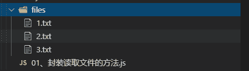

# 第五章 第 8 节 前端基础-异步 3

> 原文：[`www.nowcoder.com/tutorial/10072/1387619eb7fa495b87ea38b6267cd00a`](https://www.nowcoder.com/tutorial/10072/1387619eb7fa495b87ea38b6267cd00a)

#### 3.7 Promise.all

**参考答案：**

`Promise.all(iterable)` 方法返回一个 `Promise` 实例，此实例在 `iterable` 参数内所有的 `promise` 都“完成（resolved）”或参数中不包含 `promise` 时回调完成（resolve）；如果参数中 `promise` 有一个失败（rejected），此实例回调失败（reject），失败的原因是第一个失败 `promise` 的结果。

**解析：**

语法

```cpp
Promise.all(iterable);
```

参数

*   iterable

    一个可迭代对象，如 `Array`或 `String`

返回值

*   如果传入的参数是一个空的可迭代对象，则返回一个**已完成（already resolved）**状态的 `Promise`
*   如果传入的参数不包含任何 `promise`，则返回一个**异步完成（asynchronously resolved）** `Promise`。注意：Google Chrome 58 在这种情况下返回一个**已完成（already resolved）**状态的 `Promise`。
*   其它情况下返回一个**处理中（pending）**的`Promise`。这个返回的 `promise` 之后会在所有的 `promise` 都完成或有一个 `promise` 失败时**异步**地变为完成或失败。 见下方关于“Promise.all 的异步或同步”示例。返回值将会按照参数内的 `promise` 顺序排列，而不是由调用 `promise` 的完成顺序决定。

#### 3.8 与 promise.all 相反的是哪一个

**参考答案：**

Promse.race 就是赛跑的意思，意思就是说，Promise.race([p1, p2, p3])里面哪个结果获得的快，就返回那个结果，不管结果本身是成功状态还是失败状态。

**扩展：**

语法

```cpp
Promise.race(iterable);
```

参数

*   iterable

    可迭代对象，类似`Array`

返回值

​ 一个**待定的** `Promise`]只要给定的迭代中的一个 promise 解决或拒绝，就采用第一个 promise 的值作为它的值， 从而**异步**地解析或拒绝（一旦堆栈为空）。

#### 3.9 promise 实现文件读取

**参考答案：**

**封装异步读取文件操作**

*   fs.readFile()方法用于异步读取文件(node 核心模块)
*   将 Promise 的实例对象作为函数的返回值返回
*   这样函数执行完毕后就得到一个 Promise 对象的实例,可以通过.then 方法传入成功的回调和失败的回调

```cpp
const fs = require('fs');
const path = require('path');

function asyncGetFileByPath(p) {
    return new Promise((resolve, reject) => {
        // Promise 对象里面的参数,会立即执行(前面说过)
        fs.readFile(path.join(__dirname, p), 'utf-8', (err, data) => {
            if (err) {
                reject(err);
            } else {
                resolve(data);
            }
        })
    })
}
asyncGetFileByPath('./files/1.txt')
    .then(
        (data) => { // 成功的回调
            console.log(data);
        },
        (err) => { // 失败的回调
            console.error(err);
        }
    )

```




**解决回调地狱**

*   前面已经成功的封装了一个读取文件的函数
*   下面用它来体验一下读取多个文件
*   我们在.then()方法中,第一个参数 resolve()方法中,返回一个 promise 对象 B.
*   那么在执行.then()的 resolve()方法完毕后,此时的执行环境是这个 Promise 的实例 b
*   可以通过 b 的.then()方法继续传入 resolve 取消回调地狱,让代码趋于扁平化

```cpp
const fs = require('fs');
const path = require('path');

function asyncGetFileByPath(p) {
    return new Promise((resolve, reject) => {
        // Promise 对象里面的参数,会立即执行(前面说过)
        fs.readFile(path.join(__dirname, p), 'utf-8', (err, data) => {
            if (err) {
                reject(err);
            } else {
                resolve(data);
            }
        })
    })
}
asyncGetFileByPath('./files/1.txt')
    .then(
        (data) => { // 成功的回调    '1.txt'
            console.log(data); // 打印出 1.txt 数据
            return asyncGetFileByPath('./files/2.txt')
        },
        (err) => { // 失败的回调
            console.error(err);
        }
    )
    .then( // 成功的回调  '2.txt'
        (data) => {
            console.log(data); // 打印出 2.txt 中的数据
            return asyncGetFileByPath('./files/3.txt') // 继续返回 Promise 对象的实例
        },
        (err) => {
            console.error(err);
        }
    )
    .then(
        (data) => { // 成功的回调 '3.txt'
            console.log(data); // 打印出 3.txt 中的数据
        },
        (err) => {
            console.error(err);
        }
    )
```

#### 3.10 用 js 实现 sleep，用 promise

**参考答案:**

```cpp
function sleep(time) {
  return new Promise(resolve => setTimeout(resolve, time))
}

const t1 = +new Date()
sleep(3000).then(() => {
  const t2 = +new Date()
  console.log(t2 - t1)
})
```

优点：这种方式实际上是用了 setTimeout，没有形成进程阻塞，不会造成性能和负载问题。

缺点：虽然不像 callback 套那么多层，但仍不怎么美观，而且当我们需要在某过程中需要停止执行（或者在中途返回了错误的值），还必须得层层判断后跳出，非常麻烦，而且这种异步并不是那么彻底，还是看起来别扭

#### 3.11 实现一个 Scheduler 类，完成对 Promise 的并发处理，最多同时执行 2 个任务

**参考答案：**

```cpp
class Scheduler {
    constructor() {
        this.tasks = [], // 待运行的任务
        this.usingTask = [] // 正在运行的任务
    }
    // promiseCreator 是一个异步函数，return Promise
    add(promiseCreator) {
        return new Promise((resolve, reject) => {
            promiseCreator.resolve = resolve
            if (this.usingTask.length < 2) {
                this.usingRun(promiseCreator)
            } else {
                this.tasks.push(promiseCreator)
            }
        })
    }

    usingRun(promiseCreator) {
        this.usingTask.push(promiseCreator)
        promiseCreator().then(() => {
            promiseCreator.resolve()
            this.usingMove(promiseCreator)
            if (this.tasks.length > 0) {
                this.usingRun(this.tasks.shift())
            }
        })
    }

    usingMove(promiseCreator) {
        let index = this.usingTask.findIndex(promiseCreator)
        this.usingTask.splice(index, 1)
    }
}

const timeout = (time) => new Promise(resolve => {
    setTimeout(resolve, time)
})

const scheduler = new Scheduler()

const addTask = (time, order) => {
    scheduler.add(() => timeout(time)).then(() => console.log(order))
}

addTask(400, 4) 
addTask(200, 2) 
addTask(300, 3) 
```

#### 3.12 循环 i，setTimeout 中输出什么，如何解决（块级作用域，函数作用域）

**参考答案：**

**for 循环 setTimeout 输出 1-10 解决方式问题来源**

```cpp
for (var i = 0; i< 10; i++){
   setTimeout((i) => {
   console.log(i);
   }, 0)
}
```

期望：输出 1 到 10

为什么无法输出 1 到十

  在上面的代码中，for 循环是同步代码，setTimeout 是异步代码。遇到这种既包含同步又包含异步的情况，JavaScript 依旧按照从上到下的顺序执行同步代码，并将异步代码插入任务队列。setTimeout 的第二个参数则是把执行代码（console.log(i)）添加到任务队列需等待的毫秒数，但等待的时间是相对主程序完毕的时间计算的，也就是说，在执行到 setTimeout 函数时会等待一段时间，再将当前任务插入任务队列。
 最后，当执行完同步代码，js 引擎就会去执行任务队列中的异步代码。这时候任务队列中就会有十个 console.log(i)。我们知道，在每次循环中将 setTimeout 里面的代码“console.log(i)”放入任务队列时，i 的值都是不一样的。但 JavaScript 引擎开始执行任务队列中的代码时，会开始在当前的作用域中开始找变量 i，但是当前作用域中并没有对变量 i 进行定义。这个时候就会在创造该函数的作用域中寻找 i。创建该函数的作用域就是全局作用域，这个时候就找到了 for 循环中的变量 i，这时的 i 是全局变量，并且值已经确定：10。十个 console.log“共享”i 的值。这就是作用域链的问题。

**解决方法**

*   方法一

```cpp
for (var i = 0; i< 10; i++){
   setTimeout((i) => {
      console.log(i)
   }, 1000,i);
}
```

> 最精简解决方案

*   方法二

```cpp
for (let i = 0; i< 10; i++){
   setTimeout(() => {
      console.log(i) 
   }, 1000);
}
```

> 最优解决方案，利用`let`形成块级作用域

*   方法三

```cpp
    for (var i = 0; i< 10; i++){
      ((i)=>{
        setTimeout(() => {
          console.log(i)
        },1000);
      })(i)
    }
```

> `IIFE(立即执行函数)`，类似于 let 生成了块级作用域。

*   方法四

```cpp
for (var i = 0; i< 10; i++){
   setTimeout(console.log(i),1000);
}
```

> 直接输出，没有延迟

*   方法五

```cpp
for (var i = 0; i< 10; i++){
   setTimeout((()=>console.log(i))(),1000);
}
```

> 同上

*   方法六

```cpp
for (var i = 0; i< 10; i++){
      try{
        throw i
      }catch(i){
        setTimeout(() => {
          console.log(i)
        }, 1000)
      }
}
```

```cpp
console.time('start');

setTimeout(function() {
  console.log(2);
}, 10);

setImmediate(function() {
  console.log(1);
});

new Promise(function(resolve) {
  console.log(3);
  resolve();
  console.log(4);
}).then(function() {
  console.log(5);
  console.timeEnd('start')
});

console.log(6);

process.nextTick(function() {
  console.log(7);
});

console.log(8);
```

#### 3.13 js 执行顺序的题目，涉及到 settimeout、console、process.nextTick、promise.then

```cpp
console.time('start');

setTimeout(function() {
  console.log(2);
}, 10);

setImmediate(function() {
  console.log(1);
});

new Promise(function(resolve) {
  console.log(3);
  resolve();
  console.log(4);
}).then(function() {
  console.log(5);
  console.timeEnd('start')
});

console.log(6);

process.nextTick(function() {
  console.log(7);
});

console.log(8);
```

**参考答案：**

综合的执行顺序就是： `3——>4——>6——>8——>7——>5——>start: 7.009ms——>1——>2`

**解析：**

本题目，考察的就是 node 事件循环 Event Loop 我们可以简单理解 Event Loop 如下：

1.  所有任务都在主线程上执行，形成一个执行栈(Execution Context Stack)
2.  在主线程之外还存在一个任务队列(Task Queen),系统把异步任务放到任务队列中，然后主线程继续执行后续的任务
3.  一旦执行栈中所有的任务执行完毕，系统就会读取任务队列。如果这时异步任务已结束等待状态，就会从任务队列进入执行栈，恢复执行
4.  主线程不断重复上面的第三步

在上述的例子中，我们明白首先执行主线程中的同步任务，因此依次输出`3、4、6、8`。当主线程任务执行完毕后，再从 Event Loop 中读取任务。

Event Loop 读取任务的先后顺序，取决于任务队列（Job queue）中对于不同任务读取规则的限定。

在 Job queue 中的队列分为两种类型：

`宏任务 Macrotask` 宏任务是指 Event Loop 在**每个阶段**执行的任务

`微任务 Microtask` 微任务是指 Event Loop 在**每个阶段之间**执行的任务

我们举例来看执行顺序的规定，我们假设

宏任务队列包含任务: A1, A2 , A3

微任务队列包含任务: B1, B2 , B3

执行顺序为，首先执行宏任务队列开头的任务，也就是 A1 任务，执行完毕后，在执行微任务队列里的所有任务，也就是依次执行 B1, B2 , B3，执行完后清空微任务队中的任务，接着执行宏任务中的第二个任务 A2，依次循环。

了解完了`宏任务 Macrotask`和`微任务 Microtask`两种队列的执行顺序之后，我们接着来看，真实场景下这两种类型的队列里真正包含的任务（我们以 node V8 引擎为例），在 node V8 中，这两种类型的真实任务顺序如下所示：

宏任务 Macrotask 队列真实包含任务：

```cpp
script(主程序代码),setTimeout, setInterval, setImmediate, I/O, UI rendering
```

微任务 Microtask 队列真实包含任务：

```cpp
process.nextTick, Promises, Object.observe, MutationObserver
```

由此我们得到的执行顺序应该为：

```cpp
script(主程序代码)—>process.nextTick—>Promises...——>setTimeout——>setInterval——>setImmediate——> I/O——>UI rendering
```

> 在 ES6 中宏任务 Macrotask 队列又称为 ScriptJobs，而微任务 Microtask 又称 PromiseJobs

我们的题目相对复杂，但是要注意，我们在定义 promise 的时候，promise 构造部分是同步执行的

接下来我们分析我们的题目，首先分析 Job queue 的执行顺序：

```cpp
script(主程序代码)——>process.nextTick——>promise——>setTimeout——>setImmediate
```

*   主体部分： 定义 promise 的构造部分是同步的，因此先输出 3、4 ，主体部分再输出 6、8（同步情况下，就是严格按照定义的先后顺序）
*   process.nextTick: 输出 7
*   promise： 这里的 promise 部分，严格的说其实是 promise.then 部分，输出的是 5、以及 timeEnd('start')
*   setImmediate：输出 1，依据上面优先级，应该先 setTimeout，但是注意，setTimeout 设置 10ms 延时
*   setTimeout ： 输出 2