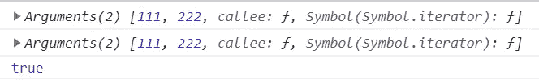
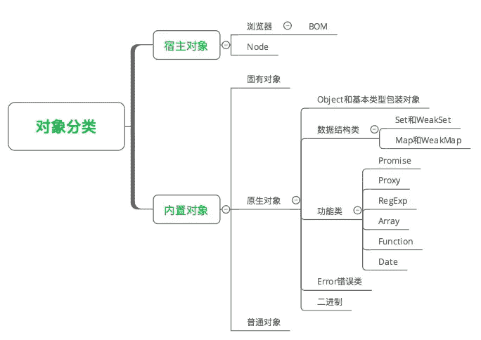

# 第五章 第 12 节 前端基础-ES 基础 1

> 原文：[`www.nowcoder.com/tutorial/10072/ac8acce9539f4ffb8cf45a3da619e96e`](https://www.nowcoder.com/tutorial/10072/ac8acce9539f4ffb8cf45a3da619e96e)

#### 6.1 es6 中箭头函数

**参考答案：**

1.  基本语法

    ES6 中允许使用箭头`=>`来定义箭头函数，具体语法，我们来看一个简单的例子：

    ```cpp
    // 箭头函数
    let fun = (name) => {
        // 函数体
        return `Hello ${name} !`;
    };

    // 等同于
    let fun = function (name) {
        // 函数体
        return `Hello ${name} !`;
    };
    ```

    可以看出，定义箭头函在数语法上要比普通函数简洁得多。箭头函数省去了`function`关键字，采用箭头`=>`来定义函数。函数的参数放在`=>`前面的括号中，函数体跟在`=>`后的花括号中。

    关于箭头函数的参数：

    **①** 如果箭头函数没有参数，直接写一个空括号即可。

    **②** 如果箭头函数的参数只有一个，也可以省去包裹参数的括号。

    **③** 如果箭头函数有多个参数，将参数依次用逗号(,)分隔，包裹在括号中即可。

    ```cpp
    // 没有参数
    let fun1 = () => {
        console.log(111);
    };

    // 只有一个参数，可以省去参数括号
    let fun2 = name => {
        console.log(`Hello ${name} !`)
    };

    // 有多个参数
    let fun3 = (val1, val2, val3) => {
        return [val1, val2, val3];
    };
    ```

    关于箭头函数的函数体：

    **①** 如果箭头函数的函数体只有一句代码，就是简单返回某个变量或者返回一个简单的 JS 表达式，可以省去函数体的大括号{ }。

    ```cpp
    let f = val => val;
    // 等同于
    let f = function (val) { return val };

    let sum = (num1, num2) => num1 + num2;
    // 等同于
    let sum = function(num1, num2) {
      return num1 + num2;
    };
    ```

    **②** 如果箭头函数的函数体只有一句代码，就是返回一个对象，可以像下面这样写：

    ```cpp
    // 用小括号包裹要返回的对象，不报错
    let getTempItem = id => ({ id: id, name: "Temp" });

    // 但绝不能这样写，会报错。
    // 因为对象的大括号会被解释为函数体的大括号
    let getTempItem = id => { id: id, name: "Temp" };
    ```

    **③** 如果箭头函数的函数体只有一条语句并且不需要返回值（最常见是调用一个函数），可以给这条语句前面加一个`void`关键字

    ```cpp
    let fn = () => void doesNotReturn();
    ```

    箭头函数最常见的用处就是简化回调函数。

    ```cpp
    // 例子一
    // 正常函数写法
    [1,2,3].map(function (x) {
      return x * x;
    });

    // 箭头函数写法
    [1,2,3].map(x => x * x);

    // 例子二
    // 正常函数写法
    var result = [2, 5, 1, 4, 3].sort(function (a, b) {
      return a - b;
    });

    // 箭头函数写法
    var result = [2, 5, 1, 4, 3].sort((a, b) => a - b);
    ```

2.  箭头函数与普通函数的区别

    2.1 语法更加简洁、清晰

    从上面的基本语法示例中可以看出，箭头函数的定义要比普通函数定义简洁、清晰得多，很快捷。

    2.2 箭头函数不会创建自己的 this

    箭头函数没有自己的`this`，它会捕获自己在**定义时**（注意，是定义时，不是调用时）所处的**外层执行环境的`this`**，并继承这个`this`值。所以，箭头函数中`this`的指向在它被定义的时候就已经确定了，之后永远不会改变。

    ```cpp
    var id = 'Global';

    function fun1() {
        // setTimeout 中使用普通函数
        setTimeout(function(){
            console.log(this.id);
        }, 2000);
    }

    function fun2() {
        // setTimeout 中使用箭头函数
        setTimeout(() => {
            console.log(this.id);
        }, 2000)
    }

    fun1.call({id: 'Obj'});     // 'Global'

    fun2.call({id: 'Obj'});     // 'Obj'
    ```

    上面这个例子，函数`fun1`中的`setTimeout`中使用普通函数，2 秒后函数执行时，这时函数其实是在全局作用域执行的，所以`this`指向`Window`对象，`this.id`就指向全局变量`id`，所以输出`'Global'`。 但是函数`fun2`中的`setTimeout`中使用的是箭头函数，这个箭头函数的`this`在定义时就确定了，它继承了它外层`fun2`的执行环境中的`this`，而`fun2`调用时`this`被`call`方法改变到了对象`{id: 'Obj'}`中，所以输出`'Obj'`

    ```cpp
    var id = 'GLOBAL';
    var obj = {
      id: 'OBJ',
      a: function(){
        console.log(this.id);
      },
      b: () => {
        console.log(this.id);
      }
    };

    obj.a();    // 'OBJ'
    obj.b();    // 'GLOBAL'
    ```

    上面这个例子，对象`obj`的方法`a`使用普通函数定义的，**普通函数作为对象的方法调用时，`this`指向它所属的对象**。所以，`this.id`就是`obj.id`，所以输出`'OBJ'`。 但是方法`b`是使用箭头函数定义的，箭头函数中的`this`实际是继承的它定义时所处的全局执行环境中的`this`，所以指向`Window`对象，所以输出`'GLOBAL'`。（**这里要注意，定义对象的大括号`{}`是无法形成一个单独的执行环境的，它依旧是处于全局执行环境中！！**）

3.  箭头函数继承而来的 this 指向永远不变（重要！！深入理解！！）

    上面的例子，就完全可以说明箭头函数继承而来的`this`指向永远不变。对象`obj`的方法`b`是使用箭头函数定义的，这个函数中的`this`就**永远指向**它定义时所处的全局执行环境中的`this`，即便这个函数是作为对象`obj`的方法调用，`this`依旧指向`Window`对象。

4.  .call()/.apply()/.bind()无法改变箭头函数中 this 的指向

    `.call()`/`.apply()`/`.bind()`方法可以用来动态修改函数执行时`this`的指向，但由于箭头函数的`this`定义时就已经确定且永远不会改变。所以使用这些方法永远也改变不了箭头函数`this`的指向，虽然这么做代码不会报错。

    ```cpp
    var id = 'Global';
    // 箭头函数定义在全局作用域
    let fun1 = () => {
        console.log(this.id)
    };

    fun1();     // 'Global'
    // this 的指向不会改变，永远指向 Window 对象
    fun1.call({id: 'Obj'});     // 'Global'
    fun1.apply({id: 'Obj'});    // 'Global'
    fun1.bind({id: 'Obj'})();   // 'Global'
    ```

5.  箭头函数不能作为构造函数使用

    我们先了解一下构造函数的 new 都做了些什么？简单来说，分为四步： ① JS 内部首先会先生成一个对象； ② 再把函数中的 this 指向该对象； ③ 然后执行构造函数中的语句； ④ 最终返回该对象实例。

    但是因为箭头函数没有自己的`this`，它的`this`其实是继承了外层执行环境中的`this`，且`this`指向永远不会随在哪里调用、被谁调用而改变，所以箭头函数不能作为构造函数使用，或者说构造函数不能定义成箭头函数，否则用`new`调用时会报错

    ```cpp
    let Fun = (name, age) => {
        this.name = name;
        this.age = age;
    };

    // 报错
    let p = new Fun('cao', 24);
    ```

6.  箭头函数没有自己的 arguments

    箭头函数没有自己的`arguments`对象。在箭头函数中访问`arguments`实际上获得的是外层局部（函数）执行环境中的值。

    ```cpp
    // 例子一
    let fun = (val) => {
        console.log(val);   // 111
        // 下面一行会报错
        // Uncaught ReferenceError: arguments is not defined
        // 因为外层全局环境没有 arguments 对象
        console.log(arguments); 
    };
    fun(111);

    // 例子二
    function outer(val1, val2) {
        let argOut = arguments;
        console.log(argOut);    // ①
        let fun = () => {
            let argIn = arguments;
            console.log(argIn);     // ②
            console.log(argOut === argIn);  // ③
        };
        fun();
    }
    outer(111, 222);
    ```

    上面例子二，①②③处的输出结果如下：

    

    很明显，普通函数`outer`内部的箭头函数`fun`中的`arguments`对象，其实是沿作用域链向上访问的外层`outer`函数的`arguments`对象。

    **可以在箭头函数中使用 rest 参数代替 arguments 对象，来访问箭头函数的参数列表！！**

7.  箭头函数没有原型 prototype

    ```cpp
    let sayHi = () => {
        console.log('Hello World !')
    };
    console.log(sayHi.prototype); // undefined
    ```

8.  箭头函数不能用作 Generator 函数，不能使用 yeild 关键字

#### 6.2 ES6 新特性

**参考答案：**

1.  变量和作用域

    1.1 let 、const、 块级作用域和变量声明

    let 声明的变量**只在所在块中生效**；

    let 声明的变量可以解决 var 与 for 循环结合使用产生的无法取得最新变量值的问题（以往都需要通过闭包来解决这个问题）；

    let 声明的变量**不存在变量提升**（从 undefined->ReferenceError，其实也是一种暂时性死区）、会造成**变量暂时性死区**(在声明 let 变量之前都不能用它)、也不允许重复声明；

    const 声明的变量行为与 let 类似，只是多了**两点更强的约束：1.声明时必须赋值；2.声明的变量内存地址不可变，需要注意的是**：对于用 const 声明基本类型，值就保存在内存地址之中，意味着变量不可重新赋值；对于用 const 声明的对象，对象内容还是可以更改的，只是不能改变其指向。（冻结对象应该用 Object.freeze()）

    1.2 解构赋值（按照一定的结构解析出来进行赋值）

    解构赋值的使用场景：变量快捷赋值、提取数据、函数参数定义和默认值、遍历某结构

2.  原生对象的方法扩展

    2.1 String

    加强了对 unicode 的支持、支持字符串遍历（后面有讲到实际上是部署了 iterator 接口）、repeat()等方法的支持、**模板字符串**

    2.2 RegExp

    构造函数第一个参数是正则表达式，指定第二个参数不再报错、u 修饰符、y 修饰符、s 修饰符

    2.3 Number

    二进制和八进制新写法、新方法 parseInt()、Number.EPSILON 极小常量、安全整数、Math 新方法

    2.4 Function

    **函数参数默认值**、rest 参数、**函数内部严格模式**、函数的 name 属性、**箭头函数**

    2.5 Array

    **扩展运算符...**

    2.6 Object 和 Symbol

    ​ (1) Object 对象

    ​ 支持**简写**：同名属性 K-V 可以省略一个、函数声明可以省略 function；支持**属性名表达式**、函数名表达 式。（注意：以上 2 个——表达式和简写不能同时使用）。

    ​ 对象的方法的 name 属性返回方法名，但有几个例外情况要小心。新增了 Object 方法

    ​ Object.is()——用于解决==和===的部分兼容问题

    ​ Object.assign()——将 src 的所有可枚举对象属性复制到 dest 对象上（浅复制）

    ​ Object.setPrototypeOf()、Object.getPrototypeOf() (Object.__proto 属性)

    ​ Object.entries()、Object.keys()、Object.values()

    ​ ES6 中 5 种遍历对象属性的方法

    ​ **for-in——自身和继承的可枚举属性（除 Symbol）**

    ​ **Object.keys()——自身非继承的可枚举属性（除 Symbol）**

    ​ **Object.getOwnPropertyNames()——自身所有属性键名（包括不可枚举、除 Symbol）**

    ​ **Object.getOwnPropertySymbols()——自身的所有 Symbol 属性的键名**

    ​ **Reflect.ownKeys()——自身的所有键名**

    （2）Symbol 类型

    ​ ES5 以前，对象属性都只能是字符串，容易造成重命名导致的冲突。Symbol 提供了一种机制，可以保存 属性名是独一无二的。Symbol 类型的使用注意：1）创建是调用函数，而不是 new 关键字 2）Symbol 类 型的属性不会被 for-*、Object.keys()、Object.getPropertyNames()返回，可以用后面两种方法遍历。

3.  数据结构 Set 和 Map

    Set 是一种类似数组的数据结构，区别在于其存储的成员都是不重复的，由此带来了它的一个应用就是：**去重**。Set 通过 new 关键字实例化，入参可以是数组 or 类数组的对象。

    值得注意的是：在 Set 中，只能存储一个 NaN，**这说明在 Set 数据结构中，NaN 等于 NaN**。

    Set 实例的方法：操作方法 add()、delete()、has()和 clear()；遍历方法：keys()、values()、entries()和 forEach();扩展运算符...、数组方法 map()、filter()方法也可以用于 Set 结构。由此它可以很方便的实现数组的交、并、差集。

    WeakSet 类似于 Set，**主要区别在于 1.成员只能是对象类型；2.对象都是弱引用**（如果其他对象都不再引用该对象，垃圾回收机制会自动回收该对象所占的内存，不可预测何时会发生，故 WeakSet 不可被遍历）

    JavaScript 对象 Object 都是键值 K-V 对的集合，但 K 取值只能是字符串和 Symbol，Map 也是 K-V 的集合，然而其 K 可以取任意类型。如果需要键值对的集合，Map 比 Object 更适合。Map 通过 new 关键字实例化。

    Map 实例的方法：set()、get()、has()、delete()和 clear();遍历方法同 Set。

    Map 与其它数据结构的互相转换：Map <---> 数组| Map <---> 对象| Map <---> JSON。

    WeakMap 类似于 Map，主要区别在于：**1.只接受对象作为键名；2.键名所指向的对象不计入垃圾回收机制**。

4.  元编程相关 Proxy 和 Reflect

    4.1 Proxy

    ​ 对目标对象加一层“拦截”（“代理”），外界对对象的访问、修改都必须先通过这层拦截层。因而它提供了 一个机制可以对外界的访问进行过滤和改写。

    ​ 用法：var proxy = new Proxy(p1,p2); p1 是要被代理的目标对象，p2 是配置对象。

    ​ 值得注意的是：**Proxy 不是对目标对象透明的代理**——即使不做任何拦截的情况下无法保证代理对象与目 标对象行为的完全一致。（主要原因在于代理时，目标对象内部的 this 会指向代理对象）

    4.2 Reflect

    ​ 与 Proxy 一样是 ES6 为**语言层面的用于操作对象提供的新 API**，目前它所拥有的对象方法与 Proxy 对象一一对 应，**引入目的**：1.将 Object 对象上一些属于语言内部的方法放在 Reflect 上（目前都可以放）2.修改 Object 对 象上某些方法的返回值，使得更加合理化（健壮）3.让 Object 对象的操作从命令式完全转化为函数式

5.  异步编程 Promise、Generator 和 Async

    在 JavaScript 的世界里，对于**异步编程存在如下几种方案：1.回调函数；2.事件触发监听；3.发布订阅者模式；4.Promise**。首先介绍 Promise，然后介绍 ES6 提供的生成器函数，async 函数。

    Promise 来源于社区，代表一个对象，它代表异步操作未来的一个结果（承诺）。它总共有**三个状态**，pending\fulfilled\rejected。另外，它的状态**翻转路径只有两个**：pending->fulfilled or pending->rejected，一旦状态翻转，就不可变了。它支持链式调用，支持错误传递，支持以同步代码的方式写异步操作。

    Promise 是一个对象，创建此对象实例的方法如下（可以理解 resolve 和 reject 是已返回的承诺对象未来回调函数的占位）

    Generator 函数是 ES6 提供的异步编程解决方案。对于 Generator 函数，可以将它**理解为一个状态机，封装了多个内部状态；此外它还是一个遍历器生成函数**，这个函数可以遍历出状态机的所有状态。

    函数特征：关键字 function 与函数名之间有*，函数体内部 yeild 关键字。

    **生成器函数与普通函数的区别**：函数调用后不执行，而是返回一个指针对象（遍历器对象）。调用对象的 next()方法，执行一段 yield 逻辑。故函数的分段执行的，**yield 是暂停执行的标志，next()可以恢复执行**。

    **yield 与 return 的区别**：yield 有记忆功能，return 没有；一个函数可以多次执行 yeild，但只会 return 一次

    **async 函数**是 Generator 函数的语法糖，它进行了**改进：1.自带执行器；2.返回值是 Promise;**

    三家对比：**使用 Promise 的异步代码存在大量自有 API 的调用，操作本身的语义夹杂其中，不是很清晰；Generator 函数实现的异步代码语义比 Promise 清晰，但需要一个执行器；async 函数的写法最简洁、符合语义，不需要执行器**。

6.  语言层面类、模块的支持

    6.1 class

    从 ES6 开始，JavaScript 提供了 class 关键字来定义类，尽管，这样的方案仍然是基于原型运行时系统的模拟，大部分功能 ES5 可以实现。

    构造函数的`prototype`属性在 ES6 的“类”上面继续存在。事实上，类中所有方法都定义在类的`prototype`属性上面（因而也是不可枚举的）。

    `constructor`方法是类的默认方法，通过`new`命令生成对象实例时，自动调用该方法。一个类必须有`constructor`方法，如果没有显式定义，一个空的`constructor`方***被默认添加。（默认构造函数）；`constructor`方法默认返回实例对象（即`this`），完全可以指定返回另外一个对象。

    注意区别：**类必须使用**`new`**调用，否则会报错**。这是它跟普通构造函数的一个主要区别，后者不用`new`也可以执行。

    类相当于实例的原型，所有在类中定义的方法，都会被实例继承。如果在一个方法前，加上`static`关键字，就表示该方法不会被实例继承，而是直接通过类来调用，这就称为“静态方法”。

    实例属性除了定义在`constructor()`方法里面的`this`上面，也可以定义在类的最顶层。

    私有属性和方法如何实现？1.命名上加以区别 2.将私有方法移出模块，利用公有方法调用；3.Symbol 属性上（都不完美）

    6.2 module

    在 ES6 之前，社区制定了一些模块加载方案，最主要的有 CommonJS 和 AMD 两种。前者用于服务器，后者用于浏览器。ES6 模块的设计思想是尽量的静态化，使得**编译时就能确定**模块的依赖关系，以及输入和输出的变量。CommonJS 和 AMD 模块，都只能在**运行时确定。**

    **编译时加载 VS 运行时加载——对象 VS 代码**

    模块命令：export 和 import；一个文件即为一个模块，除非导入否则外部无法读取模块属性；

    export 支持：变量、函数和类

    `export`命令可以出现在模块的任何位置，只要处于模块顶层就可以。如果处于块级作用域内，就会报错，下一节的`import`命令也是如此。

    输入的变量都是只读的，因为它的本质是输入接口。也就是说，不允许在加载模块的脚本里面，改写接口。由于`import`是静态执行，所以不能使用表达式和变量，这些只有在运行时才能得到结果的语法结构。

    使用`import`命令的时候，用户需要知道所要加载的变量名或函数名，否则无法加载。但是，用户肯定希望快速上手，未必愿意阅读文档，去了解模块有哪些属性和方法。为了给用户提供方便，让他们不用阅读文档就能加载模块，就要用到`export default`命令，为模块指定默认输出。

    模块之间也可以继承。

7.  JS 中对象分类、及其它原生对象

    

8.  Iterator

    ES6 之前在 JS 中只有 Array 和对象可以表示“集合”这种数据结构，ES6 中增加了：Set 和 Map。由此，四种之间互相组合又可以定义新的数据结构。这些**新定义的数据结构如何访问呢？遍历器（Iterator）就是这样一种机制。它是一种接口，为各种不同的数据结构提供统一的访问机制**。任何数据结构只要部署 Iterator 接口，就可以完成遍历操作。遍历器对象本质上是一个指针对象。

    只要为某个数据结构部署 了 Iterator 接口，则可以称此数据结构是可遍历的。iterator 属性部署在 Symbol 上。如下对象默认部署了 Iterator 结口：Array Set Map String 等。部署 iterator 结构的**要点：1）在 Symbol.iterator 上部署；2）必须包含 next()函数**。默认调用 iterator 接口的场景：解构赋值、...扩展运算符、yeild* 。for-of 循环内部调用的即是调用数据机构内部的 Symbol.iterator 方法。

    **for-in 和 for-of 循环**

    for-in 用于遍历对象属性，对象自身和继承的可枚举属性（不可遍历 Symbol 属性）

    for-of 循环是一种遍历所有数据机构的统一方法。实现原理是数据结构上部署的 Symbol.iterator 属性。