# 第五章 第 13 节 前端基础-ES 基础 2

> 原文：[`www.nowcoder.com/tutorial/10072/68300a7996fd4dfb883c87174028421a`](https://www.nowcoder.com/tutorial/10072/68300a7996fd4dfb883c87174028421a)

#### 6.3 ES6 与 ES5 继承的区别

**参考答案：**

ES6 中有类 class 的概念，类 class 的继承是通过 extends 来实现的，ES5 中是通过设置构造函数的 prototype 属性，来实现继承的。

ES6 与 ES5 中的继承有 2 个区别，第一个是，ES6 中子类会继承父类的属性，第二个区别是，super() 与 A.call(this) 是不同的，在继承原生构造函数的情况下，体现得很明显，ES6 中的子类实例可以继承原生构造函数实例的内部属性，而在 ES5 中做不到。

**解析：**

下面通过 3 个 demo，来分析它们之间的区别。

1.  ES5 继承

直接上代码：

```cpp
function A() {
  this.a = 'hello';
}

function B() {
  A.call(this);
  this.b = 'world';
}

B.prototype = Object.create(A.prototype, {
  constructor: { value: B, writable: true, configurable: true }
});

let b = new B();
```

代码中，构造函数 B 继承构造函数 A，首先让构造函数 B 的 prototype 对象中的 **proto** 属性指向构造函数 A 的 prototype 对象，并且将构造函数 B 的 prototype 对象的 constructor 属性赋值为构造函数 B，让构造函数 B 的实例继承构造函数 A 的原型对象上的属性，然后在构造函数 B 内部的首行写上 A.call(this)，让构造函数 B 的实例继承构造函数 A 的实例属性。在 ES5 中实现两个构造函数之间的继承，只需要做这两步即可。下面六幅图分别是，实例 b 的原型链及验证图，构造函数 B 的原型链及验证图，构造函数 A 的原型链及验证图。

实例 b 的原型链如下图：

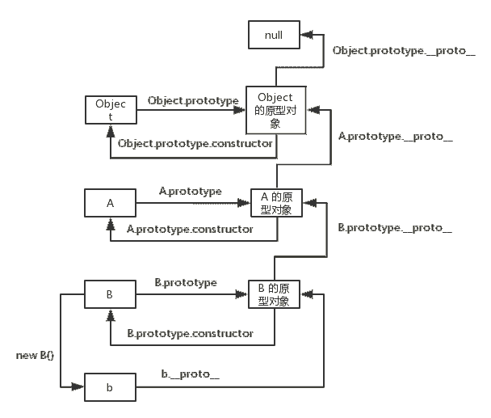

实例 b 的原型链验证图：

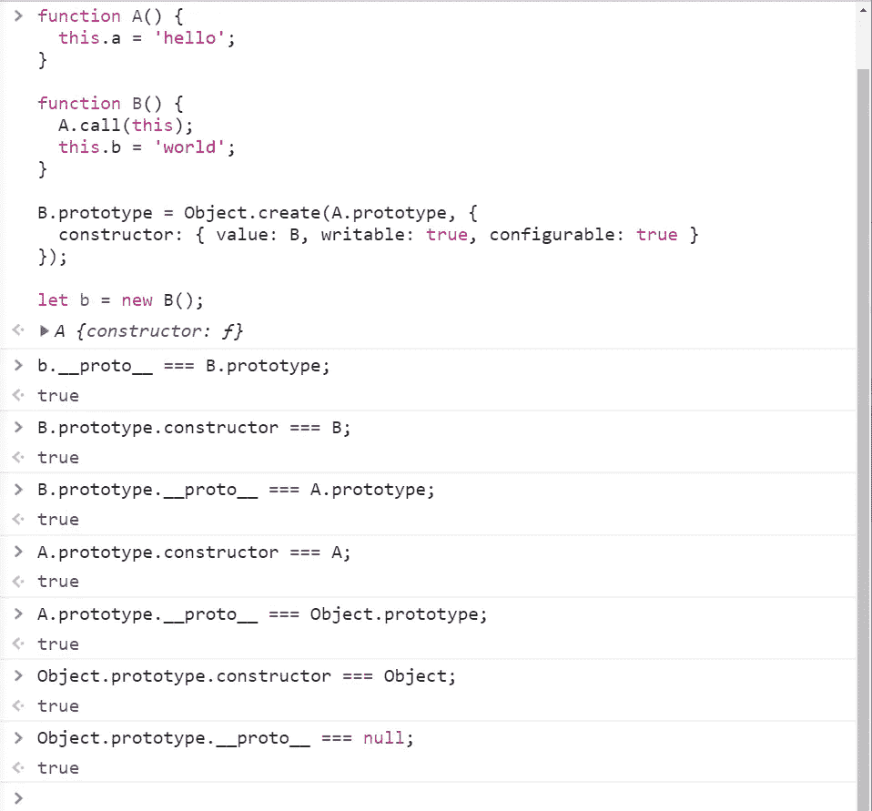

构造函数 B 的原型链图下图：

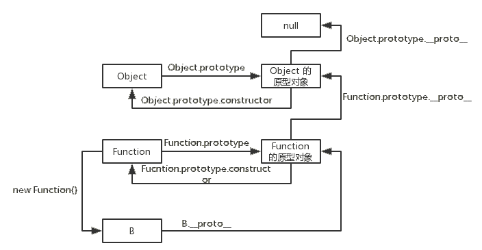

构造函数 B 的原型链验证图图：

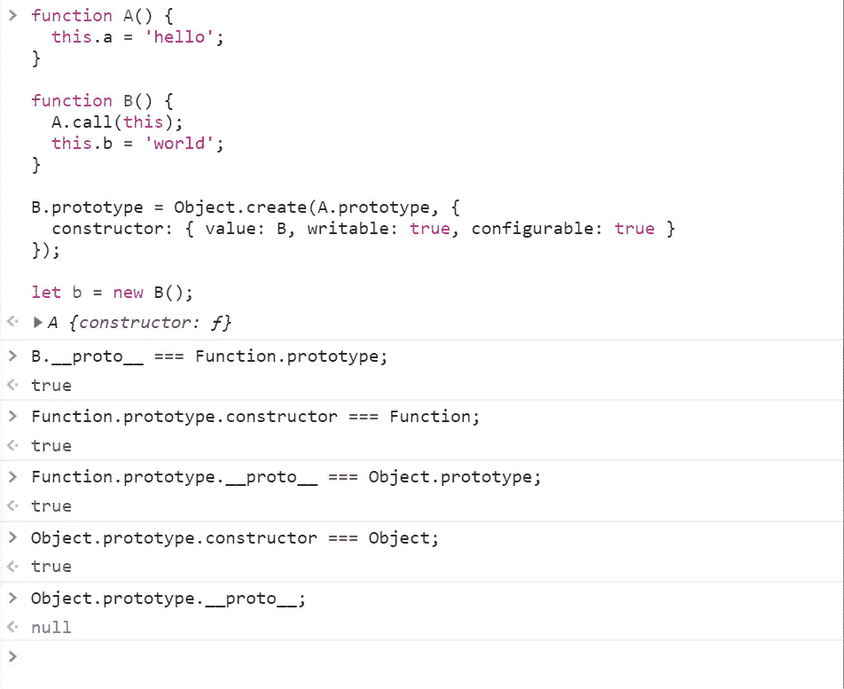

构造函数 A 的原型链图下图：

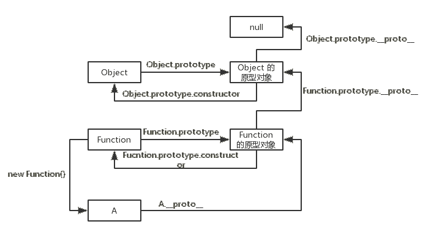

构造函数 B 的原型链验证图图：


从上面 6 幅图可知，构造函数 B 的实例 b 继承了构造函数 A 的实例属性，继承了构造函数 A 的原型对象上的属性，继承了构造函数 Object 的原型对象上的属性。构造函数 B 是构造函数 Function 的实例，继承了构造函数 Function 的原型对象上的属性，继承了构造函数 Object 的原型对象上的属性。 构造函数 A 是构造函数 Function 的实例，继承了构造函数 Function 的原型对象上的属性，继承了构造函数 Object 的原型对象上的属性。可看出，构造函数 A 与 构造函数 B 并没有继承关系，即构造函数 B 没有继承构造函数 A 上面的属性，在 ES6 中，用 extends 实现两个类的继承，两个类之间是有继承关系的，即子类继承了父类的方法，这是 ES6 与 ES5 继承的第一点区别，下面通过 ES6 的继承来说明这一点。

2.  ES6 继承

直接上代码：

```cpp
class A {
  constructor() {
    this.a = 'hello';
  }
}

class B extends A {
  constructor() {
    super();
    this.b = 'world';
  }
}

let b = new B();
复制代码
```

代码中，类 B 通过 extends 关键字继承类 A 的属性及其原型对象上的属性，通过在类 B 的 constructor 函数中执行 super() 函数，让类 B 的实例继承类 A 的实例属性，super() 的作用类似构造函数 B 中的 A.call(this)，但它们是有区别的，这是 ES6 与 ES5 继承的第二点区别，这个区别会在文章的最后说明。在 ES6 中，两个类之间的继承就是通过 extends 和 super 两个关键字实现的。下面四幅图分别是，实例 b 的原型链及验证图，类 B 的原型链及验证图。

实例 b 的原型链如下图：

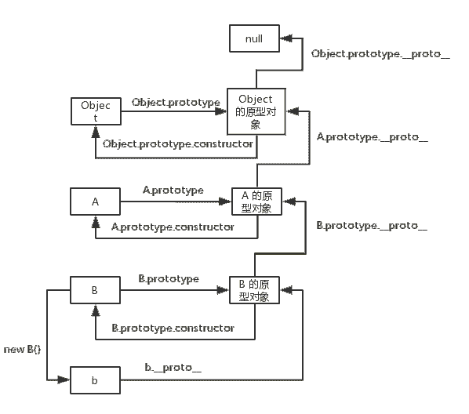

实例 b 的原型链验证图：

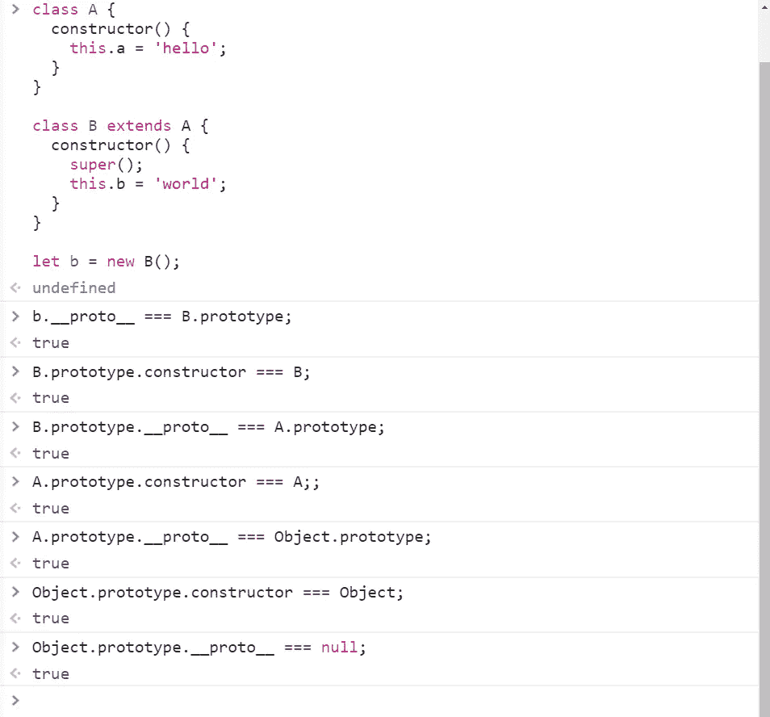

类 B 的原型链图下图：

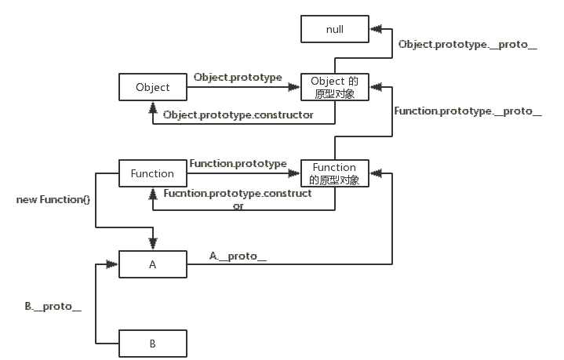

类 B 的原型链验证图图：

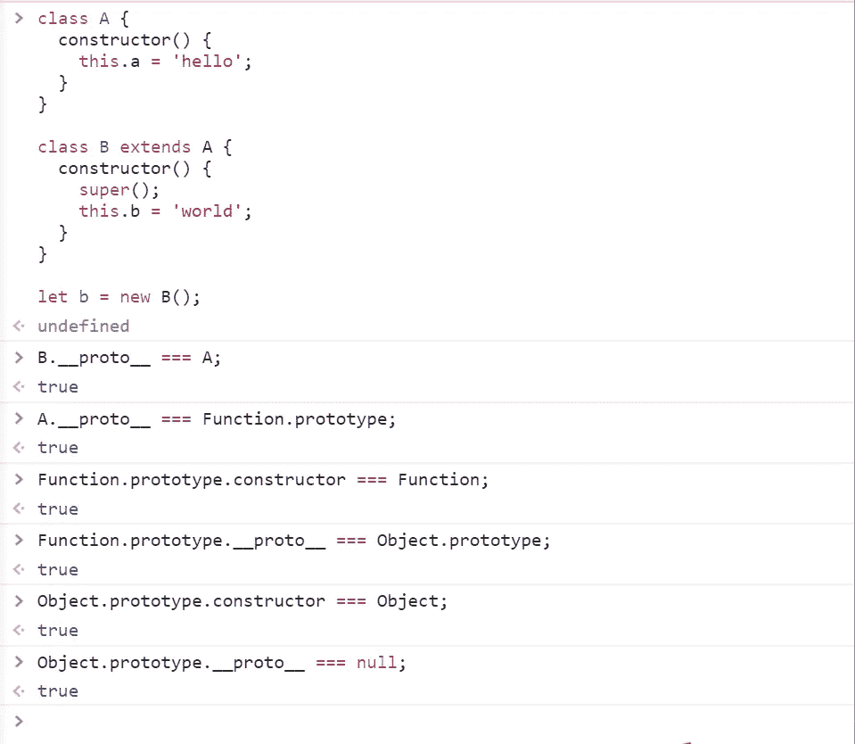

通过上面 4 幅图可知，在 ES6 与 ES5 中，类 B 的实例 b 的原型链与构造函数 B 的实例 b 的原型链是相同的，但是在 ES6 中类 B 继承了类 A 的属性，在 ES5 中，构造函数 B 没有继承构造函数 A 的属性，这是 ES6 与 ES5 继承的第一个区别。

3.  super() 与 A.call(this) 的区别

在 ES5 中，构造函数 B 的实例继承构造函数 A 的实例属性是通过 A.call(this) 来实现的，在 ES6 中，类 B 的实例继承类 A 的实例属性，是通过 super() 实现的。在不是继承原生构造函数的情况下，A.call(this) 与 super() 在功能上是没有区别的，用 [babel 在线转换](https://babeljs.io/repl/#?babili=false&evaluate=true&lineWrap=false&presets=es2015,react,stage-2&targets=&browsers=&builtIns=false&debug=false&code=) 将类的继承转换成 ES5 语法，babel 也是通过 A.call(this) 来模拟实现 super() 的。但是在继承原生构造函数的情况下，A.call(this) 与 super() 在功能上是有区别的，ES5 中 A.call(this) 中的 this 是构造函数 B 的实例，也就是在实现实例属性继承上，ES5 是先创造构造函数 B 的实例，然后在让这个实例通过 A.call(this) 实现实例属性继承，在 ES6 中，是先新建父类的实例对象 this，然后再用子类的构造函数修饰 this，使得父类的所有行为都可以继承。下面通过 2 段代码说明这个问题。

代码 1：

```cpp
function MyArray() {
  Array.call(this);
}

MyArray.prototype = Object.create(Array.prototype, {
  constructor: {
    value: MyArray,
    writable: true,
    configurable: true
  }
});

var colors = new MyArray();
colors[0] = "red";
colors.length;
```

这段代码的思路就是，让构造函数 MyArray 继承原生构造函数 Array，然后验证 MyArray 的实例是否具有 Array 实例的特性。

代码 1 执行结果如下图：

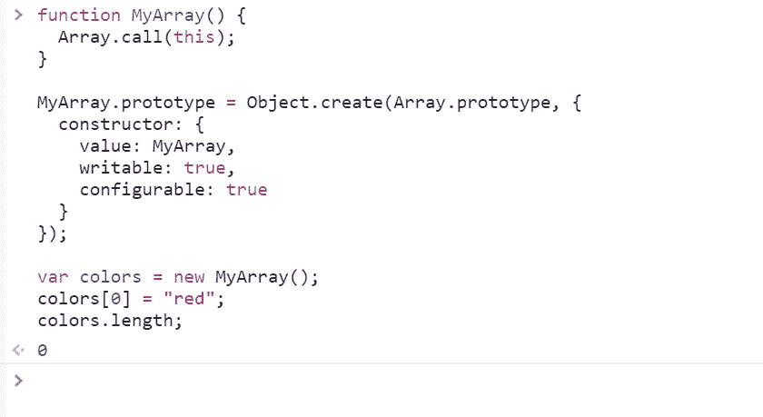

从结果可以看出，MyArray 的实例并不具有 Array 实例的特性，之所以会发生这种情况，是因为 MyArray 的实例无法获得原生构造函数 Array 实例的内部属性，通过 Array.call(this) 也不行。

代码 2：

```cpp
class MyArray extends Array {
  constructor() {
    super();
  }
}

var arr = new MyArray();
arr[0] = 12;
arr.length;
复制代码
```

代码 2 执行结果如下图：

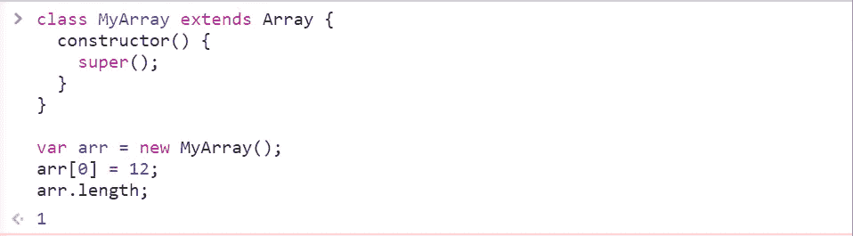

从结果可以看出，通过 super()，MyArray 的实例具有 Array 实例的特性。

#### 6.4 哪些类型能被扩展操作符...扩展

**参考答案：**

**适用类型**：数组、对象、字符串。

复杂数据类型都可以，当要转化为可迭代数据结构时可设置对象的迭代器对扩展运算符扩展出来的值进行操作。

基础数据只有 string 可以使用扩展运算符，number,boolean,null,undefined 无效

#### 6.5 事件扩展符用过吗(...)，什么场景下

**参考答案：**

**扩展运算符的应用场景**

```cpp
// 1、函数调用
function add(x, y) {
  return x + y;
}
add(...[4, 38]);

function f(v, w, x, y, z) {  }
f(-1, ...[0, 1], 2, ...[3]);
// 123456789

//2.往数组里 push 多个元素
var arr1 = [0, 1, 2];
var arr2 = [3, 4, 5];
arr1.push(...arr2);  
console.log(arr1); //[0,1,2,3,4,5]
//123456

//3.替代函数的 apply 方法
function f(x, y, z) {  }  
var args = [0, 1, 2];
f.apply(null, args); //ES5 的写法
f(...args); //ES6 的写法
// 123456

//4.求一个数组的最大数简化
Math.max.apply(null, [14, 3, 77])  //ES5 的写法
Math.max(...[14, 3, 77])  //ES6 的写法，等同于 Math.max(14, 3, 77)
//1234

//5.扩展运算符后面可以放表达式
const arr = [...(5 > 0 ? ['a'] : []),'b'];
console.log(arr);  //['a','b'] 
//1234

//6.与解构赋值结合，用于生成数组
const a1 = [1, 2];
const a2 = [...a1];  //写法 1
const [...a2] = a1;  //写法 2
const [first, ...rest] = [1, 2, 3, 4, 5];
first  //1
rest  //[2, 3, 4, 5]

const [first, ...rest] = [];
first  //undefined
rest  //[]

const [first, ...rest] = ["foo"];
first  //"foo"
rest   //[]
//1234567891011121314151617

//7.合并数组
[...arr1, ...arr2, ...arr3]  //[ 'a', 'b', 'c', 'd', 'e' ]
123

//8.数组的克隆——————————————————————特别注意
var arr1 = [0, 1, 2];
var arr2 = [...arr1];
arr1[0]=100;
console.log(arr2); //[0, 1, 2]  

/* 乍一看，arr2 与 arr1 不共用引用地址，arr2 不随着 arr1 变化，接着往下看 */

var arr1 = [0, [1,11,111], 2];
var arr2 = [...arr1];
arr1[1][0]=100;
console.log(arr2); //[0, [100,11,111], 2]
```

#### 6.6 让不同的浏览器兼容 ES6 的方法

**参考答案：**

针对 ES6 的兼容性问题，很多团队为此开发出了多种语法解析转换工具，把我们写的 ES6 语法转换成 ES5，相当于在 ES6 和浏览器之间做了一个翻译官。比较通用的工具方案有 babel，jsx，traceur，es6-shim 等。