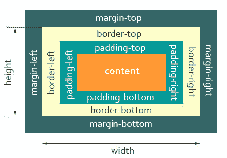
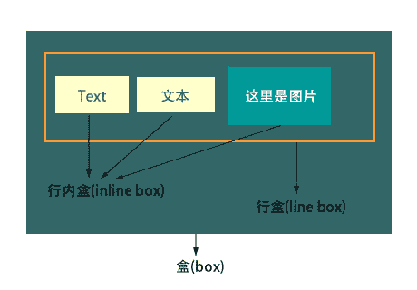

# 第五章 第 21 节 前端基础-css1

> 原文：[`www.nowcoder.com/tutorial/10072/9f8436eae97c4f2da696623599a75c8b`](https://www.nowcoder.com/tutorial/10072/9f8436eae97c4f2da696623599a75c8b)

#### 10.1 继承相关

css 的继承：就是给父级设置一些属性，子级继承了父级的该属性，这就是我们的 css 中的继承。 官方解释，继承是一种规则，它允许样式不仅应用于特定的 html 标签元素，而且应用于其后代元素。

**无继承性的属性**

1、display：规定元素应该生成的框的类型

2、文本属性：

vertical-align：垂直文本对齐

text-decoration：规定添加到文本的装饰

text-shadow：文本阴影效果

white-space：空白符的处理

unicode-bidi：设置文本的方向

3、盒子模型的属性：width、height、margin 、margin-top、margin-right、margin-bottom、margin-left、border、 border-style、border-top-style、border-right-style、border-bottom-style、border-left-style、border-width、border-top-width、border-right-right、border-bottom-width、border-left-width、border-color、border-top-color、border-right-color、border-bottom-color、border-left-color、border-top、border-right、border-bottom、border-left、padding、padding-top、padding-right、padding-bottom、padding-left

4、背景属性：background、background-color、background-image、background-repeat、background-position、background-attachment

5、定位属性：float、clear、position、top、right、bottom、left、min-width、min-height、max-width、max-height、overflow、clip、z-index

6、生成内容属性：content、counter-reset、counter-increment

7、轮廓样式属性：outline-style、outline-width、outline-color、outline

8、页面样式属性：size、page-break-before、page-break-after

9、声音样式属性：pause-before、pause-after、pause、cue-before、cue-after、cue、play-during

**有继承性的属性**

1、字体系列属性

font：组合字体

font-family：规定元素的字体系列

font-weight：设置字体的粗细

font-size：设置字体的尺寸

font-style：定义字体的风格

font-variant：设置小型大写字母的字体显示文本，这意味着所有的小写字母均会被转换为大写，但是所有使用小型大写 字体的字母与其余文本相比，其字体尺寸更小。

font-stretch：对当前的 font-family 进行伸缩变形。所有主流浏览器都不支持。

font-size-adjust：为某个元素规定一个 aspect 值，这样就可以保持首选字体的 x-height。

2、文本系列属性

text-indent：文本缩进

text-align：文本水平对齐

line-height：行高

word-spacing：增加或减少单词间的空白（即字间隔）

letter-spacing：增加或减少字符间的空白（字符间距）

text-transform：控制文本大小写

direction：规定文本的书写方向

color：文本颜色 a 元素除外

3、元素可见性：visibility

4、表格布局属性：caption-side、border-collapse、border-spacing、empty-cells、table-layout

5、列表布局属性：list-style-type、list-style-image、list-style-position、list-style

6、生成内容属性：quotes

7、光标属性：cursor

8、页面样式属性：page、page-break-inside、windows、orphans

9、声音样式属性：speak、speak-punctuation、speak-numeral、speak-header、speech-rate、volume、voice-family、 pitch、pitch-range、stress、richness、、azimuth、elevation

**所有元素可以继承的属性**

1、元素可见性：visibility

2、光标属性：cursor

**内联元素可以继承的属性**

1、字体系列属性

2、除 text-indent、text-align 之外的文本系列属性

**块级元素可以继承的属性**

1、text-indent、text-align

#### 10.2 css 预处理工具

**参考答案**：

**CSS 预处理器**是一个能让你通过预处理器自己独有的语法来生成 CSS 的程序。

css 预处理器种类繁多，三种主流 css 预处理器是 Less、Sass（Scss）及 Stylus；它们各自的背景如下:

Sass：

2007 年诞生，最早也是最成熟的 CSS 预处理器，拥有 ruby 社区的支持和 compass 这一最强大的 css 框架，目前受 LESS 影响，已经进化到了全面兼容 CSS 的 SCSS（SCSS 需要使用分号和花括号而不是换行和缩进）。

Less：

2009 年出现，受 SASS 的影响较大，但又使用 CSS 的语法，让大部分开发者和设计师更容易上手，在 ruby 社区之外支持者远超过 SASS。其缺点是比起 SASS 来，可编程功能不够。优点是简单和兼容 CSS，反过来也影响了 SASS 演变到了 SCSS 的时代，著名的 Twitter Bootstrap 就是采用 LESS 做底层语言的。

Stylus：

2010 年产生，来自 Node.js 社区，主要用来给 Node 项目进行 CSS 预处理支持，在此社区之内有一定支持者，在广泛的意义上人气还完全不如 SASS 和 LESS。

**比较**

在使用 CSS 预处理器之前最重要的是理解语法，幸运的是基本上大多数预处理器的语法跟 CSS 都差不多。

首先 Sass 和 Less 都使用的是标准的 CSS 语法，因此如果可以很方便的将已有的 CSS 代码转为预处理器代码，默认 Sass 使用 .sass 扩展名，而 Less 使用 .less 扩展名。

```cpp
h1 {
  color: #0982C1;
}
```

这是一个再普通不过的，不过 Sass 同时也支持老的语法，就是不包含花括号和分号的方式：

```cpp
h1
color: #0982c1
```

而 Stylus 支持的语法要更多样性一点，它默认使用 .styl 的文件扩展名，下面是 Stylus 支持的语法

```cpp
/* style.styl */
h1 {
  color: #0982C1;
}
/* omit brackets */
h1
color: #0982C1;
/* omit colons and semi-colons */
h1
color #0982C1
```

可以在同一个样式单中使用不同的变量，例如下面的写法也不会报错：

```cpp
h1 {
  color #0982c1
}
h2
font-size: 1.2em
```

#### 10.3 行内元素和块级元素什么区别，然后怎么相互转换

**参考答案:**

**块级元素**

1.总是从新的一行开始，即各个块级元素独占一行，默认垂直向下排列；

2.高度、宽度、margin 及 padding 都是可控的，设置有效，有边距效果；

3.宽度没有设置时，默认为 100%；

4.块级元素中可以包含块级元素和行内元素。

**行内元素**

1.和其他元素都在一行，即行内元素和其他行内元素都会在一条水平线上排列；

2.高度、宽度是不可控的，设置无效，由内容决定。

3.根据标签语义化的理念，行内元素最好只包含行内元素，不包含块级元素。

**转换**

当然块级元素与行内元素之间的特性是可以相互转换的。HTML 可以将元素分为行内元素、块状元素和行内块状元素三种。

使用 display 属性能够将三者任意转换：

​ (1)display:inline;转换为行内元素；

　(2)display:block;转换为块状元素；

　(3)display:inline-block;转换为行内块状元素。

#### 10.4 块元素哪些属性可以继承？

**参考答案**：

text-indent、text-align、visibility、cursor

#### 10.5 盒模型

**参考答案**：

1.  概念

    CSS 盒模型本质上是一个盒子，封装周围的 HTML 元素，它包括：`外边距（margin）`、`边框（border）`、`内边距（padding）`、`实际内容（content）`四个属性。
    CSS 盒模型：**标准模型 + IE 模型**

    1.1 W3C 盒子模型(标准盒模型)

    

    1.2 IE 盒子模型(怪异盒模型)

    

​ 2\. 标准模型和 IE 模型的区别

​ 计算宽度和高度的不同
​ 标准盒模型：盒子总宽度/高度 = `width/height + padding + border + margin`。（ 即 width/height 只是 内容高度，不包含 padding 和 border 值 ）
​ IE 盒子模型：盒子总宽度/高度 = `width/height + margin = (内容区宽度/高度 + padding + border) + margin`。（ 即 width/height 包含了 padding 和 border 值 ）

3.  CSS 如何设置这两种模型

    标准：`box-sizing: content-box;` ( 浏览器默认设置 )
    IE： `box-sizing: border-box;`

4.  JS 如何获取盒模型对应的宽和高

    （1）`dom.style.width/height` 只能取到行内样式的宽和高，style 标签中和 link 外链的样式取不到。
    （2）`dom.currentStyle.width/height` （只有 IE 兼容）取到的是最终渲染后的宽和高
    （3）`window.getComputedStyle(dom).width/height` 同（2）但是多浏览器支持，IE9 以上支持。
    （4）`dom.getBoundingClientRect().width/height` 也是得到渲染后的宽和高，大多浏览器支持。IE9 以上支持，除此外还可以取到相对于视窗的上下左右的距离。
    （6）`dom.offsetWidth/offsetHeight` 包括高度（宽度）、内边距和边框，不包括外边距。最常用，兼容性最好。

5.  BFC（边距重叠解决方案）

    5.1 BFC 基本概念

    **BFC: 块级格式化上下文**
    BFC 基本概念：`BFC` 是 `CSS` 布局的一个概念，是一块独立的渲染区域，是一个环境，里面的元素不会影响到外部的元素 。
    父子元素和兄弟元素边距重叠，重叠原则取最大值。空元素的边距重叠是取 `margin` 与 padding 的最大值。

    5.2 BFC 原理（渲染规则|布局规则）：

    （1）内部的 `Box` 会在垂直方向，从顶部开始一个接着一个地放置；
    （2）`Box` 垂直方向的距离由 `margin` (外边距)决定，属于同一个 `BFC` 的两个相邻 `Box` 的 `margin` 会发生重叠；
    （3）每个元素的 `margin Box` 的左边， 与包含块 `border Box` 的左边相接触，（对于从左到右的格式化，否则相反）。即使存在浮动也是如此；
    （4）BFC 在页面上是一个隔离的独立容器，外面的元素不会影响里面的元素，反之亦然。文字环绕效果，设置 `float`；
    （5）BFC 的区域不会与 `float Box` 重叠（清浮动）;
    （6）计算 `BFC` 的高度时，浮动元素也参与计算。

    5.3 CSS 在什么情况下会创建出 BFC（即脱离文档流）

    ​ 0、根元素，即 HTML 元素（最大的一个 `BFC`）
    ​ 1、浮动（ `float 的值不为 none` ）
    ​ 2、绝对定位元素（ `position 的值为 absolute 或 fixed` ）
    ​ 3、行内块（ `display 为 inline-block` ）
    ​ 4、表格单元（ `display 为 table、table-cell、table-caption、inline-block 等 HTML 表格相关的属性` )
    ​ 5、弹性盒（ `display 为 flex 或 inline-flex` ）
    ​ 6、默认值。内容不会被修剪，会呈现在元素框之外（`overflow 不为 visible`）

    5.4 BFC 作用（使用场景）

    ​ 1、自适应两（三）栏布局（避免多列布局由于宽度计算四舍五入而自动换行）
    ​ 2、避免元素被浮动元素覆盖
    ​ 3、可以让父元素的高度包含子浮动元素，清除内部浮动（原理：触发父 `div` 的 `BFC` 属性，使下面的子 `div` 都处在父 `div`的同一个 `BFC` 区域之内）
    ​ 4、去除边距重叠现象，分属于不同的 `BFC` 时，可以阻止 `margin` 重叠

6.  IFC

    6.1 IFC 基本概念

    ​ **IFC: 行内格式化上下文**
    ​ IFC 基本概念：

    ​ 

​ 6.2 IFC 原理（渲染规则|布局规则）：

​ （1）内部的 `Box` 会在水平方向，从含块的顶部开始一个接着一个地放置；
​ （2）这些 `Box` 之间的水平方向的 `margin`，`border` 和`padding` 都有效；
​ （3）`Box` 垂直对齐方式：以它们的底部、顶部对齐，或以它们里面的文本的基线（`baseline`）对齐（默认， 文本与图片对其），例：`line-heigth` 与 `vertical-align`。