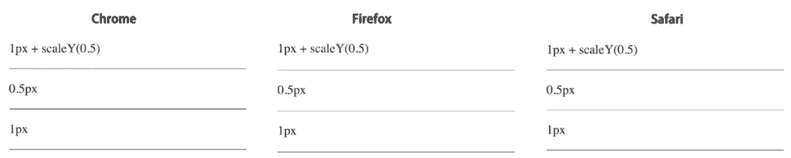
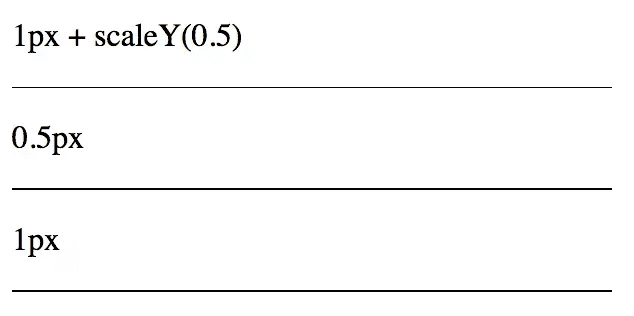
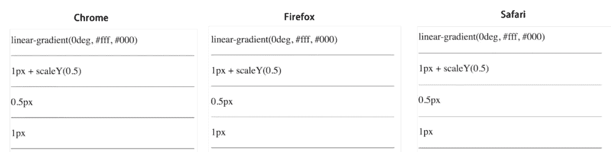

# 第五章 第 24 节 前端基础-布局-2

> 原文：[`www.nowcoder.com/tutorial/10072/3da21450ccf6429bbd050f229c6641cf`](https://www.nowcoder.com/tutorial/10072/3da21450ccf6429bbd050f229c6641cf)

#### 11.7 实现扇形、圆形

**参考答案**：

圆形：

border-radius 圆角的四个值按顺序取值分别为：左上、右上、右下、左下。这里只设置一个值，代表四个角的取值都为为 50%

原理：border-radius: 50% 弯曲元素的边框以创建圆。
由于圆在任何给定点具有相同的半径，故宽和高都需要保证一样的值，不同的值将创建椭圆。

```cpp
<div class="circle"></div>
<style>
  .circle {
     border-radius: 50%;
     width: 80px;
     height: 80px;
       background: #666;
  }
</style>
```

扇形：

1.  利用 border-radius，实现 90 度角的扇形：

    原理：

    左上角是圆角，其余三个角都是直角：左上角的值为宽和高一样的值，其他三个角的值不变（等于 0）。

```cpp
<div class="sector"></div>
<style>
.sector{
  border-radius:80px 0 0;
  width: 80px;
  height: 80px;
  background: #666;
}</style>
```

2.  绘制任意角度的扇形

```cpp
<div class="shanxing shanxing1">
    <div class="sx1"></div>
     <div class="sx2"></div>
</div>
<!--*绘制一个 85 度扇形*/--p>
<div class="shanxing shanxing2">
    <div class="sx1"></div>
     <div class="sx2"></div>
</div>
<!--*绘制一个向右扇形，90 度扇形*-->
<div class="shanxing shanxing3">
    <div class="sx1"></div>
     <div class="sx2"></div>
</div>
<!--*绘制一个颜色扇形 */--p>
<div class="shanxing shanxing4">
    <div class="sx1"></div>
     <div class="sx2"></div>
</div>
<!--/*绘制一个不同颜色半圆夹角 */-->
<div class="shanxing shanxing5">
    <div class="sx1"></div>
     <div class="sx2"></div>
</div>
<style>
.shanxing{
    position: relative;
    width: 200px;
    height: 200px;
    border-radius: 100px;
    background-color: yellow;
}

.sx1{
    position: absolute;
    width: 200px;
    height: 200px;
    transform: rotate(0deg);
    clip: rect(0px,100px,200px,0px); /*这个 clip 属性用来绘制半圆，在 clip 的 rect 范围内的内容显示出来，使用 clip 属性，元素必须是 absolute 的 */
    border-radius: 100px;
    background-color: #f00;
    /*-webkit-animation: an1 2s infinite linear; */
}

.sx2{
    position: absolute;
    width: 200px;
    height: 200px;
    transform: rotate(0deg);
    clip: rect(0px,100px,200px,0px);
    border-radius: 100px;
    background-color: #f00;
    /*-webkit-animation: an2 2s infinite linear;*/
}

/*绘制一个 60 度扇形*/
.shanxing1 .sx1{transform: rotate(-30deg);}
.shanxing1 .sx2{transform: rotate(-150deg);}

/*绘制一个 85 度扇形*/
.shanxing2 .sx1{transform: rotate(-45deg);}
.shanxing2 .sx2{transform: rotate(-140deg);}

/*绘制一个向右扇形，90 度扇形*/
.shanxing3 .sx1{transform: rotate(45deg);}
.shanxing3 .sx2{transform: rotate(-45deg);}

/*绘制一个颜色扇形 */
.shanxing4 .sx1{transform: rotate(45deg);background-color: #fff;}
.shanxing4 .sx2{transform: rotate(-45deg);background-color: #fff;}

/*绘制一个不同颜色半圆夹角 */
.shanxing5 .sx1{transform: rotate(45deg);background-color: #f00;}
.shanxing5 .sx2{transform: rotate(-45deg);background-color: #0f0;       
</style>
```

#### 11.8 旋转 45 度

**参考答案**：

CSS 中使用**rotate**方法来实现对元素的旋转，在参数中加入角度值，旋转方式为顺时针旋转。

```cpp
<!DOCTYPE html>
 2 <html>
 3     <head>
 4         <meta charset="utf-8" />
 5         <title>Transform 旋转</title>
 6         <style>
 7         div {
 8             width: 300px;
 9             margin: 150px auto;
10             background-color: yellow;
11             text-align: center;
12             -webkit-transform: rotate(45deg);    /* for Chrome || Safari */
13             -moz-transform: rotate(45deg);       /* for Firefox */
14             -ms-transform: rotate(45deg);        /* for IE */
15             -o-transform: rotate(45deg);         /* for Opera */
16         }
17         </style>
18     </head>
19     <body>
20         <div>黄色 div</div>
21     </body>
22 </html>
```

#### 11.9 画 0.5px 的直线

**参考答案**：

1.  使用 scale 缩放

```cpp
<style>
.hr.scale-half {
    height: 1px;
    transform: scaleY(0.5);
}
</style>
    <p>1px + scaleY(0.5)</p>
    <div class="hr scale-half"></div>
```



Chrome/Safari 都变虚了，只有 Firefox 比较完美看起来是实的而且还很细，效果和直接设置 0.5px 一样。所以通过 transform: scale 会导致 Chrome 变虚了，而粗细几乎没有变化。但是如果加上 transform-origin: 50% 100%：

```cpp
.hr.scale-half {
    height: 1px;
    transform: scaleY(0.5);
    transform-origin: 50% 100%;
}
```

chrome 现在的效果如下



2.  线性渐变 linear-gradient

```cpp
<style>
.hr.gradient {
    height: 1px;
    background: linear-gradient(0deg, #fff, #000);
}
</style>
<p>linear-gradient(0deg, #fff, #000)</p>
<div class="hr gradient"></div>
```



inear-gradient(0deg, #fff, #000)的意思是：渐变的角度从下往上，从白色#fff 渐变到黑色#000，而且是线性的，在高清屏上，1px 的逻辑像素代表的物理（设备）像素有 2px，由于是线性渐变，所以第 1 个 px 只能是#fff，而剩下的那个像素只能是#000，这样就达到了画一半的目的。

3.  boxshadow

```cpp
<style>
.hr.boxshadow {
    height: 1px;
    background: none;
    box-shadow: 0 0.5px 0 #000;
}
</style>
<p>box-shadow: 0 0.5px 0 #000</p>
<div class="hr boxshadow"></div>
```

4.  viewport

```cpp
<meta name="viewport" content="width=device-width,initial-sacle=0.5">
```

其中 width=device-width 表示将 viewport 视窗的宽度调整为设备的宽度，这个宽度通常是指物理上宽度。默认的缩放比例为 1 时，如 iphone 6 竖屏的宽度为 750px，它的 dpr=2，用 2px 表示 1px，这样设置之后 viewport 的宽度就变成 375px。但是我们可以改成 0.5，viewport 的宽度就是原本的 750px，所以 1 个 px 还是 1px，正常画就行，但这样也意味着 UI 需要按 2 倍图的出，整体面面的单位都会放大一倍。

#### 11.10 css 切换主题

**参考答案**：

方式一：主题层

这应该是实现主题功能的一种最常用的手段了。首先，我们的站点会有一个最初的基础样式（或者叫默认样式）；然后通过添加一些后续的额外的 CSS 来覆盖与重新定义部分样式。

具体实现

首先，我们引入基础的样式 `components.*` 文件

```cpp
@import "components.tabs";
@import "components.buttons"
```

其中 `components.tabs` 文件内容如下

```cpp
.tab {
    margin: 0;
    padding: 0;
    background-color: gray;
}
```

然后，假设我们的某个主题的样式文件存放于 `theme.*` 文件：

对应于 `components.tabs`，`theme.tabs` 文件内容如下

```cpp
.tab {
    background-color: red;
}
```

因此，我们只需要引入主题样式文件即可

```cpp
@import "components.tabs";
@import "components.buttons"

@import "theme.tabs";
```

这样当前的样式就变为了

```cpp
.tab {
    margin: 0;
    padding: 0;
    /* background-color: gray; */
    background-color: red;
}
```

优点

*   实现方式简单
*   可以实现将主题应用与所有元素

缺点

*   过多的冗余代码
*   许多的 CSS 其实是无用的，浪费了带宽
*   把样式文件切分到许多文件中，更加琐碎

* * *

方式二：有状态的主题

该方式可以实现基于条件选择不同的主题皮肤，并允许用户在客户端随时切换主题。非常适合需要客户端样式切换功能，或者需要对站点某一部分（区域）进行独立样式设置的场景。

具体实现

还是类似上一节中 Tab 的这个例子，我们可以将 Tab 部分的 (S)CSS 改为如下形式：

```cpp
.tab {
    background-color: gray;

    .t-red & {
        background-color: red;
    }

    .t-blue & {
        background-color: blue;
    }
}
```

这里我们把`.t-red`与`.t-blue`称为 Tab 元素的上下文环境（context）。Tab 元素会根据 context 的不同展示出不同的样式。

最后我们给`body`元素加上这个开关

```cpp
<body class="t-red">
    <ul class="tabs">...</ul>
</body>
```

此时 Tab 的颜色为红色。

当我们将`t-red`改为`t-blue`时，Tab 就变为了蓝色主题。

进一步的，我们可以创建一些 (S)CSS 的 util class（工具类）来专门控制一些 CSS 属性，帮助我们更好地控制主题。例如我们使用如下的`.u-color-current`类来控制不同主题下的字体颜色

```cpp
.u-color-current {
    .t-red & {
        color: red;
    }

    .t-blue & {
        color: blue;
    }
}
```

这样，当我们在不同主题上下文环境下使用`.u-color-current`时，就可以控制元素展示出不同主题的字体颜色

```cpp
<body class="t-red">
    <h1 class="page-title u-color-current">...</h1>
</body>
```

上面这段代码会控制`<h1>`元素字体颜色为红色主题时的颜色。

优点

*   将许多主题放在了同一处代码中
*   非常适合主题切换的功能
*   非常适合站点局部的主题化
*   可以实现将主题应用于所有元素

缺点

*   有时有点也是缺点，将许多主题混杂在了同一块代码中
*   可能会存在冗余

* * *

方式三：配置主题

这种方式其实是在开发侧来实现主题样式的区分与切换的。基于不同的配置，配合一些开发的自动化工具，我们可以在开发时期根据配置文件，编译生成不同主题的 CSS 文件。

它一般会结合使用一些 CSS 预处理器，可以对不同的 UI 元素进行主题分离，并且向客户端直接提供主题样式下最终的 CSS。

具体实现

我们还是以 Sass 为例：

首先会有一份 Sass 的配置文件，例如`settings.config.scss`，在这份配置中定义当前的主题值以及一些其他变量

```cpp
$theme: red;
```

然后对于一个 Tab 组件，我们这么来写它的 Sass 文件

```cpp
.tab {
    margin: 0;
    padding: 0;

    @if ($theme == red) {
        background-color: red;
    } @else {
        background-color: gray;
    }
}
```

这时，我们在其之前引入相应的配置文件后

```cpp
@import "settings.config";
@import "components.tabs";
```

Tab 组件就会呈现出红色主题。

当然，我们也可以把我们的`settings.config.scss`做的更健壮与易扩展一些

```cpp
$config: (
    theme: red,
    env: dev,
)

// 从$config 中获取相应的配置变量
@function config($key) {
    @return map-get($config, $key);
}
```

与之前相比，这时候使用起来只需要进行一些小的修改，将直接使用`theme`变量改为调用`config`方法

```cpp
.tab {
    margin: 0;
    padding: 0;

    @if (config(theme) == red) {
        background-color: red;
    } @else {
        background-color: gray;
    }
}
```

优点

*   访问网站时，只会传输所需的 CSS，节省带宽
*   将主题的控制位置放在了一个地方（例如上例中的`settings.config.scss`文件）
*   可以实现将主题应用于所有元素

缺点

*   在 Sass 中会有非常多逻辑代码
*   只支持有限数量的主题
*   主题相关的信息会遍布代码库中
*   添加一个新主题会非常费劲

* * *

方式四：主题调色板

这种方式有些类似于我们绘图时，预设了一个调色板（palette），然后使用的颜色都从其中取出一样。

在实现主题功能时，我们也会有一个类似的“调色板”，其中定义了主题所需要的各种属性值，之后再将这些信息注入到项目中。

当你经常需要为客户端提供完全的定制化主题，并且经常希望更新或添加主题时，这种模式会是一个不错的选择。

具体实现

在方式三中，我们在一个独立的配置文件中设置了一些“环境”变量，来标示当前所处的主题。而在方式四中，我们会更进一步，抽取出一个专门的 palette 文件，用于存放不同主题的变量信息。

例如，现在我们有一个`settings.palette.red.scss`文件

```cpp
$color: red;
$color-tabs-background: $color-red;
```

然后我们的`components.tabs.scss`文件内容如下

```cpp
.tabs {
    margin: 0;
    padding: 0;
    backgroung-color: $color-tabs-background;
}
```

这时候，我们只需要引入这两个文件即可

```cpp
@import "settings.palette.red";
@import "components.tabs";
```

可以看到，`components.tabs.scss`中并没有关于主题的逻辑判断，我们只需要专注于编辑样式，剩下就是选择所需的主题调色板（palette）即可。

优点

*   编译出来的样式代码无冗余
*   非常适合做一些定制化主题，例如一个公司采购了你们的系统，你可以很方便实现一个该公司的主题
*   可以从一个文件中完全重制出你需要的主题样式

缺点

*   由于主要通过设定不同变量，所以代码确定后，能实现的修改范围会是有限的

* * *

方式五：用户定制化

这种模式一般会提供一个个性化配置与管理界面，让用户能自己定义页面的展示样式。

“用户定制化”在社交媒体产品、SaaS 平台或者是 Brandable Software 中最为常见。

具体实现

要实现定制化，可以结合方式二中提到的 util class。

首先，页面中支持自定义的元素会被预先添加 util class，例如 Tab 元素中的`u-user-color-background`

```cpp
<ul class="tabs u-user-color-background">...</ul>
```

此时，`u-user-color-background`还并未定义任何样式。而当用户输入了一个背景色时，我们会创建一个``标签，并将 hex 值注入其中

```cpp
<style id="my-custom">
    .u-user-color-background {
        background-color: #00ffff;
    }
</style>
```

这时用户就得到了一个红色的 Tab。

优点

*   不需要开发人员的输入信息（是用户定义的）
*   允许用户拥有自己“独一无二”的站点
*   非常实用

缺点

*   不需要开发人员的输入信息也意味着你需要处理更多的“不可控”情况
*   会有许多的冗余
*   会浪费 CSS 的带宽
*   失去部分 CSS 的浏览器缓存能力