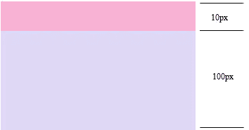
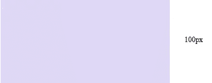

# 第五章 第 26 节 前端基础-属性 1

> 原文：[`www.nowcoder.com/tutorial/10072/da62045e950541e09f8c7991f40282b1`](https://www.nowcoder.com/tutorial/10072/da62045e950541e09f8c7991f40282b1)

#### 12.1 清除浮动

**参考答案**：

除浮动其实叫做闭合浮动更合适，因为是把浮动的元素圈起来，让父元素闭合出口和入口不让他们出来影响其他的元素。
在 CSS 中，clear 属性用于清除浮动，其基本语法格式如下：

```cpp
选择器{clear:属性值;}
/*属性值为 left,清除左侧浮动的影响
  属性值为 right,清除右侧浮动的影响
  属性值为 both,同时清除左右两侧浮动的影响*/
```

1.  额外标签法

    1.1 末尾标签法
    通过在浮动元素的末尾添加一个空的标签。这是 W3C 推荐的做法，虽然比较简单，但是添加了无意义的标 签，结构化比较差，所以不推荐使用。下面三种写法都适用：

    ```cpp
    1\. <div style="clear:both"></div>
    2\. .clear { clear:both }
        <div class="clear"></div>
    3..clear{ clear:both }
        <br class="clear" />    <!--也可以使用 br 等别的块级元素来清除浮动-->
    ```

    2.2 内部标签法，把 div 放进父盒子里，盒子会撑开，一般也不会用。

2.  overflow

    给父级元素添加 overflow 样式方法。
    代码比较简洁，可以通过触发 BFC 方式，但是因为本身 overflow 的本质是溢出隐藏的效果，所以有的时候也会有一些问题存在，比如内容增多的时候不会自动换行导致内容被隐藏掉，无法显示出要溢出的元素。

    ```cpp
    .father {
            overflow: auto;  
          /* 加上这句话，就可以清除浮动   overflow = hidden|auto|scroll 都可以实现*/
       }
    ```

3.  伪元素法（最常用）

    3.1 使用 after 伪元素清除浮动
    after 是在父元素中加一个盒子，这个元素是通过 css 添加上去的，符合闭合浮动思想，结构语义化正确。
    父元素中加一个类名为 clearfix 。但是这个方法 IE6，7 不识别，要进行兼容，使用 zoom:1 触发 hasLayout 来清除浮动
    代表网站：百度、淘宝、网易等

    ```cpp
    .clearfix:after{
        content:".";  /*尽量不要为空，一般写一个点*/
        height:0;     /*盒子高度为 0，看不见*/
        display:block;    /*插入伪元素是行内元素，要转化为块级元素*/
        visibility:hidden;      /*content 有内容，将元素隐藏*/
        clear:both;  
    }

    .clearfix {
        *zoom: 1;   /*  *只有 IE6,7 识别 */
    }
    ```

    3.2 after 伪元素空余字符法
    父元素中加一个类名为 clearfix，也需要兼容 IE6、7

    ```cpp
    .clearfix::after{
        content:"\200B";   /* content:'\0200'; 也可以 */
        display:block;
        height:0;
        clear:both;
    }

    .clearfix {
        *zoom: 1; 
    }
    ```

    3.3 使用 before 和 after 双伪元素清除浮动（推荐）
    完全符合闭合浮动思想的方法。
    父元素中加一个类名为 clearfix,需要兼容 IE6、7
    代表网站：小米、腾讯

    ```cpp
     .clearfix:before, .clearfix:after {
            content: ""; 
            display: table;
        }
        .clearfix:after {
            clear: both;
        }
        .clearfix {
            *zoom: 1;
        }
    ```

#### 12.2 padding , margin 百分比单位依据

**参考答案**：

在 CSS 盒模型中，依据 CSS2.2 文档，margin 与 padding 的百分比指定值时，一律参考**包含盒的宽度**。
示例：

```cpp
        .father{
            height: 100px;
            width: 200px;
            border: solid;
        }

        .son{
            margin: 20%;
            padding: 20%;
            width: 50%;
            height: 50%;
        }
```

如下图，包括 padding-top/bottom,margin-top/bottom 在内，所有 padding 和 margin 均是参考的包含块的宽度，故它们的值为 200px * 20% = 40px。

#### 12.3 父子边距重合

**参考答案**：

**效果：**

边界重叠是指两个或多个盒子(可能相邻也可能嵌套)的相邻边界(其间没有任何非空内容、补白、边框)重合在一起而形成一个单一边界。

父子元素的边界重叠

```cpp
<style>
  .parent {
    background: #e7a1c5;
  }
  .parent .child {
    background: #c8cdf5;
    height: 100px;
    margin-top: 10px;
  }
</style>
<section class="parent">
  <article class="child"></article>
</section>
```

以为期待的效果：



而实际上效果如下:



在这里父元素的高度不是 110px，而是 100px，在这里发生了高度坍塌。

**产生原因：**

​ 是如果块元素的 `margin-top` 与它的第一个子元素的 `margin-top` 之间没有 `border`、`padding`、`inline` `content`、 `clearance` 来分隔，或者块元素的 margin-bottom 与它的最后一个子元素的 margin-bottom 之间没有 `border`、`padding`、`inline` `content`、`height`、`min-height`、 `max-height` 分隔，那么外边距会塌陷。子元素多余的外边距会被父元素的外边距截断。

**解决办法**：

父子元素的边界重叠得解决方案： 在父元素上加上 overflow:hidden;使其成为 BFC。

#### 12.4 css 字体大小设置（三种）.em rem px

**参考答案**：

**px（绝对长度单位）**

​ 相信对于前端来说 px 这个单位是大家并不陌生，px 这个单位，兼容性可以说是相当可以，大家对 px 的了解肯 定是没有很大的问题的。

**em（相对长度单位）**

​ **使用：**

1.  浏览器的默认字体都是 16px，那么 1em=16px，以此类推计算 12px=0.75em，10px=0.625em,2em=32px；

2.  这样使用很复杂，很难很好的与 px 进行对应,也导致书写、使用、视觉的复杂(0.75em、0.625em 全是小数点)；

3.  为了简化 font-size 的换算，我们在 body 中写入一下代码

    ```cpp
    body {font-size: 62.5%;  } /*  公式 16px*62.5%=10px  */ 
    ```

    这样页面中 1em=10px,1.2em=12px,1.4em=14px,1.6em=16px，使得视觉、使用、书写都得到了极大的帮助。

    例子如下：

    ```cpp
    <div class="font1" style='font-size:1.6em'>我是 1.6em</div>
    ```

    缺点：

    1.  em 的值并不是固定的；

    2.  em 会继承父级元素的字体大小（参考物是父元素的 font-size；）；

    3.  em 中所有的字体都是相对于父元素的大小决定的；所以如果一个设置了 font-size:1.2em 的元素在另一个设置了 font-size:1.2em 的元素里，而这个元素又在另一个设置了 font-size:1.2em 的元素里，那么最后计算的结果是 1.2X1.2X1.2=1.728em

        ```cpp
        <div class="big">
            我是大字体
           <div class="small">我是小字体</div>
        </div>
        ```

        样式为

        ```cpp
        <style>
             body {font-size: 62.5%; } /*  公式:16px*62.5%=10px  */ 
            .big{font-size: 1.2em}
            .small{font-size: 1.2em}
        </style>
        ```

        但运行结果 small 的字体大小为：1.2em*1.2em=1.44em

    **rem（相对长度单位）**

    **使用：**

    1.  浏览器的默认字体都是 16px，那么 1rem=16px，以此类推计算 12px=0.75rem，10px=0.625rem，2rem=32px；

    2.  这样使用很复杂，很难很好的与 px 进行对应,也导致书写、使用、视觉的复杂(0.75rem、0.625em 全是小数点) ；

    3.  为了简化 font-size 的换算，我们在根元素 html 中加入 font-size: 62.5%;

        ```cpp
        html {font-size: 62.5%;  } /*  公式 16px*62.5%=10px  */  
        ```

        这样页面中 1rem=10px,1.2rem=12px,1.4rem=14px,1.6rem=16px;使得视觉、使用、书写都得到了极大的帮助；

        ```cpp
        <div class="font1" style='font-size:1.6rem'>我是 1.6rem=16px</div>
        ```

    特点：

    1.  rem 单位可谓集相对大小和绝对大小的优点于一身

    2.  和 em 不同的是 rem 总是相对于根元素(如:root{})，而不像 em 一样使用级联的方式来计算尺寸。这种相对单位使用起来更简单。

    3.  rem 支持 IE9 及以上，意思是相对于根元素 html（网页），不会像 em 那样，依赖于父元素的字体大小，而造成混乱。使用起来安全了很多。

        ```cpp
        <div class="big">
            我是 14px=1.4rem<div class="small">我是 12px=1.2rem</div>
        </div>
        ```

        ```cpp
        <style>
            html {font-size: 10px;  } /*  公式 16px*62.5%=10px  */  
            .big{font-size: 1.4rem}
            .small{font-size: 1.2rem}
        </style>
        ```

    **注意：**

*   值得注意的浏览器支持问题： IE8，Safari 4 或 iOS 3.2 中不支持 rem 单位。
*   如果你的用户群都使用最新版的浏览器，那推荐使用 rem，如果要考虑兼容性，那就使用 px,或者两者同时使用。