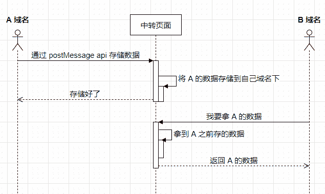

# 第六章 第 1 节 前端进阶-浏览器 1

> 原文：[`www.nowcoder.com/tutorial/10072/5747899961f441f9ae0a40b4965c91c7`](https://www.nowcoder.com/tutorial/10072/5747899961f441f9ae0a40b4965c91c7)

#### 1.1 cookie sessionStorage localStorage 区别

**参考答案**：

共同点：都是保存在浏览器端、且同源的

区别：

1.  cookie 数据始终在同源的 http 请求中携带（即使不需要），即 cookie 在浏览器和服务器间来回传递，而 sessionStorage 和 localStorage 不会自动把数据发送给服务器，仅在本地保存。cookie 数据还有路径（path）的概念，可以限制 cookie 只属于某个路径下

2.  存储大小限制也不同，cookie 数据不能超过 4K，同时因为每次 http 请求都会携带 cookie、所以 cookie 只适合保存很小的数据，如会话标识。sessionStorage 和 localStorage 虽然也有存储大小的限制，但比 cookie 大得多，可以达到 5M 或更大

3.  数据有效期不同，sessionStorage：仅在当前浏览器窗口关闭之前有效；localStorage：始终有效，窗口或浏览器关闭也一直保存，因此用作持久数据；cookie：只在设置的 cookie 过期时间之前有效，即使窗口关闭或浏览器关闭

4.  作用域不同，sessionStorage 不在不同的浏览器窗口中共享，即使是同一个页面；localstorage 在所有同源窗口中都是共享的；cookie 也是在所有同源窗口中都是共享的

5.  web Storage 支持事件通知机制，可以将数据更新的通知发送给监听者

6.  web Storage 的 api 接口使用更方便

#### 1.2 如何写一个会过期的 localStorage，说说想法

**参考答案**：

**两种方案：惰性删除 和 定时删除**

**惰性删除**

惰性删除是指，某个键值过期后，该键值不会被马上删除，而是等到下次被使用的时候，才会被检查到过期，此时才能得到删除。我们先来简单实现一下：

```cpp
var lsc = (function (self) {
    var prefix = 'one_more_lsc_'
    /**
     * 增加一个键值对数据
     * @param key 键
     * @param val 值
     * @param expires 过期时间，单位为秒
     */
    self.set = function (key, val, expires) {
        key = prefix + key;
        val = JSON.stringify({'val': val, 'expires': new Date().getTime() + expires * 1000});
        localStorage.setItem(key, val);
    };
    /**
     * 读取对应键的值数据
     * @param key 键
     * @returns {null|*} 对应键的值
     */
    self.get = function (key) {
        key = prefix + key;
        var val = localStorage.getItem(key);
        if (!val) {
            return null;
        }
        val = JSON.parse(val);
        if (val.expires < new Date().getTime()) {
            localStorage.removeItem(key);
            return null;
        }
        return val.val;
    };
    return self;
}(lsc || {}));
```

上述代码通过惰性删除已经实现了可过期的 localStorage 缓存，但是也有比较明显的缺点：如果一个 key 一直没有被用到，即使它已经过期了也永远存放在 localStorage。为了弥补这样缺点，我们引入另一种清理过期缓存的策略。

**定时删除**

定时删除是指，每隔一段时间执行一次删除操作，并通过限制删除操作执行的次数和频率，来减少删除操作对 CPU 的长期占用。另一方面定时删除也有效的减少了因惰性删除带来的对 localStorage 空间的浪费。

每隔一秒执行一次定时删除，操作如下：

1.  随机测试 20 个设置了过期时间的 key。
2.  删除所有发现的已过期的 key。
3.  若删除的 key 超过 5 个则重复**步骤 1**，直至重复 500 次。

具体实现如下：

```cpp
var lsc = (function (self) {
    var prefix = 'one_more_lsc_'
    var list = [];
    //初始化 list
    self.init = function () {
        var keys = Object.keys(localStorage);
        var reg = new RegExp('^' + prefix);
        var temp = [];
        //遍历所有 localStorage 中的所有 key
        for (var i = 0; i < keys.length; i++) {
          //找出可过期缓存的 key
            if (reg.test(keys[i])) {
                temp.push(keys[i]);
            }
        }
        list = temp;
    };
    self.init();
    self.check = function () {
        if (!list || list.length == 0) {
            return;
        }
        var checkCount = 0;
        while (checkCount < 500) {
            var expireCount = 0;
            //随机测试 20 个设置了过期时间的 key
            for (var i = 0; i < 20; i++) {
                if (list.length == 0) {
                    break;
                }
                var index = Math.floor(Math.random() * list.length);
                var key = list[index];
                var val = localStorage.getItem(list[index]);
                //从 list 中删除被惰性删除的 key
                if (!val) {
                    list.splice(index, 1);
                    expireCount++;
                    continue;
                }
                val = JSON.parse(val);
                //删除所有发现的已过期的 key
                if (val.expires < new Date().getTime()) {
                    list.splice(index, 1);
                    localStorage.removeItem(key);
                    expireCount++;
                }
            }
            //若删除的 key 不超过 5 个则跳出循环
            if (expireCount <= 5 || list.length == 0) {
                break;
            }
            checkCount++;
        }
    }
    //每隔一秒执行一次定时删除
    window.setInterval(self.check, 1000);
    return self;
}(lsc || {}));
```

#### 1.3 如何定时删除 localstorage 数据

**参考答案**：

定时删除是指，每隔一段时间执行一次删除操作，并通过限制删除操作执行的次数和频率，来减少删除操作对 CPU 的长期占用。另一方面定时删除也有效的减少了因惰性删除带来的对 localStorage 空间的浪费。

每隔一秒执行一次定时删除，操作如下：

1.  随机测试 20 个设置了过期时间的 key。
2.  删除所有发现的已过期的 key。
3.  若删除的 key 超过 5 个则重复**步骤 1**，直至重复 500 次。

具体实现如下：

```cpp
var lsc = (function (self) {
    var prefix = 'one_more_lsc_'
    var list = [];
    //初始化 list
    self.init = function () {
        var keys = Object.keys(localStorage);
        var reg = new RegExp('^' + prefix);
        var temp = [];
        //遍历所有 localStorage 中的所有 key
        for (var i = 0; i < keys.length; i++) {
          //找出可过期缓存的 key
            if (reg.test(keys[i])) {
                temp.push(keys[i]);
            }
        }
        list = temp;
    };
    self.init();
    self.check = function () {
        if (!list || list.length == 0) {
            return;
        }
        var checkCount = 0;
        while (checkCount < 500) {
            var expireCount = 0;
            //随机测试 20 个设置了过期时间的 key
            for (var i = 0; i < 20; i++) {
                if (list.length == 0) {
                    break;
                }
                var index = Math.floor(Math.random() * list.length);
                var key = list[index];
                var val = localStorage.getItem(list[index]);
                //从 list 中删除被惰性删除的 key
                if (!val) {
                    list.splice(index, 1);
                    expireCount++;
                    continue;
                }
                val = JSON.parse(val);
                //删除所有发现的已过期的 key
                if (val.expires < new Date().getTime()) {
                    list.splice(index, 1);
                    localStorage.removeItem(key);
                    expireCount++;
                }
            }
            //若删除的 key 不超过 5 个则跳出循环
            if (expireCount <= 5 || list.length == 0) {
                break;
            }
            checkCount++;
        }
    }
    //每隔一秒执行一次定时删除
    window.setInterval(self.check, 1000);
    return self;
}(lsc || {}));
```

#### 1.4 localStorage 能跨域吗

**参考答案**：

不能

解决方案：

*   通过 postMessage 来实现跨源通信
*   可以实现一个公共的 iframe 部署在某个域名中，作为共享域
*   将需要实现 localStorage 跨域通信的页面嵌入这个 iframe
*   接入对应的 SDK 操作共享域，从而实现 localStorage 的跨域存储



#### 1.5 memory cache 如何开启

**参考答案**：

memory cache 如何开启是一种比较特殊的缓存，他不受 max-age、no-cache 等配置的影响，即使我们不设置缓存，如果当前的内存空间比较充裕的话，一些资源还是会被缓存下来。但这种缓存是暂时的，一旦关闭了浏览器，这一部分用于缓存的内存空间就会被释放掉。如果真的不想使用缓存，可以设置 no-store，这样，即便是内存缓存，也不会生效。

#### 1.6 localstorage 的限制

**参考答案**：

1.  浏览器的大小不统一，并且在 IE8 以上的 IE 版本才支持 localStorage 这个属性
2.  目前所有的浏览器中都会把 localStorage 的值类型限定为 string 类型，这个在对我们日常比较常见的 JSON 对象类型需要一些转换
3.  localStorage 在浏览器的隐私模式下面是不可读取的
4.  localStorage 本质上是对字符串的读取，如果存储内容多的话会消耗内存空间，会导致页面变卡
5.  localStorage 不能被爬虫抓取到

#### 1.7 浏览器输入 URL 发生了什么

**参考答案**：

1.  URL 解析
2.  DNS 查询
3.  TCP 连接
4.  处理请求
5.  接受响应
6.  渲染页面