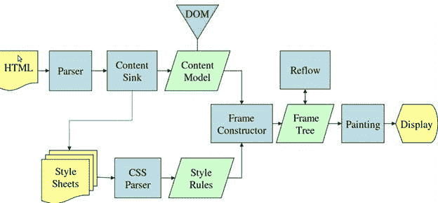
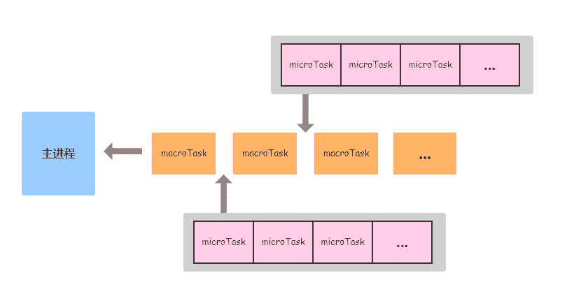

# 第六章 第 2 节 前端进阶-浏览器 2

> 原文：[`www.nowcoder.com/tutorial/10072/c901500f5cb24b4f9bdbd843fc93a00e`](https://www.nowcoder.com/tutorial/10072/c901500f5cb24b4f9bdbd843fc93a00e)

#### 1.8 浏览器如何渲染页面的？

**参考答案**：

**所以可以分析出基本过程：**

​ 1\. HTML 被 HTML 解析器解析成 DOM 树；

​ 2\. CSS 被 CSS 解析器解析成 CSSOM 树；

3.  结合 DOM 树和 CSSOM 树，生成一棵渲染树(Render Tree)，这一过程称为 Attachment；

4.  生成布局(flow)，浏览器在屏幕上“画”出渲染树中的所有节点；

5.  将布局绘制(paint)在屏幕上，显示出整个页面。

    不同的浏览器内核不同，所以渲染过程不太一样。

​ WebKit 主流程

​ Mozilla 的 Gecko 呈现引擎主流程

​ 由上面两张图可以看出，虽然主流浏览器渲染过程叫法有区别，但是主要流程还是相同的。
​ Gecko 将视觉格式化元素组成的树称为“框架树”。每个元素都是一个框架。WebKit 使用的术语是“呈现树”，它 由“呈现对象”组成。对于元素的放置，WebKit 使用的术语是“布局”，而 Gecko 称之为“重排”。对于连接 DOM 节点和可视化信息从而创建呈现树的过程，WebKit 使用的术语是“附加”。

#### 1.9 重绘、重排区别如何避免

**参考答案**：

1.  重排(Reflow)：当渲染树的一部分必须更新并且节点的尺寸发生了变化，浏览器会使渲染树中受到影响的部分失效，并重新构造渲染树。

2.  重绘(Repaint)：是在一个元素的外观被改变所触发的浏览器行为，浏览器会根据元素的新属性重新绘制，使元素呈现新的外观。比如改变某个元素的背景色、文字颜色、边框颜色等等

3.  区别：**重绘不一定需要重排（比如颜色的改变），重排必然导致重绘（比如改变网页位置）**

4.  引发重排

    4.1 添加、删除可见的 dom

    4.2 元素的位置改变

    4.3 元素的尺寸改变(外边距、内边距、边框厚度、宽高、等几何属性)

    4.4 页面渲染初始化

    4.5 浏览器窗口尺寸改变

    4.6 获取某些属性。当获取一些属性时，浏览器为取得正确的值也会触发重排,它会导致队列刷新，这些属性包括：offsetTop、offsetLeft、 offsetWidth、offsetHeight、scrollTop、scrollLeft、scrollWidth、scrollHeight、clientTop、clientLeft、clientWidth、clientHeight、getComputedStyle() (currentStyle in IE)。所以，在多次使用这些值时应进行缓存。

5.  优化：

    浏览器自己的优化：

    浏览器会维护 1 个队列，把所有会引起重排，重绘的操作放入这个队列，等队列中的操作到一定数量或者到了一定时间间隔，浏览器就会 flush 队列，进行一批处理，这样多次重排，重绘变成一次重排重绘

    减少 reflow/repaint：
    （1）不要一条一条地修改 DOM 的样式。可以先定义好 css 的 class，然后修改 DOM 的 className。

    （2）不要把 DOM 结点的属性值放在一个循环里当成循环里的变量。
    （3）为动画的 HTML 元件使用 fixed 或 absoult 的 position，那么修改他们的 CSS 是不会 reflow 的。
    （4）千万不要使用 table 布局。因为可能很小的一个小改动会造成整个 table 的重新布局。(table 及其内部元素除外，它可能需要多次计算才能确定好其在渲染树中节点的属性，通常要花 3 倍于同等元素的时间。这也是为什么我们要避免使用 table 做布局的一个原因。)

    （5）不要在布局信息改变的时候做查询（会导致渲染队列强制刷新）

#### 1.10 事件循环 Event loop

**参考答案**：

​ 主线程从"任务队列"中读取执行事件，这个过程是循环不断的，这个机制被称为事件循环。此机制具体如下:主 线程会不断从任务队列中按顺序取任务执行，每执行完一个任务都会检查 microtask 队列是否为空（执行完一个 任务的具体标志是函数执行栈为空），如果不为空则会一次性执行完所有 microtask。然后再进入下一个循环去 任务队列中取下一个任务执行。

​ **详细步骤**：

​ 1\. 选择当前要执行的宏任务队列，选择一个最先进入任务队列的宏任务，如果没有宏任务可以选择，则会 跳转至 microtask 的执行步骤。

​ 2\. 将事件循环的当前运行宏任务设置为已选择的宏任务。

​ 3\. 运行宏任务。

​ 4\. 将事件循环的当前运行任务设置为 null。

​ 5\. 将运行完的宏任务从宏任务队列中移除。

​ 6\. microtasks 步骤：进入 microtask 检查点。

​ 7\. 更新界面渲染。

​ 8\. 返回第一步。

​ **执行进入 microtask 检查的的具体步骤如下:**

​ 1\. 设置进入 microtask 检查点的标志为 true。

​ 2\. 当事件循环的微任务队列不为空时：选择一个最先进入 microtask 队列的 microtask；设置事件循环的当 前运行任务为已选择的 microtask；运行 microtask；设置事件循环的当前运行任务为 null；将运行结束 的 microtask 从 microtask 队列中移除。

​ 3\. 对于相应事件循环的每个环境设置对象（environment settings object）,通知它们哪些 promise 为 rejected。

​ 4\. 清理 indexedDB 的事务。

​ 5\. 设置进入 microtask 检查点的标志为 false。

​ **需要注意的是:当前执行栈执行完毕时会立刻先处理所有微任务队列中的事件, 然后再去宏任务队列中取出一个 事件。同一次事件循环中, 微任务永远在宏任务之前执行。**

#### 1.11 let a = "sssssss"，分别存在哪儿？

**参考答案**：

​ 使用 let 声明的全局变量不是挂在 window 对象下的，声明的全局变量存在于一个块级作用域中。

​ 具体查看，我们可以通过打印一个全局函数，在 let 声明的全局变量在全局函数的 scope 下，我们平时使用时直接 用变量名称就能访问到

​ 具体位置如下图：
