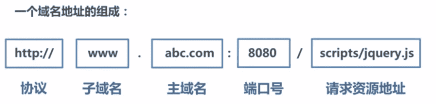

# 第六章 第 8 节 前端进阶-网络传输 1

> 原文：[`www.nowcoder.com/tutorial/10072/7e8c9b19cbf14e1088a7b8a055e396e7`](https://www.nowcoder.com/tutorial/10072/7e8c9b19cbf14e1088a7b8a055e396e7)

#### 5.1 跨域是什么？如何解决跨域？

**参考答案**：

1.什么是同源策略及其限制内容？

同源策略是一种约定，它是浏览器最核心也最基本的安全功能，如果缺少了同源策略，浏览器很容易受到 XSS、CSRF 等攻击。所谓同源是指"协议+域名+端口"三者相同，即便两个不同的域名指向同一个 ip 地址，也非同源。



**同源策略限制内容有：**

*   Cookie、LocalStorage、IndexedDB 等存储性内容
*   DOM 节点
*   AJAX 请求发送后，结果被浏览器拦截了

但是有三个标签是允许跨域加载资源：

*   ``
*   `<link href='xxx'>`
*   `<script src='xxx'>`

跨域并不是请求发不出去，请求能发出去，服务端能收到请求并正常返回结果，只是结果被浏览器拦截了。

2.  跨域解决方案

    解决方案有 jsonp、cors、postMessage、websocket、Node 中间件代理(两次跨域)、nginx 反向代理、window.name + iframe、location.hash + iframe、document.domain + iframe，CORS 支持所有类型的 HTTP 请求，是跨域 HTTP 请求的根本解决方案，JSONP 只支持 GET 请求，JSONP 的优势在于支持老式浏览器，以及可以向不支持 CORS 的网站请求数据。不管是 Node 中间件代理还是 nginx 反向代理，主要是通过同源策略对服务器不加限制。日常工作中，用得比较多的跨域方案是 cors 和 nginx 反向代理

**解析**：

1.jsonp

​ 1) JSONP 原理

​ 利用 `<script>` 标签没有跨域限制的漏洞，网页可以得到从其他来源动态产生的 JSON 数据。JSONP 请求一定 需要对方的服务器做支持才可以。

​ 2) JSONP 优缺点

​ JSONP 优点是简单兼容性好，可用于解决主流浏览器的跨域数据访问的问题。缺点是仅支持 get 方法具有局限性, 不安全可能会遭受 XSS 攻击。

​ 3) JSONP 的实现流程

​ 声明一个回调函数，其函数名(如 show)当做参数值，要传递给跨域请求数据的服务器，函数形参为要获取目 标数据(服务器返回的 data)。

​ 创建一个``标签，把那个跨域的 API 数据接口地址，赋值给 script 的 src,还要在这个地址中向服务器传递该函数 名（可以通过问号传参:?callback=show）。

​ 服务器接收到请求后，需要进行特殊的处理：把传递进来的函数名和它需要给你的数据拼接成一个字符串,例 如：传递进去的函数名是 show，它准备好的数据是`show('我不爱你')`。

​ 最后服务器把准备的数据通过 HTTP 协议返回给客户端，客户端再调用执行之前声明的回调函数（show），对 返回的数据进行操作。

2.  cors

    CORS 需要浏览器和后端同时支持。IE 8 和 9 需要通过 XDomainRequest 来实现。

    浏览器会自动进行 CORS 通信，实现 CORS 通信的关键是后端。只要后端实现了 CORS，就实现了跨域。

    服务端设置 Access-Control-Allow-Origin 就可以开启 CORS。 该属性表示哪些域名可以访问资源，如果设置通配符则表示所有网站都可以访问资源。

3.  postMessage

    postMessage 是 HTML5 XMLHttpRequest Level 2 中的 API，且是为数不多可以跨域操作的 window 属性之一，它可用于解决以下方面的问题：

    *   页面和其打开的新窗口的数据传递
    *   多窗口之间消息传递
    *   页面与嵌套的 iframe 消息传递
    *   上面三个场景的跨域数据传递

    **postMessage()方法允许来自不同源的脚本采用异步方式进行有限的通信，可以实现跨文本档、多窗口、跨域消息传递**。

4.  websocket

    Websocket 是 HTML5 的一个持久化的协议，它实现了浏览器与服务器的全双工通信，同时也是跨域的一种解决方案。WebSocket 和 HTTP 都是应用层协议，都基于 TCP 协议。但是 **WebSocket 是一种双向通信协议，在建立连接之后，WebSocket 的 server 与 client 都能主动向对方发送或接收数据**。同时，WebSocket 在建立连接时需要借助 HTTP 协议，连接建立好了之后 client 与 server 之间的双向通信就与 HTTP 无关了。

    原生 WebSocket API 使用起来不太方便，我们使用`Socket.io`，它很好地封装了 webSocket 接口，提供了更简单、灵活的接口，也对不支持 webSocket 的浏览器提供了向下兼容

5.  Node 中间件代理(两次跨域)

    实现原理：**同源策略是浏览器需要遵循的标准，而如果是服务器向服务器请求就无需遵循同源策略。** 代理服务器，需要做以下几个步骤：

    *   接受客户端请求 。
    *   将请求 转发给服务器。
    *   拿到服务器 响应 数据。
    *   将 响应 转发给客户端。
6.  nginx 反向代理

    实现原理类似于 Node 中间件代理，需要你搭建一个中转 nginx 服务器，用于转发请求。

    使用 nginx 反向代理实现跨域，是最简单的跨域方式。只需要修改 nginx 的配置即可解决跨域问题，支持所有浏览器，支持 session，不需要修改任何代码，并且不会影响服务器性能。

    实现思路：通过 nginx 配置一个代理服务器（域名与 domain1 相同，端口不同）做跳板机，反向代理访问 domain2 接口，并且可以顺便修改 cookie 中 domain 信息，方便当前域 cookie 写入，实现跨域登录。

7.  window.name + iframe

    window.name 属性的独特之处：name 值在不同的页面（甚至不同域名）加载后依旧存在，并且可以支持非常长的 name 值（2MB）。

    总结：通过 iframe 的 src 属性由外域转向本地域，跨域数据即由 iframe 的 window.name 从外域传递到本地域。这个就巧妙地绕过了浏览器的跨域访问限制，但同时它又是安全操作。

8.  location.hash + iframe

    实现原理： a.html 欲与 c.html 跨域相互通信，通过中间页 b.html 来实现。 三个页面，不同域之间利用 iframe 的 location.hash 传值，相同域之间直接 js 访问来通信。

    具体实现步骤：一开始 a.html 给 c.html 传一个 hash 值，然后 c.html 收到 hash 值后，再把 hash 值传递给 b.html，最后 b.html 将结果放到 a.html 的 hash 值中。 同样的，a.html 和 b.html 是同域的，都是`http://localhost:3000`;而 c.html 是`http://localhost:4000`

9.  document.domain + iframe

    **该方式只能用于二级域名相同的情况下，比如 `a.test.com` 和 `b.test.com` 适用于该方式**。 只需要给页面添加 `document.domain ='test.com'` 表示二级域名都相同就可以实现跨域。

    实现原理：两个页面都通过 js 强制设置 document.domain 为基础主域，就实现了同域。

#### 5.2 jsonp 原理

**参考答案**：

​ 利用 `<script>` 标签没有跨域限制的漏洞，网页可以得到从其他来源动态产生的 JSON 数据。JSONP 请求一定 需要对方的服务器做支持才可以。

**解析**：

1.  JSONP 和 AJAX 对比

    JSONP 和 AJAX 相同，都是客户端向服务器端发送请求，从服务器端获取数据的方式。但 AJAX 属于同源策略，JSONP 属于非同源策略（跨域请求）

2.  JSONP 优缺点

    JSONP 优点是简单兼容性好，可用于解决主流浏览器的跨域数据访问的问题。**缺点是仅支持 get 方法具有局限性,不安全可能会遭受 XSS 攻击。**

3.  JSONP 的实现流程

*   声明一个回调函数，其函数名(如 show)当做参数值，要传递给跨域请求数据的服务器，函数形参为要获取目标数据(服务器返回的 data)。

*   创建一个``标签，把那个跨域的 API 数据接口地址，赋值给 script 的 src,还要在这个地址中向服务器传递该函数名（可以通过问号传参:?callback=show）。

*   服务器接收到请求后，需要进行特殊的处理：把传递进来的函数名和它需要给你的数据拼接成一个字符串,例如：传递进去的函数名是 show，它准备好的数据是`show('我不爱你')`。

*   最后服务器把准备的数据通过 HTTP 协议返回给客户端，客户端再调用执行之前声明的回调函数（show），对返回的数据进行操作。

    在开发中可能会遇到多个 JSONP 请求的回调函数名是相同的，这时候就需要自己封装一个 JSONP 函数。

```cpp
// index.html
function jsonp({ url, params, callback }) {
  return new Promise((resolve, reject) => {
    let script = document.createElement('script')
    window[callback] = function(data) {
      resolve(data)
      document.body.removeChild(script)
    }
    params = { ...params, callback } // wd=b&callback=show
    let arrs = []
    for (let key in params) {
      arrs.push(`${key}=${params[key]}`)
    }
    script.src = `${url}?${arrs.join('&')}`
    document.body.appendChild(script)
  })
}
jsonp({
  url: 'http://localhost:3000/say',
  params: { wd: 'Iloveyou' },
  callback: 'show'
}).then(data => {
  console.log(data)
})
复制代码
```

上面这段代码相当于向`http://localhost:3000/say?wd=Iloveyou&callback=show`这个地址请求数据，然后后台返回`show('我不爱你')`，最后会运行 show()这个函数，打印出'我不爱你'

```cpp
// server.js
let express = require('express')
let app = express()
app.get('/say', function(req, res) {
  let { wd, callback } = req.query
  console.log(wd) // Iloveyou
  console.log(callback) // show
  res.end(`${callback}('我不爱你')`)
})
app.listen(3000)
复制代码
```

4.  jQuery 的 jsonp 形式

    **JSONP 都是 GET 和异步请求的，不存在其他的请求方式和同步请求，且 jQuery 默认就会给 JSONP 的请求清除缓存。**

```cpp
$.ajax({
url:"http://crossdomain.com/jsonServerResponse",
dataType:"jsonp",
type:"get",//可以省略
jsonpCallback:"show",//->自定义传递给服务器的函数名，而不是使用 jQuery 自动生成的，可省略
jsonp:"callback",//->把传递函数名的那个形参 callback，可省略
success:function (data){
console.log(data);}
});
```

#### 5.3 解决跨域问题，websocket 的原理

**参考答案**：

Websocket 是 HTML5 的一个持久化的协议，它实现了浏览器与服务器的全双工通信，同时也是跨域的一种解决方案。WebSocket 和 HTTP 都是应用层协议，都基于 TCP 协议。但是 **WebSocket 是一种双向通信协议，在建立连接之后，WebSocket 的 server 与 client 都能主动向对方发送或接收数据**。同时，WebSocket 在建立连接时需要借助 HTTP 协议，连接建立好了之后 client 与 server 之间的双向通信就与 HTTP 无关了。

原生 WebSocket API 使用起来不太方便，我们使用`Socket.io`，它很好地封装了 webSocket 接口，提供了更简单、灵活的接口，也对不支持 webSocket 的浏览器提供了向下兼容。

我们先来看个例子：本地文件 socket.html 向`localhost:3000`发生数据和接受数据

```cpp
// socket.html
<script>
    let socket = new WebSocket('ws://localhost:3000');
    socket.onopen = function () {
      socket.send('我爱你');//向服务器发送数据
    }
    socket.onmessage = function (e) {
      console.log(e.data);//接收服务器返回的数据
    }
</script>
```

```cpp
// server.js
let express = require('express');
let app = express();
let WebSocket = require('ws');//记得安装 ws
let wss = new WebSocket.Server({port:3000});
wss.on('connection',function(ws) {
  ws.on('message', function (data) {
    console.log(data);
    ws.send('我不爱你')
  });
})
```