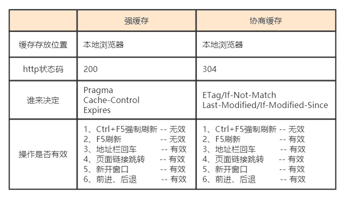

# 第六章 第 12 节 前端进阶-网络传输 5

> 原文：[`www.nowcoder.com/tutorial/10072/aebf97654c7345d181fc0a0f313671c9`](https://www.nowcoder.com/tutorial/10072/aebf97654c7345d181fc0a0f313671c9)

#### 5.21 手写 jsonp

**参考答案**：

实现步骤：

1.  创建 script 元素，设置 src 属性，并插入文档中，同时触发 AJAX 请求。
2.  返回 Promise 对象，then 函数才行继续，回调函数中进行数据处理
3.  script 元素删除清理

```cpp
<!DOCTYPE html>
<html lang="en">

<head>
  <meta charset="UTF-8">
  <meta name="viewport" content="width=device-width, initial-scale=1.0">
  <meta http-equiv="X-UA-Compatible" content="ie=edge">
  <title>Document</title>
</head>

<body>

  <script>
    /**
     * 手写 jsonp 并返回 Promise 对象
     * 参数 url，data:json 对象，callback 函数
     */
    function jsonp(url, data = {}, callback = 'callback') {
      // 处理 json 对象，拼接 url
      data.callback = callback
      let params = []
      for (let key in data) {
        params.push(key + '=' + data[key])
      }
      console.log(params.join('&'))
      // 创建 script 元素
      let script = document.createElement('script')
      script.src = url + '?' + params.join('&')
      document.body.appendChild(script)
      // 返回 promise
      return new Promise((resolve, reject) => {
        window[callback] = (data) => {
          try {
            resolve(data)
          } catch (e) {
            reject(e)
          } finally {
            // 移除 script 元素
            script.parentNode.removeChild(script)
            console.log(script)
          }
        }
      })

    }
    jsonp('http://photo.sina.cn/aj/index', {
      page: 1,
      cate: 'recommend'
    }, 'jsoncallback').then(data => {
      console.log(data)
    })
  </script>
</body>

</html>
```

#### 5.22 DNS 是什么

**参考答案**：

DNS（Domain Name Server，域名服务器）是进行域名(domain name)和与之相对应的 IP 地址 (IP address)转换的服务器。DNS 中保存了一张域名(domain name)和与之相对应的 IP 地址 (IP address)的表，以解析消息的域名。 域名是 Internet 上某一台计算机或计算机组的名称，用于在数据传输时标识计算机的电子方位（有时也指地理位置）。域名是由一串用点分隔的名字组成的，通常包含组织名，而且始终包括两到三个字母的后缀，以指明组织的类型或该域所在的国家或地区。

#### 5.23 OSI 的应用层

**参考答案**：

应用层（Application layer）是最接近用户的，应用层是给各种应用程序提供对应的网络服务的，而网络服务是由各种应用层的协议支持的。网络服务和对应的协议举几个例子：文件传输是由 FTP 协议支持的，浏览器打开网页是由 HTTP 或者 HTTPS 协议支持的，电子邮件是由 SMTP 协议支持的，远程终端登录是由 Telnet 协议（远程登录协议）支持的。

#### 5.24 域名解析原理

**参考答案**：

DNS 是应用层协议，事实上他是为其他应用层协议工作的，包括不限于 HTTP 和 SMTP 以及 FTP，用于将用户提供的主机名解析为 ip 地址。
具体过程如下：

1.  客户机提出域名解析请求 , 并将该请求发送给本地的域名服务器 ;
2.  当本地的域名服务器收到请求后 , 就先查询本地的缓存 , 如果有该纪录项 , 则本地的域名服务器就直接把查询的结果返回 ;
3.  如果本地的缓存中没有该纪录 , 则本地域名服务器就直接把请求发给根域名服务器 , 然后根域名服务器再返回给本地域名服务器一个所查询域 (根的子域) 的主域名服务器的地址 ;
4.  本地服务器再向上一步返回的域名服务器发送请求 , 然后接受请求的服务器查询自己的缓存 , 如果没有该纪录 , 则返回相关的下级的域名服务器的地址 ;
5.  重复第四步 , 直到找到正确的纪录 ;
6.  本地域名服务器把返回的结果保存到缓存 , 以备下一次使用 , 同时还将结果返回给客户机 ;

#### 5.25 http 缓存有几种？

**参考答案**：

**http 缓存的分类：**
根据是否需要重新向服务器发起请求来分类，可分为(强制缓存，协商缓存) 根据是否可以被单个或者多个用户使用来分类，可分为(私有缓存，共享缓存) 强制缓存如果生效，不需要再和服务器发生交互，而协商缓存不管是否生效，都需要与服务端发生交互。下面是强制缓存和协商缓存的一些对比：


**1.1、强制缓存**
强制缓存在缓存数据未失效的情况下（即 Cache-Control 的 max-age 没有过期或者 Expires 的缓存时间没有过期），那么就会直接使用浏览器的缓存数据，不会再向服务器发送任何请求。强制缓存生效时，http 状态码为 200。这种方式页面的加载速度是最快的，性能也是很好的，但是在这期间，如果服务器端的资源修改了，页面上是拿不到的，因为它不会再向服务器发请求了。这种情况就是我们在开发种经常遇到的，比如你修改了页面上的某个样式，在页面上刷新了但没有生效，因为走的是强缓存，所以 Ctrl + F5 一顿操作之后就好了。 跟强制缓存相关的 header 头属性有（Pragma/Cache-Control/Expires）， Pragma 和 Cache-control 共存时，Pragma 的优先级是比 Cache-Control 高的。

**1.2、协商缓存**
当第一次请求时服务器返回的响应头中没有 Cache-Control 和 Expires 或者 Cache-Control 和 Expires 过期还或者它的属性设置为 no-cache 时(即不走强缓存)，那么浏览器第二次请求时就会与服务器进行协商，与服务器端对比判断资源是否进行了修改更新。如果服务器端的资源没有修改，那么就会返回 304 状态码，告诉浏览器可以使用缓存中的数据，这样就减少了服务器的数据传输压力。如果数据有更新就会返回 200 状态码，服务器就会返回更新后的资源并且将缓存信息一起返回。跟协商缓存相关的 header 头属性有（ETag/If-Not-Match 、Last-Modified/If-Modified-Since）请求头和响应头需要成对出现

**1.3、私有缓存（浏览器级缓存）**
私有缓存只能用于单独的用户：Cache-Control: Private

**1.4、共享缓存（代理级缓存）**
共享缓存可以被多个用户使用: Cache-Control: Public

#### 5.26 协商缓存原理，谁跟谁协商，如何协商？

**参考答案**：

协商缓存: 向服务器发送请求，服务器会根据这个请求的 request header 的一些参数来判断是否命中协商缓存，如果命中，则返回 304 状态码并带上新的 response header 通知浏览器从缓存中读取资源；

服务器和请求协商，根据请求头携带的参数进行协商

#### 5.27 GET 和 POST 区别

**参考答案**：

1.  get 用来获取数据，post 用来提交数据
2.  get 参数有长度限制（受限于 url 长度，具体的数值取决于浏览器和服务器的限制，最长 2048 字节），而 post 无限制
3.  get 请求的数据会附加在 url 之 ，以 " ？ "分割 url 和传输数据，多个参数用 "&"连接，而 post 请求会把请求的数据放在 http 请求体中。
4.  get 是明文传输，post 是放在请求体中，但是开发者可以通过抓包工具看到，也相当于是明文的。
5.  get 请求会保存在浏览器历史记录中，还可能保存在 web 服务器的日志中

#### 5.28 实现 ajax 的封装

**参考答案**：

```cpp
/*
 * ajax
 * type === GET: data 格式 name=baukh&age=29
 * type === POST: data 格式 { name: 'baukh', age:29 }
 * 与 jquery 不同的是,[success, error, complete]返回的第二个参数, 并不是返回错误信息, 而是错误码
 * */
var extend = require('./extend');
var utilities = require('./utilities');
function ajax(options) {
    var defaults = {
        url: null,// 请求地址
        type: 'GET',// 请求类型
        data: null,// 传递数据
        headers: {},// 请求头信息
        async: true,// 是否异步执行
        beforeSend: utilities.noop,// 请求发送前执行事件
        complete: utilities.noop,// 请求发送后执行事件
        success: utilities.noop,// 请求成功后执行事件
        error: utilities.noop// 请求失败后执行事件
    };
    options = extend(defaults, options);
    if (!options.url) {
        utilities.error('jTool ajax: url 不能为空');
        return;
    }
    var xhr = new XMLHttpRequest();
    var formData = '';
    if (utilities.type(options.data) === 'object') {
        utilities.each(options.data, function (key, value) {
        if(formData !== '') {
            formData += '&';
        }
        formData += key + '=' + value;
        });
    }else {
        formData = options.data;
    }
    if(options.type === 'GET' && formData) {
        options.url = options.url + (options.url.indexOf('?') === -1 ?  '?' : '&') + formData;
        formData = null;
    }
    xhr.open(options.type, options.url, options.async);
    for (var key in options.headers) {
        xhr.setRequestHeader(key, options.headers[key]);
    }
    // xhr.setRequestHeader("Content-Type","application/x-www-form-urlencoded");
    // 执行发送前事件
    options.beforeSend(xhr);
    // 监听 onload 并执行完成事件
    xhr.onload = function() {
        // jquery complete(XHR, TS)
        options.complete(xhr, xhr.status);
    };
    // 监听 onreadystatechange 并执行成功失败事件
    xhr.onreadystatechange = function() {
        if (xhr.readyState !== 4) {
            return;
        }
        if (xhr.status >= 200 && xhr.status < 300 || xhr.status === 304) {
            // jquery success(XHR, TS)
            options.success(xhr.response, xhr.status);
        } else {
        // jquery error(XHR, TS, statusText)
            options.error(xhr, xhr.status, xhr.statusText);
        }
    };
    xhr.send(formData);
}
function post(url, data, callback) {
    ajax({ url: url, type: 'POST', data: data, success: callback });
}
function get(url, data, callback) {
    ajax({ url: url, type: 'GET', data: data, success: callback });
}
module.exports = {
    ajax: ajax,
    post: post,
    get: get
};

```