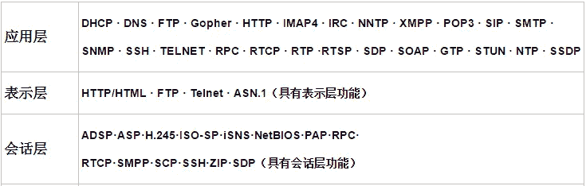
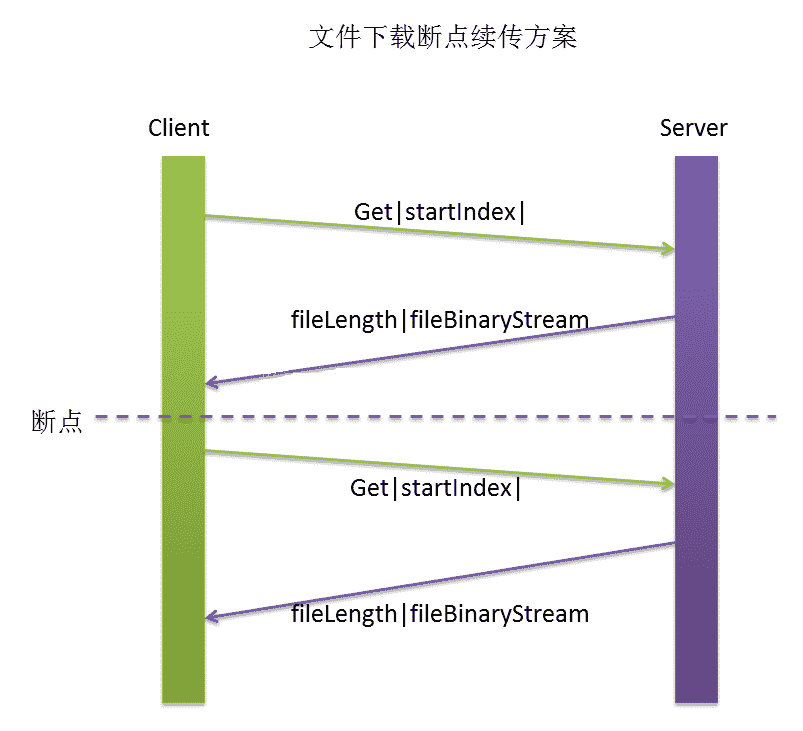

# 第六章 第 13 节 前端进阶-网络传输 6

> 原文：[`www.nowcoder.com/tutorial/10072/ce57423454564465a5a0562d07e0a0ce`](https://www.nowcoder.com/tutorial/10072/ce57423454564465a5a0562d07e0a0ce)

#### 5.29 OSI 七层协议

**参考答案**：

**OSI**（Open System Interconnect），即开放式系统互联。 一般都叫 OSI 参考模型，是 ISO（国际标准化组织）组织在 1985 年研究的网络互连模型。ISO 为了更好的使网络应用更为普及，推出了 OSI 参考模型。其含义就是推荐所有公司使用这个规范来控制网络。这样所有公司都有相同的规范，就能互联了。
**OSI 定义了网络互连的七层框架**（物理层、数据链路层、网络层、传输层、会话层、表示层、应用层），即 ISO 开放互连系统参考模型。

**1.应用层**

作用：它是与其他计算机进行通信的应用，它是对应应用程序的通信服务的。各种应用软件，包括 web 应用。

协议：DNS、FTP、HTTP、SMTP、TELNET、IRC、WHOIS

**2.表示层**

作用：这一层的主要作用是定义数据格式和加密。

**3.会话层**

作用：控制应用程序的会话能力，它定义了一段会话的开始、控制和结束，包括对多个双向消息的控制和管理，以便在只完成一部分消息时可以通知应用。

> PS：其实在应用层、表示层、会话层这三层中，协议是可以共用的

**4.传输层**

作用：对差错恢复协议和无差错恢复协议的选择，对同一主机上不同数据流的输入进行复用，对数据包进行重新排序。是最关键的一层，是唯一负责整体的数据传输和数据控制的。对上三层提供可靠的传输服务，对网络层提供可靠的目的地信息。在这一层数据的单位被称为数据段。

协议：TCP、UDP 等

**5.网络层**

作用：主要负责寻找地址和路由选择，网络层还可以实现阻塞控制、网际互联等。

协议：IP、IPX、RIP、OSPF 等

**6.数据链路层**

作用：负责物理层面上的互联的、节点间的通信传输；该层的作用包括：物理地址寻址、数据的成帧、流量控制、数据的检错、重发等。在这一层，数据的单位称为帧（frame）

协议：ARP、RARP、SDLC、HDLC、PPP、STP、帧中继等

**7.物理层**

作用：负责 0、1 比特流（0/1 序列）与电压的高低、逛的闪灭之间的转换 规定了激活、维持、关闭通信端点之间的机械特性、电气特性、功能特性以及过程特性；该层为上层协议提供了一个传输数据的物理媒体。在这一层，数据的单位称为比特（bit）。

典型规范：EIA/TIA RS-232、EIA/TIA RS-449、V.35、RJ-45、fddi 令牌环网等

#### 5.30 怎么用 UDP 实现可靠传输，两条连接

**参考答案**：

最简单的方式是在应用层模仿传输层 TCP 的可靠性传输。下面不考虑拥塞处理，可靠 UDP 的简单设计。

*   1、添加 seq/ack 机制，确保数据发送到对端
*   2、添加发送和接收缓冲区，主要是用户超时重传。
*   3、添加超时重传机制。

详细说明：送端发送数据时，生成一个随机 seq=x，然后每一片按照数据大小分配 seq。数据到达接收端后接收端放入缓存，并发送一个 ack=x 的包，表示对方已经收到了数据。发送端收到了 ack 包后，删除缓冲区对应的数据。时间到后，定时任务检查是否需要重传数据。

目前有如下开源程序利用 udp 实现了可靠的数据传输。分别为***RUDP、RTP、UDT\***。

1、RUDP（Reliable User Datagram Protocol）

***RUDP 提供一组数据服务质量增强机制，如拥塞控制的改进、重发机制及淡化服务器算法等\***，从而在包丢失和网络拥塞的情况下， RTP 客户机（实时位置）面前呈现的就是一个高质量的 RTP 流。在不干扰协议的实时特性的同时，可靠 UDP 的拥塞控制机制允许 TCP 方式下的流控制行为。

2、RTP（Real Time Protocol）

***RTP 为数据提供了具有实时特征的端对端传送服务\***，如在组播或单播网络服务下的交互式视频音频或模拟数据。

应用程序通常在 UDP 上运行 RTP 以便使用其多路结点和校验服务；这两种协议都提供了传输层协议的功能。但是 RTP 可以与其它适合的底层网络或传输协议一起使用。如果底层网络提供组播方式，那么 RTP 可以使用该组播表传输数据到多个目的地。

RTP 本身并没有提供按时发送机制或其它服务质量（QoS）保证，它依赖于底层服务去实现这一过程。 RTP 并不保证传送或防止无序传送，也不确定底层网络的可靠性。 RTP 实行有序传送， RTP 中的序列号允许接收方重组发送方的包序列，同时序列号也能用于决定适当的包位置，例如：在视频解码中，就不需要顺序解码。

3、UDT（UDP-based Data Transfer Protocol）

基于 UDP 的数据传输协议（UDP-basedData Transfer Protocol，简称 UDT）是一种互联网数据传输协议。***UDT 的主要目的是支持高速广域网上的海量数据传输\***，而互联网上的标准数据传输协议 TCP 在高带宽长距离网络上性能很差。

顾名思义，UDT 建于 UDP 之上，并引入新的拥塞控制和数据可靠性控制机制。UDT 是面向连接的双向的应用层协议。它同时支持可靠的数据流传输和部分可靠的数据报传输。由于 UDT 完全在 UDP 上实现，它也可以应用在除了高速数据传输之外的其它应用领域，例如点到点技术（P2P），防火墙穿透，多媒体数据传输等等。

#### 5.31 数据量很大的时候 UDP 怎么可靠传输

**参考答案**：

基于 UDP 的数据传输协议（UDP-basedData Transfer Protocol，简称 UDT）是一种互联网数据传输协议。***UDT 的主要目的是支持高速广域网上的海量数据传输\***，而互联网上的标准数据传输协议 TCP 在高带宽长距离网络上性能很差。

顾名思义，UDT 建于 UDP 之上，并引入新的拥塞控制和数据可靠性控制机制。UDT 是面向连接的双向的应用层协议。它同时支持可靠的数据流传输和部分可靠的数据报传输。由于 UDT 完全在 UDP 上实现，它也可以应用在除了高速数据传输之外的其它应用领域，例如点到点技术（P2P），防火墙穿透，多媒体数据传输等等。

#### 5.32 TCP 断点重传怎么实现的

**参考答案**:

断点续传的关键是断点，所以在制定传输协议的时候要设计好，如下图，我自定义了一个交互协议，每次下载请求都会带上下载的起始点，这样就可以支持从断点下载了，其实 HTTP 里的断点续传也是这个原理，在 HTTP 的头里有个可选的字段 RANGE，表示下载的范围

#### 5.33 http 多个 tcp 连接怎么实现的？

**参考答案**：

某些服务器对 Connection: keep-alive 的 Header 进行了支持。意思是说，完成这个 HTTP 请求之后，不要断开 HTTP 请求使用的 TCP 连接。这样的好处是连接可以被重新使用，之后发送 HTTP 请求的时候不需要重新建立 TCP 连接，以及如果维持连接，那么 SSL 的开销也可以避免