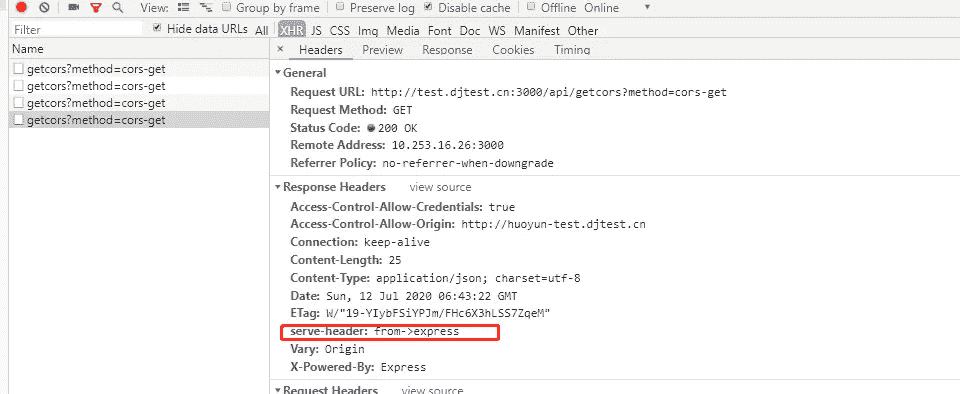
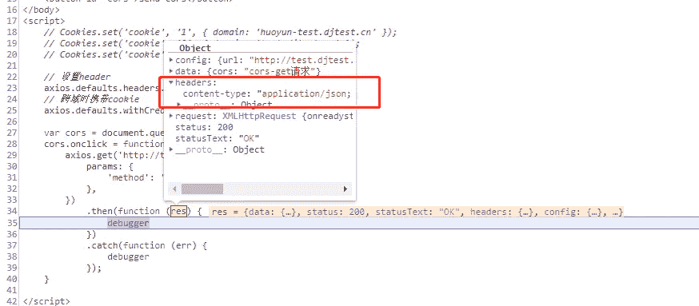

# 第六章 第 14 节 前端进阶-网络传输 7

> 原文：[`www.nowcoder.com/tutorial/10072/72bb7bad88b34506a549e89a8b1e15cc`](https://www.nowcoder.com/tutorial/10072/72bb7bad88b34506a549e89a8b1e15cc)

#### 5.34 keep-alive 是什么？

**参考答案**：

**什么是 KeepAlive**

*   KeepAlive 可以简单理解为一种状态保持或重用机制，比如当一条连接建立后，我们不想它立刻被关闭，如果实现了 KeepAlive 机制，就可以通过它来实现连接的保持
*   HTTP 的 KeepAlive 在 HTTP 1.0 版本默认是关闭的，但在 HTTP1.1 是默认开启的；操作系统里 TCP 的 KeepAlive 默认也是关闭，但一般应用都会修改设置来开启。因此网上 TCP 流量中基于 KeepAlive 的是主流
*   HTTP 的 KeepAlive 和 TCP 的 KeepAlive 有一定的依赖关系，名称又一样，因此经常被混淆，但其实是不同的东西，下面具体分析一下

**TCP 为什么要做 KeepAlive**

*   我们都知道 TCP 的三次握手和四次挥手。当两端通过三次握手建立 TCP 连接后，就可以传输数据了，数据传输完毕，连接并不会自动关闭，而是一直保持。只有两端分别通过发送各自的 `FIN` 报文时，才会关闭自己侧的连接。

*   这个关闭机制看起来简单明了，但实际网络环境千变万化，衍生出了各种问题。假设因为实现缺陷、突然崩溃、恶意攻击或网络丢包等原因，一方一直没有发送 `FIN` 报文，则连接会一直保持并消耗着资源，为了防止这种情况，一般接收方都会主动中断一段时间没有数据传输的 TCP 连接，比如 LVS 会默认中断 90 秒内没有数据传输的 TCP 连接，F5 会中断 5 分钟内没有数据传输的 TCP 连接

*   但有的时候我们的确不希望中断空闲的 TCP 连接，因为建立一次 TCP 连接需要经过一到两次的网络交互，且由于 TCP 的 `slow start` 机制，新的 TCP 连接开始数据传输速度是比较慢的，我们希望通过连接池模式，保持一部分空闲连接，当需要传输数据时，可以从连接池中直接拿一个空闲的 TCP 连接来全速使用，这样对性能有很大提升

*   为了支持这种情况，TCP 实现了 KeepAlive 机制。KeepAlive 机制并不是 TCP 规范的一部分，但无论 Linux 和 Windows 都实现实现了该机制。TCP 实现里 KeepAlive 默认都是关闭的，且是每个连接单独设置的，而不是全局设置

*   另外有一个特殊情况就是，当某应用进程关闭后，如果还有该进程相关的 TCP 连接，一般来说操作系统会自动关闭这些连接

#### 5.35 tcp/ip 协议栈、网络模型

**参考答案**:

TCP/IP 协议栈是一系列网络协议的总和，是构成网络通信的核心骨架，它定义了电子设备如何连入因特网，以及数据如何在它们之间进行传输。TCP/IP 协议采用 4 层结构，分别是**应用层、传输层、网络层和链路层**，

*   **链路层**：对 0 和 1 进行分组，定义数据帧，确认主机的物理地址，传输数据；
*   **网络层**：定义 IP 地址，确认主机所在的网络位置，并通过 IP 进行 MAC 寻址，对外网数据包进行路由转发；
*   **传输层**：定义端口，确认主机上应用程序的身份，并将数据包交给对应的应用程序；
*   **应用层**：定义数据格式，并按照对应的格式解读数据。

#### 5.36 504 如何排查

**参考答案**：

排查步骤：

1.  检查 500/502/504 错误截图，判断是负载均衡问题，高防/安全网络配置问题，还是后端 ECS 配置问题。
2.  如果有高防/安全网络，请确认高防/安全网络的七层转发配置正确。
3.  请确认是所有客户端都有问题，还仅仅是部分客户端有问题。如果仅仅是部分客户端问题，排查该客户端是否被云盾阻挡，或者负载均衡域名或者 IP 是否被 ISP 运营商拦截。
4.  检查负载均衡状态，是否有后端 ECS 健康检查失败的情况，如果有健康检查失败，解决健康检查失败问题。
5.  在客户端用 hosts 文件将负载均衡的服务地址绑定到后端服务器的 IP 地址上，确认是否是后端问题。如果 5XX 错误间断发生，很可能是后端某一台 ECS 服务器的配置问题。
6.  尝试将七层负载均衡切换为四层负载均衡，查看问题是否会复现。
7.  检查后端 ECS 服务器是否存在 CPU、内存、磁盘或网络等性能瓶颈。
8.  如果确认是后端服务器问题，请检查后端 ECS Web 服务器日志是否有相关错误，Web 服务是否正常运行，确认 Web 访问逻辑是否有问题，卸载服务器上杀毒软件重启测试。
9.  检查后端 ECS Linux 操作系统的 TCP 内核参数是否配置正确。

#### 5.37 tcp 是如何确保有效传输的，拥塞控制

**参考答案**：

通过以下 7 种方式确保有效传输

*   校验和
*   序列号
*   确认应答
*   超时重传
*   连接管理
*   流量控制
*   拥塞控制

**TCP 拥塞控制**

TCP 不仅可以可以控制端到端的数据传输，还可以对网络上的传输进行监控。这使得 TCP 非常强大智能，它会根据网络情况来调整自己的收发速度。网络顺畅时就可以发的快，拥塞时就发的相对慢一些。拥塞控制算法主要有四种：**慢启动，拥塞避免，快速重传，快速恢复。**

*   慢启动和拥塞避免
    慢启动和拥塞避免算法必须被 TCP 发送端用来控制正在向网络输送的数据量。为了
    实现这些算法，必须向 TCP 每连接状态加入两个参量。拥塞窗口（cwnd）是对发送端收到确
    认（ACK）之前能向网络传送的最大数据量的一个发送端限制，接收端通知窗口（rwnd）是对
    未完成数据量的接收端限制。cwnd 和 rwnd 的最小值决定了数据传送。
    另一个状态参量，慢启动阀值（ssthresh），被用来确定是用慢启动还是用拥塞避免
    算法来控制数据传送。
    在不清楚环境的情况下向网络传送数据，要求 TCP 缓慢地探测网络以确定可用流量，避免突然传送大量数据而使网络拥塞。在开始慢启动时 cwnd 为 1，每收到一个用于确认新数据的 ACK 至多增加 SMSS（SENDER MAXIMUM SEGMENT SIZE）字节。
    慢启动算法在 cwndssthresh 时使用。当 cwnd 和 ssthresh 相等时，发送端既可以使用慢启动也可以使用拥塞避免。
    当拥塞发生时，ssthresh 被设置为当前窗口大小的一半（cwnd 和接收方通告窗口大小的最小值，但最少为 2 个报文段）。如果是超时重传，cwnd 被设置为 1 个报文段（这就是慢启动，其实慢启动也不慢，它是指数性增长，只是它的起始比较低）当达到 ssthresh 时，进入拥塞避免算法（拥塞避免是线性增长）。

*   快速重传和快速恢复
    当接收端收到一个顺序混乱的数据，它应该立刻回复一个重复的 ACK。这个 ACK 的目的是通知发送端收到了一个顺序紊乱的数据段，以及期望的序列号。发送端收到这个重复的 ACK 可能有多种原因，可能丢失或者是网络对数据重新排序等。在收到三个重复 ACK 之后（包含第一次收到的一共四个同样的 ACK），TCP 不等重传定时器超时就重传看起来已经丢失（可能数据绕路并没有丢失）的数据段。因为这个在网络上并没有超时重传那么恶劣，所以不会进入慢启动，**而进入快速恢复**。快速恢复首先会把 ssthresh 减半(一般还会四舍五入到数据段的倍数)，然后 cwnd=ssthresh+收到重复 ACK 报文段累计的大小。

#### 5.38 CDN

**参考答案**：

 CDN 的全称是 Content Delivery Network，即内容分发网络。其目的是通过在现有的 internet 中增加一层新的网络架构，将网站的内容发布到最接近用户的网络边缘，使用户可以就近取得所需的内容，提高用户访问网站的响应速度。CDN 有别于镜像，因为它比镜像更智能，或者可以做这样一个比喻：CDN=更智能的镜像+缓存+流量导流。因而，CDN 可以明显提高 Internet 网络中信息流动的效率。从技术上全面解决由于网络带宽小、用户访问量大、网点分布不均等问题，提高用户访问网站的响应速度。

#### 5.39 xhr 的 readyState

**参考答案**：

readyState 是 XMLHttpRequest 对象的一个属性，用来标识当前 XMLHttpRequest 对象处于什么状态。
readyState 总共有 5 个状态值，分别为 0~4，每个值代表了不同的含义

0：初始化，XMLHttpRequest 对象还没有完成初始化

1：载入，XMLHttpRequest 对象开始发送请求

2：载入完成，XMLHttpRequest 对象的请求发送完成

3：解析，XMLHttpRequest 对象开始读取服务器的响应

4：完成，XMLHttpRequest 对象读取服务器响应结束

#### 5.40 CORS 的 Expose-Headers

**参考答案**：

Access-Control-Expose-Headers

作用：允许浏览器端能够获取相应的 header 值

如果服务端接口设置了响应头字段`res.setHeader('serve-header','from->express');` 但是 CORS 中对应的字段 Access-Control-Expose-Headers 并没有处理，此时通过请求响应后的 header 结果如下：

可以看到虽然响应头里面有`serve-header`字段，但是却获取不到， 如果设置了 `Access-Control-Allow-Headers: serve-header`再来看下结果

此时则可以拿到服务端设置的响应头里面的`serve-header`字段了