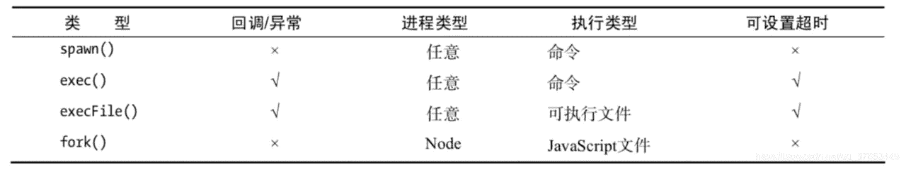

# 第六章 第 19 节 前端进阶-node2

> 原文：[`www.nowcoder.com/tutorial/10072/3b67374ea8b84a0cacaa0f10db3e6fa5`](https://www.nowcoder.com/tutorial/10072/3b67374ea8b84a0cacaa0f10db3e6fa5)

#### 6.3 node.js 中 require('xxx') 是从哪里导入的

**参考答案**：

require 函数可以导入模块、JSON 文件、本地文件。模块可以通过一个相对路径从 node_modules、本地模块、JSON 文件中导出，该路径将针对 __dirname 变量（如果已定义）或者当前工作目录。

#### 6.4 node.js 中 事件循环 和 浏览器事件循环的区别

**参考答案**：

1.  **任务队列**

**浏览器环境**

浏览器环境下的 **异步任务** 分为 **宏任务(macroTask)** 和 **微任务(microTask)**：

*   **宏任务(macroTask)**：script 中代码、setTimeout、setInterval、I/O、UI render；
*   **微任务(microTask)**： Promise、Object.observe、MutationObserver。

当满足执行条件时，**宏任务(macroTask)** 和 **微任务(microTask)** 会各自被放入对应的队列：**宏队列(Macrotask Queue)** 和 **微队列(Microtask Queue)** 中等待执行。

**Node** 环境

在 Node 环境中 **任务类型** 相对就比浏览器环境下要复杂一些：

*   **microTask**：微任务；
*   **nextTick**：`process.nextTick`；
*   **timers**：执行满足条件的 setTimeout 、setInterval 回调；
*   **I/O callbacks**：是否有已完成的 I/O 操作的回调函数，来自上一轮的 poll 残留；
*   **poll**：等待还没完成的 I/O 事件，会因 **timers** 和超时时间等结束等待；
*   **check**：执行 setImmediate 的回调；
*   **close callbacks**：关闭所有的 closing handles ，一些 onclose 事件；
*   idle/prepare 等等：可忽略。

因此，也就产生了执行事件循环相应的任务队列 **Timers Queue**、**I/O Queue**、**Check Queue** 和 **Close Queue**。

**2.执行过程**

**浏览器环境**

先执行``中的同步任务，然后所有微任务，一个宏任务，所有微任务，一个宏任务......

*   1.  执行完主执行线程中的任务；
*   1.  取出 **Microtask Queue** 中任务执行直到清空；
*   1.  取出 **Macrotask Queue** 中一个任务执行；
*   1.  重复 2 和 3 。

需要 **注意** 的是：

*   在浏览器页面中可以认为初始执行线程中没有代码，每一个`中的代码是一个独立的 **task** ，即会执行完前面的`中创建的 **microTask** 再执行后面的``中的同步代码；
*   如果 **microTask** 一直被添加，则会继续执行 **microTask** ，“卡死” **macroTask**；
*   部分版本浏览器有执行顺序与上述不符的情况，可能是不符合标准或 js 与 html 部分标准冲突；
*   Promise 的`then`和`catch`才是 **microTask** ，本身的内部代码不是；
*   个别浏览器独有 API 未列出。

**Node 环境**

循环之前

在进入第一次循环之前，会先进行如下操作：

*   同步任务；
*   发出异步请求；
*   规划定时器生效的时间；
*   执行`process.nextTick()`。

开始循环

循环中进行的操作：

*   清空当前循环内的 **Timers Queue**，清空 **NextTick Queue**，清空 **Microtask Queue**；
*   清空当前循环内的 **I/O Queue**，清空 **NextTick Queue**，清空 **Microtask Queue**；
*   清空当前循环内的 **Check Queue**，清空 **NextTick Queue**，清空 **Microtask Queue**；
*   清空当前循环内的 **Close Queue**，清空 **NextTick Queue**，清空 **Microtask Queue**；
*   进入下轮循环。

可以看出，**nextTick** 优先级比 Promise 等 **microTask** 高，`setTimeout`和`setInterval`优先级比`setImmediate`高。

注意

在整个过程中，需要 **注意** 的是：

*   如果在 **timers** 阶段执行时创建了`setImmediate` 则会在此轮循环的 **check** 阶段执行，如果在 **timers** 阶段创建了`setTimeout`，由于 **timers** 已取出完毕，则会进入下轮循环，**check** 阶段创建 **timers** 任务同理；
*   `setTimeout`优先级比`setImmediate`高，但是由于`setTimeout(fn,0)`的真正延迟不可能完全为 0 秒，可能出现先创建的`setTimeout(fn,0)`而比`setImmediate`的回调后执行的情况。

#### 6.5 node.js 中 多进程如何创建子进程

**参考答案**：

**node.js 中 多进程如何创建子进程**

hild_process 模块赋予了 node 可以随意创建子进程的能力 ，它提供了 4 个方法用于创建子进程：

`spawn()`: 启动一个子进程来执行命令 `exec`: 启动一个子进程来执行命令，与`spawn`不同的是其接口不同，他有一个回掉函数来获知子进程的状况。 `execFile()`:启动一个子进程来执行可执行文件。 `fork()`:与`spawn()`类似，不同点在于它创建 Node 的子进程只需指定要执行的 JavaScript 文件模块即可。

spawn()与 exec()、execFile()的不同是:

后两者创建时可以指定 timeout 属性设置超时时间，一旦创建的进程运行超过设定的时间将会
被杀死

exec()与 execFile()不同的是，`exec()适合执行已有的命令`，`execFile()适合执行文件`。这里我们以一个寻常命令为例，node worker.js 分别用上述 4 种方法实现，如下所示

```cpp
var cp = require('child_process');
//spawn
cp.spawn('node', ['worker.js']);
//exec
cp.exec('node worker.js', function (err, stdout, stderr) {
    // some code 
});
//execFile
cp.execFile('worker.js', function (err, stdout, stderr) { 
  // some code
}); 
//fork
cp.fork('./worker.js');
```



如果是 JavaScript 文件通过 execFile()运行,它的首行内容必须添加如下代码

```cpp
#!/usr/bin/env node
```

尽管 4 种创建子进程的方式有些差别，但事实上后面 3 种方法都是 spawn()的延伸应用

#### 6.6 请介绍一下 require 的模块加载机制

**参考答案**：

1.  计算模块绝对路径；
2.  如果缓存中有该模块，则从缓存中取出该模块；
3.  按优先级依次寻找并编译执行模块，将模块推入缓存（require.cache）中；
4.  输出模块的 `exports` 属性；

#### 6.7 请介绍一下 Node 中的内存泄露问题和解决方案

**参考答案**：

**内存泄露原因**

1.  全局变量：全局变量挂在 root 对象上，不会被清除掉；
2.  闭包：如果闭包未释放，就会导致内存泄露；
3.  事件监听：对同一个事件重复监听，忘记移除（removeListener），将造成内存泄露。

**解决方案**

最容易出现也是最难排查的就是事件监听造成的内存泄露，所以事件监听这块需要格外注意小心使用。

如果出现了内存泄露问题，需要检测内存使用情况，对内存泄露的位置进行定位，然后对对应的内存泄露代码进行修复。

#### 6.8 简单介绍一下 IPC

**参考答案**：

IPC（Inner-Process Communication）又称进程间通信技术，是用于 Node 内部父子进程之间进行通信的方法。

Node 的 IPC 是通过不同平台的管道技术实现的，特点是本地网络通信，速度快，效率高。

Node 在启动子进程的时候，主进程先建立 IPC 通道，然后将 IPC 通道的 fd（文件描述符）通过环境变量（NODE_CHANNEL_FD）的方式传递给子进程，然后子进程通过 fd 与 父进程建立 IPC 连接。

#### 6.9 什么是守护进程？Node 如何实现守护进程？

**参考答案**：

守护进程是不依赖终端（tty）的进程，不会因为用户退出终端而停止运行的进程。

Node 实现守护进程的思路：

1.  创建一个进程 A；
2.  在进程 A 中创建进程 B，可以使用 `child_process.fork` 或者其他方法；
3.  启动子进程时，设置 `detached` 属性为 true，保证子进程在父进程退出后继续运行；
4.  进程 A 退出，进程 B 由 init 进程接管。此时进程 B 为守护进程。

#### 6.10 简单介绍一下 Buffer

**参考答案**：

Buffer 是 Node 中用于处理二进制数据的类，其中与 IO 相关的操作（网络/文件等）均基于 Buffer。Buffer 类的实例非常类似于整数数组，但其大小是固定不变的，并且其内存在 V8 堆栈外分配原始内存空间。Buffer 类的实例创建之后，其所占用的内存大小就不能再进行调整。