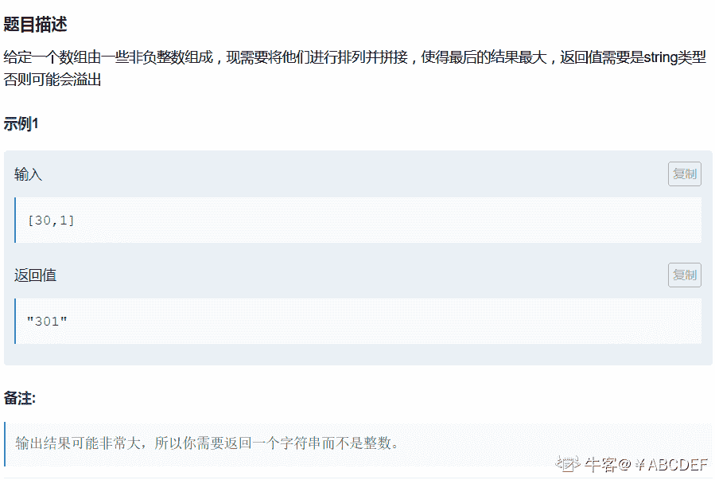
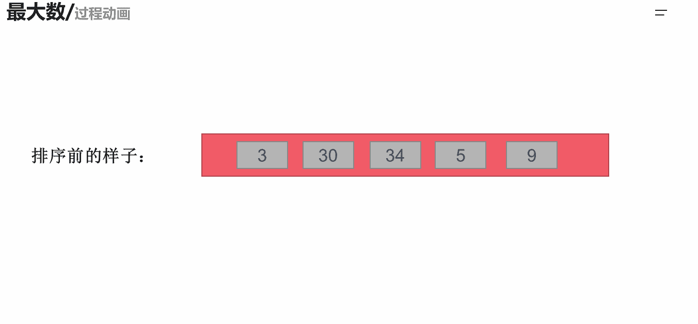

# 第八章 第 7 节 NC111 最大数

> 原文：[`www.nowcoder.com/tutorial/10072/b0a3ab275f7149b48f286c763404c062`](https://www.nowcoder.com/tutorial/10072/b0a3ab275f7149b48f286c763404c062)

### NC111 最大数

**- 1、题目描述：**

**- 2、题目链接：**
[题目所在位置](https://www.nowcoder.com/practice/fc897457408f4bbe9d3f87588f497729?tpId=117&&tqId=35036&rp=1&ru=/ta/job-code-high&qru=/ta/job-code-high/question-ranking)

**-3、 设计思想：**

详细操作流程看下图


**-5、代码：**
c++版本:

```cpp
class Solution {
public:
    /**
     * 最大数
     * @param nums int 整型 vector 
     * @return string 字符串
     */
    //定义一个排序规则 
    static bool cmp(string a,string b){
        return a + b > b + a;
    }
    string solve(vector<int>& nums) {
        vector<string> ve;
        //将整型的数字转化为字符串
        for(int i  = 0;i < nums.size();i ++){
            ve.push_back(to_string(nums[i]));
        }
        //排序
        sort(ve.begin(),ve.end(),cmp);
        //这个地方需要注意如果第一个字符串已经是 0 了，那么直接输出 0
        if(ve[0] == "0") return "0";

        string res =""; //结果字符串
        for(int i = 0;i < ve.size();i ++){
            res += ve[i];//将排序好后的字符串一次相加就是最终的结果
    }
    return res;
    }
};
```

Java 版本：

```cpp
import java.util.*;

public class Solution {
    /**
     * 最大数
     * @param nums int 整型一维数组 
     * @return string 字符串
     */
    public String solve (int[] nums) {
        // write code here
        ArrayList<String> list = new ArrayList<>();
        //将整型的数字转化为字符串
        for(int i = 0;i < nums.length;i ++){
            list.add(String.valueOf(nums[i]));
        }
        //排序
        Collections.sort(list,new Comparator<String>(){
            @Override
            public int compare(String a,String b){
                return (b + a).compareTo(a + b);
            }
        });
        //这个地方需要注意如果第一个字符串已经是 0 了，那么直接输出 0
        if(list.get(0).equals("0")) return "0";

        StringBuilder res = new StringBuilder(); //结果字符串
        for(int i = 0;i < list.size();i ++){//将排序好后的字符串一次相加就是最终的结果
            res.append(list.get(i));
        }
        return res.toString();

    }
}
```

Python 版本:

```cpp
#
# 最大数
# @param nums int 整型一维数组 
# @return string 字符串
#
#比较规则
class cmp(str):
    def __lt__(x, y):
        return x+y > y+x
class Solution:      
    def solve(self , nums ):
        # write code here
        #将整型的数字转化为字符串
        strs = [str(i) for i in nums]
        #排序
        strs = sorted(strs,key = cmp)
        #这个地方需要注意如果第一个字符串已经是 0 了，那么直接输出 0
        if strs[0] == "0": return "0"
        return "".join(strs)

```