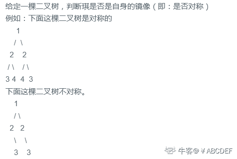
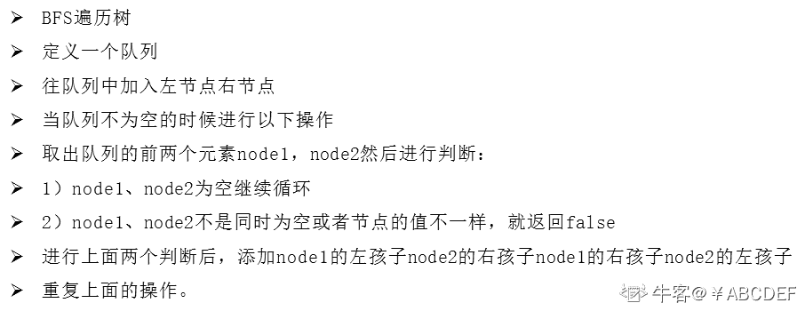
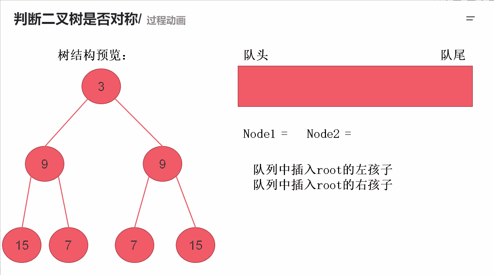

# 第八章 第 8 节 NC16 判断二叉树是否对称

> 原文：[`www.nowcoder.com/tutorial/10072/c4bb5b893b6c4057af631a6ac4e63ba7`](https://www.nowcoder.com/tutorial/10072/c4bb5b893b6c4057af631a6ac4e63ba7)

### NC16 判断二叉树是否对称

**- 题目描述：**


**- 题目链接：**
[`www.nowcoder.com/practice/1b0b7f371eae4204bc4a7570c84c2de1?tpId=117&&tqId=34937&rp=1&ru=/ta/job-code-high&qru=/ta/job-code-high/question-ranking`](https://www.nowcoder.com/practice/1b0b7f371eae4204bc4a7570c84c2de1?tpId=117&&tqId=34937&rp=1&ru=/ta/job-code-high&qru=/ta/job-code-high/question-ranking)

**- 设计思想：**
同 NC15 求二叉树的层序遍历那道题目，仍然是使用 BFS 的思想，每一次都去遍历每一层的节点然后进行比较。详细操作如下：


操作流程如下：


**- 代码：**
c++版本:

```cpp
/**
 * struct TreeNode {
 *    int val;
 *    struct TreeNode *left;
 *    struct TreeNode *right;
 * };
 */

class Solution {
public:
    /**
     *
     * @param root TreeNode 类
     * @return bool 布尔型
     */
    bool isSymmetric(TreeNode* root) {
        if(root == NULL) return true;//当根节点为空的时候返回 true
        queue<TreeNode*>q;//定义一个队列，用于存储每一层的节点
        q.push(root->left);//把根节点的左孩子放队列
        q.push(root->right);//把根节点的右孩子放队列
        while(!q.empty()){//队列不为空就执行下面的操作
            TreeNode *node1 = q.front();//取出队列的头元素
            q.pop();//出队列
            TreeNode *node2 = q.front();//取出队列的头元素
            q.pop();//出队列
            if(node1 == NULL && node2 == NULL) continue;//当前取出的两个节点都为空的时候继续
            if(node1 == NULL || node2 == NULL || node1->val != node2->val) return false;//取出的两个节点有一个为空或者值不相等都返回 false
            //通过看图会发现节点的左孩子对应另一个节点的右孩子
            //节点的右孩子对应另一个节点的左孩子
            q.push(node1->left);
            q.push(node2->right);
            q.push(node1->right);
            q.push(node2->left);
        }
        return true;
    }
};

```

Java 版本：

```cpp
import java.util.*;

/*
 * public class TreeNode {
 *   int val = 0;
 *   TreeNode left = null;
 *   TreeNode right = null;
 * }
 */

public class Solution {
    /**
     * 
     * @param root TreeNode 类 
     * @return bool 布尔型
     */
    public boolean isSymmetric (TreeNode root) {
        if(root == null) return true;//当根节点为空的时候返回 true
        Queue<TreeNode> q = new LinkedList<TreeNode>();//定义一个队列，用于存储每一层的节点
        q.add(root.left);//把根节点的左孩子放队列
        q.add(root.right);//把根节点的右孩子放队列
        while(!q.isEmpty()){//队列不为空就执行下面的操作
            TreeNode node1 = q.poll();//取出队列的头元素并弹出
            TreeNode node2 = q.poll();//取出队列的头元素并弹出
            if(node1 == null && node2 == null) continue;//当前取出的两个节点都为空的时候继续
            if(node1 == null || node2 == null || node1.val != node2.val) return false;//取出的两个节点有一个为空或者值不相等都返回 false
            //通过看图会发现节点的左孩子对应另一个节点的右孩子
            //节点的右孩子对应另一个节点的左孩子
            q.add(node1.left);
            q.add(node2.right);
            q.add(node1.right);
            q.add(node2.left);
        }
        return true;

    }
}
```

Python 版本:

```cpp
import queue
# class TreeNode:
#     def __init__(self, x):
#         self.val = x
#         self.left = None
#         self.right = None

#
# 
# @param root TreeNode 类 
# @return bool 布尔型
#
class Solution:
    def isSymmetric(self , root ):
        # write code here
        if not root:
            return True#当根节点为空的时候返回 true
        q = queue.Queue()#定义一个队列，用于存储每一层的节点
        q.put(root.left)#把根节点的左孩子放队列
        q.put(root.right)#把根节点的右孩子放队列
        while q.qsize() >0:#队列不为空就执行下面的操作
                node1 = q.get()#取出队列的头元素并弹出
                node2 = q.get()#取出队列的头元素并弹出
                if node1 == None and node2 == None:continue
                if node1 == None or node2 == None or node1.val != node2.val:return False;
                #通过看图会发现节点的左孩子对应另一个节点的右孩子
                #节点的右孩子对应另一个节点的左孩子
                q.put(node1.left);
                q.put(node2.right);
                q.put(node1.right);
                q.put(node2.left);

        return True
```