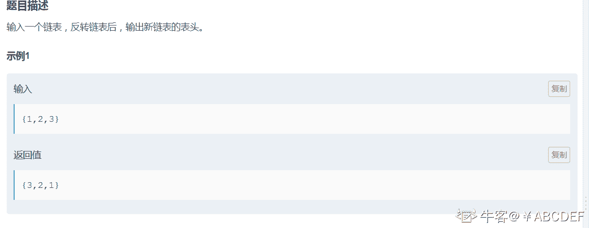
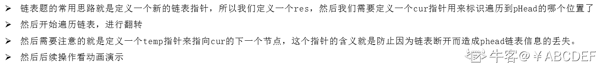
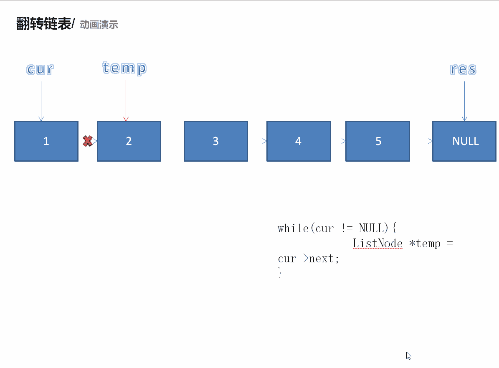

# 第八章 第 15 节 NC78 反转链表

> 原文：[`www.nowcoder.com/tutorial/10072/8cb43a0e1cd549f3a2e55de5ecdbf9df`](https://www.nowcoder.com/tutorial/10072/8cb43a0e1cd549f3a2e55de5ecdbf9df)

### NC78 反转链表

**- 1、题目描述：**


**- 2、题目链接：**
[`www.nowcoder.com/practice/75e878df47f24fdc9dc3e400ec6058ca?tpId=117&&tqId=35000&rp=1&ru=/ta/job-code-high&qru=/ta/job-code-high/question-ranking`](https://www.nowcoder.com/practice/75e878df47f24fdc9dc3e400ec6058ca?tpId=117&&tqId=35000&rp=1&ru=/ta/job-code-high&qru=/ta/job-code-high/question-ranking)

**-3、 设计思想：**

详细操作流程看下图：


**-5、代码：**
c++版本:

```cpp
 /*
struct ListNode {
    int val;
    struct ListNode *next;
    ListNode(int x) :
            val(x), next(NULL) {
    }
};*/

class Solution {
public:
    ListNode* ReverseList(ListNode* pHead) {
        ListNode *res = NULL; //定义新的链表
        ListNode *cur = pHead;//用来遍历 pHead 指针
        while(cur != NULL){ //用来翻转链表
            ListNode *temp = cur->next;
            cur->next = res;
            res = cur;
            cur = temp;
        }
        return res;

    }
};

```

Java 版本：

```cpp
public class Solution {
    public ListNode ReverseList(ListNode head) {
        ListNode res = null;
        ListNode cur = head;
        while(cur != null){
            ListNode temp = cur.next;
            cur.next = res;
            res = cur;
            cur = temp;
        }
        return res;

    }
}

```

Python 版本:

```cpp
class Solution:
    # 返回 ListNode
    def ReverseList(self, pHead):
        # write code here
        res = None#定义新的链表
        cur = pHead#用来遍历 pHead 指针
        while cur != None:#用来翻转链表
            temp = cur.next
            cur.next = res
            res = cur
            cur = temp

        return res

```