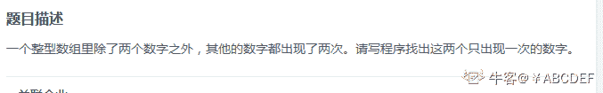
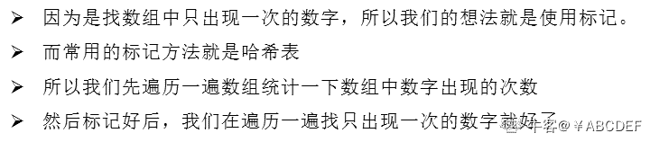
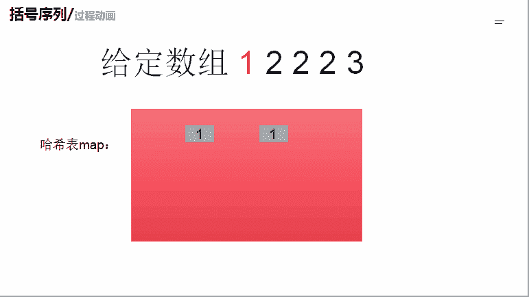

# 第八章 第 18 节 NC75 数组中只出现一次的数字（哈希法）

> 原文：[`www.nowcoder.com/tutorial/10072/ffef51f4096540cb94500be31411366c`](https://www.nowcoder.com/tutorial/10072/ffef51f4096540cb94500be31411366c)

### NC75 数组中只出现一次的数字（哈希法）

**- 1、题目描述：**


**- 2、题目链接：**
[`www.nowcoder.com/practice/e02fdb54d7524710a7d664d082bb7811?tpId=117&&tqId=34997&rp=1&ru=/ta/job-code-high&qru=/ta/job-code-high/question-ranking`](https://www.nowcoder.com/practice/e02fdb54d7524710a7d664d082bb7811?tpId=117&&tqId=34997&rp=1&ru=/ta/job-code-high&qru=/ta/job-code-high/question-ranking)

**-3、 设计思想：**

详细操作流程看下图：


**-5、代码：**
c++版本:

```cpp
 class Solution {
public:
    void FindNumsAppearOnce(vector<int> data,int* num1,int *num2) {
        map<int,int>mp; //定义一个哈希表
        for(int i = 0;i < data.size();i ++){
            mp[data[i]]++; //把 data 里面元素出现的次数进行统计
        }
        vector<int>res; //定义 res 方便给*num1,*num2 赋值
        for(int i = 0;i < data.size();i ++){
            if(mp[data[i]] == 1){//如果 data[i]出现过一次就加入到 res 里面
                res.push_back(data[i]);
            }
            if(res.size() >= 2) break; //因为题目说了，只有两个元素出现了 1 次,所以 res 的大小超过 1 个就可以不需要遍历 data 数组了
        }
        *num1 =res[0];
        *num2 = res[1];

    }
};

```

Java 版本：

```cpp
//num1,num2 分别为长度为 1 的数组。传出参数
//将 num1[0],num2[0]设置为返回结果
import java.util.*;
public class Solution {
    public void FindNumsAppearOnce(int [] array,int num1[] , int num2[]) {
         HashMap<Integer,Integer> mp = new HashMap<>();//定义一个哈希表
         for(int num:array){//把 data 里面元素出现的次数进行统计
             if(!mp.containsKey(num)){
                 mp.put(num,1);//如果 map 里面没有存在那么就先加入
             }else{
                mp.put(num,mp.get(num)+1); //如果 map 里面存在那么就进行键值的更新
             }

         }
         int cnt = 0;
         int res[] = new int[2];//定义 res 方便给*num1,*num2 赋值
         for(int num:array){
             if(mp.get(num)== 1){//如果 data[i]出现过一次就加入到 res 里面
                 res[cnt] = num; 
                 cnt ++;
             }
             if(cnt >= 2) break;//因为题目说了，只有两个元素出现了 1 次,所以 res 的大小超过 1 个就可以不需要遍
         }
         num1[0] = res[0];
         num2[0] = res[1];

    }
}

```

Python 版本:

```cpp
# -*- coding:utf-8 -*-
class Solution:
    # 返回[a,b] 其中 ab 是出现一次的两个数字
    def FindNumsAppearOnce(self, array):
        # write code here
        map = {}#定义一个哈希表
        for num  in array:#把 data 里面元素出现的次数进行统计
            if num in map:
                map[num] += 1
            else:
                map[num] = 1
        res = []
        cnt = 0
        for num in array:#如果 data[i]出现过一次就加入到 res 里面
            if map[num] == 1:
                res.append(num)
                cnt += 1
            if cnt >= 2: break#因为题目说了，只有两个元素出现了 1 次,所以 res 的大小超过 1 个就可以不需要遍

        return res

```