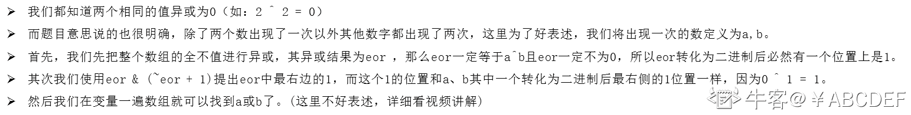
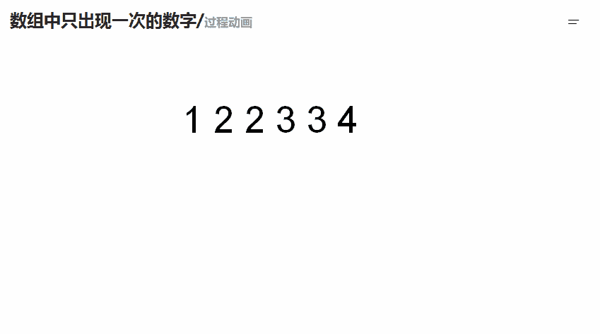

# 第八章 第 19 节 NC75 数组中只出现一次的数字（位运算法）

> 原文：[`www.nowcoder.com/tutorial/10072/b6c1c061cc3b42c58f87b84ecef4aa7b`](https://www.nowcoder.com/tutorial/10072/b6c1c061cc3b42c58f87b84ecef4aa7b)

### NC75 数组中只出现一次的数字（位运算法）

**- 1、题目描述：**


**- 2、题目链接：**
[`www.nowcoder.com/practice/e02fdb54d7524710a7d664d082bb7811?tpId=117&&tqId=34997&rp=1&ru=/ta/job-code-high&qru=/ta/job-code-high/question-ranking`](https://www.nowcoder.com/practice/e02fdb54d7524710a7d664d082bb7811?tpId=117&&tqId=34997&rp=1&ru=/ta/job-code-high&qru=/ta/job-code-high/question-ranking)

**-3、 设计思想：**

详细操作流程看下图：



**-5、代码：**
c++版本:

```cpp
 class Solution
{
public:
    void FindNumsAppearOnce(vector<int> data,int* num1,int *num2)
    {
        int n = data.size();//求出数组的长度
        int eor = 0; //用来保存那两个只出现 1 次的数的异或值
        for(int i = 0; i < n; i ++)
        {
            eor ^= data[i];//将整个数组异或
        }
        /// eor = a ^ b
        /// eor != 0
        /// eor 必然有一个位置上是 1
        int rightOne = eor & (~eor + 1); // 提取出最右的 1
        int onlyOne = 0;//用来保存只出现 1 次的数的其中的那一个
        for(int i = 0; i < n; i ++)
        {
            if((data[i] & rightOne) != 0)
            {
                onlyOne ^= data[i];//寻找那个数
            }
        }
        *num1 = onlyOne;
        *num2 = (eor ^ onlyOne);

    }
};

```

Java 版本：

```cpp
//num1,num2 分别为长度为 1 的数组。传出参数
//将 num1[0],num2[0]设置为返回结果
public class Solution {
    public void FindNumsAppearOnce(int [] array,int num1[] , int num2[]) {
        int n = array.length;//求出数组的长度
        int eor = 0;//用来保存那两个只出现 1 次的数的异或值
        for(int i = 0; i < n; i ++)
        {
            eor ^= array[i];//将整个数组异或
        }
        /// eor = a ^ b
        /// eor != 0
        /// eor 必然有一个位置上是 1
        int rightOne = eor & (~eor + 1); /// 提取出最右的 1
        int onlyOne = 0;//用来保存只出现 1 次的数的其中的那一个
        for(int i = 0; i < n; i ++)
        {
            if((array[i] & rightOne) != 0)
            {
                onlyOne ^= array[i];//寻找那个数
            }
        }
        num1[0] = onlyOne;
        num2[0] = (eor ^ onlyOne);
    }
}

```

Python 版本:

```cpp
# -*- coding:utf-8 -*-
class Solution:
    # 返回[a,b] 其中 ab 是出现一次的两个数字
    def FindNumsAppearOnce(self, array):
        # write code here
        n  = len(array)#求出数组的长度
        eor = 0#用来保存那两个只出现 1 次的数的异或值
        for i in range(n):#将整个数组异或
            eor ^= array[i]
        rightOne = eor & (~eor + 1)#提取出最右的 1
        onlyOne = 0#用来保存只出现 1 次的数的其中的那一个
        for i in range(n): 
            if ((array[i] & rightOne) != 0):
                onlyOne ^= array[i] #寻找那个数
        res = []
        res.append(onlyOne)
        res.append((eor ^ onlyOne))
        return res

```