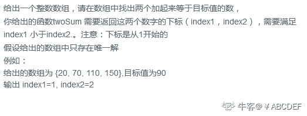
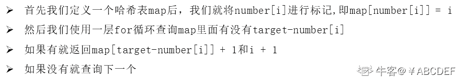
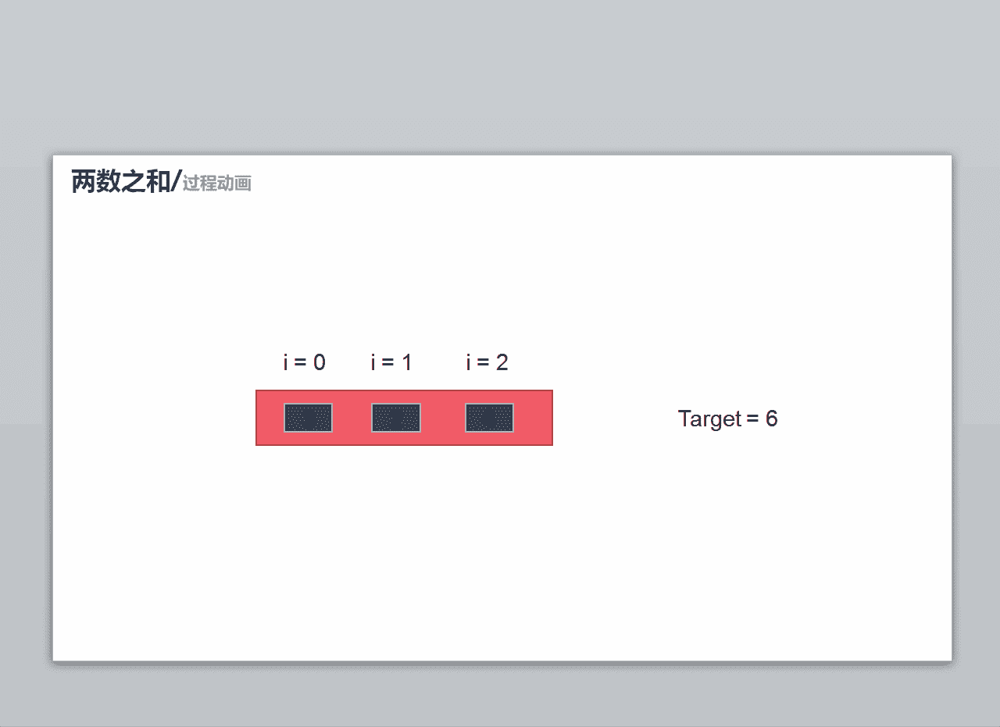

# 第八章 第 21 节 NC61 两数之和（哈希法）

> 原文：[`www.nowcoder.com/tutorial/10072/6fb5a9844f694265b122bd031ff68611`](https://www.nowcoder.com/tutorial/10072/6fb5a9844f694265b122bd031ff68611)

### NC61 两数之和（哈希法）

**- 1、题目描述：**


**- 2、题目链接：**

[`www.nowcoder.com/practice/20ef0972485e41019e39543e8e895b7f?tpId=117&&tqId=34983&rp=1&ru=/ta/job-code-high&qru=/ta/job-code-high/question-ranking`](https://www.nowcoder.com/practice/20ef0972485e41019e39543e8e895b7f?tpId=117&&tqId=34983&rp=1&ru=/ta/job-code-high&qru=/ta/job-code-high/question-ranking)
**-3、 设计思想：**

详细操作流程看下图：


**-5、代码：**
c++版本:

```cpp
 class Solution {
public:
    /**
     * 
     * @param numbers int 整型 vector 
     * @param target int 整型 
     * @return int 整型 vector
     */
    vector<int> twoSum(vector<int>& numbers, int target) {
        vector<int>res;//保存结果
        map<int,int>mp;//定义一个哈希表存储 numbers[i]和对应的下标
        for (int i = 0; i < numbers.size(); i ++) {//进行标记
            mp[numbers[i]] = i;
        }
         for (int i = 0; i < numbers.size(); i++) {
             //每遍历一个 numbers[i]就去对应的 mp 里找有没有 target - numbers[i]
             //如果有就返回结果
             //如果没有就找下一个
            if(mp.find(target - numbers[i]) != mp.end() && i != mp[target - numbers[i]]){
                res.push_back(i + 1);
                res.push_back(mp[target - numbers[i]] + 1);
                return res;
            }
        }
        return res;

    }
};

```

Java 版本：

```cpp
import java.util.HashMap;
public class Solution {
    public int[] twoSum(int[] numbers, int target) {
        int[] res = {0,0};//保存结果
        HashMap<Integer, Integer> mp = new HashMap<Integer, Integer>();//定义一个哈希表存储 numbers[i]和对应的下标
        for(int i = 0;i < numbers.length;i ++){//进行标记
            mp.put(numbers[i],i);
        }
        for(int i = 0;i < numbers.length;i ++){
             //每遍历一个 numbers[i]就去对应的 mp 里找有没有 target - numbers[i]
             //如果有就返回结果
             //如果没有就找下一个
            if(mp.containsKey(target-numbers[i]) && i != mp.get(target - numbers[i])){
                res[0] = i + 1;
                res[1] = mp.get(target-numbers[i]) + 1;
                return res;
            }
        }

        return res;
    }
}

```

Python 版本:

```cpp
#
# 
# @param numbers int 整型一维数组 
# @param target int 整型 
# @return int 整型一维数组
#
class Solution:
    def twoSum(self , numbers , target ):
        # write code here
        res = [0,0]#保存结果
        mp = {}#定义一个哈希表存储 numbers[i]和对应的下标
        for i in range(len(numbers)):#进行标记
            mp[numbers[i]] = i
        for i in range(len(numbers)):
             #每遍历一个 numbers[i]就去对应的 mp 里找有没有 target - numbers[i]
             #如果有就返回结果
             #如果没有就找下一个
            if target - numbers[i] in mp:
                if mp[target - numbers[i]] != i:
                    res[0] = i + 1
                    res[1] = mp[target - numbers[i]]
                    return res
        return res
```