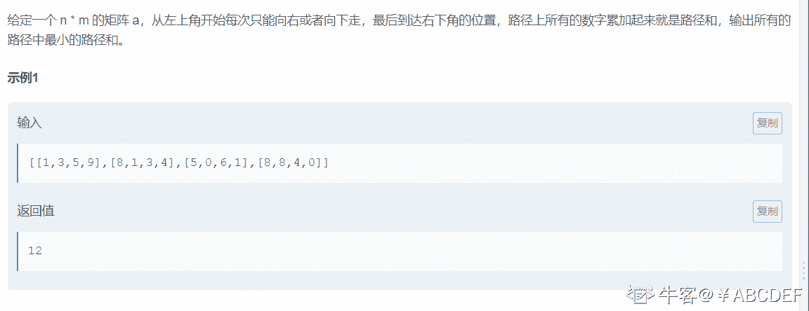
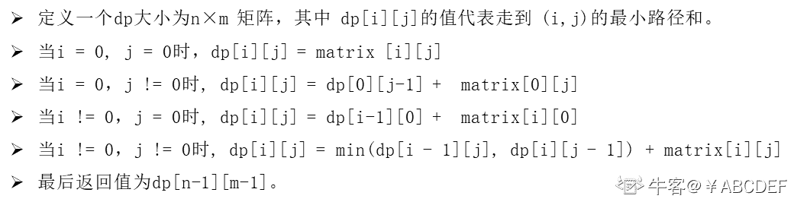
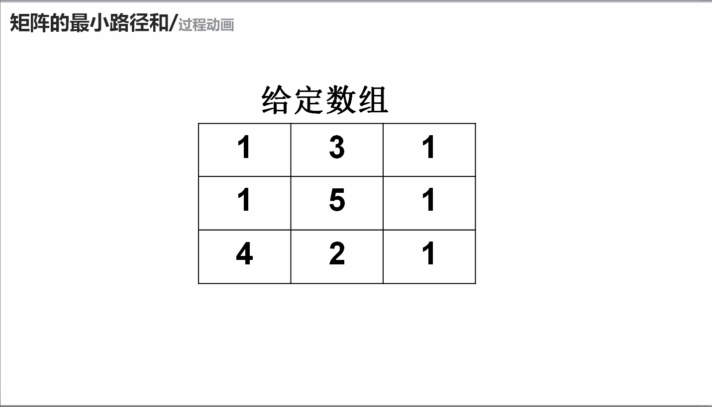

# 第八章 第 22 节 NC59 矩阵的最小路径和

> 原文：[`www.nowcoder.com/tutorial/10072/0d176bc742f64954809866a2789f4b6b`](https://www.nowcoder.com/tutorial/10072/0d176bc742f64954809866a2789f4b6b)

### NC59 矩阵的最小路径和

**- 1、题目描述：**


**- 2、题目链接：**
[`www.nowcoder.com/practice/7d21b6be4c6b429bb92d219341c4f8bb?tpId=196&&tqId=37157&rp=1&ru=/activity/oj&qru=/ta/job-code-total/question-ranking`](https://www.nowcoder.com/practice/7d21b6be4c6b429bb92d219341c4f8bb?tpId=196&&tqId=37157&rp=1&ru=/activity/oj&qru=/ta/job-code-total/question-ranking)

**-3、 设计思想：**

详细操作流程看下图：


**-5、代码：**
c++版本:

```cpp
class Solution
{
public:
    /**
     *
     * @param matrix int 整型 vector<vector<>> the matrix
     * @return int 整型
     */
    int minPathSum(vector<vector<int> >& matrix)
    {
        // write code here
        int n = matrix.size(); //matrix 的行
        int m = matrix[0].size();//matrix 的列
        int dp[n + 10][m + 10];//dp[i][j]代表在第 i 行第 j 列最小的路径和为多少
        dp[0][0] = matrix[0][0];//初始化 dp[0][0]为 matrix[0][0]
        for(int i = 1; i < n; i ++)
        {
            dp[i][0] = dp[i-1][0] +  matrix[i][0];//初始化 dp[i][0]
        }
        for(int i = 1; i < m; i ++)
        {
            dp[0][i] = dp[0][i-1] +  matrix[0][i];//初始化 dp[0][i]
        }
        for (int i = 1; i < n; i++)
        {
            for (int j = 1; j < m; j++)
            {
                //dp[i][j] 就应该等于在 dp[i - 1][j]、dp[i][j - 1]选一个最小的在和 matrix[i][j]加和
                dp[i][j] = min(dp[i - 1][j], dp[i][j - 1]) + matrix[i][j];
            }
        }
        return dp[n - 1][m - 1];//最终的结果为 dp[n-1][m-1]即二维表的最右下角
    }
};

```

Java 版本：

```cpp
import java.util.*;

public class Solution {
    /**
     * 
     * @param matrix int 整型二维数组 the matrix
     * @return int 整型
     */
    public int minPathSum (int[][] matrix) {
        // write code here
        int n = matrix.length; //matrix 的行
        int m = matrix[0].length;//matrix 的列
        int [][]dp = new int[n + 10][m + 10];//dp[i][j]代表在第 i 行第 j 列最小的路径和为多少
        dp[0][0] = matrix[0][0];//初始化 dp[0][0]为 matrix[0][0]
        for(int i = 1; i < n; i ++)
        {
            dp[i][0] = dp[i-1][0] +  matrix[i][0];//初始化 dp[i][0]
        }
        for(int i = 1; i < m; i ++)
        {
            dp[0][i] = dp[0][i-1] +  matrix[0][i];//初始化 dp[0][i]
        }
        for (int i = 1; i < n; i++)
        {
            for (int j = 1; j < m; j++)
            {
                //dp[i][j] 就应该等于在 dp[i - 1][j]、dp[i][j - 1]选一个最小的在和 matrix[i][j]加和
                dp[i][j] = Math.min(dp[i - 1][j], dp[i][j - 1]) + matrix[i][j];
            }
        }
        return dp[n - 1][m - 1];//最终的结果为 dp[n-1][m-1]即二维表的最右下角
    }
}

```

Python 版本:

```cpp
#
# 
# @param matrix int 整型二维数组 the matrix
# @return int 整型
#
class Solution:
    def minPathSum(self , matrix ):
        # write code here
        n = len(matrix)#matrix 的行
        m = len(matrix[0])#matrix 的列
        dp = [[0] * (m+10) for _ in range(n+10)]#dp[i][j]代表在第 i 行第 j 列最小的路径和为多少
        dp[0][0] = matrix[0][0];#初始化 dp[0][0]为 matrix[0][0]
        for i in range(1,n):
            dp[i][0] = dp[i-1][0] +  matrix[i][0]#初始化 dp[i][0]
        for i in range(1,m):
            dp[0][i] = dp[0][i-1] +  matrix[0][i];#初始化 dp[0][i]
        for i in range(1,n):
            for j in range(1,m):
            #dp[i][j] 就应该等于在 dp[i - 1][j]、dp[i][j - 1]选一个最小的在和 matrix[i][j]加和
                dp[i][j] = min(dp[i - 1][j], dp[i][j - 1]) + matrix[i][j]

        return dp[n - 1][m - 1] #最终的结果为 dp[n-1][m-1]即二维表的最右下角

```