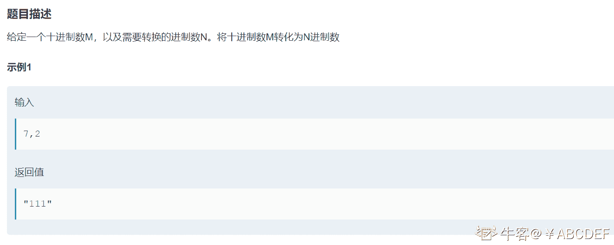

# 第八章 第 28 节 NC112 进制转换

> 原文：[`www.nowcoder.com/tutorial/10072/d85670d83ec74093a3cbf5b05bc8866f`](https://www.nowcoder.com/tutorial/10072/d85670d83ec74093a3cbf5b05bc8866f)

### NC112 进制转换

**- 1、题目描述：**


**- 2、题目链接：**
[`www.nowcoder.com/practice/2cc32b88fff94d7e8fd458b8c7b25ec1?tpId=188&&tqId=37376&rp=1&ru=/ta/job-code-high-week&qru=/ta/job-code-high-week/question-ranking`](https://www.nowcoder.com/practice/2cc32b88fff94d7e8fd458b8c7b25ec1?tpId=188&&tqId=37376&rp=1&ru=/ta/job-code-high-week&qru=/ta/job-code-high-week/question-ranking)

**-3、 设计思想：**


**-5、代码：**
c++版本:

```cpp
class Solution {
public:
    /**
     * 进制转换
     * @param M int 整型 给定整数
     * @param N int 整型 转换到的进制
     * @return string 字符串
     */
    string solve(int M, int N) {
        // write code here
        if(M == 0) return "0";//如果 M=0 就直接返回
        bool flag = false;//记录是不是负数
        if(M < 0){
            //如果是负数 flag=true，M 取相反数
            flag = true;
            M = -M;
        }
        string res = "";//返回最终的结果
        string jz = "0123456789ABCDEF";//对应进制的某一位
        while(M != 0){//就对应转换为 N 进制的逆序样子
            res += jz[M % N];
            M /= N;
        }
        reverse(res.begin(),res.end());//逆序一下才是对应的 N 进制
        if(flag) res.insert(0,"-");//如果是负数就在头位置插入一个-号
        return res;
    }
};

```

Java 版本：

```cpp
import java.util.*;

public class Solution {
    /**
     * 进制转换
     * @param M int 整型 给定整数
     * @param N int 整型 转换到的进制
     * @return string 字符串
     */
    public String solve (int M, int N) {
        // write code here
        if(M == 0) return "0";//如果 M=0 就直接返回
        boolean flag = false;//记录是不是负数
        if(M < 0){
            //如果是负数 flag=true，M 取相反数
            flag = true;
            M = -M;
        }
        String jz ="0123456789ABCDEF";//对应进制的某一位
        StringBuffer res = new StringBuffer();//返回最终的结果
        while(M != 0){//就对应转换为 N 进制的逆序样子
            res.append(jz.charAt(M % N));
            M /= N;
        }
        res.reverse();//逆序一下才是对应的 N 进制
        if(flag) res.insert(0,"-");//如果是负数就在头位置插入一个-号
        return res.toString();
    }
}
```

Python 版本:

```cpp
#
# 进制转换
# @param M int 整型 给定整数
# @param N int 整型 转换到的进制
# @return string 字符串
#
class Solution:
    def solve(self , M , N ):
        # write code here
        if M == 0: return "0" #如果 M=0 就直接返回
        flag = False #记录是不是负数
        if M < 0 :
            #如果是负数 flag=true，M 取相反数
            flag = True
            M = -M
        jz = "0123456789ABCDEF" #对应进制的某一位
        res = ""#返回最终的结果
        while M != 0:
            #就对应转换为 N 进制的逆序样子
            res += jz[M % N]
            M //= N
        if flag: #如果是负数就加一个－号
            res += "-"
        return res[::-1] #直接逆序返回

```