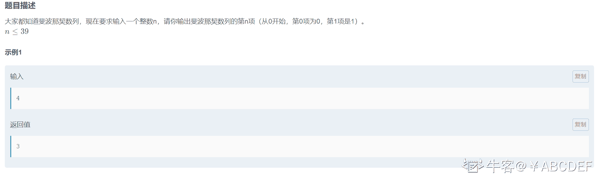
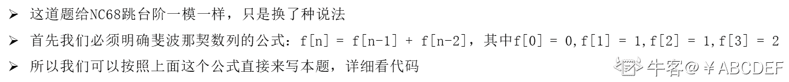

# 第八章 第 29 节 NC65 斐波那契数列

> 原文：[`www.nowcoder.com/tutorial/10072/9c656835492a4d3d9eaa5c2db4326192`](https://www.nowcoder.com/tutorial/10072/9c656835492a4d3d9eaa5c2db4326192)

### NC65 斐波那契数列

**- 1、题目描述：**


**- 2、题目链接：**
[`www.nowcoder.com/practice/c6c7742f5ba7442aada113136ddea0c3?tpId=196&&tqId=37094&rp=1&ru=/activity/oj&qru=/ta/job-code-total/question-ranking`](https://www.nowcoder.com/practice/c6c7742f5ba7442aada113136ddea0c3?tpId=196&&tqId=37094&rp=1&ru=/activity/oj&qru=/ta/job-code-total/question-ranking)

**-3、 设计思想：**



**-5、代码：**
c++版本:

```cpp
 class Solution {
public:
    int Fibonacci(int n) {
        if(n<=1) return n; //因为第 0 项等于 0，第 1 项等于 1
        if(n == 2) return 1;//因为第 2 项等于 1
        return Fibonacci(n-1) + Fibonacci(n - 2);//斐波那契数列公式为：f[n] = f[n-1] + f[n-2]
    }
};

```

Java 版本：

```cpp
public class Solution {
    public int Fibonacci1(int n) {
        if(n<=1) return n;//因为第 0 项等于 0，第 1 项等于 1
        if(n == 2) return 1;//因为第 2 项等于 1
        return Fibonacci(n-1) + Fibonacci(n - 2);//斐波那契数列公式为：f[n] = f[n-1] + f[n-2],
    }
    public int Fibonacci(int n) {
        if(n <= 1) return n;
        int a = 0,b = 1;
        int temp = 0;
        for(int i = 2;i <= n;i ++){
            temp = a + b;
            a = b;
            b = temp;
        }
        return temp;
    }
}

```

Python 版本:

```cpp
# -*- coding:utf-8 -*-
class Solution:
    def Fibonacci1(self, n):
        # write code here
        if n <= 1: return n;#因为第 0 项等于 0，第 1 项等于 1
        if n == 2: return 1;#因为第 2 项等于 1
        return self.Fibonacci(n-1) + self.Fibonacci(n - 2);#斐波那契数列公式为：f[n] = f[n-1] + f[n-2]

    def Fibonacci(self, n):
        # write code here
        if n <= 1: return n
        dp = [0 for i in range(n+2)]
        dp[1] = 1
        dp[2] = 1
        for i in range(3,n+1):
            dp[i] = dp[i-1] + dp[i-2] 
        return dp[n]

```