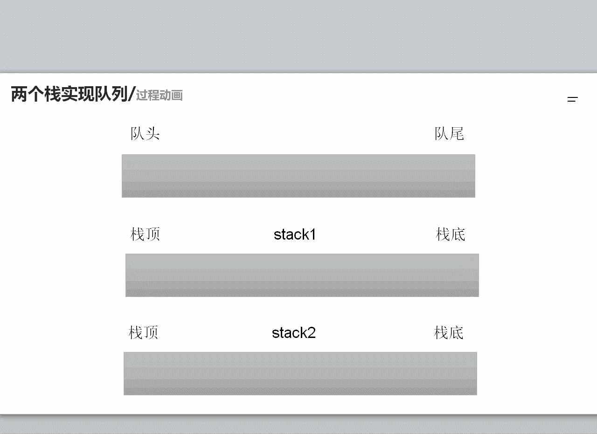
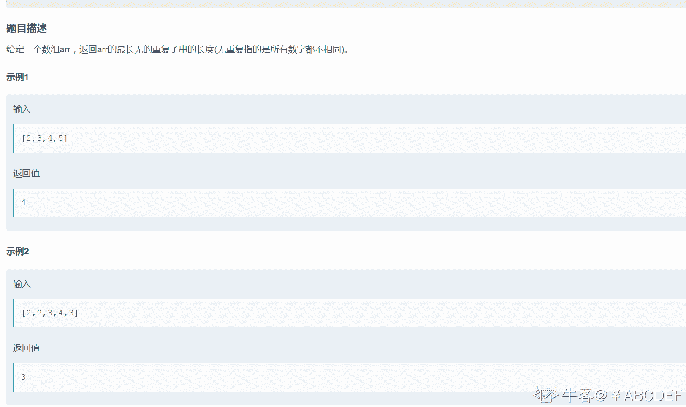
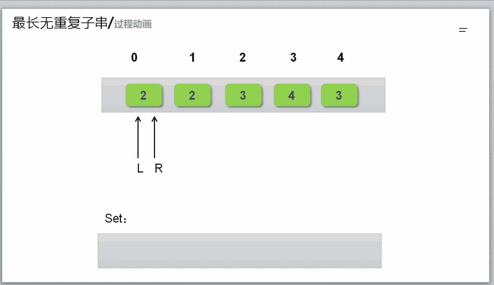

# 第八章 第 30 节 NC76 用两个栈实现队列

> 原文：[`www.nowcoder.com/tutorial/10072/38ce0b8cdb724ce9b9193bc73bf1d0c7`](https://www.nowcoder.com/tutorial/10072/38ce0b8cdb724ce9b9193bc73bf1d0c7)

### NC76 用两个栈实现队列

**- 1、题目描述：**


**- 2、题目链接：**
[`www.nowcoder.com/practice/54275ddae22f475981afa2244dd448c6?tpId=196&&tqId=37108&rp=1&ru=/ta/job-code-total&qru=/ta/job-code-total/question-ranking`](https://www.nowcoder.com/practice/54275ddae22f475981afa2244dd448c6?tpId=196&&tqId=37108&rp=1&ru=/ta/job-code-total&qru=/ta/job-code-total/question-ranking)

**-3、 设计思想：**

详细操作流程看下图：


**-5、代码：**
c++版本:

```cpp
 class Solution
{
public:
    void push(int node) {
        stack1.push(node);//直接入栈 1

    }

    int pop() {
         /*如果栈 2 为空就代表没有进行过出队操作
        所以需要把栈 1 里面的元素全部压入栈 2 中，进行模拟队的出队操作
        */
        if(stack2.empty()){
            while(!stack1.empty()){
                stack2.push(stack1.top());
                stack1.pop();
            }
        }
        /*如果栈 2 不为空就代表之前的操作已经使用过出队操作，直接取出栈 2 的栈顶
        元素就是当前出队的那个元素*/
        int res = stack2.top();
        stack2.pop();
        return res;

    }

private:
    stack<int> stack1;//用来模拟队列的压入操作
    stack<int> stack2;//用来模拟队列的弹出操作
};

```

Java 版本：

```cpp
import java.util.Stack;

public class Solution {
    Stack<Integer> stack1 = new Stack<Integer>();//用来模拟队列的压入操作
    Stack<Integer> stack2 = new Stack<Integer>();//用来模拟队列的弹出操作

    public void push(int node) {
        stack1.push(node);//直接入栈 1

    }

    public int pop() {
        /*如果栈 2 为空就代表没有进行过出队操作
        所以需要把栈 1 里面的元素全部压入栈 2 中，进行模拟队的出队操作
        */
        if(stack2.isEmpty()){
            while(!stack1.isEmpty()){
                stack2.push(stack1.pop());
            }
        }
        /*如果栈 2 不为空就代表之前的操作已经使用过出队操作，直接取出栈 2 的栈顶
        元素就是当前出队的那个元素*/
        return stack2.pop();

    }
}

```

Python 版本:

```cpp
# -*- coding:utf-8 -*-
class Solution:
    def __init__(self):
        self.stack1 = []#用来模拟队列的压入操作
        self.stack2 = []#用来模拟队列的弹出操作
    def push(self, node):
        # write code here
        self.stack1.append(node) #直接入栈 1
    def pop(self):
        # return xx
        '''
        如果栈 2 为空就代表没有进行过出队操作
        所以需要把栈 1 里面的元素全部压入栈 2 中，进行模拟队的出队操作
        '''
        if not self.stack2:
            while self.stack1:
                self.stack2.append(self.stack1.pop())
        '''
        如果栈 2 不为空就代表之前的操作已经使用过出队操作，直接取出栈 2 的栈顶
        元素就是当前出队的那个元素
        '''
        return self.stack2.pop()

```

NC41 最长无重复子串

**- 1、题目描述：**


**- 2、题目链接：**
[`www.nowcoder.com/practice/b56799ebfd684fb394bd315e89324fb4?tpId=117&rp=1&ru=%2Factivity%2Foj&qru=%2Fta%2Fjob-code-high%2Fquestion-ranking`](https://www.nowcoder.com/practice/b56799ebfd684fb394bd315e89324fb4?tpId=117&rp=1&ru=%2Factivity%2Foj&qru=%2Fta%2Fjob-code-high%2Fquestion-ranking)

**-3、 设计思想：**

详细操作流程看下图：


**-5、代码：**
c++版本:

```cpp
 class Solution
{
public:
    /**
     *
     * @param arr int 整型 vector the array
     * @return int 整型
     */
    int maxLength(vector<int>& arr)
    {
        // write code here
        set<int> se;//用来判断有没有重复的数字
        int l = 0,r = 0;//定义两个双指针
        int cnt = 1;//代表最长的无重复字符子串
        while(l < arr.size() && r < arr.size())
        {
            if(se.find(arr[r]) == se.end())
            {
                //如果 set 里面不存在 arr[r]就插入到 set，并且更新 cnt，r 指针移动
                se.insert(arr[r ++]);
                cnt = max(cnt,r-l);
            }
            else
            {
                //如果 set 里面存在 arr[r]就移动 l 指针，并且删除 arr[l]
                //因为是求子串，所以就得重新开始判断了
                se.erase(arr[l ++]);
            }
        }
        return cnt;
    }
};

```

Java 版本：

```cpp
import java.util.*;

public class Solution {
    /**
     * 
     * @param arr int 整型一维数组 the array
     * @return int 整型
     */
    public int maxLength (int[] arr) {
        // write code here
        HashSet<Integer> se = new HashSet<>();//用来判断有没有重复的数字
        int l = 0,r = 0;//定义两个双指针
        int cnt = 1;//代表最长的无重复字符子串
        while(l < arr.length && r < arr.length){
            if(se.contains(arr[r]) == false){
                //如果 set 里面不存在 arr[r]就插入到 set，并且更新 cnt，r 指针移动
                se.add(arr[r++]);
                cnt = Math.max(r-l,cnt);
            }else{
                //如果 set 里面存在 arr[r]就移动 l 指针，并且删除 arr[l]
                //因为是求子串，所以就得重新开始判断了
                se.remove(arr[l++]);
            }
        }
        return cnt;
    }
}

```

Python 版本:

```cpp
#
# 
# @param arr int 整型一维数组 the array
# @return int 整型
#
class Solution:
    def maxLength(self , arr ):
        # write code here
        cnt  = 1#代表最长的无重复字符子串
        l,r = 0,0 #定义两个双指针
        se = set() #用来判断有没有重复的数字
        while l < len(arr) and r < len(arr):
            if arr[r] in se:
                #如果 set 里面存在 arr[r]就移动 l 指针，并且删除 arr[l]
                se.remove(arr[l])
                l+=1
            else:
                #如果 set 里面不存在 arr[r]就插入到 set，并且更新 cnt，r 指针移动
                se.add(arr[r])
                r += 1
                cnt = max(r - l,cnt)
        return cnt

```