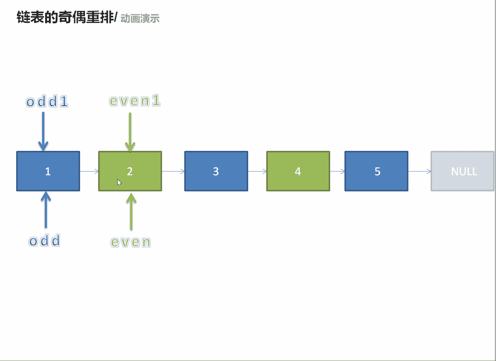

# 第八章 第 31 节 NC133 链表的奇偶重排

> 原文：[`www.nowcoder.com/tutorial/10072/e5000a2b1ff54958bf8a06b4f39e1d03`](https://www.nowcoder.com/tutorial/10072/e5000a2b1ff54958bf8a06b4f39e1d03)

### NC133 链表的奇偶重排

**- 1、题目描述：**


**- 2、题目链接：**

[`www.nowcoder.com/practice/02bf49ea45cd486daa031614f9bd6fc3?tpId=117&&tqId=35488&rp=1&ru=/ta/job-code-high&qru=/ta/job-code-high/question-ranking`](https://www.nowcoder.com/practice/02bf49ea45cd486daa031614f9bd6fc3?tpId=117&&tqId=35488&rp=1&ru=/ta/job-code-high&qru=/ta/job-code-high/question-ranking)
**-3、 设计思想：**

详细操作流程看下图：


**-5、代码：**
c++版本:

```cpp
 /**
 * struct ListNode {
 *    int val;
 *    struct ListNode *next;
 * };
 */

class Solution {
public:
    /**
     * 代码中的类名、方法名、参数名已经指定，请勿修改，直接返回方法规定的值即可
     * 
     * @param head ListNode 类 
     * @return ListNode 类
     */
    ListNode* oddEvenList(ListNode* head) {
        // write code here
        if(head == NULL || head->next == NULL){
            //如果头节点为空或者头节点的下一个节点为空直接返回
            return head;
        }
        ListNode* odd = head;//奇链表头节点 
        ListNode* even = head->next;//偶链表头节点
        ListNode* odd1 = odd;//进行奇链表的操作，最终成为奇链表尾节点
        ListNode* even1 = even;//进行偶链表的操作，最终成为偶链表尾节点
        while(odd1->next != NULL && even1->next != NULL){
            /*
            1->2->3->4->5
            */
            odd1->next = even1->next;//奇链表的下一个节点应该等于偶数链表的下一个节点,如奇链表 1 下一位应该指向 3
            odd1 = odd1->next;//奇链表指向下一个节点
            even1->next = odd1->next;//偶链表的下一个节点应该指向奇链表的下一个节点，如偶链表 2 下一位应该指向 4
            even1 = even1->next;//偶链表指向下一个节点
        }
        odd1->next = even;//最后将奇链表和偶链表拼接
        return odd;
    }
};

```

Java 版本：

```cpp
import java.util.*;

/*
 * public class ListNode {
 *   int val;
 *   ListNode next = null;
 * }
 */

public class Solution {
    /**
     * 代码中的类名、方法名、参数名已经指定，请勿修改，直接返回方法规定的值即可
     * 
     * @param head ListNode 类 
     * @return ListNode 类
     */
    public ListNode oddEvenList (ListNode head) {
        // write code here
        if(head == null || head.next == null){
            //如果头节点为空或者头节点的下一个节点为空直接返回
            return head;
        }
        ListNode odd = head;//奇链表头节点
        ListNode even = head.next;//偶链表头节点
        ListNode odd1 = odd;//进行奇链表的操作，最终成为奇链表尾节点
        ListNode even1 = even;//进行偶链表的操作，最终成为偶链表尾节点
        while(odd1.next != null && even1.next!= null)
        {
            /*
            1->2->3->4->5
            */
            odd1.next = even1.next;//奇链表的下一个节点应该等于偶数链表的下一个节点,如奇链表 1 下一位应该指向 3
            odd1 = odd1.next;//奇链表指向下一个节点
            even1.next = odd1.next;//偶链表的下一个节点应该指向奇链表的下一个节点，如偶链表 2 下一位应该指向 4
            even1 = even1.next;//偶链表指向下一个节点
        }
        odd1.next = even;//最后将奇链表和偶链表拼接
        return odd;
    }
}

```

Python 版本:

```cpp
# class ListNode:
#     def __init__(self, x):
#         self.val = x
#         self.next = None

#
# 代码中的类名、方法名、参数名已经指定，请勿修改，直接返回方法规定的值即可
# 
# @param head ListNode 类 
# @return ListNode 类
#
class Solution:
    def oddEvenList(self , head ):
        # write code here
        if head == None or head.next == None: return head#如果头节点为空或者头节点的下一个节点为空直接返回
        odd = head#奇链表头节点
        even = head.next#偶链表头节点
        odd1 = odd#进行奇链表的操作，最终成为奇链表尾节点
        even1 = even#进行偶链表的操作，最终成为偶链表尾节点
        while odd1.next != None and even1.next != None:
            #1->2->3->4->5
            odd1.next = even1.next#奇链表的下一个节点应该等于偶数链表的下一个节点,如奇链表 1 下一位应该指向 3
            odd1 = odd1.next#奇链表指向下一个节点
            even1.next = odd1.next#偶链表的下一个节点应该指向奇链表的下一个节点，如偶链表 2 下一位应该指向 4
            even1 = even1.next#偶链表指向下一个节点
        odd1.next = even#最后将奇链表和偶链表拼接
        return odd

```