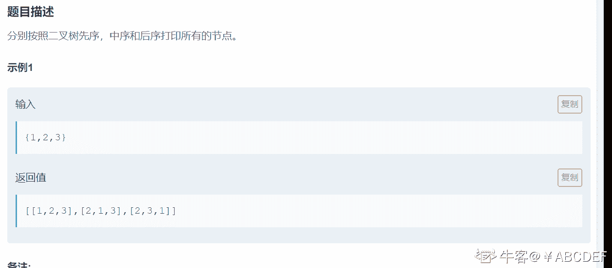

# 第八章 第 35 节 NC45 实现二叉树先序，中序和后序遍历（递归）

> 原文：[`www.nowcoder.com/tutorial/10072/43ac5ec4f3a24a1f80c0916562e53a1c`](https://www.nowcoder.com/tutorial/10072/43ac5ec4f3a24a1f80c0916562e53a1c)

### NC45 实现二叉树先序，中序和后序遍历（递归）

**- 1、题目描述：**


**- 2、题目链接：**
[`www.nowcoder.com/practice/a9fec6c46a684ad5a3abd4e365a9d362?tpId=117&tqId=37819&rp=1&ru=%2Factivity%2Foj&qru=%2Fta%2Fjob-code-high%2Fquestion-ranking&tab=answerKey`](https://www.nowcoder.com/practice/a9fec6c46a684ad5a3abd4e365a9d362?tpId=117&tqId=37819&rp=1&ru=%2Factivity%2Foj&qru=%2Fta%2Fjob-code-high%2Fquestion-ranking&tab=answerKey)

**-3、 设计思想：**


**-5、代码：**
c++版本:

```cpp
/**
 * struct TreeNode {
 *    int val;
 *    struct TreeNode *left;
 *    struct TreeNode *right;
 * };
 */

class Solution {
public:
    /**
     * 
     * @param root TreeNode 类 the root of binary tree
     * @return int 整型 vector<vector<>>
     */
     vector<int> pre;//存储先序遍历结果
     vector<int> in;//存储中序遍历结果
     vector<int> post;//存储后序遍历结果
         /*先序遍历*/
     void preOrderRecur(TreeNode *root) {
        if (root == nullptr) return;
        pre.push_back(root->val);//根
        preOrderRecur(root->left);//左
        preOrderRecur(root->right);//右
    }
     /*中序遍历*/
     void inOrderRecur(TreeNode *root) {
        if (root == nullptr) return;
        inOrderRecur(root->left);//左
        in.push_back(root->val);//根
        inOrderRecur(root->right);//右
    }
     /*后序遍历*/
     void posOrderRecur(TreeNode *root) {
        if (root == nullptr) return;
        posOrderRecur(root->left);//左
        posOrderRecur(root->right);//右
        post.push_back(root->val);//根
    }
    vector<vector<int> > threeOrders(TreeNode* root) {
        // write code here
        vector<vector<int>>res;//用于返回最终的结果
        if(root == nullptr) return res;
        preOrderRecur(root);//先序遍历
        inOrderRecur(root);//中序遍历
        posOrderRecur(root);//后序遍历
        res.push_back(pre);//将先序遍历放进 res
        res.push_back(in);//将中序遍历放进 res
        res.push_back(post);//将后序遍历放进 res
        return res;
    }
};
```

Java 版本：

```cpp
import java.util.*;

/*
 * public class TreeNode {
 *   int val = 0;
 *   TreeNode left = null;
 *   TreeNode right = null;
 * }
 */

public class Solution {
    /**
     * 
     * @param root TreeNode 类 the root of binary tree
     * @return int 整型二维数组
     */
    ArrayList<Integer> pre = new ArrayList<Integer>();//存储先序遍历结果
    ArrayList<Integer> in = new ArrayList<Integer>();//存储中序遍历结果
    ArrayList<Integer> post = new ArrayList<Integer>();//存储后序遍历结果
    public int[][] threeOrders (TreeNode root) {
        // write code here
        if(root == null) return new int[][]{{}};//根节点为空直接返回
        ArrayList<ArrayList<Integer>> res = new ArrayList<>();//临时存储最终结果
        preOrderRecur(root);//先序遍历
        inOrderRecur(root);//中序遍历
        posOrderRecur(root);//后序遍历
        res.add(new ArrayList(pre));//将先序遍历放进 res
        res.add(new ArrayList(in));//将中序遍历放进 res
        res.add(new ArrayList(post));//将后序遍历放进 res
        int [][]ans = new int[res.size()][res.get(0).size()];//用于返回最终的结果
        ///需要将 res 的结果复制到 ans 里面
        for(int i = 0;i < res.size();i ++){
            for(int j = 0;j < res.get(0).size();j ++){
                ans[i][j] = res.get(i).get(j);
            }
        }
        return ans;
    }

    /*先序遍历*/
    public void preOrderRecur(TreeNode root) {
        if (root == null) return;
        pre.add(root.val);//根
        preOrderRecur(root.left);//左
        preOrderRecur(root.right);//右
    }
     /*中序遍历*/
    public void inOrderRecur(TreeNode root) {
        if (root == null) return;
        inOrderRecur(root.left);//左
        in.add(root.val);//根
        inOrderRecur(root.right);//右
    }
     /*后序遍历*/
    public void posOrderRecur(TreeNode root) {
        if (root == null) return;
        posOrderRecur(root.left);//左
        posOrderRecur(root.right);//右
        post.add(root.val);//根
    }
}

```

Python 版本:

```cpp
# class TreeNode:
#     def __init__(self, x):
#         self.val = x
#         self.left = None
#         self.right = None

#
# 
# @param root TreeNode 类 the root of binary tree
# @return int 整型二维数组
#
class Solution:
    #先序遍历
    pre,inn,post=[],[],[]#分别用来存储先序遍历结果、中序遍历结果、后序遍历结果
    def preOrderRecur(self ,root):
        if root == None: return
        self.pre.append(root.val)#根
        self.preOrderRecur(root.left)#左
        self.preOrderRecur(root.right)#右

    #中序遍历
    def inOrderRecur(self ,root):
        if (root == None) :return
        self.inOrderRecur(root.left)#左
        self.inn.append(root.val)#根
        self.inOrderRecur(root.right)#右

    #后序遍历
    def posOrderRecur(self , root):
        if (root == None) :return
        self.posOrderRecur(root.left)#左
        self.posOrderRecur(root.right)#右
        self.post.append(root.val)#根

    def threeOrders(self , root ):
        # write code here
        res = []
        #应该后台是多组数据所以需要清空
        self.pre.clear()
        self.inn.clear()
        self.post.clear()
        if root == None: return res
        self.preOrderRecur(root)#先序遍历
        self.inOrderRecur(root)#中序遍历
        self.posOrderRecur(root)#后序遍历
        res.append(self.pre)#将先序遍历放进 res
        res.append(self.inn)#将中序遍历放进 res
        res.append(self.post)#将后序遍历放进 res
        return res
```