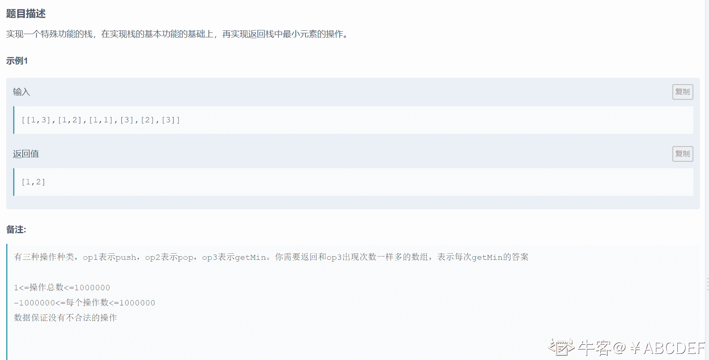
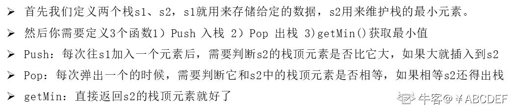
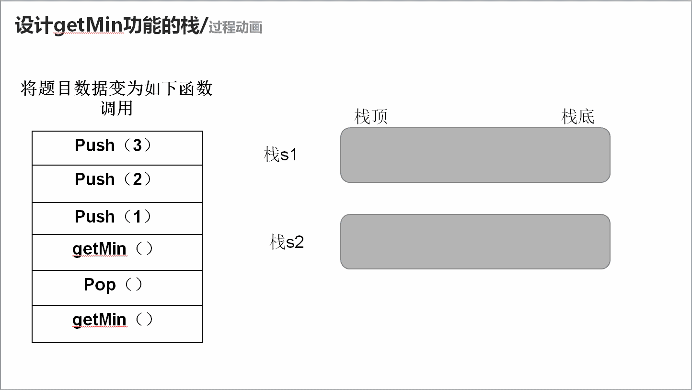

# 第八章 第 36 节 NC90 设计 getMin 功能的栈

> 原文：[`www.nowcoder.com/tutorial/10072/83190eba15574d91abbd2d0994a8adc9`](https://www.nowcoder.com/tutorial/10072/83190eba15574d91abbd2d0994a8adc9)

### NC90 设计 getMin 功能的栈

**- 1、题目描述：**


**- 2、题目链接：**
[`www.nowcoder.com/practice/c623426af02d4c189f92f2a99647bd34?tpId=188&tqId=37556&rp=1&ru=%2Fta%2Fjob-code-high-week&qru=%2Fta%2Fjob-code-high-week%2Fquestion-ranking&tab=answerKey`](https://www.nowcoder.com/practice/c623426af02d4c189f92f2a99647bd34?tpId=188&tqId=37556&rp=1&ru=%2Fta%2Fjob-code-high-week&qru=%2Fta%2Fjob-code-high-week%2Fquestion-ranking&tab=answerKey)

**-3、 设计思想：**

详细操作流程看下图：


**-5、代码：**
c++版本:

```cpp
 class Solution {
public:
    /**
     * return a array which include all ans for op3
     * @param op int 整型 vector<vector<>> operator
     * @return int 整型 vector
     */
     stack<int> s,min_s;//s 用来存数据，min_s 用来获取最小值
    vector<int> getMinStack(vector<vector<int> >& op) {
        // write code here
        vector<int> res;//结果集
        for (int i = 0; i < op.size(); i++) {
            if(op[i][0] == 1)//为 1 就入栈
                Push(op[i][1]);
            else if (op[i][0] == 2)//为 2 就出栈
                Pop();
            else //为 3 就返回栈中最小元素
                res.push_back(getMin());
        }
        return res;

    }
    void Push(int x){
        s.push(x);
        if(min_s.empty() || min_s.top() >= x) min_s.push(x);//如果 min_s 为空,或者栈顶元素大于 x 就进入 min_s

    }
    void Pop() {
        if(!s.empty()){
            if(s.top() == min_s.top()) min_s.pop();//如果 min_s 栈顶元素和栈 s 中要出栈的元素相等，那么也需要出栈
            s.pop();

        }
    }
    int getMin(){
        return min_s.top();//栈 min_s 的栈顶元素即为最小值
    }
};

```

Java 版本：

```cpp
import java.util.*;

public class Solution {
    /**
     * return a array which include all ans for op3
     * @param op int 整型二维数组 operator
     * @return int 整型一维数组
     */
    public static Stack<Integer>s = new Stack<Integer>();//s 用来存数据
    public static Stack<Integer>min_s = new Stack<Integer>();//min_s 用来获取最小值
    public int[] getMinStack (int[][] op) {
        // write code here
        ArrayList<Integer> res = new ArrayList<Integer>();//结果集
        for (int i = 0;i<op.length;i++){
            if (op[i][0] == 1){ //为 1 就入栈
                Push(op[i][1]);
            }else if (op[i][0] == 2){//为 2 就出栈
                Pop();
            }else//为 3 就返回栈中最小元素
                res.add(getMin());
        }
        //因为返回类型的缘故我们需要把 res 中的元素丢在 arr 数组里面
        int [] arr = new int[res.size()];
        for (int i = 0;i< res.size();i++){
            arr[i] = res.get(i);
        }
        return arr;

    }
    public void Push(int x){
        s.push(x);
        if(min_s.empty() || min_s.peek()>=x)min_s.push(x); //如果 min_s 为空,或者栈顶元素大于 x 就进入 min_s
    }
    public void Pop() {
        if(!s.empty()){
            if(s.peek().equals(min_s.peek())) min_s.pop();//如果 min_s 栈顶元素和栈 s 中要出栈的元素相等，那么也需要出栈
            s.pop();
        }   

    }
    int getMin(){
        return min_s.peek();//栈 min_s 的栈顶元素即为最小值
    }

}
```

Python 版本:

```cpp
#
# return a array which include all ans for op3
# @param op int 整型二维数组 operator
# @return int 整型一维数组
#
class Solution:
    s = []
    min_s = []
    def getMinStack(self , op ):
        # write code here
        res = []
        for i in range(len(op)):
            if op[i][0] == 1:#为 1 就入栈
                self.Push(op[i][1])
            elif op[i][0] == 2:#为 2 就出栈
                self.Pop()
            else:#为 3 就返回栈中最小元素
                res.append(self.getMin())
        return res

    def Push(self,x):
        self.s.append(x)
        if not self.min_s or self.min_s[-1] >= x: self.min_s.append(x) #如果 min_s 为空,或者栈顶元素大于 x 就进入 min_s

    def Pop(self):
        if self.s:
            if  self.s[-1]== self.min_s[-1] : self.min_s.pop() #如果 min_s 栈顶元素和栈 s 中要出栈的元素相等，那么也需要出栈
            self.s.pop()
    def getMin(self):
        return self.min_s[-1] #栈 min_s 的栈顶元素即为最小值

```