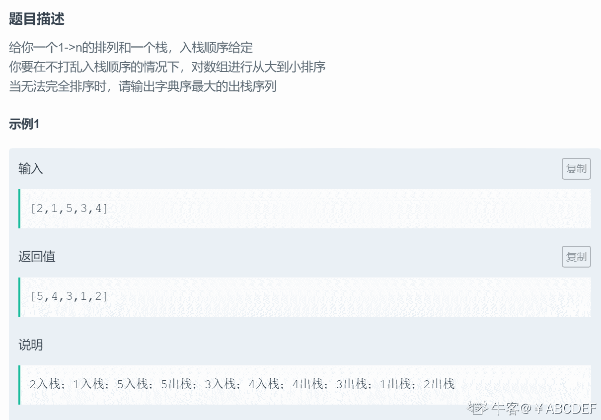
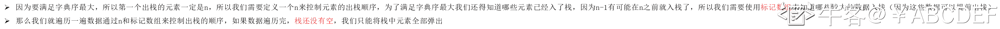
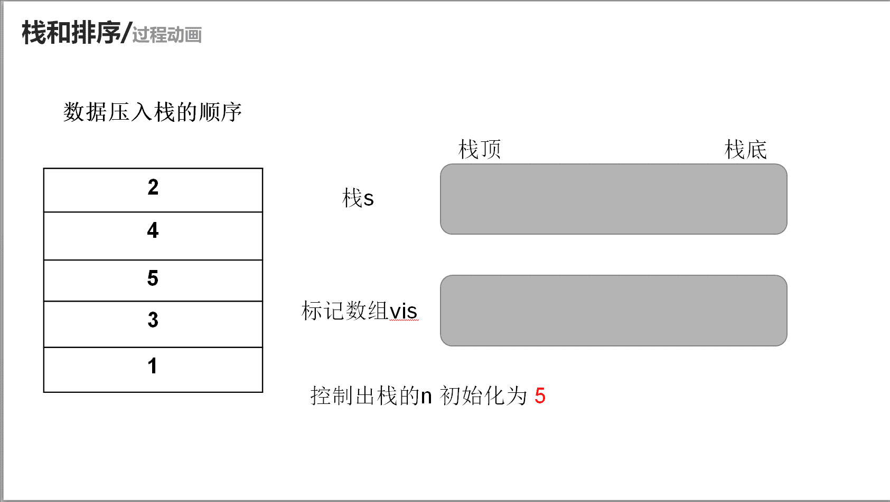

# 第八章 第 38 节 NC115 栈和排序

> 原文：[`www.nowcoder.com/tutorial/10072/17cba097843f4df79583e912a81db16a`](https://www.nowcoder.com/tutorial/10072/17cba097843f4df79583e912a81db16a)

### NC115 栈和排序

**- 1、题目描述：**


**- 2、题目链接：**

[`www.nowcoder.com/practice/95cb356556cf430f912e7bdf1bc2ec8f?tpId=117&tqId=37839&rp=1&ru=%2Factivity%2Foj&qru=%2Fta%2Fjob-code-high%2Fquestion-ranking&tab=answerKey`](https://www.nowcoder.com/practice/95cb356556cf430f912e7bdf1bc2ec8f?tpId=117&tqId=37839&rp=1&ru=%2Factivity%2Foj&qru=%2Fta%2Fjob-code-high%2Fquestion-ranking&tab=answerKey)
**-3、 设计思想：**

详细操作流程看下图：


**-5、代码：**
c++版本:

```cpp
class Solution {
public:
    /**
     * 栈排序
     * @param a int 整型一维数组 描述入栈顺序
     * @param aLen int a 数组长度
     * @return int 整型 vector
     */
    vector<int> solve(int* a, int aLen) {
        stack<int>s;//定义一个栈用来存储数据
        int n = aLen;
        vector<int>res;//用来返回结果
        vector<bool> vis(aLen + 10,0);//用来标记哪个数字出现过
        for(int i = 0;i < aLen;i ++){//遍历数组
            s.push(a[i]);//压入栈
            vis[a[i]] = 1;//压入一个数就把对应的数字标记为 1
            while(n && vis[n]) n--;//检测现有栈中有多少个数出现了就是较大的哪些数出现了（从大到小）
            while(!s.empty() && n <= s.top()){
                //然后将栈中>=n 的元素出栈
                res.push_back(s.top());
                s.pop();
            }
        }
        //如果栈没为空就按照栈中原样直接出栈
        while(!s.empty()){
            int temp = s.top();
            res.push_back(temp);
            s.pop();
        }
        return res;
    }
}; 

```

Java 版本：

```cpp
import java.util.*;

public class Solution {
    /**
     * 栈排序
     * @param a int 整型一维数组 描述入栈顺序
     * @return int 整型一维数组
     */
    public int[] solve (int[] a) {
        // write code here
        Stack<Integer> s = new Stack<>();//定义一个栈用来存储数据
        int n = a.length;
        int []res = new int[n];//用来返回结果
        int cnt = 0;
        boolean []vis = new boolean[n+10];//用来标记哪个数字出现过
        for(int i =0;i < a.length;i ++){//遍历数组
            s.push(a[i]);//压入栈
            vis[a[i]] = true;//压入一个数就把对应的数字标记为 true
            while(n>0&& vis[n]) n--;//检测现有栈中有多少个数出现了就是较大的哪些数出现了（从大到小）
            while(!s.empty() && n <= s.peek()){
                //然后将栈中>=n 的元素出栈
                res[cnt ++] = s.pop();
            }
        }
        //如果栈没为空就按照栈中原样直接出栈
        while(!s.empty()){
            res[cnt++] = s.pop();
        }
        return res;
    }
}

```

Python 版本:

```cpp
#
# 栈排序
# @param a int 整型一维数组 描述入栈顺序
# @return int 整型一维数组
#
class Solution:
    def solve(self , a ):
        # write code here
        s = [] #定义一个栈用来存储数据(我们用数组来模拟)
        n  = len(a)
        res = []#用来返回结果
        vis = [0] *(n+10)#用来标记哪个数字出现过
        for i in a:
            s.append(i)#压入栈
            vis[i] = 1#压入一个数就把对应的数字标记为 1
            while n and vis[n]: n-=1#检测现有栈中有多少个数出现了就是较大的哪些数出现了（从大到小）
            while s and n <= s[-1]:
                #然后将栈中>=n 的元素出栈
                res.append(s[-1])
                s.pop()
        #如果栈没为空就按照栈中原样直接出栈
        while s:
            res.append(s[-1])
            s.pop()
        return res

```