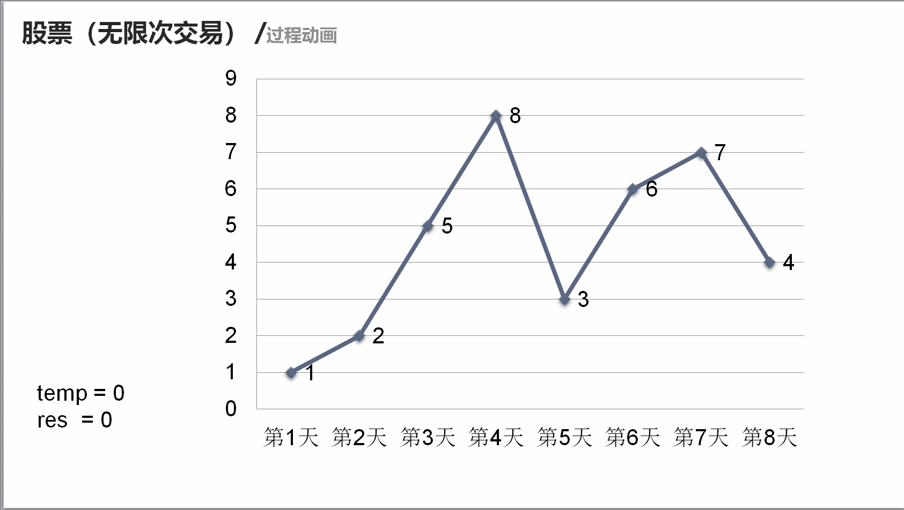

# 第八章 第 40 节 NC134 股票（无限次交易）

> 原文：[`www.nowcoder.com/tutorial/10072/0b2f7c0948684734a40ccfc106491c57`](https://www.nowcoder.com/tutorial/10072/0b2f7c0948684734a40ccfc106491c57)

### NC134 股票（无限次交易）

**- 1、题目描述：**


**- 2、题目链接：**

[`www.nowcoder.com/practice/9e5e3c2603064829b0a0bbfca10594e9?tpId=117&tqId=37846&rp=1&ru=%2Factivity%2Foj&qru=%2Fta%2Fjob-code-high%2Fquestion-ranking&tab=answerKey`](https://www.nowcoder.com/practice/9e5e3c2603064829b0a0bbfca10594e9?tpId=117&tqId=37846&rp=1&ru=%2Factivity%2Foj&qru=%2Fta%2Fjob-code-high%2Fquestion-ranking&tab=answerKey)
**-3、 设计思想：**

详细操作流程看下图：


**-5、代码：**
c++版本:

```cpp
class Solution {
public:
    /**
     * 代码中的类名、方法名、参数名已经指定，请勿修改，直接返回方法规定的值即可
     * 计算最大收益
     * @param prices int 整型 vector 股票每一天的价格
     * @return int 整型
     */
    int maxProfit(vector<int>& prices) {
        // write code here
        int res = 0;//代表最终收益
        for(int i= 1;i < prices.size();i ++){
            int temp = prices[i]-prices[i-1];//收益
            if(temp > 0) res += temp;//如果为正收益就加和
        }
        return res;
    }
}; 

```

Java 版本：

```cpp
import java.util.*;

public class Solution {
    /**
     * 代码中的类名、方法名、参数名已经指定，请勿修改，直接返回方法规定的值即可
     * 计算最大收益
     * @param prices int 整型一维数组 股票每一天的价格
     * @return int 整型
     */
    public int maxProfit (int[] prices) {
        // write code here
        int res = 0;//代表最终收益
        for(int i= 1;i < prices.length;i ++){
            int temp = prices[i]-prices[i-1];//收益
            if(temp > 0) res += temp;//如果为正收益就加和
        }
        return res;
    }
}

```

Python 版本:

```cpp
#
# 代码中的类名、方法名、参数名已经指定，请勿修改，直接返回方法规定的值即可
# 计算最大收益
# @param prices int 整型一维数组 股票每一天的价格
# @return int 整型
#
class Solution:
    def maxProfit(self , prices ):
        # write code here
        res = 0#代表最终收益
        for i in range(1,len(prices)):
            temp = prices[i] - prices[i-1]#收益
            if temp > 0: res += temp#如果为正收益就加和
        return res

```