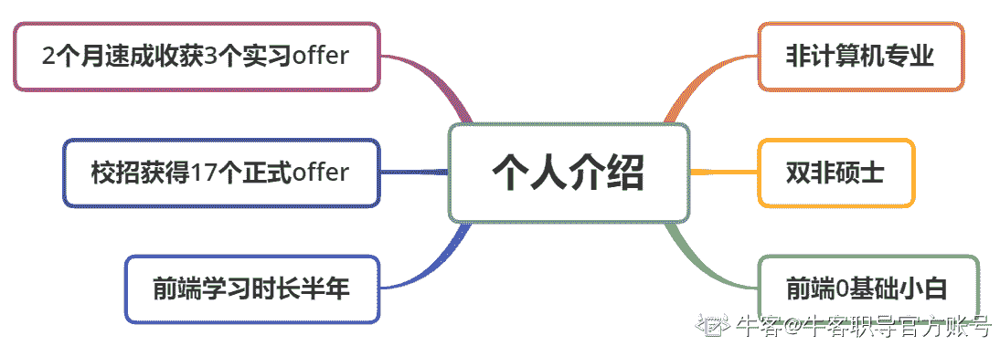

# 第一章 第 1 节 专刊介绍

> 原文：[`www.nowcoder.com/tutorial/10091/fdde7d829d5c451d9b38a2ff042a6a28`](https://www.nowcoder.com/tutorial/10091/fdde7d829d5c451d9b38a2ff042a6a28)

### 1 专刊介绍

#### 1.1 个人介绍

大家好，我是桃子，是一个刚经历过校招的应届毕业生，同时也是某知名大厂前端核心部门待入职员工。在 2020 年暑假实习校招中，拿下了涂鸦、海康、政采云三个实习 offer。在秋季校园招聘***投递了 78 家公司，其中收获了 17 个正式 offer，如 shopee、滴滴、哈啰出行、有赞、酷家乐等互联公司，并有浙商、工商等银行类公司。

同时，我也是一个跨专业的前端 0 基础小白。在较短时间内，我之所以能通过校招这门至关重要的“考试”，是因为我在实习与校招期间具有丰富的被面试经验，总结了一套有效针对校招的学习方法，本专刊则是结合校招亲身经历，全方位总结前端岗校招面试真题，并对其进行详细分析与解答。

#### 1.2 专刊特点

*   全方位覆盖前端岗技术栈中常见面试题，大幅度提升校招备战效率

*   脚踏实地从一个个面试题出发，详细分析各题技术原理以及答题思路

*   结合真实校招经历，代入感强，作为跨专业求职的我，具有更加丰富的备战经历

*   通俗易懂，无技术门槛，适用于各阶段求职者，无论你是前端小白还是技术大牛，都能助你顺利获得心仪的 offer

#### 1.3 专刊适宜人群

*   将前端作为校招目标岗位的在校生

*   想巩固前端基础，并且在技术方面想有一定提升的前端开发工程师

*   准备跳槽或参加社招的有一两年工作经验的前端开发工程师

#### 1.4 学习该专刊有何收获

*   对前端技术栈中的各个核心技术获得一定的理解与学习

*   分模块掌握前端岗位面试中的高频考点及其解析

*   透过问题看本质，从每个面试题出发，参透其背后的实现原理

*   笔者亲测有效的一些校招学习方案与备战技巧