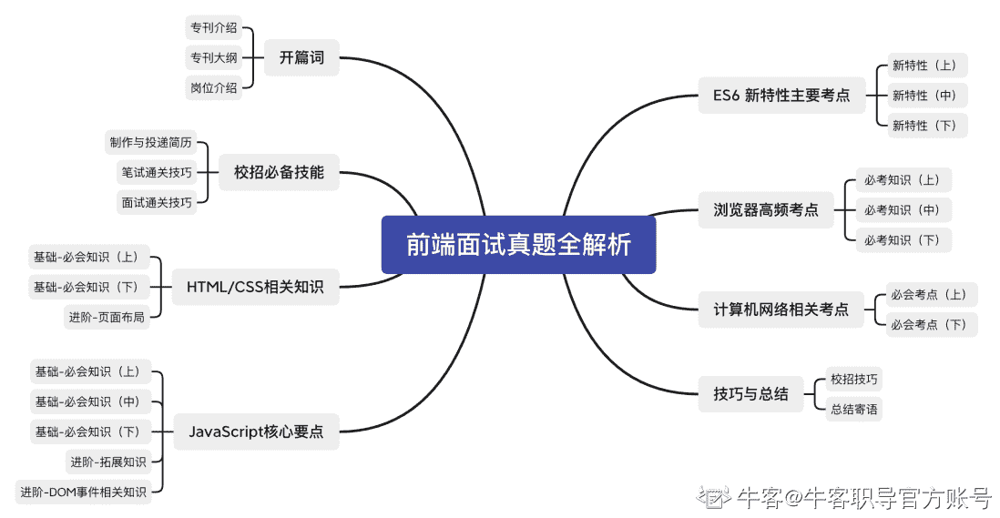

# 第一章 第 2 节 专刊大纲与校招技能树

> 原文：[`www.nowcoder.com/tutorial/10091/c2b2d2a6b47b4d0d9bb5a8262dfd6f7d`](https://www.nowcoder.com/tutorial/10091/c2b2d2a6b47b4d0d9bb5a8262dfd6f7d)

#### 专刊大纲

本专刊将从前端岗技术栈出发，分模块剖析各类常见面试题，层层递进，旨在带领大家掌握题目背后的技术原理，主要将根据以下大纲进行讲解与总结：