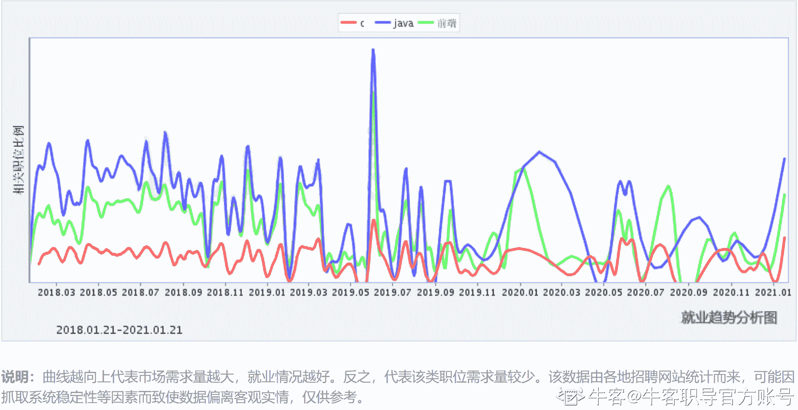

# 第一章 第 3 节 岗位介绍

> 原文：[`www.nowcoder.com/tutorial/10091/39f4bcac395349799dcb2d5c7385cc84`](https://www.nowcoder.com/tutorial/10091/39f4bcac395349799dcb2d5c7385cc84)

#### 1 工作内容

前端岗的主要工作是开发 Web 页面或 app 等前端界面，利用 HTML，CSS 及 JavaScript 以及衍生出来的各种技术、框架、解决方案，实现互联网产品的用户界面交互功能。早年 Web1.0 时期，主要工作重心为网页制作，开发内容多为静态，以图片和文字为主，用户行为也以浏览网站为主。随着互联网的蓬勃发展和各类框架盛行，现阶段网页更加美观，更注重交互功能，同时小程序开发、移动端开发也是当下前端岗热点。

虽说都叫前端岗，但不同部门有可能会根据业务方向做进一步的技术划分，可参考公司发布的岗位招聘需求，下图是百度三个不同部门前端开发工程师的招聘需求：

第一个部门：

第二个部门：

第三个部门：

明显可见，第一个部门更偏向于前端主流框架开发，对 HTML/CSS/JS 基础要求较高。第二个部门的开发工作更偏向于移动端开发，比如 H5 开发、hybrid 开发或小程序开发。第三个部门的工作焦点在与图形动画绘制与渲染，对一些图形学技术、3d 游戏开发技术有一定的要求。        故大家开始准备校招时，掌握前端基础知识的同时，应拓宽技术面，关注行业技术热点，与时俱进地学一些较为“吃香”的技术，才能在校招时优势满满。

#### 2 校招概况

##### 2.1 需求量

下图是某招聘网站的 2020 互联网春招报告中校招需求量排名情况，从图中明显看出：Web 前端工程师对比其他岗位，需求量高达第 3 名。
下图是某招聘网站统计的 2018 年 1 月~2021 年 1 月的岗位市场需求量对比图，其中，红色为 C++岗，蓝色为 java 岗，绿色为前端岗。明显看出，前端岗市场需求量远高于 c++，在校招高峰时期，需求量不亚于 java 开发。

虽说各网站样本数据有限，仅供参考，但纵观近几届校招形势，市场需求处于稳定上升状态。前端岗与 java 开发、c++开发、python 开发等统一划分为开发岗。对于招聘企业角度，前端岗业务范围逐渐扩大，需求量随之增加；对于应聘者角度，随着越来越多前端技术大牛的产生，岗位热度也随之上升。

##### 2.2 薪资情况

下图是某招聘网站统计的前端岗在杭州地区以及全国工资情况。

下图是某招聘网站统计的 2021 届秋招互联网行业的薪资情况。

由两图可得，前端岗在校招中的平均薪资在 14~15k/月，在整个行业（包含各类工作年限）中的薪资范围大约在 10~20k/月。另外，在牛客网-发现-[查薪资](https://www.nowcoder.com/offer/show-v2/index)中可查询各公司各岗位历年具体薪资情况，大家在后续谈薪资时可做参考。

薪资受地域、公司类型等多方面原因影响，各平台数据仅能起参考作用，但依据个人校招经历，对比前几年，前端岗薪资是有大幅上涨的，现阶段，绝大部分公司给出的起薪是和 c++岗、java 岗一样的，若面试表现优异，甚至还要更高。

##### 3.3 岗位特点

从个人校招经历来说，前端岗的主要特点可分为以下几点：

*   需求受整体形势影响较小，可以说绝大部分互联网公司对前端岗都有一定的需求，甚至多于其他技术岗

*   简历筛选通过率相对较大，技术栈较独立，不需要对操作系统、数据结构算法等课程有深层次掌握(部分大厂除外），只要技术方向与部门业务挂钩，或学的框架与项目经历符合招聘需求，基本上都有笔试机会

*   前端岗知识点大多分布零散，且各技术框架更新速度快，除了打牢基础，还需要结合实际开发场景、行业内最新技术咨询等，不断地拓宽知识广度。