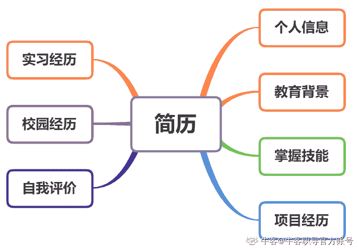
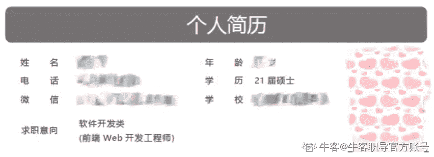
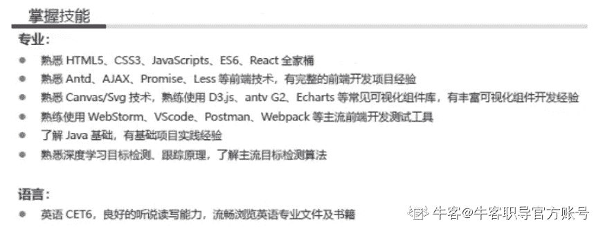
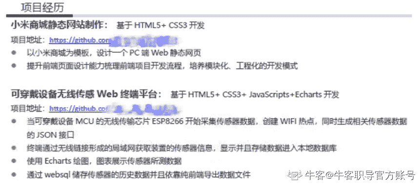

# 第二章 第 1 节 制作与投递简历

> 原文：[`www.nowcoder.com/tutorial/10091/b8c1b9e8b9d841fd98487484462092bc`](https://www.nowcoder.com/tutorial/10091/b8c1b9e8b9d841fd98487484462092bc)

### 1 制作与投递简历

纵观整个校招阶段，要想获得心仪的 offer，除了不断增强专业技能以外，求职技能也至关重要。通过个人与周遭同学的校招经历，我逐渐认识到，简历不仅仅只有获得笔试机会一个作用，在校招的每个环节都发挥着至关重要的作用，相当于校招“敲门砖”+“身份证”，一份高质量的简历不仅可以顺利通过一次次简历筛选，同时能打造一个良好的初印象。下面，让我们一起来看看校招简历的制作与投递。

#### 1.1 制作简历

如何制作高质量校招简历，首先应注意以下几个要点：

*   突出个人优势

一般 HR 或面试官浏览一份简历时间不会超过两分钟，如何快速引起 HR 或面试官的兴趣呢？突出个人优势很重要，只有展示出更多的就业优势，才能更有力度地“推销”自己。通常建议简历篇幅在 2 页内，可利用一些关键点强调优势，如：985 硕/博、某大厂实习经历、某大赛 TOP3、某国家级项目负责人等等。

*   不可过分夸大，所写即所会

突出优势固然重要，但切记不可夸大，写一堆“空头支票”，哪怕有幸进入面试环节，面试官依照简历随便提几个问题便漏洞百出。在校招期间，HR 和面试官们平均一天要看几十封简历，故简历中提到的点都应该符合真实情况。同时，在简历中的每个技能点、每个项目都应该有一定的了解，所写即所会，一些高频考点底层原理也应该一清二楚。

*   增强匹配度，紧贴招聘需求

虽说都属于前端方向，但不同公司不同团队业务方向不同，技术需求自然不同，对应需要的人才技能方向也不同，通常，HR 和面试官们是带着“目的”去筛选简历的。比如，A 部门需要一个会 React 框架的，如果你的简历中提到熟练使用 React 框架，并配有丰富的开发经历，那你自然能顺利进入候选队伍；B 部门是一个可视化团队，需要有可视化方面开发经验，如你的简历正好符合该条件，那你自然对比其他同学多了一份优势。

故在挑选目标公司或投简历之前，多浏览招聘需要，根据需求去完善简历，查漏补缺，扩充技能点。

校招简历一般由下图几个板块组成，下面将对各模块进行详细介绍，手把手带你制作一份面试官真正想要看到的优秀简历。

*   个人信息

在简历的开始，应该准确列出基本个人信息，主要包含：姓名、年龄、联系方式、学历、学校、求职意向等。通常需写 1~2 个有效联系方式，因为会依据简历中的联系方式发放后续校招通知（一般是邮箱/电话）。这里给出本人简历中对应部分，仅供参考：

*   教育背景

这个部分一般注明本科、硕士、博士教育经历，一般写时间、学校、专业、成绩（较好的话写进去，不好的话最好别写），成绩可通过绩点或排名（注明总人数）形式体现。这里给本人简历中对应部分，仅供参考：

*   掌握技能

与所投岗位相关的技能掌握是校招考核的重点，也是简历的重要组成部分，技能主要分为专业技能和其他技能。

1.  专业技能：

主要包含以前端方面为主，你所了解、熟悉或掌握的所有专业性技术点。各技能点可根据基础—进阶—高级依次阐述，以层层递进的方式构建一个立体技术框架，侧面体现出你对前端整体技术体系有一个完整的认识。

应特别注意技能掌握程度的描述词，尽可能保持客观态度，避免使用主观意识较强的修饰词，如“优秀”、“较好”、“较强”等。可以使用“精通”、“熟练掌握”、“熟悉”、“了解”直接代表不同掌握程度，直接且客观。但尽量少写“精通 XX 技术”，面试官一但捕捉到“精通”两字，会直接拉高期待值，除非你能保证能招架住面试官的各类问题，不然只会弄巧成拙。

与前端无关的一些专业技能，如果你掌握程度较好，可进行简洁说明。各个岗位并不是独立技术体系，各公司也不可能只做前端，肯定会有一些交叉技术。例如在我简历中就提到研究生阶段从事深度学习相关技术研究，面试时就遇到了解该领域的面试官，不仅在前端方面对我进行考核，同时也聊到了关于深度学习方面的问题，相较于其他只懂前端的同学，算是多了一个加分项。

1.  其他技能：

一般指语言技能和岗位以外的技能。语言技能一般写四六级情况，四六级分数较高可在后面备注分数。如有一些岗位相关的特殊学习经历也可以放进去，但篇幅不宜过长，简洁一句话说明即可。

这里给出本人简历中对应部分，仅供参考：

*   项目经历

这一部分也是简历的重要一环，实际项目是掌握技能点的支撑。对于大多数技术出身的面试官来说，你理论知识掌握得再丰富，都不如几个实打实的项目来得实在，项目规模与难度能直接反映出你的技术水平，面试官也能直接考察项目***能点的实现方式与遇到的实际问题。

在筛选项目时应该：

*   完全掌握项目细节，都能做到对答如流，尤其是各个功能点所对应的技术点，要深入了解其底层原理，为什么要选择该技术，优缺点是什么，有没有进一步优化方案，这都是面试中项目部分的考核重点。

*   要写能证明技术实力的项目，一般项目数量控制在 4 个左右。过于简单的项目以及和岗位毫无关联的项目不要写，一些过于简单或“烂大街”的项目体现不出任何技术差异，若你的简历中的项目与前端毫无关联，无论项目规模如何，通常情况也不属于考核范围内，因为和后期工作关联不大。

简历中的每个项目都应该说明主要职责与项目内容，若有对应的项目链接（如 github 代码仓库）可注明链接。

*   主要职责是指你在项目中所负责的工作内容，比如：负责前端页面开发、负责页面渲染性能优化等等。可参考各公司发布的前端岗招聘需求，会写得比较专业一些。若达到一些可量化成绩，最好用数据增强说服力，比如通过 XX 方案性能优化后，页面刷新率提高了 XX%。

*   对于项目内容的叙述，尽量用简洁明了的陈述句。一般包含：任务场景+技术方案+取得成果，连起来就是：为了实现 XX 任务，采用 XX 技术方案，最终取得了 XX 效果。具体技术方案可以分功能点介绍，比如利用 HTML5+CSS3 技术搭建基础前端页面、利用 Ajax+Promise 技术实现前后台数据交互等。这里给出本人简历中的对应部分，仅供参考：

*   实习经历

在技术岗校招中实习经历是绝对的加分项，一般需要写明实习时间、公司和具体工作内容，若所在部门是重要部门也可以加上部门名称。工作内容与项目经历类似，可以根据工作职责或具体项目进行介绍：

*   工作职责是你实习期间所负责的日常工作，同样可参考岗位招聘需求写，切记不可只是简短的“负责 XX 工作”，应该用一些专业技术和功能化术语做支撑，如利用 XX 框架负责 XX 平台开发，若实习期间所负责的项目不多，可详细介绍工作职责。

*   若在实习期间接触或负责了一些具体项目，可以采用上面项目经历一样的写法写在实习经历中。这里给出本人简历中对应部分，仅供参考：

*   自我评价

这部分可以认为是：总结你有哪些优势和特点比其他同学更适合这个岗位，同样参考目标公司对前端岗的招聘需求，提炼出符合自身情况的点写进去。但不可过分自大，写得自己优势满满，但面试表现却差强人意，这也是校招中的一大禁忌。

除了一些总结性的自我评价外，还可以利用一些额外优势去表现自己，比如有前端领域个人公众号（关注量 XXX）、个人 CSDN 博客（累计 XXX 篇）、githubXXX 个项目，并写上对应链接，部门面试官可能会在面试前提前了解。这里给出本人简历中对应部分，仅供参考：

#### 1.2 投递简历

在投简历时，主要有以下几点注意事项：

1.  能内推投就不要官网投

通常有官网或内推两种投简历方式，但相较于官网投简历，通过内推能大大增加简历筛选通过率（部分公司内推帖中会直接表明免简历筛选），一般是能优先处理简历的。在校招时，我和室友投一家公司同一个岗位，我内推投的没几天就收到了笔试通知，她在官网投的，到校招结束时都没收到任何消息。所以一定要内推！

1.  内推方式

基本上公司内部员工都有内推名额，可以找前几届进了该公司的学长学姐内推。另外，在牛客网-[内推广场](https://www.nowcoder.com/discuss/referral/all/index)中搜索公司名称，会有很多公司员工发布的内推贴，找一个有效的内推链接投简历就行。

1.  关注内推结果

最好每次投完简历后记下内推人的联系方式，以便后续查询简历状态。通常各公司负责招聘的 HR 在校招时会在牛客网发推广贴，在校招过程中遇到任何问题也能在平台上咨询对方。

#### 1.3 总结

本节主要探讨了简历的制作与投递，希望上述经验与建议能带给大家一些实质性的帮助！