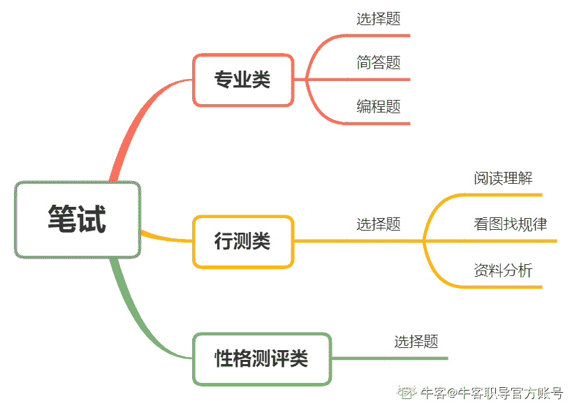
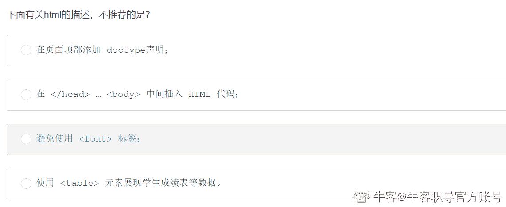
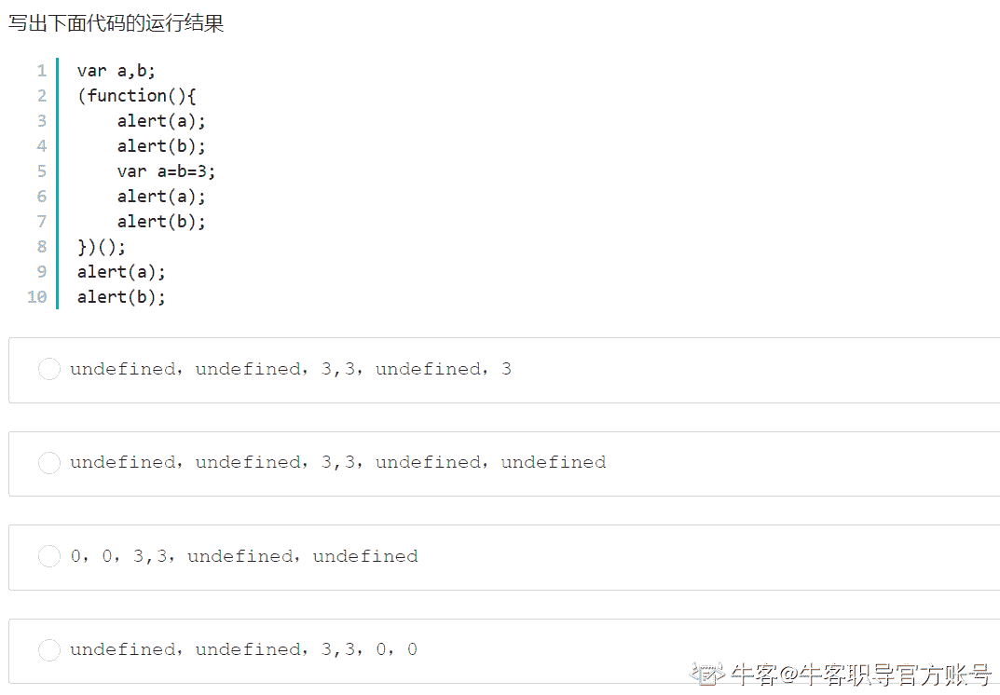
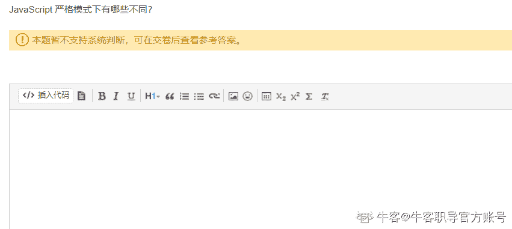
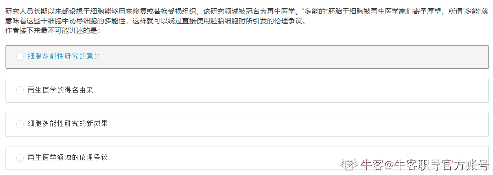
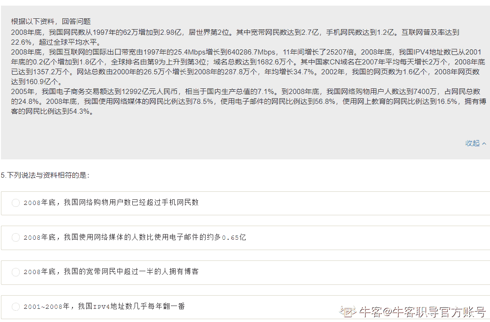

# 第二章 第 2 节 笔试通关技巧

> 原文：[`www.nowcoder.com/tutorial/10091/0a55f4ac35144d0f91ebe2d8f3fc9131`](https://www.nowcoder.com/tutorial/10091/0a55f4ac35144d0f91ebe2d8f3fc9131)

简历筛选通过后，就正式进入笔试阶段啦！通常校招笔试分专业类、行测类、性格测评三大类，不同类型题目考题类型、特点均不同，应采取针对性准备工作，下面将按类别进行展开性分析。

### 1 专业类

专业类笔试是对前端相关专业知识的考核，一般分为选择题、问答题、编程题三种题型。

*   选择题：

通常是 10~20 个单选题，0~10 个多选题。其覆盖的知识范围非常广泛，且比较琐碎，除了 HTML、CSS、JS、ES6 新特性相关知识是高频考点以外，数据结构、操作系统相关的也是常考点，常规题型如下图所示：

但需格外注意，除了常规文字类选择题以外，近几年“伪选择题”出现频率越来越高，主要是一些伪装成选择题的代码题，如下图例题所示，虽出现在选择题中，但实则是以代码考核的形式，这类题通常不仅仅是背了某个知识点就能看出答案，需要仔细看代码，甚至需要一定的计算量才能得出答案。

前端岗的主观题大多是一些功能设计题，没有固定答案，通常题目内会给出几点功能需求，难度依次递增，简单的可能用 HTML+CSS+JS 就能实现，较难的可能会涉及到前后端数据传输或者动画效果开发。但不同于编程题，这类题目是按功能点给分， 基本上写了就会给分。如下图例题，todoList1 用 HTML+CSS 实现界面，todoList2、3 要设置变量实现增删功能，todoList4 要使用正则表达式实现模糊匹配功能。

简答题也有较强的随机性，不适合额外花很多时间去刷一些固定题目，最好是多积累+多总结，客观题的一些考点往往也是面试时的高频考点，在平时的学习中打好基础，这类题目自然迎刃而解。另外，遇到经典设计型例题时，可以记在笔记里，以供后期项目开发中使用。

*   编程题：

校招的各技术岗基本上都有编程题，这部分也是笔试中分数占比最大的，一般是按通过率给分，所有测试用例通过才能得满分，一般从易到难有 3~5 道题。大部分编程题主要是考各类数据结构的实现及变换、十大排序算法、各类遍历算法、动态规划等等。值得注意的是，笔试题目通常会用一长段文字扰乱解题思路，这就是为什么很多同学在笔试时，光题目就看了 10 分钟，还没看懂究竟在考什么。考试时不要被一长段题目吓到，除部分大厂题目难度较大以外，大部分公司前 1、2 道题目还是偏简单的。

要想编程题拿高分，只有踏踏实实的刷题敲代码，才能提高代码能力，并且需要坚持较长时间。往往今天搞懂的题，下周再看又不会了，所以最好定期复习，不需要又重新敲一遍，而是复盘解题思路。切记！刷题不是为了笔试中能遇到原题，而是培养敏锐地解题思路与提升编程能力，这样才能在笔试时才能拿到较高的分数，当你达到一定的题量时，你会发现核心考点就那几大块。

在牛客网-题库-[在线编程](https://www.nowcoder.com/activity/oj)里包含了校招各类编程题，并进行详细地分区。如果你是新手，你可以从[剑指 offer](https://www.nowcoder.com/ta/coding-interviews)开始刷，题目偏基础，但涵盖了大部分笔试面试常考编程题，这部分也是技术岗必刷题目。刷完基础题之后，可以刷一些[公司真题](https://www.nowcoder.com/activity/oj)和牛客网-[题霸原创](https://www.nowcoder.com/ta/job-code)。此外，还可以在牛客网-题库-[公司真题](https://www.nowcoder.com/contestRoom?categories=0)中刷各公司往年笔试真题， 当真题刷得差不多之后，可以定期参加[模拟笔试](https://www.nowcoder.com/mockexam/MockExam)，检验这一段时间的刷题效果。

### 2 行测类

此类题目主要是客观考核基本工作能力与素质。一般是选择题，对笔试结果影响较小，包含阅读理解、看图找规律、资料分析三种题型，每类题型约有 10~15 题，下面分别是这三类题目的经典例题。

通常情况，公司会在题库中随机抽题，随机性强，个人觉得不必额外花时间专门刷题，但在第一次笔试或重要公司笔试前，可以每个类型刷几道熟悉下题型，在牛客网-题库-专项练习-职能类-[通用能力](https://www.nowcoder.com/intelligentTest?categories=7)中总结了大量行测真题。

另外，根据个人校招笔试经历，总结了几点做题技巧：

*   做题环境很重要。行测题难度并不大，特别是阅读理解与资料分析题，往往答案就藏在题目中。需要一个较为安静的时间与环境，静下心来做题。

*   锁定关键词。尤其是阅读理解与资料分析题，篇幅较长，但每题只有 1 分钟左右，所以完全可以先看选项，锁定选项中的关键词在题目中的位置，前后匹配选项中的其他词语。

*   通过颜色/面积/斜率找变化趋势。资料分析题通常多图表、多数据，选项大多是求出数据指定区间的变化趋势。首先通过选项锁定该数据在题目/图表中的位置，可以利用图表中的颜色、面积、斜率进行趋势对比。

*   通过线面数量、移动规律找规律。看图找规律题大多是找不同或根据规律找下一个图形，可以利用各选项图形的移动规律、或线面数量进行推导。

### 3 性格测评类

大多数同学都会觉得性格测评只是走过场，甚至会觉得：“随便选一下就好了，没什么影响”，但每年都会有部分同学因性格测评没做或成绩太差而失去面试机会，所以大家一定要引起重视。

题量一般在 100~150 道左右，基本上都根据选项匹配个人性格与处事风格，选”最符合“、”较符合“、”不符合“、”最不符合“。看似简单，其实各个选项都是有不同人物性格偏向的，也可以理解为不同的“人设”。或许你做事谨慎，或许你比较冲动，或许你很有野心想成为领导者，或许你只想老老实实做个“打工人”，这正是公司做性格测评类笔试的目的，通过一些指向性题目测试性格类型，提前筛选极端个例。

此类题目没有标准答案，基本上按个人情况选就行，但尽量不要选一头一尾：“最符合”与“最不符合”这种绝对性很强的选项，若你的大部分答案都十分绝对，那你会更符合“XX 人设”，“踩雷”的几率就会大很多，对于公司来说，他们当然是更倾向于勤恳、老实本分、团结合作的员工，过于骄傲、独立性强、野心大的员工自然不是他们想要的。

### 4 总结

本节主要介绍了校招各类笔试具体情况，并针对性提出了一些准备技巧，希望大家参考上述要点认真准备，顺利通过笔试！