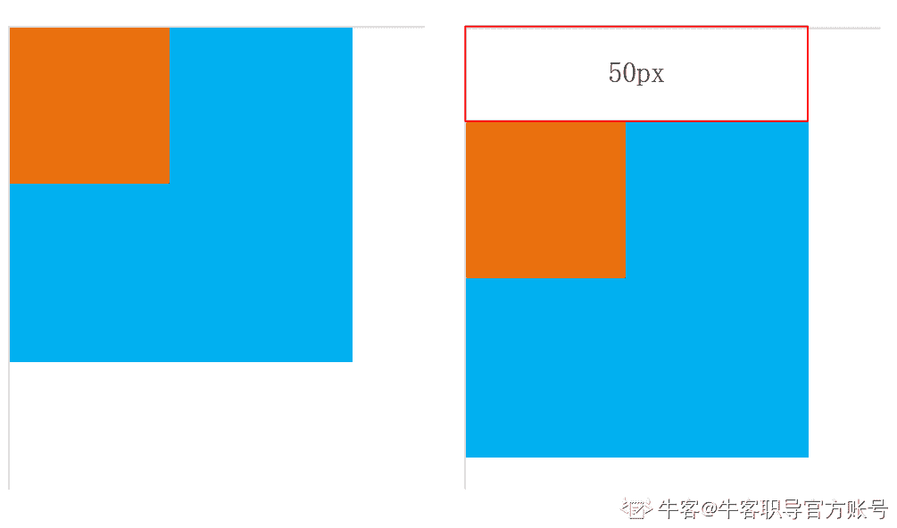
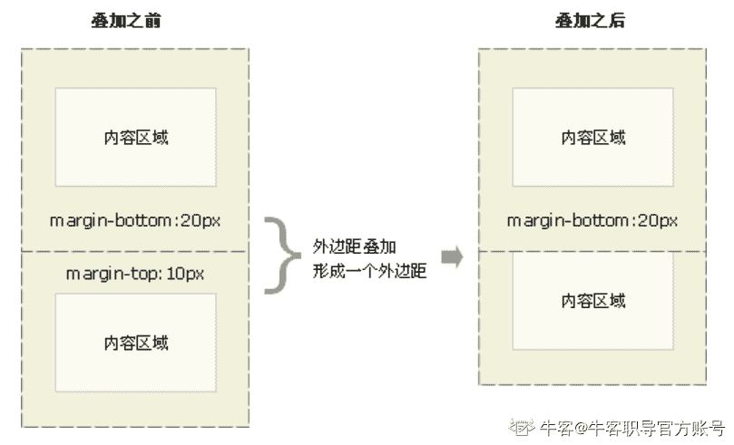
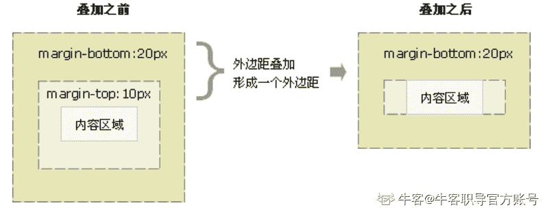

# 第三章 第 2 节 基础-必会知识（下）

> 原文：[`www.nowcoder.com/tutorial/10091/98629259ca714d2e8f356f22f7ad56da`](https://www.nowcoder.com/tutorial/10091/98629259ca714d2e8f356f22f7ad56da)

### 2 基础-必会知识（下）

#### 2.1 请问有哪些 CSS 浏览器兼容问题以及解决方案？

【考点映射】

*   CSS 浏览器兼容问题

*   兼容问题解决方案

【频率】★★★

【难度】☆

【参考答案】

目前，浏览器厂商众多，Chrome，Frirefox，Safari，Edge，IE6……对于同一段 CSS 代码，不同厂商、甚至同一厂商不同版本的解析效果极大可能不一致，其根本原因是浏览器内核不同，这就导致了页面显示效果不统一，产生了 CSS 兼容性问题

目前对兼容问题的解决方案：

*   **浏览器 CSS 样式初始化**

在所有 CSS 开始前，对某些属性初始化，以防不同浏览器的显示效果不一样，通常不推荐一味地使用通配符统一初始化样式

```cpp
*{
 margin: 0;
 padding: 0;
}

```

*   **浏览器私有属性**

可直接在某个属性中额外添加浏览器私有写法，确保浏览器能识别该属性值，有两种开发思路，分别是渐近增强和优雅降级

**渐进增强：**先写某些特殊浏览器能识别的私有属性，再写通用写法确保大部分浏览器能正常显示

```cpp
.transition {
-webkit-transform:rotate(-3deg); /*Chrome/Safari*/
-moz-transform:rotate(-3deg); /*Firefox*/
-ms-transform:rotate(-3deg); /*IE*/
-o-transform:rotate(-3deg); /*Opera*/
transform:rotate(-3deg); 
}

```

**优雅降级：**先确保大部分浏览器能正常显示，再写某些特殊浏览器能识别的私有属性

```cpp
.transition {
transform:rotate(-3deg); 
-webkit-transform:rotate(-3deg); /*Chrome/Safari*/
-moz-transform:rotate(-3deg); /*Firefox*/
-ms-transform:rotate(-3deg); /*IE*/
-o-transform:rotate(-3deg); /*Opera*/
}

```

*   **CSS hack 语法（**一般情况下，尽量避免使用 CSS hack，过多滥用会造成 html 文档混乱，不易管理与维护）

1.  条件 hack，IE 浏览器专有的 hack 方式，微软官方推荐

```cpp
<!--[if IE]> 	
这段文字只在 IE 浏览器显示 	
<![endif]-->
<!--[if gte IE 6]> 	
这段文字只在 IE6 以上(包括)版本 IE 浏览器显示 	
<![endif]-->

```

  **2\.** **属性****级 hack，** CSS 样式属性名前加上一些只有特定浏览器才能识别的 hack 前缀，以达到预期的页面展现效果 ```cpp
.test {
  color: red; /* All browsers */
  *color: blue;  /* IE7，IE6 */
  _color: skyblue;  /* IE6 */
}

```

    **3\.** **选择符级 hack，**在 CSS 选择器前加上一些只有某些特定浏览器才能识别的前缀

```cpp
*html /* *前缀只对 IE6 生效*/
*+html /* *+前缀只对 IE7 生效*/
@media screen\9{...} /*只对 IE6/7 生效*/
@media \0screen {body { background: red; }} /*只对 IE8 有效*/
@media \0screen\,screen\9{body { background: blue; }} /*只对 IE6/7/8 有效*/
@media screen\0 {body { background: green; }} /*只对 IE8/9/10 有效*/
@media screen and (min-width:0\0) {body { background: gray; }} /*只对 IE9/10 有效*/ 
@media screen and (-ms-high-contrast: active), (-ms-high-contrast: none) {body { background: orange; }} /*只对 IE10 有效*/

```

*   **自动化插件**

在解析 CSS 文件时，插件会自动添加浏览器前缀至 CSS 代码中，如 Autoprefixer 

#### 2.2 请问 Flex 的常见写法：flex:1 表达什么含义？

【考点映射】

*   Flex 缩写

*   Flex 实际应用

【频率】★★★★

【难度】☆

【参考答案】

虽说 Flex 具有众多属性，但在实际开发常简写为：flex：1，再结合 display：flex，就能轻松打造出自适应布局，这也是 Flex 布局最大的优势。实际上 flex 为：flex-grow flex-shrink flex-basic 三者的缩写。

flex-grow：定义在分配多余空间时，盒子的放大比例，默认为 0，即存在剩余空间，也不放大

flex-shrink：定义在分配多余空间时，盒子的缩小比例（多余空间可能是负值），默认为 1，即空间不足将缩小

flex-basis：定义在分配多余空间之前，盒子占据的主轴空间（可理解为基准值），通常根据该属性计算多余空间，默认为 auto，即盒子自身大小

flex 取值不同，空间分配计算值不同，有以下几种常见情况：

|  | flex-grow | flex-shrink | flex-basis |  |
| flex: 2 3 23px | 2 | 3 | 23px | 当 flex 有三个值时，则依次分配给 flex-grow、flex-shrink、flex-basic |
| flex: none | 0 | 0 | auto | 当 flex 为 none 时，则计算值为 0 0 auto |
| flex: auto | 1 | 1 | auto | 当 flex 为 auto 时，则计算值为 1 1 auto |
| flex: 1 | 1 | 1 | 0% | 当 flex 为一个非负数字，该数字为 flex-grow 值，flex-shrink 取 1，flex-basis 取 0% |
| flex: 0% | 1 | 1 | 0% | 当 flex 为一个长度或百分比，该数字为 flex-basis 值，flex-grow 取 1，flex-shrink 取 1 |
| flex: 23px | 1 | 1 | 23px |
| flex: 2 3 | 2 | 3 | 0% | 当 flex 为两个非负数字，则分别为 flex-grow 和 flex-shrink 的值，flex-basis 取 0% |
| flex: 2 23px | 2 | 1 | 23px | 当 flex 为一个非负数字和一个长度或百分比，则分别视为 flex-grow 和 flex-basis 的值，flex-shrink 取 1 |

关于 flex-basis 的取值情况：

*   auto：盒子本身大小

*   百分比：根据其包含块（即伸缩父容器）的主尺寸计算

*   0：盒子本身大小，当盒子大小未定义时，按其内容来来计算

*   可以代替 width 属性定义盒子大小，同时声明 width 属性和 flex-basic 属性时，会以 flex-basic 的值来计算

【相关例题】

针对以下 Flex 布局，算出三个盒子自适应后的最终宽度。

```cpp
<div class="parent">     
    <div class="item-1"></div>     
    <div class="item-2"></div>     
    <div class="item-3"></div> 
</div>
<style type="text/css">
.parent {         
    display: flex;         
    width: 600px;     
}     
.item-1 {         
    width: 140px;         
    flex: 2 1 0%;         
}     
.item-2 {         
    width: 100px;         
    flex: 2 1 auto;        
}     
.item-3 {         
    flex: 1 1 200px;         
}
</style>

```

主轴上父容器总尺寸： 600px

子元素总基准值（flex-basis）：0% + auto + 200px = 300px，其中

0% 即 600*0% = 0 宽度

auto 对应取盒子自身尺寸：100px

故剩余空间： 600px - 300px = 300px

剩余空间为正，需要扩大子元素，伸缩放大(flex-grow)系数之和为： 2 + 2 + 1 = 5

剩余空间分配如下：

item-1 和 item-2 各分配 2/5，各得 300*2/5 = 120px

item-3 分配 1/5，得 300*1/5 = 60px

各项目最终宽度为：

item-1 = 0% + 120px = 0 + 120px = 120px

item-2 = auto + 120px = 100px + 120px = 220px

item-3 = 200px + 60px = 260px

#### 2.3 请问清除浮动有哪些常用方法？

【考点映射】

*   清除浮动

【频率】★★★★★

【难度】☆☆

【参考答案】

目前常用清除浮动的方法主要有：

**1\.** **给父元素添加 overflow：hidden（BFC 布局）**

overflow：hidden 为隐藏溢出，当内容超过其父元素时，可以用该方式将溢出的部分裁剪掉，使页面更加美观

当子元素浮动，给父元素添加 overflow：hidden，按照该属性特性，将子元素超出的部分截掉，但是子元素有浮动，无法裁剪，只能父元素增加高度去包裹住子元素，从而使得父元素拥有高度，且高度随子元素自适应变化，从而清除浮动效果

    2\. 给需要清除浮动元素添加 clear:both

clear:both：元素的左侧和右侧均不允许出现浮动元素（摘自 W3C），添加了 clear 属性的元素只能通过调整自身来使自己不要和浮动元素排列在一起，不能移动别的元素。若一个元素同时设置了 float：left 和 clear：left，左边不能有浮动元素，那么这个元素就要调整自己，排到下一行，因设置了 float: left，这个元素会往左边靠拢，所以这个元素会跑到下一行，同时往左浮动

    3\. 给浮动元素下方添加空盒子

给该空盒子清除浮动（一般用 clear:both），把父元素撑开，需要注意：必须是块级元素，此方法早期比较常用，会给页面增加无意义标签，通常不建议页面中设置多个无意义标签。

    4\. 利用伪类::after

该种方式的原理和方法 3 一样，添加一个内容为空的伪类，同时清除浮动（一般用 clear:both），这里用伪类代替了空盒子，避免增加无意义标签

**5\.** **让父元素也浮动**

以浮制浮，父元素与子元素一起脱离文档流浮动，这样父元素就能自适应子元素高度，此方法有较大弊端，一定会影响父元素之后的元素排列，影响页面整体布局

    6\. 给父元素添加固定高度

此方法仅适用于子元素高度已知并且固定情况

#### 2.4 请问有哪些常见 margin 问题，有什么解决办法？

【考点映射】

*   常见 margin 问题总结

*   margin 问题解决办法

【频率】★★★★

【难度】☆

【参考答案】

1.  父元素 margin 塌陷

只发生在垂直方向，父元素和第一个/最后一个子元素设置了同方向的 margin 值，两个属性之间没有其他内容进行隔离，导致父元素 margin-top/margin-bottom 塌陷

当父子元素 margin-top 均为 0px，效果如左图；当蓝色框父元素 margin-top: 0px/20px，橙色框子元素 margin-top: 50px，效果如右图。当父元素 margin-top<子元素 margin-top 时，子元素会带着父元素一起掉下来



常见解决办法：

*   给父级元素设置边框或内边距

*   触发 BFC 布局，改变父级元素渲染规则，将父级元素独立，可给父级盒子添加：position：absolute/fixed、display：inline-block、float：left/right、overflow：hidden 等一些触发 BFC 的属性，但是使用的时候都会带来不同的问题，具体使用中还需根据具体情况选择

*   给子元素前面添加一个空的兄弟元素，其 overflow 设为 hidden，起隔离作用

    2\. 同级元素 margin 重叠

只发生在垂直方向，在同一个 BFC 区域内，相邻的兄弟元素会出现 margin 重叠情况，通常是上一个盒子的 margin-bottom 和下一个盒子的 margin-top，叠加后的间距通常是：两者为正取大值（如下图所示效果），一正一负/两者为负取两者之和



常见解决办法：

触发 BFC 布局，改变元素渲染规则，将其中一个元素独立出来

    3\. 空元素自身 margin 重叠

若一个无内容的空元素，同时设置了 margin-top 与 margin-bottom，则会发生重叠，如下图所示效果



#### 2.5 请问 display:none、visibility:hidden、opacity:0 有什么异同点？

【考点映射】

*   display:none、visibility:hidden、opacity:0 异同点

【频率】★★★

【难度】☆

【参考答案】

相同点：都可以让网页中某个元素隐藏

不同点：

*   **空间占据**

display:none：元素没有被渲染，不存在于 Render Tree 中，不保留元素位置，在页面上彻底消失，可理解为：看不见摸不到

visibility:hidden：存在于 Render Tree 中，元素在网页上不可见，但元素位置没有改变，可理解为：看不见但摸得到

opacity:0 ：会占据空间

*   **子元素**

display:none：所有子元素都会被隐藏，占据的空间会消失，不可点击，也不可被访问

visibility:hidden：具有继承性，给父元素设置，子元素也会继承，但若重新给子元素设置 visibility: visible，子元素又会显示

opacity:0 ：具有继承性，不能通过设置子元素的 opacity:1 使其显示

*   **DOM 结构**

display:none：影响 DOM 结构，会触发回流，计数器不会计数，浏览器渲染开销大 visibility:hidden：不影响 DOM 结构，计数器仍运行，只会触发重绘

opacity:0 ：只会触发重绘

*   **事件绑定**

display:none 和 visibility:hidden：元素上绑定的事件无法触发

opacity:0 ：元素上绑定的事件可以触发

#### 2.6 请问 src 和 href 有什么异同点？

【考点映射】

*   src 与 href 区别

【频率】★★★

【难度】☆

【参考答案】

相同点：都具有引用功能

不同点：

**href：**表示超文本引用，通常用于 link、a 等元素，href 是引用和页面关联，在当前元素和引用资源之间建立联系

**src：**source 的缩写，表示资源引用，通常用于 img，script，iframe 等元素，指向外部资源的位置，指向的内部会迁入到文档中当前标签所在的位置；在请求 src 资源时会将其指向的资源下载并应用到当前文档中，如 js 脚本，img 图片等元素