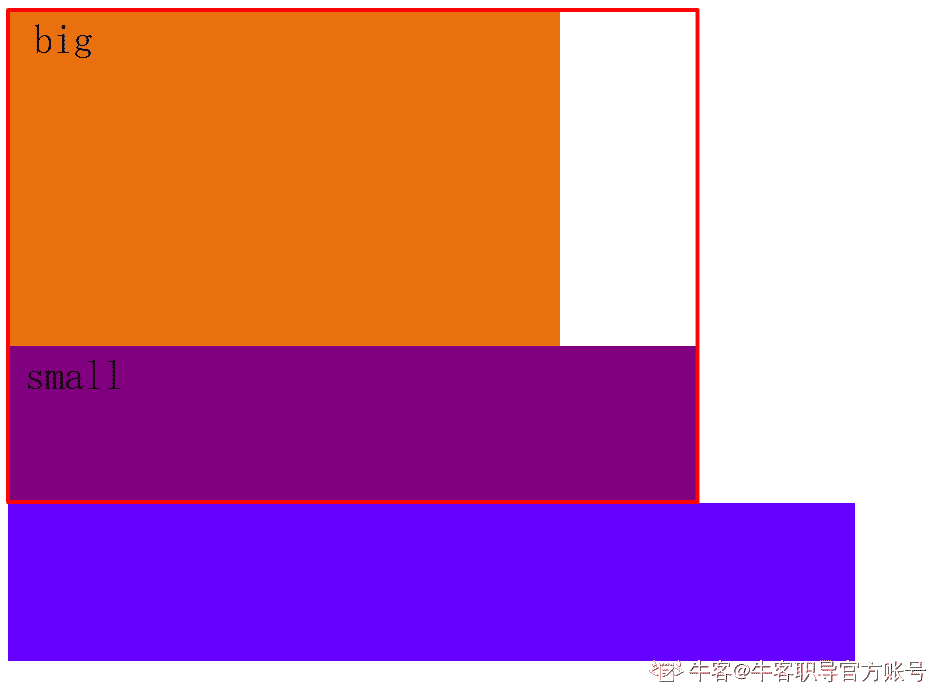
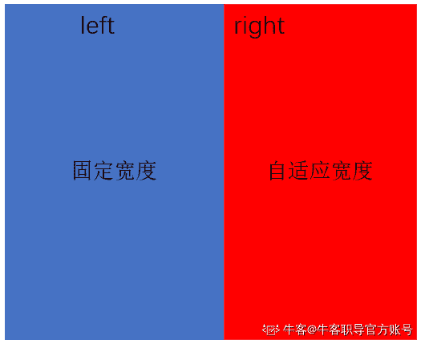
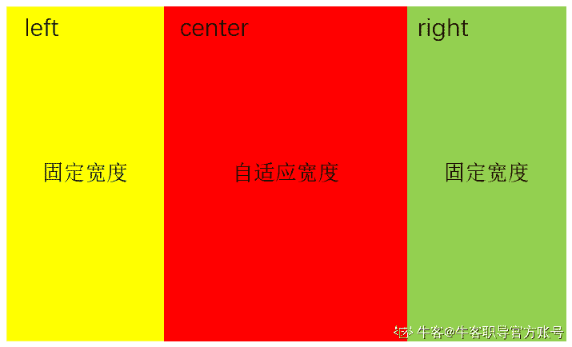

# 第三章 第 3 节 进阶-页面布局

> 原文：[`www.nowcoder.com/tutorial/10091/489d86b8a7764f3fbdfb0f1a57240268`](https://www.nowcoder.com/tutorial/10091/489d86b8a7764f3fbdfb0f1a57240268)

### 3 进阶-页面布局

#### 3.1 请问定位布局 position 属性有哪些取值？

【考点映射】

*   定位布局

*   position 属性

【频率】★★★★★

【难度】☆

【参考答案】

定位布局：页面元素 CSS 样式采用 position 属性，可在 top/bottom/right/left 四个方向进行位置移动，从而达到定位效果，position 属性可取以下 7 个值：

    1\. 相对定位 relative

*   不会使元素脱离文档流（原本位置会被保留，即改变位置也不会占用新位置）

*   相对于自身原本位置移动（没有定位偏移量则对元素无影响）

*   不影响元素本身特性（无论块级元素或行内元素，保留其原本特性）

*   常用于提升层级，从而改变元素覆盖关系，若两个都为定位元素，后面的会覆盖前面

    2\. 绝对定位 absolute

*   使元素完全脱离文档流（在文档流中不再占原来位置）

*   行内元素设置定位效果后，支持设置宽高

*   区块元素设置定位效果后，未设置宽度时由内容撑开宽度

*   相对于最近一个有定位的父元素进行偏移，如果不存在就逐级向上排查，直到相对于 body 元素，即相对于浏览器窗口（必须有参照物）

*   子绝父相，一般配合相对定位使用，（将父元素设置相对定位，子元素相对于父元素偏移）

*   可提升层级

    3\. 固定定位 fixed

*   直接相对于浏览器窗口进行“绝对定位”

*   浮动在页面中，元素位置不会随浏览器窗口滚动条滚动而变化

*   不会受文档流动影响

    4\. 粘性定位 sticky

*   基于用户的滚动来定位，在相对定位与绝对定位两者间切换。滚动前相当于 position:relative，当页面滚动超出目标区域时，相当于 position:fixed，会将元素固定在目标位置

*   相对于离它最近的具有滚动框的父级元素，如果父级元素都不可以滚动，那相对于浏览器窗口计算偏移量

*   如 top: 50px，在 sticky 元素到达距离相对定位的元素顶部 50px 的位置时固定，无论怎么滚动，都不再向上移动

*   兼容性不好，如 Internet Explorer, Edge 15 及更早 IE 版本不支持 sticky 定位，通常需要结合 CSS3 兼容方案

    5\. 静态定位 static

*   默认定位，遵循正常的文档流

*   元素不会受到影响

    6\. 继承值 inherit

*   从父元素继承 position 属性值

    7\. 初始值 initial

*   initial 关键字可用于任何 HTML 元素上任何 CSS 属性

*   可将所有 CSS 属性恢复到初始状态

【延伸考点】

**    1\. fixed 定位会出现失效情况吗？有什么解决办法吗？**

存在常见 3 种 fixed 定位失效情况：

        1\. 父元素的 transform 属性值不为 none 时，子元素的 fixed 失效（比较常见，仅在部分浏览器中失效）

        失效原因：当元素祖先的 transform 属性非 none 时，定位容器由视口改为该祖先（摘自 MDN）

        解决办法：

        经过实验发现，absolute 定位在该情况下不会失效，可利用 absolute 定位模拟 fixed 效果，主要实现思路：将 html 的滚动条禁用，开启 body 滚动条，对该元素 absolute 定位，并不设置父级元素定位，会相对 document 定位，但其滚动条未开启，不会受 body 滚动影响

        2\. perspective 属性值不为 none 时（不常见）

        浏览器都不支持 perspective 属性，Chrome 和 Safari 支持替代的 -webkit-perspective 属性，目前可行办法就是删掉 perspective 属性

         3\. 元素的 will-change 中指定了任意 CSS 属性
        目前可行办法就是尽量避免给 fixed 定位元素设置 will-change

#### 3.2 请问你了解浮动布局 float 属性吗？

【考点映射】

*   浮动布局

*   float 属性

【频率】★★★★★

【难度】☆

【参考答案】

浮动布局：为方便页面设计，给元素设置 float 属性，将元素脱离文档流，浮动框进行左右移动，直至外边缘遇到包含框或者另一个浮动框边缘，再通过 margin 属性调整位置，float 属性可取 3 个值：left：左浮动、right：右浮动、none：不浮动（默认）

浮动的影响：

*   改变块级元素的排列方式，内容从上下排列显示变成水平排列显示

*   浮动元素会脱离文档流，不占位，盒子重叠，内容不重叠

*   浮动的块级元素的宽度由内容撑开，行内元素可设宽高、margin 和 padding 均有效，可理解为隐式转换为 inline-block 元素

【延伸考点】

1.  浮动布局最常产生什么问题？

通常父级盒子不设置高度时，高度将由内容或子元素撑开，当子元素浮动脱离文档流后， 父盒子就会出现高度塌陷，边框变成一条线，通常需要清除浮动来解决该问题

如下图，给父盒子设置红色边框，内部放 big、small 两个子盒子，当两者不浮动时，会默认撑开父盒子，两者高度和为父盒子高度；当两个子盒子加上 float 属性后，底部蓝色盒子就会顶上来，父盒子无内容撑开，变成一条线




#### 3.3 请问 BFC 布局有哪些特点、触发条件以及实际应用？

【考点映射】

*   BFC 布局

【频率】★★★★★

【难度】☆

【参考答案】

BFC（Block Formatting Context）：格式化上下文，也称 BFC 布局，是 Web 页面中盒模型布局的 CSS 渲染模式，指一个独立的渲染区域，与其他元素隔离，不受外部布局影响

BFC 布局特点：

*   在 BFC 区域内，内部盒子会在垂直方向上一个接一个地放置

*   在 BFC 区域内，内部盒子垂直方向上的距离由 margin 决定。（可理解为：属于同一个 BFC 的两个相邻盒子的上下 margin 会发生重叠）

*   同一个 BFC 区域内，设置了 float 属性的盒子不会重叠

*   BFC 就是页面上的一个隔离的独立容器，容器内外元素互不影响

*   计算 BFC 的高度时，区域内的浮动元素也参与计算

BFC 布局触发条件（满足任意一个即可形成 BFC）：

*   根元素<html>

*   浮动元素：float 不为 none

*   绝对定位元素：position（absolute、fixed）

*   display 为 inline-block、table-cells、table-caption、flex、inline-flex

*   overflow 不为 visible（hidden、auto、scroll）

BFC 布局实际应用：

*   清除浮动，通过设置 overflow:hidden 解决父元素坍塌问题

*   垂直 margin 合并，BFC 区域内两个相邻元素的垂直外边距会发生叠加，叠加后的外边距为两者外边距的最大值。这样可保持各区域间上下间距一致，比如多个段落之间与顶部底部的边距保持一致

*   防止垂直 margin 合并，反之可以在元素外层包裹一层容器，并触发该容器生成一个新的 BFC 布局，与相邻元素隔离开来

*   实现自适应双栏、三栏布局，利用浮动、定位、Flex 布局原理可实现多种自适应布局

#### 3.4 请问如何将一个<div>盒子在页面垂直水平居中？

【考点映射】

*   垂直水平居中布局（代码面试可能需手撕）

【频率】★★★★★

【难度】☆

【参考答案】

元素宽高固定时（设元素宽高为 100px）：

*   **absolute + 负 margin**

```cpp
.box {     
    position:absolute;;     
    top:50%;
    left:50%;     
    margin-left:-50px;     
    margin-top:-50px;
}

```

*   **absolute + margin auto**

```cpp
.box {     
    position:absolute;;     
    top:0;
    left:0;
    right:0;     
    bottom:0;    
    margin:auto;     
}

```

*   absolute + calc()

```cpp
.box{     
    position:absolute;;     
    top:calc(50% - 50px);     
    left:calc(50% - 50px);
}

```

元素宽高未知时：

*   absolute + transform

```cpp
.box{
    position:absolute;
    top: 50%;
    left: 50%;
    transform:translate(-50%, -50%);
}

```

*   table，需要先打造一个表格结构，再将盒子放入单元格中，表格单元格中的内容本身就是垂直居中的，此法弊端：增加了很多冗余代码

```cpp
<table>
    <tbody>
        <tr>
            <td class="wp">
                <div class="box">123</div>
            </td>
        </tr>
    </tbody>
</table>
<style type="text/css">
.wp{
    text-align: center;
    }
.box{
    display: inline-block;
}
</style>
```

*   css-table，CSS 新增的 table 属性，直接把普通元素，变为 table 元素的现实效果，原理与用 table 一样，但没有那么多的冗余代码

```cpp
<div class="wp">    
    <div class="box">123</div> 
</div>
<style type="text/css">
.wp{
    display: table-cell;
    text-align: center;
    vertical-align: middle;
}
.box{
    display: inline-block;
}
</style>
```

*   flex 布局

```cpp
<div class="wp">    
    <div class="box">123</div> 
</div>
<style type="text/css">
.wp{
    display: flex;
    justify-content: center;
    align-items: center;
}
</style>

```

*   grid 布局，CSS 新出的网格布局，代码量少，但兼容性不太好

```cpp
<div class="wp">    
    <div class="box">123</div> 
</div>
<style type="text/css">
.wp{
    display: grid;
}
.box{
    align-self: center;
    justify-self: center;
}
</style>

```

总结：宽高固定时，推荐 absolute + 负 margin；宽高不固定，推荐 flex

#### 3.5 请问实现自适应两栏布局（左定宽，右宽度自适应）有哪些方法？

【考点映射】

*   自适应两栏布局（代码面试可能需手撕）

【频率】★★★★★

【难度】☆

【参考答案】

自适应两栏布局示意图如下：



```cpp
<!-- 公共代码部分 -->
<div class="wrap">
    <div class="left">左侧固定内容</div>
    <div class="right">右侧内容自适应</div>
</div>
<style type="text/css">
.left{
    width: 200px;
    height: 200px;
}
.right{
    height: 200px;
}
</style>

```

*   **float**

```cpp
.left{
    float: left;
    }
.right{
    margin-left: 200px;
}

```

*   **absolute**

```cpp
.wrap{
    position: relative;
    }
.left{
    position: absolute;
    left: 0;
    top: 0;
    }
.right{
    margin-left: 200px;
}

```

*   **table**

```cpp
.wrap{
    display: table;
    width: 100%;
}
.left{
    display: table-cell;
}
.right{
    display: table-cell;
}

```

*   **calc()**

```cpp
.left{
    float: left;
}
.right{
    float: left;
    width:calc(100% - 200px);
}

```

*   **inline-block+calc()**

```cpp
.wrap{
    width: 100%;
}
.left{
    display: inline-block;
}
.right{
    display: inline-block;
    width: calc(100% - 200px);
}

```

*   **flex 布局**

```cpp
.wrap{
    display: flex;
}
.left{
    flex:0 0 auto； 
}
.right{
    flex: 1;
}

```

 #### 3.6 请问实现自适应三栏布局（左右定宽，中间宽度自适应）有哪些方法？

【考点映射】

*   自适应三栏布局（代码面试可能需手撕）

【频率】★★★★★

【难度】☆☆

【参考答案】

自适应三栏布局示意图如下：



*   左边左浮动，右边右浮动，中间自适应，需注意：中间盒子必须放在 DOM 结构的最后，若放在第一个，会占据第一行文档流位置，左右两边的盒子只能在第二行浮动

```cpp
<div class="left">left</div> 
<div class="right">right</div> 
<div class="middle">middle</div>
<style type="text/css">     
.left{ 
    width: 200px;   
    height: 200px;         
    float: left;             
}     
.right{   
    width: 300px;  
    height: 200px;         
    float: right;          
}     
.middle{         
    height: 200px;                
    margin: 0 300px 0 200px; //为左右两盒子留出位置
} 
</style> 

```

*   左右两盒子绝对定位，中间自适应，三个盒子的先后顺序无要求

```cpp
<div class="middle">middle</div>
<div class="left">left</div> 
<div class="right">right</div> 
<style type="text/css">  
    .left{
        position: absolute;
        width: 200px;
        height: 200px;
        top: 0;
        left: 0;
    }
    .right{
        position: absolute;
        width: 300px;
        height: 200px;
        top: 0;
        right: 0;
    }
    .middle{
        height: 200px;
        margin: 0 300px 0 200px;
    }
</style>

```

*   flex 布局，左右两盒子定宽，中间盒子 flex：1，flex-grow：1、flex-shrink：1、flex-basic：0%，中间盒子的宽度：自动分配父元素除去左右盒子后的宽度，其次，弹性布局中盒子默认水平方向排列，需注意：必须最外层加一个大盒子，且中间盒子必须放在中间，按左中右顺序排列

```cpp
<div class="contain">
    <div class="left">left</div> 
    <div class="middle">middle</div>
    <div class="right">right</div> 
</div>
<style type="text/css">  
    .contain{
        display: flex;
    }
    .left{
        width: 200px;
        height: 200px;
    }
    .right{
        width: 300px;
        height: 200px;
    }
    .middle{
        flex: 1;
        height: 200px;
    }
</style>

```

*   圣杯布局法，浮动+负 margin，此方法逻辑上稍复杂，建议大家一步步理解后再实践一下，center 盒子必须放在 DOM 结构第一个

```cpp
<div class="container">
    <div class="center"></div>
    <div class="left"></div>
    <div class="right"></div>
</div>

```

**步骤 1：center 盒子**宽度 100%，左右两边盒子定宽

**步骤 2：三个盒子**先设置相对定位，再左浮动，脱离文档流

为什么用 relative 而不用 absolute 呢？因为设置 absolute 会让 float 失效，而 relative 就不存在这个问题

**步骤 3：left 盒子** margin-left：-100%（直接将 left 盒子拉到 center 盒子右边），这里效果不等同取 left 盒子宽度（left 盒子会跑到 center 盒子右边），margin 设置-100%就等价于把 left 盒子向左移动视窗宽度的距离，等价于 left 盒子直接放置到最左边

**步骤 4：left 盒子**会覆盖 center 盒子左边部分内容，要把 center 盒子内容拉出来，在外围 container 加上左右 padding，值分别为左右两盒子宽度，此时 lef 盒子也会跟过来，left 盒子设置 left：-自身盒子宽度

**步骤 5：right 盒子** margin-left：-自身盒子宽度，移动到 center 盒子右边，不需要盒子处于最左端，所以不需要-100%，仅让它回到第一行即可

**步骤 6：right 盒子** right -自身盒子宽度，就可以让它不覆盖 center 盒子右边部分内容

完整的 CSS 代码如下：

```cpp
.container {         
    padding: 0 300px 0 200px;     
}
.center, .left, .right {   
    position: relative;   
    min-height: 130px;   
    float: left; 
} 
.left {   
    width: 200px; 
    margin-left: -100%;  
    left: -200px;
} 
.right {   
    width: 300px;  
    margin-left: -300px;  
    right: -300px;     
}    
.center {             
    width:100%;     
}

```

*   双飞翼布局法，前半部分与圣杯布局基本一致，三栏全部 float 浮动，但左右两盒子加上负 margin 让其跟中间盒子并排，以形成三栏布局。

**不同处：**对于中间盒子被覆盖问题的解决思路：直接在 center 盒子内部创建子盒子用于放置内容，对该子盒子设置 margin-left 和 margin-right 为左右两盒子留出位置

简单地说，对比圣杯布局，双飞翼布局比圣杯布局多创建了一个 div，但不用相对布局

```cpp
<div class="container">
    <div class="center">
    　　<div class="main"></div>
    </div>
    <div class="left"></div>
    <div class="right"></div>
</div>
<style type="text/css"> 
.center, .left, .right {    
    min-height: 130px;   
    float: left; 
} 
.left {   
    width: 200px; 
    margin-left: -100%;  
} 
.right {   
    width: 300px;  
    margin-left: -300px;      
}    
.center {             
    width:100%;     
}
.main {
    margin:0 300px 0 200px;
}
</style>

```

## 总结

在本章主要针对一些 HTML、CSS 相关的高频面试考题，分析考点原理，并给出了一些参考答案和部分代码示例，也仅是结合个人所学、各类参考书籍与网站，如有欠缺或错误的地方，欢迎大家在下面的留言区指出。

下一章则是对 JavaScript 部分进行展开探讨，无论在校招，还是今后工作中，JavaScript 都是前端岗的重点知识，希望各位同学在此部分多花时间与精力，打牢基础。