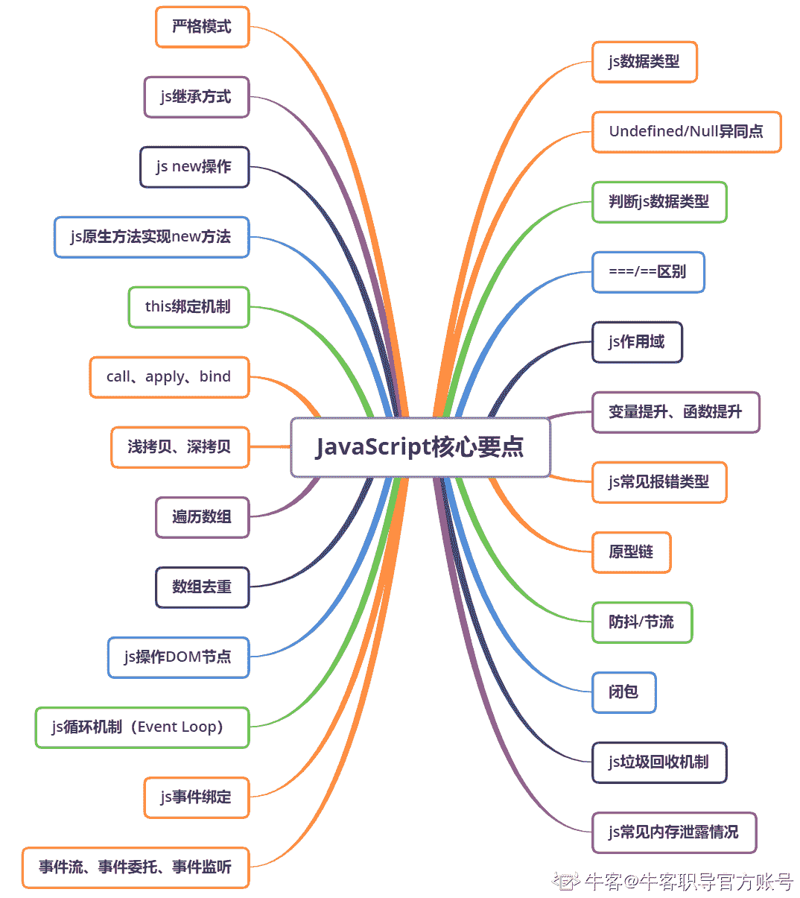

# 第四章 第 1 节 基础-必会知识（上）

> 原文：[`www.nowcoder.com/tutorial/10091/37cd7378c1534d1a841b9d5ea1616919`](https://www.nowcoder.com/tutorial/10091/37cd7378c1534d1a841b9d5ea1616919)

### 1 基础-必会知识（上）

【考点简介】

js 相关知识是前端技术的核心，也是校招笔试、面试的重中之中，本章将详细的分析前端岗面试中有关 js 的高频考点，主要知识点如下图所示。大家可以各考点为核心，展开性学习与记忆，这里推荐一本很值得反复翻看的书——《JavaScript 高级程序设计》，无论是初学者还是有一定的 js 基础的同学，都能从中有所收获。除了基础知识点以外，对相关代码的理解与默写也是极有必要的，面试中大部分代码题都出自这一块

【例题示例】

#### 1.1 请问在 JS 中有哪些数据类型？

【考点映射】

*   JS 数据类型

*   基本数据类型与引用数据类型区别总结

【频率】★★★★★

【难度】☆

【参考答案】

JS 数据类型一共有 7 种，分为基本数据类型和引用数据类型

基本数据类型：字符串（String）、数字(Number)、布尔(Boolean)、空（Null）、未定义（Undefined）、Symbol、BigInt

Symbol：ES6 引入了一种新的原始数据类型，表示独一无二的值，主要用于解决属性名冲突的问题，做为标记

BigInt：新增数据类型，是 ES2020 新增加的，精度大于 2⁵³ - 1， 是比 Number 类型支持的范围更大的整数值，在对大整数执行数***算时，使用 BigInt，会减少整数溢出问题

创建方式：BigInt(value)、在一个整数字面量后面加 n 

```cpp
let a = 10n; 
let b = BigInt(10);  
console.log(a === b);     // true

```

注意：由于在 Number 与 BigInt 之间进行转换会损失精度，建议仅在值可能大于 2⁵³ 时使用 BigInt 类型，并且不在两种类型之间进行相互转换。

与 Number 不同点：

（1）、不能用于 Math 对象中的方法；

（2）、不能和任何 Number 实例混合运算，两者必须转换成同一种类型（ BigInt 变量在转换成 Number 变量时可能会丢失精度）

引用数据类型：对象(Object)，其中包含了日期（Date）、函数（Function)、数组（Array）、正则（RegExp）等

两者总结区别：

（1）、声明变量时不同的内存分配：

基本：存储在栈中的简单数据段，它们的值直接存储在变量访问的位置

原因：基本类型数据占据的空间是固定的，所以将他们存储在较小的内存区域——栈，便于迅速查寻变量的值

引用：存储在堆中的对象，存储在变量处的值是一个指针，指向存储对象的内存地址

 原因：引用类型数据的大小会改变，不能把它放在栈中，否则会降低变量查寻速度，相反，地址的大小是固定的，可以存在栈中

（2）、不同的内存分配机制也带来了不同的访问机制

引用：js 中不允许直接访问保存在堆内存中的对象，在访问一个对象时，首先得到对象在堆内存中的地址，按照这个地址去获得对象中的值（引用访问）

基本：可直接访问

（3）、复制变量时的不同

基本：变量复制时，会将原始值的副本赋值给新变量，此后两变量是完全独立的，他们只是拥有相同的值而已（深拷贝）

引用：变量复制时，会把内存地址赋值给新变量，新旧变量都指向了堆内存中的同一个对象，任何一个作出的改变都会影响另一个（浅拷贝）（深拷贝浅拷贝对比详见下 3.3）

（4）、参数传递的不同（把实参复制给形参的过程）

由于内存分配的差别，两者在传参时也有区别

基本：只是把变量里的值传递给参数，之后参数和这个变量互不影响

引用：传递的值也就是这个内存地址，这也就是为什么函数内部对这个参数的修改会体现在外部，因为它们都指向同一个对象

#### 1.2 请问 Undefined 与 Null 有何异同点？

【考点映射】

*   Undefined 与 Null 异同点

【频率】★★★★★

【难度】☆

【参考答案】

共同点：都是基本类型，保存在栈中

不同点：

Undefined 表示"缺少值"，就是此处应该有一个值，但是还没有定义，转为数值时为 NaN。典型用法：

*   变量被声明了，但没有赋值时，就等于 undefined

*   调用函数时，应该提供的参数没有提供，该参数等于 undefined

*   对象没有赋值的属性，该属性的值为 undefined

*   函数没有返回值时，默认返回 undefined

Null：

表示"没有对象"，即该处不应该有值，转为数值时为 0。典型用法是：

*   作为函数的参数，表示该函数的参数不是对象

*   作为对象原型链的终点

注意：

```cpp
undefined == null; //true
undefined === null; //false

```

ECMAScript 规范： null 和  undefined 的行为很相似，并且都表示 一个无效的值，那么它们所表示的内容也具有相似性，故他们相等。

全等操作 === 在比较相等性的时候，两者不是同一类型值，会发生类型转换，故两者不全等。

```cpp
Number(undefined); // NaN
Number(null); // 0

```

 #### 1.3 请问如何判断 js 变量的数据类型？

【考点映射】

*   JS 数据类型判断方法（面试时极可能现场撕代码）

*   各方法适用场景及局限

【频率】★★★★★

【难度】☆☆

【参考答案】

常见判断方法有以下四种：

*   **typeof xx**

返回一个字符串（小写），用来判断：Undefined、String、Number、Boolean、Symbol、Object、Function，无法检测引用类型里的 Array

优点：可区分 Object 与 Function

缺点：（1）对于 Null ，返回 object 类型

原因：Null 类型只有一个 null 值，该值表示一个空对象指针（出自 JavaScript 高级程序设计）

typeof 的检测原理：不同的对象在底层都表示为二进制，在 js 中二进制前（低）三位存储其类型信息为：000: Object、100：String、110： Boolean、1： Number。null 的二进制表示全为 0，自然前三位也是 0，所以执行 typeof 时会返回"object"。

    （2） 对于 Array、Date、RegExp 都会返回 object，不能更详细的区分

```cpp
console.log(typeof '12');// string 
console.log(typeof 12);// number 
console.log(typeof undefined);// underfined 
console.log(typeof true);// boolean 
console.log(typeof null);// object

```

*   **xx instanceof xx**

返回 true/false，只能判断引用类型 ，无法检测基本类型

判断原理：判断一个构造函数的 prototype 属性所指向的对象是否存在另外一个要检测对象的原型链上。简单来说：能验证 new 构造函数创建出来的实例，左边的对象是否是右边的类的实例，属于验证式判断类型

缺点：只能用来判断两个对象是否属于实例关系， 而不能判断一个对象实例具体属于哪种类型（原型链上的都会返回 true）

```cpp
console.log('abc' instanceof String);// false 
console.log(

 String('abc') instanceof String);// true console.log(12 instanceof Number);// false 
console.log(new Number(12) instanceof Number);// true console.log(true instanceof Boolean);// false 
console.log(new Boolean(true) instanceof Boolean);// true console.log({name:'yy'} instanceof Object);// true 
console.log(new Object({name:'yy'}) instanceof Object);// true console.log(['12','123'] instanceof Object);// true console.log(['12','123'] instanceof Array);// true 
console.log(new Array('12',32) instanceof Object);// true console.log(new Array('12',32) instanceof Array);// true console.log(function(){} instanceof Object);// true console.log(function(){} instanceof Function);// true console.log(new Function() instanceof Function);// true console.log(new Date() instanceof Object);// true 
console.log(new RegExp instanceof Object);// true 
console.log(new String('abc') instanceof Object);// true console.log(new Number(12) instanceof Object);// true

```

*   **xx.constructor === xx**

返回 true/false，判断原理：

当一个函数 F 被定义时，JS 引擎会为 F 添加 prototype 原型，然后再在 prototype 上添加一个 constructor 属性，并让其指向 F 的引用

具体来说：当 var f = new F() 时，F 被当成了构造函数，f 是 F 的实例对象，此时 F 原型上的 constructor 传递到了 f 上，因此 f.constructor === F

缺点：不可判断 Null、Undefined 是无效的对象，没有 constructor 存在

constructor 是不稳定的，如创建的对象更改了原型，无法检测到最初的类型

```cpp
console.log(''.constructor === String);//true
console.log(new Number(1).constructor === Number);//true
console.log([].constructor === Array);//true
console.log(true.constructor === Boolean);//true
console.log(new Function().constructor === Function;);//true
console.log(new Date().constructor === Date);//true
console.log(document.constructor === HTMLDocument);//true

```

*   **Object.prototype.toString.call(xx)**

返回“[object type]”（字符串），能判断所有类型，万金油方法

判断原理：JS 中的所有对象都是继承自 Object 对象的，通过 call 方法（显式绑定）改变 this 指向，利用 Object.prototype 上的原生 toString()方法判断数据类型

```cpp
console.log(Object.prototype.toString.call(123));//[object Number] console.log(Object.prototype.toString.call('123'));//[object String] console.log(Object.prototype.toString.call(undefined));//[object Undefined] 
console.log(Object.prototype.toString.call(true));//[object Boolean] 
console.log(Object.prototype.toString.call({}));//[object Object] console.log(Object.prototype.toString.call([]));//[object Array] console.log(Object.prototype.toString.call(function(){}));//[object Function]

```

 #### 1.4 请问===与==有何区别？

【考点映射】

*   相等与全等的区别

*   相关面试高频考题

【频率】★★★★★

【难度】☆

【参考答案】

==：相等(值)

先转换再比较（强制转换）

*   有布尔值，把 false->0， true->1， 调用 Number()方法

*   字符串 和 数值，字符串转数值 ；调用 Number()方法

*   对象 和 非对象，调用对象的 valueOf()和 toString()方法把对象转换成基础类型的值再比较，除 Date 对象外，会优先尝试使用 valueOf()方法

*   有一个是 NaN， 则返回 false。 即使两个都是 NaN，也返回 false，因为按照规则，NaN 不等于 NaN

*   两个操作数都是对象，则比较他们是不是同一个对象，如果指向的是同一个对象，则返回 ture 因为对象存的是地址值

*   比较相等性之前， 不能将 null 和 undefined 转换成其他任何值

```cpp
1 == true //true           
2 == true //false 
1 == "1"  //true           
[] == ""  //true 
[] == false // true      
[] == 0   //true 
[] == {}  //false          
[] == []  //false
{} == {}  //false           
null == undefined  //true
5 == NaN  //false
0 == undefined  //false
0 == null  //false

```

**=== ： 全等(类型和值）**

先判断类型再比较， 类型不同直接不等，不转换类型

```cpp
null === undefined //false

```

#### 1.5 请问你了解 js 作用域吗？

【考点映射】

*   js 作用域

【频率】★★★★★

【难度】☆

【参考答案】

**1，js 作用域**

作用域：在运行时代码中的某些特定部分中变量、函数和对象的可访问性。换句话说，作用域决定了代码区块中变量和其他资源的可见性，作用域就是一个独立的地盘，让变量不会外泄、暴露出去。作用域最大作用：隔离变量，不同作用域下同名变量不会有冲突

作用域是分层的，内层作用域可以访问外层作用域的变量，反之不行

**2， JavaScript 没有块级作用域（ES6 之前）**，只有全局作用域和函数作用域，ES6 引入块级作用域（相关知识会在第五章中分析）

全局作用域（浏览器）：window

最外层函数 和在最外层函数外面定义的变量拥有全局作用域

所有末定义直接赋值的变量自动声明为拥有全局作用域

所有 window 对象的属性拥有全局作用域，如 window.name、window.location、window.top 等

nodejs 的全局对象：global，声明全局变量的方式为: global.变量名

在各个模块下都可以直接访问 global 对象

一个文件就是一个模块，通过 require 引入模块

函数作用域：

声明在函数内部的变量

**3，作用域链**

当我们需要某个变量的值时，先去它最近的作用域去找，如果找不到，就找它的上级作用域，依次类推，直到找到全局，如全都未定义，那就抛出一个错误，如下代码所示

```cpp
var a = 1
function A(){
    function B(){
        console.log(a);
    }
    return B();
}
A();//1

```

常见面试题：

```cpp
var a=10;
function A(){
    alert(a);
};
function B(){
    var a=20;
    A();
}
B();//10

```

为什么输出 10，而不是 20？js 中变量的作用域链与定义时的环境有关，与执行时无关。调用函数 B，B 中调用了函数 A，函数 A 里面没定义变量 a，函数 A 只是被 B 调用且不传参，因此函数 A 无权使用函数 B 的局部变量 a，而在上方还有一个全局变量 a，因此这里输出 10

#### 1.6 请问什么是变量提升？什么是函数提升？

【考点映射】

*   变量提升

*   函数提升

【频率】★★★★★

【难度】☆

【参考答案】

js 区别于 C、C++、Java 语言，在 ES6 之前，JavaScript 没有块级作用域，只有全局作用域和函数作用域。

这题在面试时尽量用具体代码举例说明

先看下面代码：

```cpp
console.log(a); 
var a = 2;

```

变量 a 在使用前没有先进行声明，会抛出 ReferenceError 异常?还是输出 2 ？事实上都不对，正确答案是输出 undefined（已声明未定义值）

这就是一个典型的 变量提升 现象

js 实际上会将 var a = 2 看成两个声明： var a 和 a = 2。第一个定义声明在编译阶段进行，第二个赋值声明被留在原地等待执行阶段

因此上面代码会以如下形式进行处理：

```cpp
var a; 
console.log(a); 
a = 2;

```

所有的声明（变量和函数）都会被“移动”到各自作用域的最前端，这个过程被称为 变量（函数）提升

再看一个高频考题：

```cpp
var a = true; 
foo();  
function foo() { 	//函数声明
    if(a) { 		
    var a = 10; 	
    } 	
    console.log(a); 
}

```

最终的答案是 undefined，代码实际 js 执行情况如下：

```cpp
function foo() { 	
    var a; 	
    if(a) { 		
    a = 10; 	
    } 	
    console.log(a); 
} 
var a;  
a = true;  
foo();

```

首先， foo(...) {} 的位置被移到了 foo();的前面，这是函数发生了提升，在 foo(...) {} 中，为什么会输出 undefined，而不是 10？

原因：**JavaScript 中没有块级作用域，**所以 var a = 10 会被 JavaScript 分为两步：var a; 会被提升到函数作用域中的最顶端，声明了一个局部变量 a，在 foo(...) {} 的函数作用域中，这个重名局部变量 a 会屏蔽全局变量 a，换句话说，在对 a 的赋值声明之前，在 foo(...) {}中，a 的值都是 undefined，无法进入 if(a) {...} 中，所以最后打印出来 undefined

注意：在 JavaScript 中，函数有两种方式进行声明，函数声明会被提升，但函数表达式却不会被提升

```cpp
var a = true; 
foo();  
var foo = function() { 	//函数表达式
    if(a) { 		
    var a = 10; 	
} 	
console.log(a); }

```

```cpp
var a; 
var foo；  
a = true; 
foo();  
foo = function() { 	
    if(a) { 		
    var a = 10; 	
    } 	
    console.log(a); 
}

```

当执行到 foo()时，foo 还没有赋值（如果它是一个函数声明而不是函数表达式，那么就会赋值）。foo()对 undefined 值进行函数调用而导致非法操作，因此会抛出 TypeError 异常

函数优先：函数声明和变量声明都会被提升。但函数会首先被提升，然后才是变量提升

```cpp
foo(); 
function foo() {
    console.log('1'); 
}
var foo = function() { 	
    console.log('2'); 
}

```

输出 1 而不是 2！这段代码片段会被引擎理解为：

```cpp
function foo() { 	
    console.log('1'); 
}  
var foo;
foo();  
foo = function() {
 	console.log('2'); 
 }

```

#### 1.7 请问 js 有哪些常见报错类型？它们有什么区别？

【考点映射】

*   常见报错及区别

【频率】★★★

【难度】☆☆

【参考答案】

在 js 中常有 6 种错误类型：TypeError、ReferenceError、SyntaxError、RangeError、EvalError、URIError。其中 TypeError 和 ReferenceError 日常开发会经常碰到。

**TypeError：**类型错误(调用不存在的方法)，变量或参数不是预期类型时发生的错误

```cpp
var a; 
console.log(a.b);//Uncaught TypeError: Cannot read property 'b' of undefined

```

变量 a 存在，但 a 不存在 b 属性不存在

**ReferenceError：**引用错误(要用的变量没找到)

```cpp
console.log(b);//Uncaught ReferenceError: b is not defined

```

对 b 进行 RHS 查询，在所有嵌套作用域中遍寻不到变量

**SyntaxError：**语法错误（给关键字赋值、变量名不符合规范）

```cpp
var 1       // Uncaught SyntaxError: Unexpected number     
function = 5     // Uncaught SyntaxError: Unexpected token =    
```

**RangeError：**范围错误(参数超范围)，主要有：数组长度为负数、Number 对象的方法参数超出范围、函数堆栈超过最大值

```cpp
// 1、数组长度为负数
[].length = -5      // Uncaught RangeError: Invalid array length
// 2、Number 对象的方法参数超出范围
var num = new Number(12.34)
console.log(num.toFixed(-1))   // Uncaught RangeError: toFixed() digits argument must be between 0 and 20 at Number.toFixed

```

**EvalError：**非法调用 eval()，eval()函数没有被正确执行

```cpp
var myEval = eval;
myEval("alert('call eval')");
// 需要注意的是：ES5 以上的 JavaScript 中已经不再抛出该错误，但依然可以通过 new 关键字来自定义该类型的错误提示。
new Error([message[fileName[lineNumber]]])
// 第一个参数是错误提示信息，第二个是文件名，第三个是行号。

```

**URIError：**URI 不合法，相关函数的参数不正确。

```cpp
decodeURI("%")     // Uncaught URIError: URI malformed at decodeURI // jzz

```

【延伸考点】

**1、什么是 LHS 和 RHS 查询？**

如上所说，对于 var a = 2， js 引擎会将它分为两步完成：var a 和 a = 2

变量的赋值操作会执行两个动作：首先编译器会在当前作用域中声明一个变量（如果之前没有声明过），然后在运行时引擎会在引用域中查找该变量，如果能够找到就会对它赋值

LHS 和 RHS 就是 js 对变量的两种查找操作， 查找的过程是由作用域（词法作用域）进行协助，在编译的第二步中执行

LHS（Left-hand Side）和 RHS（Right-hand Side）通常是指等号（赋值运算）的左右边的查询，但并不一定意味就是"="的左侧和右侧，赋值操作还有其他几种形式，因此在概念上最好将其理解为：“赋值操作的目标是谁（LHS）”以及“谁是赋值操作的源头（RHS）”

可以参考下面代码加以理解：

```cpp
function foo(a) { 	
    var b = a; 	
    return a + b; 
}  
var c = foo(2);
```

代码中一共有 3 个 LHS 查询和 4 个 RHS 查询

LHS：

第 2、5 行中的 b = ...、c = ...，变量在赋值操作的左边，对 b、c 需要 LHS 查询

第 5 行调用 foo(2) 时，需要将实参 2 赋值给形参 a，所以对 a 需要 LHS 查询

RHS：

第 2 行 b = a， a 在赋值操作的右边，需要知道 a 的值，对 a 需要 RHS 查询

第 3 行 reutrn a + b， 需要知道 a 和 b 的值， 分别对 a 和 b 都进行 RHS 查询

第 6 行 c = foo(2)，foo(2) 在赋值操作的右边，需要知道 foo(2)的值，对 foo(2) 需要 RHS 查询

当**RHS****查询不成功**时：会抛出 ReferenceError 异常

当**LHS 查询不成功**时：会自动隐式地创建一个全局变量（非严格模式下），该变量使用 LHS 查询的目标作为标识符，或者抛出 ReferenceError 异常（严格模式下）