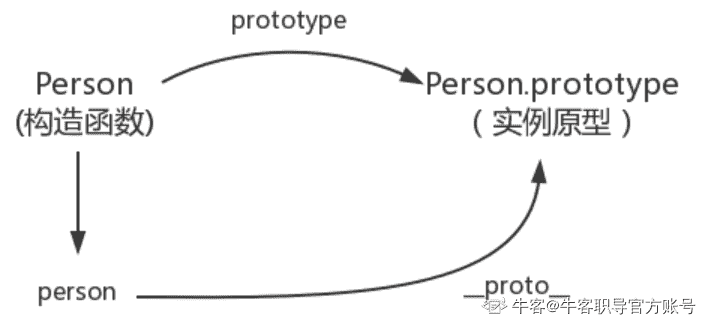
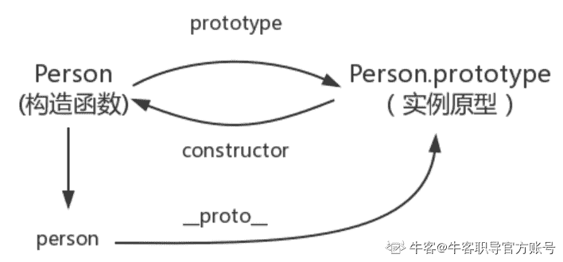
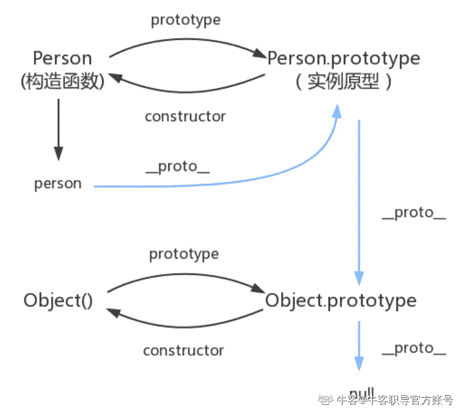

# 第四章 第 2 节 基础-必会知识（中）

> 原文：[`www.nowcoder.com/tutorial/10091/a0db7167e15e4032b56d4d57592b0866`](https://www.nowcoder.com/tutorial/10091/a0db7167e15e4032b56d4d57592b0866)

### 2 基础-必会知识（中）

#### 2.1 请问你了解 js 中的闭包吗？

【考点映射】

*   js 闭包

【频率】★★★★★

【难度】☆☆

【参考答案】

概念一：闭包是指有权访问另一个函数作用域中的变量的函数（概念出自《JavaScript 高级程序设计》）

概念二：一个函数和对其周围状态（词法环境）的引用捆绑在一起（或者说函数被引用包围），这样的组合就是闭包，也就是说，闭包让你可以在一个内层函数中访问到其外层函数的作用域。（概念出自 MDN）

可以简单理解为：闭包就是一个函数，一个外部函数通过调用函数并 return 返回出内部函数，此内部函数就是一个闭包

js 作用域只能函数内部向外层访问，闭包就是将函数内部和函数外部连接起来的一座桥梁，能够在函数外部访问到函数内部作用域的局部变量的函数

```cpp
function f1(){
    var n=999;
　　function f2(){  //f2 函数就是闭包
　　　　alert(n);
　　}
　　return f2;// 重点在这里，将闭包函数作为返回值，做到 f1 能访问到 f2 的内部局部变量
}
var result=f1();
result(); // 999

```

此时 f2 函数形成了一个闭包，因 f2 函数里需要访问 f1 作用域下的 n 变量，但他们不处于同一个作用域，故两者相互牵引，需要输出 n，f1 中的变量 n 就必须存在，作用域链在 f1 中找到 n，输出 n 时，垃圾回收机制会认为 f2 还没有执行完成，但此时作用域链查找已经到了 f1 作用域下，所以 n 的内存空间不会被垃圾回收机制清除

闭包优点：

*   可以读取函数内部的变量

*   延长局部变量寿命，不被垃圾回收机制销毁

*   封装变量（模仿块级作用域）

高频考题：

```cpp
for(var i=0;i<5;i++){
      setTimeout(function(){
            console.log(i); //输出 5 个 5
      });
} 

```

预期应该是输出 0、1、2、3、4，但实际是输出 5 个 5，因为 setTimeout 事件是被异步触发的，当事件被触发的时候，for 循环早已经结束

可利用闭包解决该问题：将每次循环的 i 值封闭起来， 当沿着作用域链从内到外查找变量 i 时，会先找到被封闭在闭包环境中的 i

```cpp
//1、在 setTimeout 外部创建一个自执行函数，并将 i 当作参数传递进闭包
for(var i=0;i<5;i++){
    (function(num){
        setTimeout(function(){
            console.log(num);   // 输出 0，1，2，3，4         
        }, num*1000);
      }
    )(i)
}

//2、在 setTimeout 内部函数创建一个闭包，并将 i 当作参数传递进去
for(var i=0;i<5;i++){
        setTimeout(function(num){
            return function(){ //用匿名函数打造一个 num 变量副本
            	console.log(num);   // 输出 0，1，2，3，4 
            }    
        }(i), i*1000);
} 

```

**闭包缺点：**

*   闭包会导致变量不会被垃圾回收机制所清除，会大量消耗内存

*   使用不恰当可能会造成内存泄漏的问题

避免闭包引起的内存泄漏：

1、在退出函数之前，将不使用的局部变量全部删除或者赋值为 null

将变量设置为 null：切断变量与它此前引用的值之间的连接，当垃圾回收器下次运行时，会删除这些值并回收它们占用的内存

2、避免变量的循环赋值和引用

#### 2.2 请问 js 垃圾回收机制是什么工作原理？

【考点映射】

*   js 垃圾回收机制

【频率】★★★★★

【难度】☆

【参考答案】

js 语言有 自动垃圾回收机制，执行环境会管理 代码执行过程中使用的内存，垃圾收集器会定期（周期性）找出不再继续使用的变量，然后释放其内存

不再使用的变量：生命周期结束的变量（局部变量），全局变量的生命周期直至浏览器卸载页面才会结束

**栈内存 垃圾回收：**

栈内存中的垃圾回收其实就是销毁执行栈中的执行上下文，栈顶就是正在执行函数的执行上下文， 当函数执行完毕后，执行栈中对应的执行上下文会被销毁

**ESP** 是执行栈中用来记录当前执行状态的指针， 当执行完一行后**，ESP 指针下移**，即该行对应的上下文被回收。 可理解为 js 引擎就是通过 ESP 指针的下移操作完成栈内存中的垃圾回收

**堆内存 垃圾回收：**

js 中堆内存的垃圾回收主要建立在 代际假说 和 分代收集 两个概念上

**代际假说：**

*   大部分对象的存活时间都很短，分配完内存以后很快就变得不可访问

*   “不死”的对象，存活时间都很长

**分代收集：**

*   堆内存分为 新生代 和 老生代 两个区域

*   新生代区域：存放的都是存活时间比较短，占内存比较小的对象

*   老生代区域：存放的都是存活时间比较长，占内存比较大的对象

**主垃圾回收器和副垃圾回收器：**

新生代区域：副垃圾回收器

老生代区域：主垃圾回收器

这两个垃圾回收器的大致工作流程是相同的，可以简化为三步：

（1）、标记待回收的内存

（2）、垃圾内存回收

（3）、内存碎片整理（频繁的垃圾回收后，会产生很多不连续的内存空间，不利于后续数据的存储）

副垃圾回收器 工作流程

主要是对新生代区域进行垃圾回收，新生代区域的内存空间比较小，大约是 1~8M

采用的是 Scavenge 算法 进行垃圾回收，主要是将新生代区域 分成两部分：空闲区域 和对象区域， Scavenge 算法具体工作流程：

（1）、所有进入新生代区域新产生的对象都会存放到对象区域中

（2）、当对象区域被写满的时候会进行垃圾回收

（3）、垃圾回收器会标记垃圾数据（使用“标记清除算法”）

（4）、标记完成后对象区域会将有效数据按照一定顺序存放到空闲区域的一端

（5）、存放好后，对象区域和空闲区域会角色互换

（6）、清空当前的空闲区域的内存空间

其中，因为是对象区域的有效数据按照一定顺序放到了空闲区域中，所以也顺便完成内存碎片的整理

注意：新生代区域的空间很小，经常很快被填满，js 有一个对象晋升策略解决这种情况：

对象晋升策略规定**：两次垃圾回收还存活的对象就会被移动到老生代区域**

**主垃圾回收器 工作流程**

对老生代区域进行垃圾回收，老生代区域的内存空间要大很多，用 Scavenge 算法 效率明要低很多，还是按照以下三步进行垃圾回收：

（1）、通过标记清除算法，标记垃圾数据

（2）、标记垃圾数据后，主垃圾回收器开始进行垃圾回收，把可回收对象加入到空闲列表中

（3）、 剩下就是内存碎片整理，主垃圾回收器会将存活的对象移动到一端，然后清理掉边界以外的内存

【延伸考点】

**1、什么是标记清除算法与引用计数算法？**

两算法都是针对垃圾数据标记的

**标记清除：**js 中最常用的垃圾回收方式，当变量进入环境时，（一般是在函数中声明一个变量），将这个变量标记为“进入环境”。而当变量离开环境时，则将其标记为“离开环境”。逻辑上讲，永远不能回收 进入环境的变量 所占用的内存，因为当执行流进入相应的环境，就可能会用到它们

```cpp
function test(){
    var a =10;//被标记 ，进入环境
    var b =20;//被标记 ，进入环境
}
test();//执行完毕 之后 a、b 又被标离开环境，被回收

```

**引用计数：**跟踪记录每个值被引用的次数。当声明了一个变量并将一个引用类型值赋给该变量时，这个值的引用次数是 1；若同一个值又被赋给另一个变量，则该值的引用次数再加 1。相反，如果包含对这个值引用的变量又取得了另外一个值，则这个值的引用次数减 1

当这个值的引用次数变成 0 时，则表示没有办法再访问这个值了，其占用的内存空间可回收

```cpp
function test(){
    var a ={};//a 的引用次数为 0
    var b = a ;//a 的引用次数加 1，为 1 
    var c = a;//a 的引用次数再加 1，为 2
    var b ={};//a 的引用次数减 1，为 1
}

```

注意：引用计数算法是 js 早期的垃圾标记算法，现在几乎不怎么用，该算法存在一个问题：无法应对互相引用的情况，当两个对象互相引用时，就会永远无法被回收，从而造成内存泄漏。 基于这个问题，后来提出了标记-清除算法

#### 2.3 请问 js 有哪几种常见的内存泄露情况？

【考点映射】

*   js 内存泄露

【频率】★★★★

【难度】☆

【参考答案】

**1、闭包**

闭包可以延长局部变量寿命，若使用不当则会导致内存泄露

**2、意外的全局变量**

js 中如果不用 var 声明变量，该变量将被视为 window 对象(全局对象)的属性，也就是全局变量，目前开发场景中：主要还是使用 let 和 const 较多

```cpp
function foo(arg) {
    bar = "this is a hidden global variable";
}
function foo(arg) {
    window.bar = "this is an explicit global variable";
}

```

上面代码中两个函数是等价的，调用完函数后，变量仍然存在，会导致泄漏

如果不注意 this 的话，也可能发生内存泄露：

```cpp
function foo() {
    this.variable = "potential accidental global";
}
foo();// 没有对象调用 foo, 也没有给它绑定 this, 所以 this 是 window

```

解决办法：加上“use strict”，启用严格模式来避免，严格模式会组织创建意外的全局变量

**3、被遗忘的定时器或者回调**

```cpp
var someResource = getData();
setInterval(function() {
    var node = document.getElementById('Node');
    if(node) {
        node.innerHTML = JSON.stringify(someResource));
    }
}, 1000);

```

如上代码，若 id 为 Node 的元素从 DOM 中被移除，但定时器仍会存在，因为回调函数中包含对 someResource 的引用，定时器外面的 someResource 也不会被释放

**4、没有清理的 DOM 元素引用**

```cpp
var elements = {
    button: document.getElementById('button'),
    image: document.getElementById('image'),
    text: document.getElementById('text')
};
function doStuff() {
    image.src = 'http://some.url/image';
    button.click();
    console.log(text.innerHTML);
}
function removeButton(){
document.body.removeChild(document.getElementById('button'));
}

```

虽用 removeChild 移除了 button，但是还在 elements 对象里保存着 button 的引用，DOM 元素还在内存里面

#### 2.4 请问你了解 js 的原型链吗？

【考点映射】

*   js 原型链

【频率】★★★★★

【难度】☆☆

【参考答案】

与其他面向对象语言不同，ES6 之前 js 没有引入类（class）的概念，js 并非通过类而是直接通过构造函数来创建实例

构造函数与实例原型

在 js 中，每当定义一个函数(普通函数、类)时候，都会天生自带一个 prototype 属性，这个属性指向函数的原型对象，并且这个属性是一个对象数据类型的值


原型对象可看作一个公共的区域，所有同一个类的实例都可以访问到原型对象，可将对象***有的内容，统一设置到原型对象中

__proto__

每个对象(除 null 外)都会有 __proto__ 属性，这个属性会指向该对象的原型

**注意：__proto__ 是 ES 标准中 [[proto]] 指针，不建议在代码中直接编写 __proto__ 属性，应该通过 Object.getPrototypeOf(）来获取原型**

 **```cpp
person.__proto__ === Person.prototype

```

**

**constructor**

每个原型都有一个 constructor 属性，指向该关联的构造函数



**原型链**

在 JavaScript 中万物都是对象，对象和对象之间也有关系，并不是孤立存在的。对象之间的继承关系，在 JavaScript 中是通过 prototype 对象指向父类对象，直到指向 Object 对象为止，这样就形成了一个原型指向的链条，专业术语称之为原型链

注意：Object 是 js 中所有对象数据类型的基类（最顶层的类），Object.prototype 没有原型，（Object.prototype.__proto__ 的值为 null）

像下图中：person → Person → Object ，普通人继承人类，人类继承对象类

当访问**对象的一个属性或方法时**，会先在对象自身中寻找，如果有则直接使用，如果没有则会去原型对象中寻找，如果找到则直接使用。如果没有则去原型的原型中寻找，直到找到 Object 对象的原型，Object 对象的原型没有原型，如果在 Object 原型中依然没有找到，则返回 undefined



看一道经典面试题：

```cpp
var F = function(){}
Object.prototype.a = function(){
    console.log('a()')
}
Function.prototype.b = function(){
      console.log('b()')
}
var f = new F()
F.a() 
F.b() 
f.a() 
f.b()

```

这道题有几个考点：1、原型与原型链 2、实例对象、构造函数、Object、Function 的关系

```cpp
a()
b()
a()
Uncaught TypeError:f.b is not a function

```

代码分析：F 是个构造函数，而 f 是构造函数 F 的一个实例

有：F instanceof Object === true、F instanceof Function === true

F 是 Object 和 Function 两个的实例，即 F 既能访问到 a，也能访问到 b

故：F.a() 输出 a()    F.b()  输出  b()

对于 f，并不是 Function 的实例，因为它本来就不是构造函数，只能访问 Object 原型链

有：f instanceof Object === true、f instanceof Function === false

故：f.a() 输出  a() f.b()报错

具体分析下，它们是如何在原型链上查找的：

**F.a() 查找路径：**

F 自身：没有 → F.__proto__(Function.prototype)：没有 → F.__proto__.__proto__(Object.prototype)：输出 a()

**F.b() 查找路径：**

F 自身：没有 → F.__proto__(Function.prototype)：b()

**f.a 的查找路径：**

f 自身：没有 → f.__proto__(Object.prototype)：输出 a()

**f.b 的查找路径：**

f 自身：没有 → f.__proto__(Object.prototype)：没有 → f.__proto__.__proto__ (Object.prototype.__proto__)：找不到，所以报错

#### 2.5 请问 js 有哪些继承方式？

【考点映射】

*   js 继承（面试时极可能现场撕代码）

【频率】★★★★★

【难度】☆☆

【参考答案】

js 常用继承方式主要有 6 种：原型链继承、构造函数继承、组合继承、原型式继承、寄生式继承、寄生组合式继承

创造一个超类型的构造函数 Super()，为它设置静态属性 name、原型链方法 getSuper()

```cpp
function Super(){
    this.name =["super"];
}
Super.prototype.getSuper = function(){
    return this.name;
}

```

再创造一个子类构造函数 Sub()，使用以上 6 种继承方法让 Sub()继承 Super()

```cpp
function Sub(){}
```

*   **原型链继承（将 子类的原型对象 指向 超类型的实例）函数式继承**

```cpp
Sub.prototype = new Super(); //将 Sub 的原型对象 Sub.prototype 指向 Super 的实例

var sub1 =new Sub(); //创建 Sub 的实例 sub1
sub1.name.push("sub1");

var sub2 =new Sub(); //创建 Sub 的实例 sub2
sub2.name.push("sub2");

console.log(sub2.getSuper())//["super", "sub1", "sub2"]

```

这样可以在 Sub 中继承 Super 的属性 name 以及 原型链方法 getSuper，然而在 sub1 中修改 name 时，sub2 的 name 也会受到影响

这种继承方式的缺点是：

（1）、所有实例共享 超类中的属性

（2）、子类的实例 不能向超类型构造函数传参

*   **构造函数继承（子类中使用 call 调用超类）函数式继承**

```cpp
function Sub(name){
    Super.call(this, name); //在 Sub 中使用 call 去调用 Super
}
var sub1 = new Sub("Tom");
console.log(sub1.getSuper()) //Uncaught TypeError(不能继承原型链方法）
console.log(sub1.name)//Tom

var sub2 =new Sub(); 
console.log(sub2.name) //undefined

var sup =new Super() 
console.log(sup.getSuper())//undefined

```

在 Sub 中用 call 调用 Super，继承了 Super 的所有静态属性。在实例 sub1、sub2 中，各自对 name 的修改也互不影响，实现了属性不共享，子类的实例也能向超类型构造函数传参    

这种继承方式的缺点是：

（1）、不能继承原型链方法

*   **组合继承（原型链继承+构造函数继承）函数式继承**

```cpp
function Sub(name){
    Super.call(this, name); //第二次调用，构造函数继承
}
Sub.prototype =new Super(); //第一次调用，原型链继承
Sub.prototype.constructor = Sub;

var sub1 =new Sub("Tom"); 
console.log(sub1.getSuper()) //Tom 
console.log(sub1.name) //Tom 
console.log(sub1 instanceof Sub) //true 
console.log(sub1 instanceof Super) //true

var sub2 =new Sub(); 
console.log(sub2.name) //undefined

```

在子类 Sub 中，使用 call 继承超类型的属性 + 原型链继承原型链的方法和属性，弥补了上面两种继承方式的三个缺点

这种继承方式的缺点是：

（1）、调用了两次超类型的构造函数

第一次：Sub.prototype = new Super()，调用一次超类型构造函数

第二次：Sub 内使用 call 方法，又调用了一次超类型构造函数，且之后每次实例化子类 sub1、sub2...的过程中（ new Sub() ），都会调用超类型构造函数

*   原型式继承（创造了一个 临时的构造函数 F，将 F 的原型 指向传进来的对象参数，再返回 F 的实例）

```cpp
function object(o){
    function F(){}
    F.prototype = o;
    return new F();
}

var person ={     
    name:"Nicholas",     
    friends:["Sherlly","Van"]
}

var people1 = object(person); 
// var people1 = Object.create(person);在传入一个参数的情况下，Object.create()和 object()相同
people1.name ="Greg"; 
people1.friends.push("Rob")；

var people2 = object(person); 
people2.name ="Linda"; 
people2.friends.push("Barbie")；

console.log(person.name)；//Nicholas 
console.log(person.friends)；//["Sherlly", "Van", "Rob", "Barbie"]

```

原型式继承和原型链继承类似，区别：前者是完成了一次对 对象的浅拷贝，后者是对构造函数进行继承

缺点也是一致的：属性会被共享

*   **寄生式继（基于原型式继承的封装）**

```cpp
function object(o){
    function F(){}
    F.prototype = o;
    return new F();
}

function createAnother(o){
    var clone = object(o)
    clone.sayHi = function(){         
        console.log("hi")
    }
    return clone;
}
var person ={     
    name:"Nicholas",     
    friends:["Sherlly","Van"]
}
var anotherPerson = createAnother(person); 
anotherPerson.sayHi()

```

此方法使用较少，本质上可以通过寄生式继承 实现子类方法 sayHi 的复用，后面通过 createAnother()创造出来的对象，都拥有 sayHi 方法

*   寄生组合式继承

在组合继承中，若需要优化一次调用，那一定是第一次调用：原型链继承，利用原型式继承便可实现

Sub.prototype = new Super()，实质上就是一次对超类型原型对象的拷贝

```cpp
function object(o){
    function F(){}
    F.prototype = o;
    return new F();
}

function inheritPrototype(subType, superType){
    //复制超类型的原型对象: 
    var clone = object(superType.prototype);
    //将构造函数指向子类型:   
    clone.constructor = subType;    
    subType.prototype = clone;
}

function Super(name){
    this.name = name 
}
Super.prototype.getSuper = function(){
    return this.name;
}
function Sub(name){ 
    Super.call(this, name);//第二次调用
}

// 优化前：
// Sub.prototype = new Super();        //第一次调用
// Sub.prototype.constructor = Sub;
// 优化后：
inheritPrototype(Sub, Super);

var sub1 = new Sub("Tom"); 
console.log(sub1.getSuper()) //Tom 
console.log(sub1.name) //Tom 
console.log(sub1 instanceof Sub) //true 
console.log(sub1 instanceof Super) //true

var sub2 =new Sub(); 
console.log(sub2.name) //undefined

```

子类对超类型的原型对象的继承，分为以下几个步骤：

（1）、封装一个 inheritPrototype 函数

（2）、利用 object（或 Object.create()）复制出超类型的原型对象

（3）、将原型对象的构造函数指向自身（把名字改成自己的：clone.constructor = subType，constructor 相当于一张身份证，身份证上的名字一定得是自己）

（4）、将拷贝出来的对象传递给子类的原型对象

结合性记忆：原型链继承+构造函数继承 = 组合继承；为了优化组合继承→原型式继承→寄生式继承→寄生组合式继承

#### 2.6 请问 js 在 new 过程中到底做了什么？

【考点映射】

*   new 操作

【频率】★★★★★

【难度】☆☆

【参考答案】

在 js 日常开发中，常 new 一个构造函数或类得到对应实例，下面代码分别是利用 ES5 构造函数与 ES6 class 类实现一个简单的创建实例

```cpp
// ES5 构造函数 
var Parent = function (name, age) {     
    this.name = name;     
    this.age = age; 
}; 
Parent.prototype.sayName = function () {           
    console.log(this.name); 
}; 
var child = new Parent('echo', 26); 
child.sayName() //echo

//ES6 class 类
class Parent {     
    constructor(name, age) {         
        this.name = name;         
        this.age = age;     
    }     
    sayName() {         
        console.log(this.name);     
    } 
}; 
const child = new Parent('echo', 26); 
child.sayName() //echo

```

对于 var child = new Parent('echo', 26)，要创建 Parent 的新实例，必须使用 new 操作符，以这种方式调用构造函数有以下几个步骤：

（1）、创建一个新对象，如 var child =｛｝

（2）、新对象的 _proto_ 属性指向构造函数的原型对象，

（3）、将构造函数的作用域赋给新对象（因此 this 就指向了这个新对象）

（4）、执行构造函数中的代码，将属性添加给 child 中的 this 对象

（5）、若构造器没有手动返回对象，则返回第一步创建的对象（新对象 child）

通俗理解：在 new 一个对象时，新对象（新实例）没有 prototype 属性，所以把 prototype 属性赋值给新对象的 _proto_ 属性

#### 2.7 请问如何 js 原生方法实现 new 方法？

【考点映射】

*   js 实现 new 方法（面试时极可能现场撕代码）

【频率】★★★★★

【难度】☆

【参考答案】

可根据上题中的 new()操作步骤加以理解性记忆，下面是参考代码：

```cpp
//定义的 new 方法
let newMethod = function(Parent, ...rest) {
    // 1.以构造器的 prototype 属性为原型，创建新对象；
    let newObj = Object.create(Parent.prototype);
    // 2.将 this 和调用参数传给构造器执行
    let result = Parent.apply(newObj, rest);
    // 3.如果构造器没有手动返回对象，则返回第一步的对象（4）
    return typeof result  === 'object' ? result : newObj;
};
```