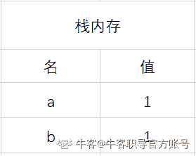
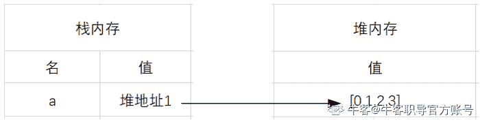
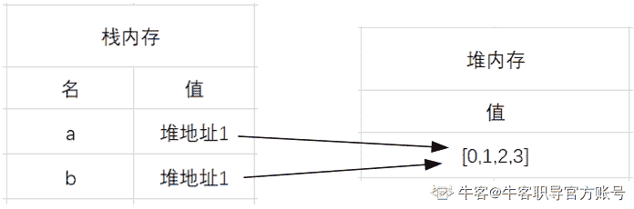
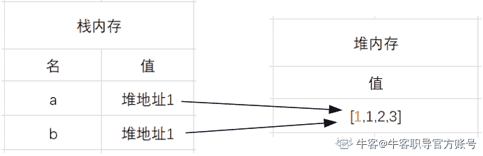

# 第四章 第 3 节 基础-必会知识（下）

> 原文：[`www.nowcoder.com/tutorial/10091/7009471eb3484120ae90f81451d899b0`](https://www.nowcoder.com/tutorial/10091/7009471eb3484120ae90f81451d899b0)

### 3 基础-必会知识（下）

#### 3.1 请问你了解 js 中的 this 绑定机制吗？

【考点映射】

*   this 绑定机制

【频率】★★★★★（面试极有可能出代码题（面试官给代码，答输出））

【难度】☆☆

【参考答案】

this 特点：

this 是 js 的关键字之一，它是对象自动生成的一个内部对象，只能在对象内部使用

随着使用场合的不同，this 的值会发生变化，并不是一成不变的

this 指向完全取决于：什么地方以什么方式调用，而不是 创建时

this 4 种绑定机制：默认绑定、隐式绑定、显示绑定、new 绑定，箭头函数的 this 不适用于这 4 种绑定机制，需要单独分析，将会在后续 ES6 新特性章节中做重点分析

*   默认绑定（函数调用时无任何调用前缀的情景）

没有其他绑定规则存在时的默认规则，也是函数调用中最常见情况

```cpp
function fn1() {
    let fn2 = function () {
        console.log(this); //window
        fn3();
    };
    console.log(this); //window
    fn2();
};
function fn3() {
    console.log(this); //window
};
fn1();

```

代码中无论函数声明在哪，在哪调用，由于函数调用时前面并未指定任何对象，这种情况下 this 指向全局对象 window

注意：在严格模式下（use strict），全局对象将无法使用默认绑定，会报 undefined 错误

```cpp
function fn() {
    console.log(this); //window
    console.log(this.a);
};
function fn1() {
    "use strict";
    console.log(this); //undefined
    console.log(this.a);
};
var a = 1;
fn() //1
fn1() //TypeError: Cannot read property 'a' of undefined

```

*   **隐式绑定**

在函数调用时，前面存在调用它的对象，即函数的调用是在该对象上触发的，调用位置上存在上下文对象，那 this 就会隐式绑定到该对象上

```cpp
function foo() { 
    console.log(this.a);
}
var a = 2;
var obj = { 
    a: 3,
    foo: foo 
};
obj.foo(); //3

```

代码中 foo 函数被当做引用属性，被添加到 obj 对象上。调用过程：获取 obj.foo 属性→ 根据引用关系找到 foo 函数，执行调用

这里对 foo 的调用存在上下文对象 obj，this 进行了隐式绑定，即 this 绑定到了 obj 上，this.a 被解析成了 obj.a

多层调用链（面试高频考题）（函数调用前存在多个对象，this 指向距离调用自己最近的对象）

```cpp
function foo() { 
    console.log( this.a );
}
var a = 2;
var obj1 = { 
    a: 4,
    foo: foo 
};
var obj2 = { 
    a: 3,
    obj1: obj1
};
obj2.obj1.foo();  //4

```

代码中调用链不只一层，存在 obj1、obj2 两个对象，先获取 obj2.obj1→通过引用获取到 obj1 对象，再访问 obj1.foo →最后执行 foo 函数调用，获取最后一层调用的上下文对象，即 obj1，所以结果是 4（obj1.a）

*   **隐式丢失**

在一些特殊情况下，会存在隐式绑定丢失问题，最常见：参数传递、变量赋值

**参数传递**

```cpp
var a = 1;
let obj = {
    a: 2,
    fn: function () {
        console.log(this.a);
    }
};
function fn1(param) {
    param();
};
fn1(obj.fn);//1

```

代码中将 obj.fn 作为参数传递进 fn1 中执行，只是单纯地传递了一个函数而已，this 并没有跟函数绑在一起，发生了隐式丢失，this 依旧指向 window

**变量赋值（本质上与传参相同）**

```cpp
var a = 1;
let obj = {
    a: 2,
    fn: function () {
        console.log(this.a);
    }
};
let fn1 = obj.fn;
fn1(); //1

```

*   **显式绑定（call、apply、bind）**

```cpp
let obj1 = {
    a: 2
};
let obj2 = {
    a: 3
};
let obj3 = {
    a: 4
}
var a = 1;

function fn() {
    console.log(this.a);
};
fn(); //1
fn.call(obj1); //2
fn.apply(obj2); //3
fn.bind(obj3)(); //4

```

代码中，我们分别通过 call、apply、bind 改变了函数 fn 的 this 指向

通常，js 中调用一个函数时（函数调用），函数处于一个被动的状态，而 call 与 apply 让函数从被动变主动，函数能主动选择自己的上下文，这种写法又称之为函数应用

注意：若使用函数应用的方法改变 this 指向时，指向参数是 null 或者 undefined，那么 this 将指向全局对象

*   **new 绑定**

```cpp
function Fn(){     
    this.a = 1; 
}; 
let echo = new Fn(); 
console.log(echo.a)  //1

```

代码中，构造函数调用创建了一个新对象 echo，而在函数体内，this 将指向新对象 echo 上（可以抽象理解为新对象就是 this）

*   **this 绑定优先级**

如果一个函数调用存在多种绑定方法，this 最终指向是什么呢？this 绑定优先级为：

显式绑定 > 隐式绑定 > 默认绑定

new 绑定 > 隐式绑定 > 默认绑定

注意：不存在显式绑定和 new 绑定同时生效的场景，若同时写会直接报错

【延伸考点】

**1、作用域链与原型链有什么区别？**

作用域链：当访问一个变量时，首先在当前作用域查找标识符，如果没有找到就去父作用域找，作用域链顶端是全局对象 window，如果 window 都没有这个变量则报错

原型链：当在对象上访问某属性时，首先会查找当前对象，如果没有就顺着原型链往上找，原型链顶端是 null，如果全程都没找到则返回 undefined，而不是报错

#### 3.2 请问 call、apply 与 bind 有什么区别？

【考点映射】

*   call、apply 与 bind 区别

【频率】★★★★

【难度】☆

【参考答案】

call、apply 与 bind：都能用于改变 this 绑定

**apply 与 call：**

都是函数应用，指定 this 的同时也会执行函数，参数传递方式不同

call 与 apply 的绑定只适用当前调用，调用完毕即失效，下次要用还得重新绑

**call：**接受一个参数列表，第一个参数指向 this，其余的参数在函数执行时都会作为函数形参传入函数

**apply：**除了第一个参数作为 this 指向外，其它参数都被包裹在一个数组中，在函数执行时同样会作为形参传入

```cpp
let o = {
    a: 1
};
function fn(b, c) {
    console.log(this.a + b + c);
};
// fn.call(this, arg1, arg2, ...);
fn.call(o, 2, 3); // 6
// fn.apply(this, [arg1, arg2, ...]);
fn.apply(o, [2, 3]); // 6

```

**bind：**

绑定 this 后并不会立马执行，而是返回一个全新的 boundFcuntion 绑定函数

bind 属于硬绑定，返回的 boundFunction 的 this 指向无法再次通过 bind、apply 或 call 修改

```cpp
let o1 = {
    a: 1
};
let o2 = {
    a: 2
};
function fn(b, c) {
    console.log(this.a + b + c);
};
let fn1 = fn.bind(o1, 2, 3);
//尝试再次传入形参
fn1(4, 4); //6
//尝试改变 this
fn1.call(o2); //6

```

代码中， 当执行 fn1 时，本质上等于 window.fn1()，如果 this 还能被改变，那 this 岂不是得指向 window，那 bind 方法就毫无意义了

#### 3.3 请问什么是浅拷贝？什么是深拷贝？两者有何区别？

【考点映射】

*   浅拷贝与深拷贝

【频率】★★★★★

【难度】☆

【参考答案】

深拷贝与浅拷贝简单区分方法：假设 B 复制了 A，当修改 A 时，B 是否改变，若 B 也跟着变化，说明是浅拷贝；若 B 没变化，则是深拷贝

注意：一般情况下，深拷贝只针对较为复杂的 object 类型数据

在 js 中， 分基本数据类型与引用数据类型，这两类数据存储分别是：

基本数据类型：名与值都存储在栈内存中，例如 let a=1：


当 b=a 时，b 复制了 a 的值，栈内存会新开辟一个内存给 b，例如：



当修改 a=2 时，对 b 并不会造成影响，因为此时的 b 具有独立的存储空间，不受 a 的影响了

引用数据类型：名存在栈内存中，值存在于堆内存中，栈内存会提供一个引用的地址指向堆内存中的值



当 b=a 时，其实 b 复制了 a 的引用地址，而并非堆内存中的值



而当 a[0]=1 时进行数组修改时，由于 a 与 b 指向的是同一个地址，自然 b 也受影响，这就是所谓的浅拷贝



#### 3.4 请问 js 如何实现深拷贝？

【考点映射】

*   深拷贝的实现

【频率】★★★★★（面试极有可能要求撕代码）

【难度】☆☆

【参考答案】

1.  递归复制所有层级属性（面试高频撕代码题）

可理解为一层层地复制对象中的属性， 直到值为基础类型，缺点：代码较为复杂

```cpp
//使用递归的方式实现数组、对象的深拷贝
function deepClone(obj) {
//判断拷贝的要进行深拷贝的是数组还是对象，是数组的话进行数组拷贝，对象的话进行对象拷贝
    var objClone = Array.isArray(obj) ? [] : {};
    //进行深拷贝的不能为空，并且是对象
    if (obj && typeof obj === "object") {
        for (key in obj) {
            if (obj.hasOwnProperty(key)) {
                if (obj[key] && typeof obj[key] === "object") {
          objClone[key] = deepClone1(obj[key]);
                } else {
                objClone[key] = obj[key];
                }
            }
        }
    }
    return objClone;
}  
```

    2\. 借助 JSON 对象的 parse 和 stringify

利用 js 的内置对象 JSON 来进行数组对象的深拷贝，缺点：无法实现对象中方法的深拷贝

```cpp
function deepClone(obj) {   
    var _obj = JSON.stringify(obj),     
    objClone = JSON.parse(_obj);   
    return objClone; 
}

```

stringify() → JavaScript 对象序列化为 JSON 字符串

parse() → 把 JSON 字符串解析为原生 JavaScript 值

    通过 jQuery 的 extend 方法

```cpp
var array = [1,2,3,4];
var newArray = $.extend(true,[],array);    

```

    4\. Object.assign()拷贝

当对象中只有一级属性，没有二级属性的时候，此方法为深拷贝，但是对象中有对象的时候，此方法，在二级属性以后就是浅拷贝

    5\. lodash 函数库

lodash 是一个很热门的函数库，可利用 lodash.cloneDeep()实现深拷贝

#### 3.5 请问 js 如何判断一个变量是空对象？

【考点映射】

*   空对象判断

【频率】★★★★（面试极有可能要求撕代码）

【难度】☆

【参考答案】

1.  for in 

```cpp
functionis EmptyObj(obj){
    for(let i in obj){
        return false  //能遍历，不为空
    }
    return true
}

```

利用 for in 循环遍历对象和对象原型上的可枚举属性

缺点：只能遍历可枚举属性，若一个对象上只有不可枚举属性的话，会判断错误

**2\.** **Object.keys() **

```cpp
console.log(Object.keys(obj).length===0)
```

Object.keys 能返回对象自身上所有可枚举属性的名称所构成的数组，若数组长度为 0，那就是一个空对象

缺点：如 for in 断一样，Object.keys 方法也只返回可枚举属性

    3\. 将对象转化为 json 字符串

```cpp
console.log(JSON.stringify(obj)==='{}')

```

**4\.** **Object.getOwnPropertyNames()**

```cpp
console.log(Object.getOwnPropertyNames(obj).length == 0)

```

Object.getOwnPropertyNames 方法获取到对象中的属性名，存到一个数组中，返回数组对象，若数组长度为 0，则是空对象

缺点：此方法是 Object.keys 的改进，可获取到不可枚举属性，但该方法无法获取 Symbol 属性

    5\. Reflect.ownKeys()

```cpp
console.log(Reflect.ownKeys(obj).length===0)
```

Reflect.ownKeys 也可以返回对象自身属性名所构成的数组，该方法可以返回不可枚举属性以及 Symbol 属性

【延伸考点】

**1、什么可枚举属性？什么是不可枚举属性？**

可枚举属性是指内部可枚举标志（enumerable）设置为 true 的属性，不可枚举属性即是 enumerable 为 false（摘自 MDN）

**2、js 遍历对象各个方法区别总结**

| 方法 | 基本属性 | 原型链属性 | 不可枚举属性 | symbol 属性 |
| for in | ✔ | ✔ | ✖ | ✖ |
| Object.keys() | ✔ | ✖ | ✖ | ✖ |
| Object.getOwnPropertyNames() | ✔ | ✖ | ✔ | ✖ |
| Object.getOwnPropertySymbols() | ✖ | ✖ | ✔ | ✔ |
| Reflect.ownKeys() | ✔ | ✖ | ✔ | ✔ |

for in （遍历 key）：

可遍历到原型对象上的属性 ，用 hasOwnProperty()方法过滤

可遍历得到字符串类型的键值，通常不适用于数组遍历

**Object.values() 、Object.keys() ：**可自动过滤原型链上的属性

**Object.getOwnPropertyNames()：****可遍历不可枚举的属性**

**Reflect.ownkeys()：** 可遍历不可枚举的属性 和 Symbol 属性

#### 3.6 请问 js 有哪些遍历数组的方法？

【考点映射】

*   js 遍历数组方法总结

【频率】★★★★★

【难度】☆

【参考答案】

**1\.** **for 循环**

用临时变量将长度缓存起来，避免重复获取数组长度，当数组较大时优化效果比较明显，写法比较繁琐

 ```cpp
for(j = 0,len=arr.length; j < len; j++) {      
}

```

**2\.** **forEach（）**

遍历数组中的每一项，没有返回值，即使有 return，也不会返回任何值，对原数组没有影响，不支持 IE 浏览器，执行速度比 map()快

```cpp
//参数：item 数组中的当前索引的值, index 当前项的索引, array 原始数组
arr.forEach((item,index,array)=>{     
})    

```

**3\.** **map（）**

创建一个新的数组，新数组的每一个元素由调用数组中的每一个元素执行提供的函数得来，有 return 返回值

return 的意义：不影响原来的数组，只是把原数组克隆一份，改变克隆的数组中的对应项

```cpp
var arr = [0，1,2,3,4]; 
var res = arr.map(function (item,index,arr ) { 
    return item*10; 
}) 
console.log(res); //[0,10,20,30,40];  拷贝原数组，并进行了修改
console.log(arr); //[0，1,2,3,4]；  原数组并未发生变化

```

**5\.** **f****or of**

遍历 value，适用遍历数组对象、字符串、map、set 等拥有迭代器对象的集合，不能遍历对象，因为没有迭代器

与 forEach()区别：可以正确响应 break、continue 和 return 语句

与 for in 区别：无法循环遍历对象，不会遍历自定义属性

```cpp
for (var value of arr) { 
    console.log(value); 
}

```

**6\.** **reduce()**

接收一个函数作为累加器，数组中的每个值（从左到右）开始缩减，得出最终计算值

相当于：为数组中的每一个元素依次执行回调函数，不包括数组中被删除或从未被赋值的元素

```cpp
arr.reduce(function(total, currentValue, currentIndex, arr), initialValue)

```

各参数意义：

| function() | 必需 | 用于执行每个数组元素的函数 |
| total | 必需 | 初始值, 或者计算结束后的返回值 |
| currentValue | 必需 | 当前元素 |
| currentIndex | 可选 | 当前元素的索引 |
| arr | 可选 | 当前元素所属的数组对象 |
| initialValue | 可选 | 传递给函数的初始值 |

一起看几个 reduce()的实际应用（面试时可能要求撕代码）

*   **简单用法：数组求和，求乘积**

```cpp
var  arr =[1,2,3,4]
var sum = arr.reduce((x,y)=>x+y)
var mul = arr.reduce((x,y)=>x*y) 
console.log(sum);//求和，10 
console.log(mul);//求乘积，24

```

*   **复杂用法：**

计算数组中每个元素出现的次数

```cpp
let names =['Alice','Bob','Tiff','Bruce','Alice'];
let nameNum = names.reduce((pre,cur)=>{
    if(cur in pre){     
        pre[cur]++}else{     
        pre[cur]=1}return pre 
    },{}) 
    console.log(nameNum);//{Alice: 2, Bob: 1, Tiff: 1, Bruce: 1}

```

数组去重（ 面试高频撕代码题）

```cpp
let arr =[1,2,3,4,4,1]
let newArr = arr.reduce((pre,cur)=>{
    if(!pre.includes(cur)){
        return pre.concat(cur)
    }else{
        return pre     
    }
},[]) 
console.log(newArr);// [1, 2, 3, 4]

```

将多维数组转化为一维（又名数组扁平化， 面试高频撕代码题）

```cpp
let arr =[[0,1],[2,3],[4,[5,6,7]]]
const newArr=function(arr){
    return arr.reduce((pre,cur)=> pre.concat(Array.isArray(cur) ? newArr(cur):cur),[])
} 
console.log(newArr(arr));//[0, 1, 2, 3, 4, 5, 6, 7]

```