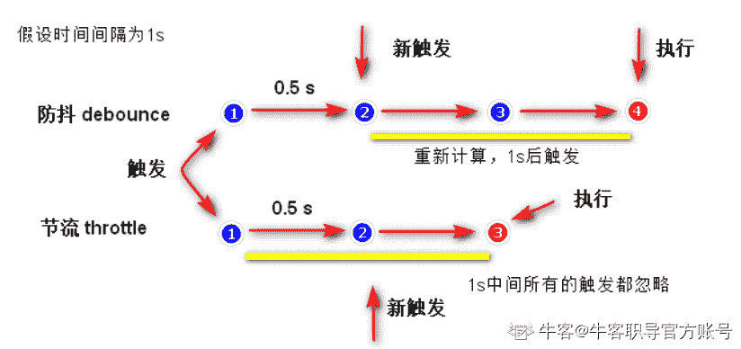

# 第四章 第 4 节 进阶-拓展知识

> 原文：[`www.nowcoder.com/tutorial/10091/1689c39d2191428eba0d2bb95e54ad69`](https://www.nowcoder.com/tutorial/10091/1689c39d2191428eba0d2bb95e54ad69)

### 4 进阶-拓展知识

#### 4.1 请问什么是函数防抖？什么是函数节流？

【考点映射】

*   防抖与节流概念、区别

*   防抖与节流实现

【频率】★★★★★（面试极有可能要求撕代码）

【难度】☆☆

【参考答案】

函数防抖(debounce)：触发高频事件后 n 秒内，函数只会执行一次，如果 n 秒内高频事件再次被触发，则重新计算时间

函数节流(throttle)：高频事件触发，但在 n 秒内只会执行一次，所以节流会稀释函数的执行频率

两者都是为了限制函数的执行频次，以优化函数触发频率过高导致的响应速度跟不上触发频率，出现延迟，假死或卡顿的现象

可结合下图对两者进行区分：

**防抖：**

实现思路：在事件被触发 n 秒后再执行回调函数，如果在这 n 秒内又被触发，则重新计时

特点：如果事件在规定的时间间隔内被不断的触发，则调用方***被不断的延迟，当遇到不断触发但是仍然需要触发的情况，应该选用节流

只有当高频事件停止，最后一次事件触发的超时调用才能在 wait 时间后执行

```cpp
function debounce(func, wait) {
    var timeout; //  用来存放定时器的返回值，一触发就重新计时
	return function () {
    	var context = this;
        // 把前一个 setTimeout clear 掉
    	clearTimeout(timeout)
        // 又创建一个新的 setTimeout, 保证间隔内时间持续触发，不会执行 func 函数
   		timeout = setTimeout(function(){
        	func.apply(context)
    	}, wait);
	}
}

```

**节流：**（每隔一段时间发一次 Ajax 请求，用节流）

规定一个单位时间，在这个单位时间内，只能有一次触发事件的回调函数执行，如果在同一个单位时间内某事件被触发多次，只有一次能生效

实现思路：通过判断是否到达一定时间来触发函数，若没到规定时间则使用计时器延后，而下一次事件则会重新设定计时器

```cpp
function throttle(fn,delay) {
    let canRun = true; // 通过闭包保存一个标记
    return function () {
         // 在函数开头判断标记是否为 true，不为 true 则 return
        if (!canRun) return;
         // 立即设置为 false
        canRun = false;
        // 将外部传入的函数的执行放在 setTimeout 中
        setTimeout(() => { 
        // 最后在 setTimeout 执行完毕后再把标记设置为 true(关键)表示可以执行下一次循环了。
        // 当定时器没有执行的时候标记永远是 false，在开头被 return 掉
            fn.apply(this, arguments);
            canRun = true;
        }, delay);
    };
}

```

#### 4.2 请问 js 有哪些数组去重方法？

【考点映射】

*   数组去重方法总结、性能分析

【频率】★★★★★（面试极有可能要求撕代码）

【难度】☆☆

1.  for 循环（两次嵌套）+ 新数组

```cpp
function sort(arr) {
    var flag = 0;
    var result = new Array();
    for(var i = 0; i < arr.length; i++) {
        flag = 0;
        for(var j = 0; j < arr.length; j++) {
            if(result[j] == arr[i]) {
                flag = 1;
                break;
            }
        }
        if(flag == 0)
            result.push(arr[i]);
    }
    return result;
}

```

新建一个空数组，for 循环遍历原数组，判断数组内是否已存在当前元素，如有相同的值则跳过，不同的推入新数组中，直至原数组遍历完，返回新数组，涉及到多次遍历，执行时间较长

  **2\.** **for 循环（两次嵌套）+ splice （ES5 中最常用）**

```cpp
function sort(arr){                     
    for(var i=0; i<arr.length; i++){             
        for(var j=i+1; j<arr.length; j++){ 
            if(arr[i]==arr[j]){         
            //两者相等时，splice 方法删除第二个                     
            arr.splice(j,1);                     
            j--;                 
            }             
        }         
    }
     return arr; 
}

```

双层循环，外层循环元素，内层循环时比较值，值相同时，删除这个值    3\. for 循环（一次） + indexOf() + 新数组

```cpp
function sort(arr) {
    var result = new Array();
    for(var i = 0; i < arr.length; i++) {
        if(result.indexOf(arr[i]) == -1)
            result.push(arr[i]);
    }
    return result;
}

```

对方法 1 进行改进，对新数组判定是否有该字符，可以调用 Array.prototype.indexOf 函数，执行时间缩减了很多

    4\. sort()

```cpp
function sort(arr) {     
    arr = arr.sort()     
    var result= [arr[0]];     
    for (var i = 1; i < arr.length; i++) {         
        if (arr[i] !== arr[i-1]) {            
            result.push(arr[i]);         
        }     
    }     
    return result; 
}

```

利用 sort()排序方法，然后根据排序后的结果进行遍历及相邻元素对比

    5\. Map

```cpp
function sort(arr) {   
    let map = new Map();   
    let result = new Array();  
    for (let i = 0; i < arr.length; i++) {     
        if(map.has(arr[i])) {  // 如果有该 key 值       
            map.set(arr[i], true);     
        } else {        
            map.set(arr[i], false);   // 如果没有该 key 值       
            result.push(arr[i]);     
        }   
    }    
    return result ; 
}

```

利用 ES6 中的 Map 集合替代前面方法中的新数组，调用 Map.has 替代 indexOf()，Map.set 替代 push()，执行速度比前面的方法都要快

    6\. new Set() + Array.from()

```cpp
function sort(arr) {     
    return Array.from(new Set(arr)); 
}

```

利用 ES6 中的 Set 集合，Set 集合是一种无重复元素的列表，new Set(arr)会自动剔除重复元素，Array.from(...)将 Set 集合转换为数组

    7\. new Set() + …(展开运算符)

```cpp
function sort(arr) {     
    return [...(new Set(arr))]; 
}

```

思路与方法 6 一致，只是将 Set 集合转换为数组的实现方法从 Array.from(...) 改成了 ...(展开运算符)

    8. for 循环(一次) + 新对象

```cpp
function sort(arr) {
    let obj = {};
    for (let i = 0; i < arr.length; i++) {
        if (!obj[arr[i]]) {
            obj[arr[i]] = 1;
        }
    }
    return Object.keys(obj);;
}

```

将创建一个新数组，改成创建一个新对象，判定对象的 key 值，存在跳过，不存在则将字符以对象的 key 值存储

执行时间：所有的方法中最短的，因为 js 对象的属性是基于 Hash 表实现，对属性进行访问的时间复杂度可以达到 O(1)，故此方法的时间复杂度为 O(n) ；上述一般双重循环时间复杂度为 O(n²)

#### 4.3 请问你了解 js 事件循环机制（Event Loop）吗？

【考点映射】

*   js 事件循环机制

*   js 同步异步任务

【频率】★★★★★（面试极有可能出代码题（面试官给代码，答出输出））

【难度】☆☆

js 是一门主要运行在浏览器的脚本语言，主要用途之一是操作 DOM 元素

若 js 同时有两个线程，对同一个 DOM 元素进行操作，这时浏览器应该听哪个线程的？如何判断优先级？为了避免这种问题，js 必须是一门单线程语言。

主线程：即主线程会不停的从执行栈中读取事件，直至执行完所有栈中的同步代码

任务队列：当遇到一个异步事件后，js 并不会一直等待异步事件返回结果，而是会将这个事件挂在与执行栈不同的队列中，即任务队列

异步任务：分为 宏任务（macrotask） 与 微任务 (microtask)，不同的 API 注册的任务会依次进入自身对应的队列中，然后等待 Event Loop 将它们依次压入执行栈中执行

常见宏任务(macrotask)：

script(整体代码)、setTimeout、setInterval、UI 渲染、 I/O、postMessage、 MessageChannel、setImmediate(Node.js 环境)

常见微任务(microtask)：

Promise、 MutaionObserver、process.nextTick(Node.js 环境）

Event Loop(事件循环)：宏任务 > 所有微任务 > 宏任务（主要针对 V8）

1.  执行栈选择最先进入队列的宏任务(通常是 script 整体代码)，如果有则执行

2.  检查是否存在 Microtask，如果存在则不停地执行，直至清空 microtask 队列

3.  更新 render(每一次事件循环，浏览器都可能会去更新渲染)

4.  重复以上步骤


一起看两道经典面试题：（主要考察执行顺序问题，考察频率极高）

```cpp
//题目一
setTimeout(function () {         
    console.log(1);     
});     
new Promise(function(resolve,reject){         
    console.log(2)         
    resolve()     
}).then(function(){         
    console.log(3);     
})     
console.log(4); 

```

先执行 script 同步代码：先执行 Promise 中的 console.log(2)，再执行 console.log(4)

再执行微任务：Promise 的 then 函数

最后执行定时器中的 console.log(1)，最终输出顺序为：2，4，3，1

注意：对于 Promise，本身是同步的， Promise.then 是异步的

```cpp
//题目二（稍微复杂一点，建议大家结合分析多看几遍）
console.log('script start')  
async function async1() {
    await async2()
    console.log('async1 end') 
}
async function async2() {
    console.log('async2 end')
}
async1()

setTimeout(function() {
    console.log('setTimeout') 
}, 0)

new Promise(resolve => {
    console.log('Promise') 
    resolve()
})
.then(function() {
    console.log('promise1') 
})
.then(function() {
    console.log('promise2') 
})

console.log('script end')

```

首先执行同步代码：

（1）、执行 console.log('script start')

（2）、执行 async1() ，马上执行 async2 函数：console.log('async2 end')

（3）、执行 new Promise()中的同步函数：console.log('Promise')

（4）、最后执行 console.log('script end')，同步代码执行完毕

看剩下的异步代码：

（5）、setTimeout 是宏任务，留到最后

剩下微任务：

```cpp
async function async1() {
  await async2()
  console.log('async1 end') 
}
new Promise(resolve => {
  resolve()
})
.then(function() {
  console.log('promise1') 
})
.then(function() {
  console.log('promise2') 
})

```

（6）、根据队列的先入先出方式，先执行 await async2() 后面的函数  console.log('async1 end') 

（7）、执行 promise 的 resolve 函数

```cpp
new Promise(resolve => { resolve() })

```

也就是两个 then： console.log('promise1') 、console.log('promise2')

（8）、 最后执行宏任务 setTimeout 函数  console.log('setTimeout')

综上所述，以上代码执行的顺序是：

“script start”、“async2 end”、“Promise”、“script end”、“async1 end”、“promise1”、 “promise2 ”、“setTimeout”

#### 4.4 请问 setTimeout 与 setInterval 有何区别？

【考点映射】

*   setTimeout 与 setInterval 区别

【频率】★★★★

【难度】☆

setTimeout() 是在载入后，延迟指定时间后，去执行一次表达式，次数只有一次

setInterval() 是指定某个任务每隔一段时间就执行一次，可以无限次的定时执行

通俗理解：setTimeout()是延时器，setInterval()是定时器

注意：setTimeout 和 setInterval 都是不能保证时间精度的，他们的第二个参数（延时）只能保证何时把代码添加到浏览器的任务队列中，不能保证添加到队列就会立即执行

若队列前面还有其他任务，主线程被占用，那么就要等这些任务执行完再执行

#### 4.5 请问 js 有哪几种方式创建对象？

【考点映射】

*   js 创建对象

【频率】★★★★

【难度】☆

1.  使用 Object 直接创建对象

```cpp
// 创建对象
var newObj = new Object()；
// 添加属性
newObj.property1 = value1;
newObj.property2 = value2;
// 添加方法
newObj.method1 = function () { };
newObj.method2 = function (a, b, c) { };
```

    2\. 使用 new 关键字调用 构造器 创建对象 ```cpp
// 创建对象
function 对象名（参数 1，参数 2…）{
    this.property1 = 参数 1;
    this.method1 = function ( ) { }
}
// 使用对象
var obj = new 对象名（参数 1，参数 2）;  
```

    3\. 使用 JSON 创建对象 （JOSN 格式中属性名要加双引号）

```cpp
var object = {属性名 1：属性值 1，属性名 2：属性值 2，.....}

```

    4\. 组合使用构造函数和原型模式

```cpp
function Student(name, sex, grade){     
    this.name=name;     
    this.sex=sex;     
    this.grade=grade; 
}   
Student.prototype.sayName=function(){        
    console.log(this.name); 
}   
Student.prototype.school="nongda";

```

构造函数用于定义实例的属性，原型模式用于定义方法和共享的属性，可极大节约内存

#### 4.6 请问你了解 js 严格模式吗？

【考点映射】

*   js 严格模式

【频率】★★★

【难度】☆

设立"严格模式"的意义：

*   消除 js 语法中的一些不合理、不严谨之处，减少一些怪异行为

*   消除代码运行的一些不安全之处，保证代码运行的安全

*   提高编译器效率，增加运行速度

使用"use strict"便可进入严格模式，通常有两种调用方法：

针对整个文件：将"use strict"放在文件的第一行，则整个文件都将以"严格模式"运行。

针对单个函数：将"use strict"放在函数体的第一行，则整个函数以"严格模式"运行。

严格模式与非严格模式的一些常见区别：

*   在正常模式中，如果一个变量没有声明就赋值，默认是全局变量。严格模式禁止这种用法，全局变量必须显式声明，然后再使用

```cpp
'use strict'
a = 1 // 严格模式下将报错，非严格模式 a 变量会提升至全局作用域

```

*   严格模式创建了第三种作用域：eval 作用域

正常模式下，eval 语句的作用域，取决于它处于全局作用域，还是处于函数作用域。严格模式下，eval 语句本身就是一个作用域，不再能够生成全局变量了，它所生成的变量只能用于 eval 内部

```cpp
'use strict'
eval('var a = 1')
console.log(typeof a) // 严格模式下为 undefined;非严格模式下为 number

```

*   禁止 this 关键字指向全局对象，使用构造函数时，如果忘了加 new，this 不再指向全局对象

*   禁止删除变量（ delete x）； 删除对象上不存在的属性也会报错

```cpp
function usualMode() {
    function fn() {} 
    var a = 1
    delete a // 不会报错，但实际上也没能删除变量 a
    delete fn // 同 delete a
}
usalMode() // 正常执行

function strictMode() {
    'use strict'
    function fn() {} 
    var a = 1
    delete a
}
strictMode() // 将报错

```

*   严格模式禁用 with 语法，使用将报错

```cpp
function usualMode() {
    with({a: 1}) {
    console.log(a)
    }
}
usalMode() // 正常输出 1

function strictMode() {
    'use strict'
    with({a: 1}) {
    console.log(a)
    }
}
strictMode() // 将报错

```