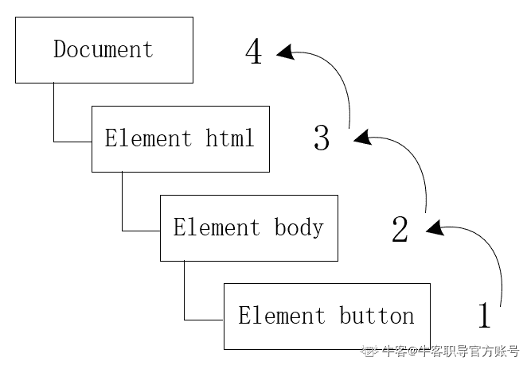
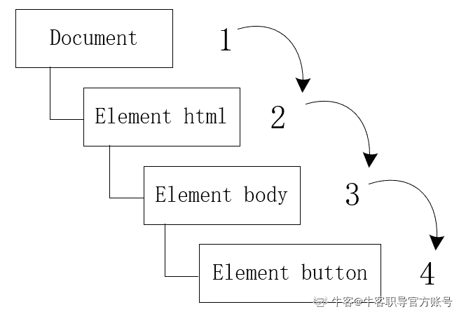
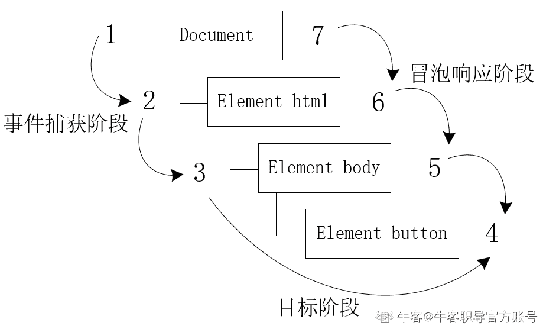

# 第四章 第 5 节 进阶-DOM 事件相关知识

> 原文：[`www.nowcoder.com/tutorial/10091/fbef1012160f4b718ae5422e49a4ff96`](https://www.nowcoder.com/tutorial/10091/fbef1012160f4b718ae5422e49a4ff96)

### 5 进阶-DOM 事件相关知识

#### 5.1 请问 js 怎样增、删、查、替换 DOM 节点？

【考点映射】

*   js 操作 DOM 元素

【频率】★★★★★

【难度】☆

1.  创建元素节点 

 ```cpp
document.createDocumentFragment() //创建一个虚拟节点对象，节点对象包含所有属性和方法
document.createElement("p");//创建 p 标签
document.createTextNode("txt");//创建文本标签    

```

2\. 插入元素节点

element.appendchild：向节点的子节点列表末尾添加新的子节点

element.insertBefore：在已有的元素前插入一个新元素

element.insertAfter：在已有的元素后插入一个新元素

注意：在 DOM 的原生 api 中，只有 insertBefore，没有 insertAfter，借助原有的 api，可以模拟一个 insterAfter：

先找父级元素，若目标元素为最后一个元素，直接 append 到父级末尾，如果不是，则利用 insertBefore 插入到目标元素的下一个元素的前面 

```cpp
function insterAfter(newElement,targetElement){
     var parent = targetElement.parentNode;
     if(parent.lastChild == targetElement){
           parent.appendChild(newElement);
     }
     else{      parent.insertBefore(newElement,targetElement.nextSibling);
     }              
}

```

    3\. 删除元素节点

element.removeChild：从文档树中删除一个节点（先找到要删除节点的父节点，用父节点删除）

```cpp
var para1 = document.getElementById("p1")
para1.parentNode.removeChild(para1)

```

    4\. 替换元素节点

element.replaceChild：将一个节点替换为另一个节点（先找到要替换的节点的父节点，用父节点替换）

```cpp
element.replaceChild(newnode,oldnode);

```

    5\. 查找元素节点

```cpp
document.querySelector("#demo") //查找文档中 id="demo"的节点
document.querySelectorAll("#demo") //查找文档中 id="demo"的所有节点

```

 #### 5.2 请问 js 事件绑定有哪几种方式？

【考点映射】

*   js 事件绑定

【频率】★★★★★

【难度】☆

1.  html 标签事件绑定

```cpp
 <button id="vv" onclick="function()" ></button>

```

    2\. js 事件绑定

```cpp
var func = function () {                           
} 
var aa = document.getElementById('vv') 
aa.onclick = func

```

    3\. 直接定义函数与内容

```cpp
document.getElementById('vv').onclick = function () {                           }    

```

**4\.** **W3C 标准的事件监听 addEventListener（IE6/IE7/IE8 不支持）**

```cpp
//写法一
var func = function () {                           
} 
document.getElementById('vv').addEventListener('click',func);
//写法二
document.getElementById('vv').addEventListener('click',function () {})；

```

    5\. IE 下使用 attachEvent 函数

```cpp
document.getElementById('vv').attachEvent('onclick',function () {}); 

```

#### 5.3 请问什么是事件流？

【考点映射】

*   事件流三阶段

【频率】★★★★★

【难度】☆

js 与 html 页面的交互是通过 DOM 事件实现的，事件流 指页面接收事件的顺序

DOM 事件流包括三个阶段：事件捕获阶段、处于目标阶段、事件冒泡阶段

利用简单的 HTML 页面为例，进行具体分析：

 ```cpp
<!DOCTYPE html>
<html lang="en">
<head>
    <meta charset="UTF-8">
    <title>Event Bubbling</title>
</head>
<body>
    <button id="clickMe">Click Me</button>
</body>
</html>

```

**事件冒泡：**即事件开始时，由最具体的元素（也就是事件发生所在的节点）接收，然后逐级向上传播到较为不具体的节点（文档）（摘自《JavaScript 高级程序设计》）

对于上述页面中， 当单击<button>元素，这个 click 点击事件会按照如下顺序传播：

<button>→<body>→<html>→Document（由内到外）  **事件捕获：**与事件冒泡正好相反，不具体的节点应该更早接收到事件，最具体的节点应该最后接收到事件，其用意在于在事件到达预定目标之前捕获它（摘自《JavaScript 高级程序设计》）

对于上述页面中， 当单击<button>元素，这个 click 点击事件会按照如下顺序传播：

Document→<html>→<body>→<button>（由外到内）

  **事件流：**首先事件捕获，为截获事件提供机会，然后实际的目标接收到事件， 最后事件冒泡阶段，可在这个阶段对事件做出响应

  #### 5.4 请问什么是事件委托/事件代理？

【考点映射】

*   事件委托原理及应用

【频率】★★★★★

【难度】☆☆

事件委托：又名事件代理，利用事件冒泡，只指定一个事件处理程序，就可以管理某一类型的所有事件（摘自《JavaScript 高级程序设计》）

优点：

1.  事件管理函数变少，不需要为每个元素都添加监听函数，对于同一个父节点下相似的子元素，可以通过委托给父元素的监听函数来处理事件。

2.  可以更方便地动态添加和修改元素，不需要因元素的改动而修改事件绑定

3.  可以大大减少与 DOM 的交互次数，从而提高整体运行性能，事件委托开是 事件处理程序过多 问题的直接解决方案

通过一个简单的实例学习如何使用事件委托：

```cpp
 <div id="box">
     <input type="button" value="添加" id="add">
     <input type="button" value="删除" id="remove">
     <input type="button" value="移动" id="move">
     <input type="button" value="选择" id="select">
 </div>

```

```cpp
window.onload = function(){
	/* 普通方式 */
     var Add = document.getElementById('add');
     var Remove = document.getElementById('remove');
     var Move = document.getElementById('move');
     var Select = document.getElementById('select');
     Add.onclick = function(){
        alert("添加");
     }
     Remove.onclick = function(){
         alert("删除");
     }
     Move.onclick = function(){
         alert("移动");
     }
     Select.onclick = function(){
         alert("选择");
     }
	 /* 事件委托*/
	var oBox = document.getElementById('box');
	oBox.onclick = function(e){
		var e = e || window.event;
		var target = e.target || e.srcElement;
		if(target.nodeName.toLowerCase() == 'input'){
		     switch(target.id){
		         case 'add': 
		             alert('添加');
		             break;
		         case 'remove': 
		             alert('删除');
		             break;
		         case 'move': 
		             alert('移动');
		             break;
		         case 'select':
		             alert('选择');
		             break;
		     }
		}
	 }
 }   
```

使用普通方式点击每一个做不同的操作，至少需要 4 次 DOM 操作，用事件委托就可以只用一次 DOM 操作就能实现所有效果

适合使用事件委托的事件： click、mousedown、mouseup、keydown、keyup、keypress

注意：mouseover 和 mouseout 事件虽然也冒泡，但是处理它们的时候需要计算元素位置，非常不好把控，focus，blur 之类本身就没用冒泡的特性，自然就不能使用事件委托

#### 5.5 请问什么是事件监听？

【考点映射】

*   事件监听

*   事件函数执行顺序（面试极有可能出代码题（面试官给代码，答输出））

【频率】★★★★★

【难度】☆☆

事件监听是利用 addEventListener() 方法为元素绑定事件处理程序

对比 5.1 中事件绑定的方法 1、2、3，利用事件监听可向一个元素添加多个事件处理程序，且不会覆盖已有事件

**使用语法：**

```cpp
element.addEventListener(event, function, useCapture);

```

event：事件的类型（比如 click、mousedown、mouseup 等），事件不要使用 "on" 前缀，如 click 代替 onclick

function：当事件发生时我们需要调用的函数

useCapture：布尔值，指定使用事件冒泡还是事件捕获，冒泡（false）捕获（true），此参数可选

多重绑定时，函数执行顺序：

```cpp
<script>
window.onload = function(){
    var outA = document.getElementById("outA");  
    var outB = document.getElementById("outB");  
    var outC = document.getElementById("outC");  

	// 目标(自身触发事件,是冒泡还是捕获无所谓)
    outC.addEventListener('click',function(){ 
        alert("target2");},true);
    outC.addEventListener('click',function(){ 
        alert("target1");},true);

	// 事件冒泡
	outA.addEventListener('click',function(){ 
        alert("bubble1");},false);
	outB.addEventListener('click',function(){ 
        alert("bubble2");},false);

	// 事件捕获
	outA.addEventListener('click',function(){          
        alert("capture1"); },true);
	outB.addEventListener('click',function(){ 
        alert("capture2");},true);
};
</script>

<body>
	<div id="outA">
		<div id="outB">
			<div id="outC"></div> 
		</div>
	</div>
</body>

```

点击 outC 的时，打印顺序是：

capture1→capture2→target2→target1→bubble2→bubble1

根据 DOM 事件流顺序：

**捕获阶段**的处理函数最先执行，其次是目标阶段的处理函数，最后是冒泡阶段的处理函数

outC.addEventListener（目标阶段的处理函数）：outC 是触发事件的目标对象，在 outC 上注册的事件处理函数，属于 DOM 事件流中的目标阶段

**目标阶段函数的执行顺序：**先注册的先执行，后注册的后执行，并且，在目标对象上绑定的函数是采用捕获，还是采用冒泡，都没有影响，冒泡和捕获只是对父元素上的函数执行顺序有影响

对于**注册在父级元素的函数执行顺序**可总结如下：

true 的触发顺序总是在 false 之前（捕获阶段早于冒泡阶段）

如果多个 true（捕获阶段），则外层的触发早于内层

如果多个 false（冒泡阶段），则内层的触发早于外层

**【延伸考点】**

**1、onclick 与 click 区别是什么？**

以“on”开头：如 onclick，为事件处理程序（或事件侦听器），是响应某个事件的函数

不以“on”开头：如 click，为事件，就是用户或浏览器自身执行的某种动作

#### 5.6 请问如何阻止事件触发？

【考点映射】

*   阻止事件触发方法总结

【频率】★★★★

【难度】☆

默认情况下，同时存在多个事件处理函数时，会按照 DOM 事件流模型中的顺序执行。当子元素上发生某个事件，不需要执行父元素上注册的事件处理函数，可以停止事件捕获和冒泡，避免过多没有意义的函数调用

常见以下三种阻止事件触发的方式：

*   **event.preventDefault()**

用于阻止特定事件的默认动作

只有 cancelable 为 true 的事件才可以用，若对象的 cancelable 是 fasle，那就是没有默认动作，或不能阻止默认动作

cancelable：是事件对象（event）上的属性，event.cancelable 返回一个布尔值， 如用 preventDefault() 方法可以取消与事件关联的默认动作，则为 true，否则为 fasle

例：点击 type="submit" 的 input 标签提交表单，在 onclick 事件用 event.preventDefault()， 点击 submit 后就不会自动提交表单

不能阻止事件冒泡

*   **event.stopPropagation()**

立即停止事件在 DOM 中的传播，不阻止默认动作

例：点击 click 的时，只想触发绑定在 click 上的函数，不想触传播链上的其他函数，可使用 stopPropagation

注意：若是在捕获流就执行到的事件，比如在 document 上绑定一个点击事件，addEventListen 的第三个参数设置为 true，那 event.stopPropagation 无法阻止触发

*   **return false**

后续所有相关的触发事件和动作都不会被执行，阻止事件继续传播，事件冒泡和默认行为都被阻止。

jQuery 提供，实际做了三件事：

（1）event.preventDefault()

（2）event.stopPropagation()

（3）停止回调函数执行并立即返回

#### 5.7 总结

在本章主要包含了 js 相关的大部分高频面试考题，着重分析了个考点所涉及原理，并给出相应参考答案和部分代码示例，但这仅是结合个人所学、各类参考书籍与网站所得，如有欠缺或错误的地方，欢迎大家在下面的留言区指出。

下一章则是对 ES6 新特性部分进行探讨，这部分也是前端面试中的“必问题”，希望各位同学结合本专刊的相关解析，共同学习与进步！