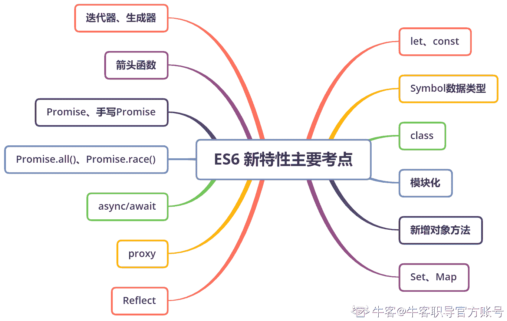

# 第五章 第 1 节 新特性（上）

> 原文：[`www.nowcoder.com/tutorial/10091/a766e3aabace411ca8de8625b59a5739`](https://www.nowcoder.com/tutorial/10091/a766e3aabace411ca8de8625b59a5739)

### 1 新特性（上）

【考点简介】

ES6 提出了一些新特性，对 js 进行补充与优化，在日常开发中得到了广泛应用，也是前端笔试面试的必考点，本章将分析 ES6 的每个新特性，列举相关校招考点，主要知识点如下图所示。大家除了学习以下考点外，可以看看[ES2015 语言标准官方文档](https://262.ecma-international.org/6.0/#sec-let-and-const-declarations)，另外，阮一峰老师的《ECMAScript 6 入门教程》也是一本很好的 ES6 入门之书。希望大家能多看例题与代码，在理解原理基础上，做到灵活运用。

### **【例题示例】**

#### 1.1 请问什么是 ES6，它有哪些新特性？

【考点映射】

*   ES6 新特性

【频率】★★★★★（几乎是前端岗必考题，尽量答多点新特性）

【难度】☆☆

【参考答案】

ECMAScript 规定了浏览器脚本语言（js）的标准，ES6 是一个泛指，包含 ES5.1 版以后的 js 的下一代标准，涵盖了 ES2015、ES2016、ES2017 等，（ES2015/2016/2017 是正式名称，特指发布的正式版本语言标准的年份），通常提到的 ES6 一般指 ES2015 标准，有时也泛指“下一代 js 语言”

ES6 相对于更加简洁，大幅度提高了开发效率，主要新增了以下特性：

（1）let 声明变量、const 声明常量

（2）箭头函数

（3）解构赋值变量（数组、变量）

```cpp
let [a, b, c] = [1, 2, 3];
let[a,[[b], c]]=[1,[[2],3]]; //a：1 b：2 c：3

```

（4）Set、Map 数据结构

（5）Symbol 数据类型

（6）Promise 对象

（7）async、await

（8）class 类

（9）ES 模块化（Moudule）

（10）函数默认参数

（11）函数的 rest 参数（...变量名），用于获取函数的多余参数，就不需要用 arguments 对象

```cpp
function add(...values){
    let sum = 0;
    for(var val of values){     
        sum += val;
    }
    return sum;
}
add(2,5,3)  //10

```

（12）模板字符串

（13）… 展开运算（延展操作符）

（14）元编程 Proxy、Reflet

（15）迭代器 Iterator 和 for...of 

（16）新增了一些 Object 对象方法

#### 1.2 请问 var、let 和 const 有何区别？

【考点映射】

*   var、let 和 const 区别总结

【频率】★★★★★

【难度】☆

【参考答案】

作用域不同：

var 声明的变量的作用域是当前执行上下文，或者说对于声明在任何函数外的变量来说是全局的

let 、 const 声明的是块级作用域变量，只在它所在的代码块内有效

变量提升现象：

var 声明的变量会被提升到作用域顶部，并初始化为 undefined

let、 const 声明的变量会被提升到顶部，但在声明代码前不能使用（暂时性死区），会被初始化 undefined

变量/常量：

var 和 let 声明变量，const 声明只读常量

暂时性死区：

var 可以先使用，后声明，值为 undefined

let 、const 必须先声明，后使用；且 const 必须初始化赋值

在 let、const 声明之前就访问对应的变量与常量，会抛出 ReferenceError，产生原因：

由 let/const 声明的变量，当它们包含的词法环境(Lexical Environment)被实例化时会被创建，但只有在变量的词法绑定(LexicalBinding)已经被求值运算后，才能够被访问（摘自 ES2015 语言标准）

简单来说：用 let/const 声明的变量会先在作用域中被创建出来，但此时还未进行词法绑定，是不能被访问的，会抛出错误。从在作用域创建变量开始，到变量开始可被访问之间的一段时间，称之为 TDZ(暂时性死区)

**【延伸考点】**

**1、const 声明的变量是绝对的不可变吗？**

实际上，不是 const 变量的值不得改动，而是变量指向的那个内存地址不得改动。对于基础类型数据，值保存在变量指向的那个内存地址，等同于常量

对于复合类型数据（主要是对象和数组），变量指向的内存地址，保存的只是一个指针，const 只能保证这个指针是不变的，至于它指向的数据结构是否变化，是不可控的

#### 1.3 请问 ES6 新增的 Symbol 数据类型有何特点？

【考点映射】

*   Symbol 数据类型

【频率】★★★★

【难度】☆

为保证每个属性的名字都是独一无二，从根本上防止属性名冲突，ES6 引入 Symbol 数据类型

Symbol 是第 7 种基础数据类型，表示独一无二的值，Symbol 值通过 Symbol 函数生成，对象的属性名现在可以有两种类型，一种是本来的字符串，另一种就是新增的 Symbol 类型

Symbol 数据类型特点：

（1）、凡属性名属于 Symbol 类型，就是独一无二的，可以保证不会与其他属性名产生冲突

（2）、Symbol 数据类型可用 typeof 检测出来，返回“symbol”

（3）、Symbol 函数前不能使用 new 操作，会报错，因为生成的 Symbol 是一个基础类型的值，不是对象，可理解为它是一种类似于字符串的数据类型

（4）、Symbol 函数的参数只表示对当前 Symbol 值的描述，就算参数相同，Symbol 函数的返回值是不相等的

```cpp
// 没有参数的情况 
let s1 =Symbol();
let s2 =Symbol();  
s1 === s2 // false  
// 有参数的情况 
let s1 =Symbol('foo');
let s2 =Symbol('foo');  
s1 === s2 // false

```

（5）、在 Symbol 作为属性名，遍历对象的时，该属性不会出现在 for...in、for...of 循环中，也不会被 Object.keys()、Object.getOwnPropertyNames()、JSON.stringify()遍历返回

但它并不是私有属性，Object.getOwnPropertySymbols()方法，可以获取指定对象的所有 Symbol 属性名。该方法返回一个数组，成员是当前对象的所有用作属性名的 Symbol 值

Reflect.ownKeys()方法可以返回所有类型的键名，包括常规键名和 Symbol 键名

**常用方法：Symbol.for()：（全局注册）**

接受一个字符串作为参数，随后搜索有没有以该参数作为名称的 Symbol 值。如果有，就返回这个 Symbol 值，否则就新建一个以该字符串为名称的 Symbol 值，并将其注册到全局，可以实现重新使用同一个 Symbol 值。

#### 1.4 请问 ES6 class 与 ES5 构造函数有什么联系？（如何用 ES5 的方式实现 class？）

【考点映射】

*   class 与构造函数

【频率】★★★★★

【难度】☆☆

【参考答案】

class 其实是一个语法糖，使得 js 的编码更清晰、更人性化、风格更贴合面向对象的思想，为代码编译器、检查器提供方便

js 生成新对象的传统方法是通过构造函数定义的，这种写法与传统的面向对象语言差异较大。故 ES6 引入了 class 作为对象的生成模板

```cpp
//ES5 写法
function Person(name, age) {
    this.name = name;
    this.age = age;
}
Person.prototype.toString = function() {
    return'('+ this.name + ','+ this.age + ')';
}
var person = new Person('TOM', 20);
console.log(person);// Person { name: 'Mia', age: 18 }

//ES6 写法
class Person {
    constructor(name, age) {
    this.name = name;
    this.age = age;
    }
    toString() {    
    return'('+ this.name + ','+ this.age + ')';
    }
}
var person = new Person('TOM', 20);
console.log(person);// Person { name: 'Mia', age: 18 }

```

由上述代码可得出：

（1）class 类可以看做是**构造函数的另一种写法**

（2）class 类的数据类型就是函数，typeof Person === 'function'为 true

（3）也可以说 class 的底层依然是 function 构造函数

class 类与构造函数区别：

（1）class 内部定义的方法都是不可枚举的（non-enumerable），ES5 中 prototype 的方法是可枚举的

（2）class 必须使用 new 调用，否则会报错

（3）继承：class 用 extends 实现继承

```cpp
class Person{
    constructor(skin,language){
        this.skin=skin;
        this.language=language;
    }
    say(){         
        console.log('I am a Person')
    }
}

```

**（1）子类没有 constructor 时**

```cpp
class American extends Person{
    aboutMe(){         
        console.log(this.skin+' '+this.language)
    }
}

```

子类 American 继承父类 Person，子类没有定义 constrcutor，则会默认添加一个，并且在 constrcutor 中调用 super 函数，相当于调用父类的构造函数。调用 super 函数是为了在子类中获得父类的 this，调用之后 this 指向子类，也就是父类.prototype.constructor.call(this)

**（2）子类有 constructor**

```cpp
class Chinese extends Person{
    constructor(skin,language,positon){
    //console.log(this);//在没有调用 super 之前输出 this 会报错
    super(skin,language);
    //super();//不给父类构造函数传参，父类的构造数的值为 undefined       
    console.log(this);
    this.positon=positon;
    }aboutMe(){         
        console.log(this.x+' '+this.y+' '+this.positon);
    }
}

```

子类必须在 constructor 方法中调用 super 方法，否则 new 实例时会报错。因为子类没有自己的 this 对象，而是继承父类的 this 对象。如果不调用 super 函数，子类就得不到 this 对象。super()作为父类的构造函数，只能出现在子类的 constructor()中；但是 super 指向父类的原型对象，可以调用父类的属性和方法

#### 1.5 请问你了解 js 模块化吗？

【考点映射】

*   js 模块化

【频率】★★★★

【难度】☆

【参考答案】

js 模块化所解决问题：

命名冲突：一些变量和函数命名可能相同

文件依赖：一些需要从外部引入的文件数目、顺序

js 模块化将按照功能将一个软件切分成许多单独部分，每个部分为一个模块，然后再组装起来。分模块进行使用与维护，提高开发效率。

js 模块化发展过程：

**（1）script 标签**

最早期的 js 文件加载方式，把每个文件看做一个模块，接口通常直接暴露在全局作用域（定义在 window 对象中）

缺点：加载顺序取决于 script 标签书写顺序

易污染全局作用域

各文件间的依赖关系较繁琐

**（2）CommonJS**

每个文件就是一个模块，有自己的作用域，在一个文件里面定义的变量、函数、类，都是私有的，对其他文件不可见。在服务器端，模块的加载是运行时同步加载，在浏览器端，模块需要提前编译打包处理。

```cpp
//暴露模块:
module.exports = value 或 exports.xxx = value
//引入模块：
require(xxx)
//如果是第三方模块，xxx 为模块名；如果是自定义模块，xxx 为模块文件路径

// module add.js
module.exports = function add (a, b) { return a + b; }
// main.js
var {add} = require('./math');
console.log('1 + 2 = ' + add(1,2);

```

**CommonJS 加载模块是同步的，**只有加载完成，才能执行后面的操作，造成一个重大的局限：不适用于浏览器

同步加载对服务器端影响不大，可把所有的模块都存在本地硬盘，同步加载，等待时间就是读取硬盘时间。但对于浏览器，因为模块都放在服务器端，等待时间取决于网速的快慢，长时间等待会造成浏览器处于”假死”状态

**浏览器端的模块不能采用同步加载，**只能采用异步加载，便有了 AMD

**（3）AMD**

非同步加载模块，允许指定回调函数，浏览器端一般采用 AMD

优点： 

（1）适合在浏览器环境中异步加载模块 （2）可以并行加载多个模块

```cpp
//定义没有依赖的模块
define(function(){
    return 模块
})
//定义有依赖的模块
define(['module1', 'module2'], function(m1, m2){
   return 模块
})
//引入使用模块
require(['module1', 'module2'], function(m1, m2){
   //使用 m1/m2
})

```

**（4）CMD**

专门用于浏览器端，模块的加载是异步的，模块使用时才会加载执行（延迟执行）

```cpp
//定义没有依赖的模块
define(function(require, exports, module){
    exports.xxx = value
    module.exports = value
})
//定义有依赖的模块
define(function(require, exports, module){
    //引入依赖模块(同步)
    var module2 = require('./module2')
    //引入依赖模块(异步)
    require.async('./module3', function (m3) {
    })
    //暴露模块
    exports.xxx = value
})
//引入使用模块
define(function (require) {
    var m1 = require('./module1')
    var m4 = require('./module4')
    m1.show()
    m4.show()
})

```

CMD 与 AMD 区别：

最大的区别是对依赖模块的执行时机处理不同，二者皆为异步加载模块

AMD 依赖前置，js 可以方便知道依赖模块是谁，立即加载

CMD 就近依赖，需要使用把模块变为字符串解析一遍才知道依赖了那些模块，延迟执行

**（4）UMD**

严格上说，UMD 不能算是一种模块规范，它主要用来处理 CommonJS、AMD、CMD 的差异兼容，使模块代码能在不同的模块环境下都能正常运行，是模块定义的跨平台解决方案

**（5）ES6 模块化**

设计思想：尽可能静态化，使得编译时就能确定模块的依赖关系、输入和输出变量，CommonJS 和 AMD 模块，都只能在运行时确定

```cpp
//导出模块方式
var a = 0;
export { a }; //第一种
export const b = 1; //第二种 
let c = 2;
export default { c }//第三种 
let d = 2;
export default { d as e }//第四种，别名

//导入模块方式
import { a } from './a.js' //针对 export 导出方式，.js 后缀可省略
import main from './c' //针对 export default 导出方式,使用时用 main.c
import 'lodash' //仅仅执行 lodash 模块，但是不输入任何值

```

主要由 export 和 import 两个命令构成，export 用于规定模块的对外接口，import 用于输入其他模块提供的功能

**总结与对比：**

**CommonJS：**主要用于服务端，同步加载模块，并不适合在浏览器环境

**AMD：**在浏览器中异步加载模块，且可并行加载多个模块，但开发成本相对高，代码阅读和书写较困难，模块定义方式语义不顺畅

**CMD：**与 AMD 相似，都用于浏览器，依赖就近，延迟执行，很容易在 Node.js 中运行

**ES6 模块化：**异步加载，有一个独立的模块依赖的解析阶段，实现相对简单，浏览器和服务器通用模块解决方案