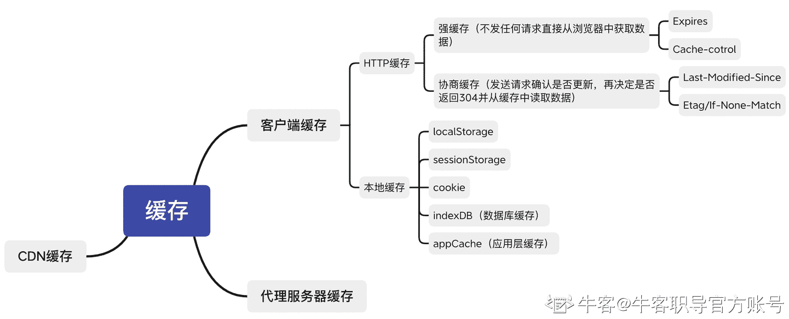

# 第六章 第 2 节 必考知识（中）

> 原文：[`www.nowcoder.com/tutorial/10091/28f0700d987c447e950d665a8ff49544`](https://www.nowcoder.com/tutorial/10091/28f0700d987c447e950d665a8ff49544)

### 2 必考知识（中）

#### 2.1 请问在浏览器中输入 URL 后，浏览器会做哪些工作？

【考点映射】

*   浏览器整个渲染过程

【频率】★★★★★

【难度】☆☆

【参考答案】

从输入 URL 到渲染出整个页面包括三个部分：

**（1）、DNS 解析 URL**

DNS 解析就是寻找哪个服务器上有请求的资源，因为 ip 地址不易记忆，一般会使用 URL 域名（如[www.baidu.com](http://www.baidu.com)）作为网址，DNS 解析就是将域名“翻译”成 IP 地址

具体过程：

a、浏览器缓存：浏览器会按照一定的频率，缓存 DNS 记录

b、操作系统缓存：如果浏览器缓存中找不到需要的 DNS 记录，就会取操作系统中找

c、路由缓存：路由器也有 DNS 缓存

d、ISP 的 DNS 服务器：ISP 有专门的 DNS 服务器应对 DNS 查询请求

e、根服务器：ISP 的 DNS 服务器找不到，就要向根服务器发出请求，进行递归查询

**（2）、浏览器发送请求与服务器交互**

a、浏览器利用 tcp 协议通过三次握手与服务器建立连接

http 请求包括 header 和 body，header 中包括请求的方式（get 和 post）、请求的协议 （http、https、ftp）、请求的地址 ip、缓存 cookie，body 中有请求的内容

b、浏览器根据解析到的 IP 地址和端口号发起 http 的 get 请求

c、服务器接收到 http 请求之后，开始搜索 html 页面，并使用 http 返回响应报文

d、若状态码为 200 显示响应成功，浏览器接收到返回的 HTML 页面后，开始渲染页面

**（3）、浏览器对接收到的 HTML 页面进行渲染**

a、浏览器根据深度遍历的方式把 HTML 节点遍历成 DOM 树

b、将 CSS 解析成 CSSOM 树

c、将 DOM 树和 CSSOM 树构造成 Render 树

d、根据 Render 树计算所有节点在屏幕中的位置，进行布局（回流）

e、遍历 Render 树并调用硬件 API 绘制所有节点（重绘）

#### 2.2 请问你了解浏览器缓存吗？

【考点映射】

*   浏览器缓存原理

【频率】★★★★★

【难度】☆☆

【参考答案】

缓存可以重复利用文件，降低网络负荷，提高网页打开速度，提升用户体验

缓存分类：

从宏观上分为私有缓存和共享缓存，共享缓存就是那些能被各级代理缓存的缓存，私有缓存就是用户专享的，各级代理不能缓存

从微观上可以分为以下几类：

a、浏览器缓存

b、代理服务器缓存

c、CDN 缓存

d、数据库缓存

e、应用层缓存

主要对浏览器的缓存进行分析：

**（1）、HTTP 缓存：主要分为强缓存与协商缓存**

*   强缓存

强可理解为强制的意思，当浏览器去请求某个文件的时候，服务端就在 respone header 里面对该文件做了缓存配置。缓存的时间、缓存类型都由服务端控制，具体由 respone header 的 cache-control 控制，常见的设置是 max-age public private no-cache no-store 等，各类设置对应情况：

a、cache-control: max-age=xxxx，public

客户端和代理服务器都可以缓存该资源，客户端在 xxx 秒的有效期内，如果有请求该资源的需求的话就直接读取缓存，statu code200 ，如果用户做了刷新操作，就向服务器发起 http 请求

b、cache-control: max-age=xxxx，private

只让客户端可以缓存该资源；代理服务器不缓存，客户端在 xxx 秒内直接读取缓存，statu code:200

c、cache-control: max-age=xxxx，immutable

客户端在 xxx 秒的有效期内，如果有请求该资源的需求的话就直接读取缓存，statu code:200 ，即使用户做了刷新操作，也不向服务器发起 http 请求

d、cache-control: no-cache

跳过设置强缓存，但不妨碍设置协商缓存；通常做了强缓存，只有强缓存失效了才走协商缓存的，设置了 no-cache 就不会走强缓存了，每次请求都回询问服务端

e、cache-control: no-store

不缓存，客户端、服务器都不缓存

*   协商缓存

可理解为强缓存就是为资源设置一个有效时间，每次请求资源时都会检查是否过期，只有过期才会去请求服务器（可有效减少请求次数），当强制缓存失效后，浏览器携带缓存标识向服务器发起请求，由服务器根据缓存标识决定是否使用缓存的过程协商缓存生效，返回 304 和 Not Modified

在 response header 里面的设置 etag、last-modified

etag：每个文件具有唯一一个“标识”

last-modified：文件的修改时间，精确到秒

每次请求返回携带 response header 中的 etag 和 last-modified，在下次请求时 request header 也会带上，服务端对比 etag 标识，判断资源是否更改，如更改直接返回新的资源，并更新 response header 的 etag、last-modified，如资源不变，etag、last-modified 不变，对客户端来说，每次请求都进行了协商缓存，即：

发请求-->资源是否过期？-->过期（没过期为强缓存）-->请求服务器-->服务器对比资源是否真的过期？-->没过期-->返回 304 状态码-->客户端用缓存的老资源

当服务端发现资源过期时：

服务器对比资源是否真的过期-？->过期-->返回 200 状态码-->客户端像第一次接收该资源一样，记录 cache-control 中的 max-age、etag、last-modified 等信息

**（2）、本地存储**

主要有：localStorage，sessionStorage 和 cookie，WebSql 和 IndexDB 主要用在前端有大容量存储需求的页面上，如在线编辑浏览器或者网页邮箱，可以将数据存储在浏览器，应该根据不同的场景进行使用

*   Cookie

由服务器生成，且前端也可设置，保存在客户端本地的一个文件，通过 response header 的 set-Cookie 字段进行设置，且 Cookie 的内容自动在请求的时候被传递给服务器

其中包含的信息：

a、用户 ID、密码、浏览过的网页、停留的时间等信息，当该用户再打开该网站时，网站通过读取 Cookie，就可以做出相应的动作，如身份校验、提示语等

b、还保存 host 属性，即网站的域名或 ip，一个网站只能读取它自己放置的信息，不能读取其他网站的 Cookie 文件

Cookie 优点：给用户更人性化的使用体验，如自动登陆、提示语；弥补了 HTTP 无连接特性；可作为站点统计访问量依据

Cookie 缺点：无法解决多人共用电脑问题，具有安全隐患；Cookie 文件容易被误删除；可人为修改 host 文件，可以非法访问目标站点的 Cookie；容量较小，不能超过 4kb；直接在 response header 上带数据安全性差

*   LocalStorage（本地存储）

主要是开发人员在前端设置，一旦数据保存在本地后，就可避免再向服务器请求数据，从而减少不必要的数据请求，可以长期存储数据，没有时间限，遵循同源策略，不同的网站不能直接共用

一般浏览器 localStorage 支持的是 5M 大小，不同的浏览器会略有不同

LocalStorage 优点：拓展了 Cookie 的 4k 限制；可以将第一次请求的 5M 大小数据直接存储到本地，相比于 Cookie 节约带宽

LocalStorage 缺点：需要手动删除，否则长期存在；浏览器大小不一，版本的支持也不一样；只支持 string 类型的存储，JSON 对象需要转换；本质上是对字符串的读取，存储内容过多会消耗内存空间，导致卡顿

*   SessionStorage（会话存储）

同样是开发人员在前端设置，用于临时保存同一窗口(或标签页)的数据，在关闭窗口或标签页之后将会删除这些数据，大多数浏览器限制为 5MB

*   WebSQL

WebSQL 是在浏览器上模拟数据库，可以使用 JS 来操作 SQL 进行数据读写，使用 SQL 来操纵客户端数据库的 API（异步），现阶段使用较少

*   IndexedDB

随浏览器的功能日益强大，越来越多的网站将大量数据储存在客户端，可减少从服务器获取数据，直接从本地获取数据

现有浏览器数据储存方案，都不适用于储存大量数据：Cookie 大小不超过 4KB，且每次请求都会发送回服务器；LocalStorage 大小在 2.5MB 到 10MB 之间（各家浏览器不同），且不提供搜索功能，不能建立自定义的索引。

IndexedDB 是浏览器提供的本地数据库，可被网页脚本创建和操作。IndexedDB 允许储存大量数据，提供查找接口，还能建立索引。但 IndexedDB 不属于关系型数据库（不支持 SQL 查询语句），更接近 NoSQL 数据库

#### 2.3 请问 Cookie 和 Session 的机制是什么？两者有什么区别？

【考点映射】

*   cookie、session 机制

*   cookie 与 session 区别

【频率】★★★★★

【难度】☆

【参考答案】

cookie 机制是通过检查客户身上的“通行证”来确定客户身份，session 机制就是通过检查服务器上的“客户明细表”来确认客户身份。session 可理解为在服务器上建立一份客户档案，客户来访的时候只需要查询客户档案表是否有该客户，session 是基于 cookie 实现的

cookie 和 session 的区别：

存储位置： cookie 存在于客户端，临时文件夹中；session 存在于服务器的内存中，一个 session 域对象为一个用户浏览器服务

安全性： cookie 是以明文的方式存放在客户端的，安全性低，可以通过一个加密算法进行加密后存放；session 存放于服务器的内存中，所以安全性好

生命周期(以 20 分钟为例) ：cookie 的生命周期是累计的，从创建时，就开始计时，20 分钟后 cookie 生命周期结束； session 的生命周期是间隔的，从创建时，开始计时，在 20 分钟内，没有访问 session，那 session 生命周期被销毁。如在 20 分钟内（如在第 19 分钟时）访问过 session，那将重新计算 session 的生命周期。关机会造成 session 生命周期的结束，但是对 cookie 没有影响

访问范围： cookie 为多个用户浏览器共享；session 为一个用户浏览器独享

#### 2.4 请问 GET 请求和 POST 请求区别？

【考点映射】

*   GET 请求与 POST 请求区别

【频率】★★★★★

【难度】☆

【参考答案】

参数传递：GET 参数通过 url 传递，POST 放在 body 中（http 协议规定，url 在请求头中，所以大小限制很小）

长度限制：GET 请求在 url 中传递的参数是有长度限制的，POST 没有

参数类型：对参数的数据类型，GET 只接受 ASCII 字符（发起之前需要进行 UrlEncoding

），而 POST 没有限制

回退影响：GET 在浏览器回退时是无害的，POST 会再次提交请求

安全性：GET 比 POST 不安全，参数直接暴露在 url 中，不能用来传递敏感信息

请求过程：GET 产生一个 TCP 数据包；POST 产生两个 TCP 数据包（大多数浏览器）。对于 GET 请求，浏览器会把 http 的 header 和 data 一并发送出去，服务器响应 200（返回数据）；而 POST 请求，浏览器先发送 header，服务器响应 100 continue，浏览器再发送 data，服务器响应 200 ok（返回数据）

#### 2.5 请问 HTTP 状态码有哪些分类，你了解哪些状态码？

【考点映射】

*   HTTP 状态码

【频率】★★★★★

【难度】☆

【参考答案】

|  | 类别 | 原因短语 |
| 1XX | Informational（信息性状态码) | 接受的请求正在处理 |
| 2XX | Success（成功状态码） | 请求正常处理完毕 |
| 3XX | Redirection（重定向） | 需要进行附加操作以完成请求 |
| 4XX | Client error（客户端错误） | 客户端请求出错，服务器无法处理请求 |
| 5XX | Server Error（服务器错误） | 服务器处理请求出错 |

常见 HTTP 状态码：

**1xx（请求状态）：**

100 ： 继续，请求者应当继续提出请求。服务器返回此代码表示已收到请求的第一部分，正在等待其余部分

101 ：切换协议，请求者已要求服务器切换协议，服务器已确认并准备切换

**2xx（成功）：**

200：成功，服务器已经成功处理了请求

201：已创建，请求成功并且服务器创建了新的资源

202：已接受，服务器已接受请求，但尚未处理

203：非授权信息，服务器已经成功处理了请求，但返回的信息可能来自另一来源

204：无内容，服务器成功处理了请求，但没有返回任何内容

205：重置内容，服务器成功处理了请求，但没有返回任何内容

206：部分内容，服务器成功处理了部分 GET 请求

**3xx（重定向）：**

300：多种选择，针对请求，服务器可执行多种操作。服务器可根据请求者（user agent）选择一项操作，或提供操作列表供请求者选择

301：永久移动，请求的网页已永久移动到新位置。服务器返回此响应（对 GET 或 HEAD 请求的响应）时，会自动将请求者转到新位置

302：临时移动，服务器目前从不同位置的网页响应请求，但请求者应继续使用原有位置来进行以后的请求

303：查看其它位置，请求者应当对不同的位置使用单独的 GET 请求来检索响应时，服务器返回此代码

304：未修改，自上次请求后，请求的网页未修改过。服务器返回此响应，不会返回网页的内容

305：使用代理，请求者只能使用代理访问请求的网页。如果服务器返回此响应，还表示请求者应使用代理

307：临时性重定向，服务器目前从不同位置的网页响应请求，但请求者应继续使用原有的位置来进行以后的请求

**4xx（客户端请求错误）：**

400：错误请求，服务器不理解请求的语法

401：未授权，请求要求身份验证。对于需要登录的网页，服务器可能返回此响应

403：禁止，服务器拒绝请求

404：未找到，服务器找不到请求的网页

405：方法禁用，禁用请求中指定的方法

406：不接受，无法使用请求的内容特性响应请求的网页

407：需要代理授权，此状态码与 401（未授权）类似，但指定请求者应当授权使用代理

408：请求超时，服务器等候请求时发生超时

409：冲突，服务器在完成请求时发生冲突。服务器必须在响应中包含有关冲突的信息

410：已删除，如果请求的资源已永久删除，服务器就会返回此响应

411：需要有效长度，服务器不接受不含有效内容长度标头字段的请求

412：未满足前提条件，服务器未满足请求者在请求者设置的其中一个前提条件

413：请求实体过大，服务器无法处理请求，因为请求实体过大，超出了服务器的处理能力

414：请求的 URI 过长，请求的 URI（通常为网址）过长，服务器无法处理

415：不支持媒体类型，请求的格式不受请求页面的支持

416：请求范围不符合要求，如果页面无法提供请求的范围，则服务器会返回此状态码

417：未满足期望值，服务器未满足“期望”请求标头字段的要求

**5xx（服务器错误）：**

500：服务器内部错误，服务器遇到错误，无法完成请求

501：尚未实施，服务器不具备完成请求的功能。例如，服务器无法识别请求方法时可能会返回此代码

502：错误网关，服务器作为网关或代理，从上游服务器无法收到无效响应

503：服务器不可用，服务器目前无法使用（由于超载或者停机维护）。通常，这只是暂时状态

504：网关超时，服务器作为网关代理，但是没有及时从上游服务器收到请求

505：HTTP 版本不受支持，服务器不支持请求中所用的 HTTP 协议版本